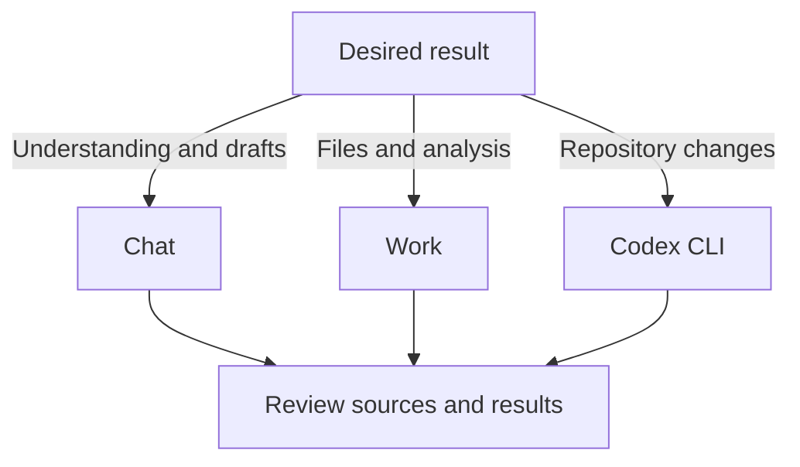

# Chat, Work, and Codex CLI: choosing and combining workflows

## Summary

**Start with Chat to think through an answer, Work to turn sources into a reviewable deliverable, and Codex CLI to handle project files and commands directly.** This is a situational recommendation, not a capability ranking. OpenAI distinguishes Chat, Work, and Codex by purpose and experience while explaining that Work and Codex overlap.[^choose]

This article brings together the differences and ways to combine them. Read the independent articles for first steps and example requests.

| Article | Central question |
| --- | --- |
| [ChatGPT Chat](chatgpt-chat.md) | How can conversation develop understanding, ideas, and wording? |
| [ChatGPT Work](chatgpt-work.md) | How can supplied sources become finished documents, analysis, and spreadsheets? |
| [Codex CLI](codex-cli.md) | How can project files be investigated, edited, and verified? |

## Learning goals

- Distinguish a working mode, client, model, and execution location.
- Choose by the desired result and review method rather than job title.
- Explain how to hand over sources and completion criteria between environments.
- Check output creation separately from actual application or publication.

## Prerequisites

Development knowledge is optional. A **working mode** distinguishes ongoing conversation from delegated outcomes. A **client** is a program used to access a service. A **model** interprets requests and produces results. **Execution location** is where file or tool operations happen.

## 101 · Understand the concepts

### The names belong to different categories

Chat and Work are working modes within ChatGPT, while Codex CLI is a terminal client for Codex. This article therefore compares **how you begin work and review its results**, rather than treating the names as equivalent categories.[^choose][^cli]

| Category | Choice | Decision question |
| --- | --- | --- |
| Working mode | Chat or Work | Develop a conversation or delegate a completed result? |
| Interface | Web, desktop, Codex CLI, and others | Review through previews, code differences, or a terminal? |
| Model and effort | Available model and reasoning effort | Which reasoning and processing characteristics fit the task? |
| Execution and access | Local, cloud, connected sources | Are the required files and tools actually accessible? |

See the [GPT-6 Astra article](gpt-6-astra.md) for model and effort selection. Changing models does not automatically provide missing files or connection permissions. Check actual options against plan, environment, and workspace settings.[^choose]

### Practical differences

| Criterion | ChatGPT Chat | ChatGPT Work | Codex CLI |
| --- | --- | --- | --- |
| Useful starting point | Question, idea, or draft | Delegated goal and deliverable | Working folder and desired change |
| Input to supply | Background, short material, conditions | Original files, connected sources, templates | File paths, project rules, reproduction steps |
| Typical output | Explanation, comparison, draft wording | Reviewable documents, sheets, presentations, analysis | File changes, check results, work summary |
| Review method | Read and ask follow-up questions | Open files and check content, numbers, structure | Inspect diffs, commands, and check results |
| Additional checks | Availability of required tools | Execution location, source access, output files | Working folder, command tools, writable scope |

The table translates official capabilities into practical criteria. Chat can summarize files, Work can run code, and Codex can create reports and presentations. Do not divide them into developer-only and non-developer-only work.[^choose][^files]

Figure 1. An original starting-point guide. The branches are not exclusive capability boundaries and can be combined.

## 201 · Apply them to an example

### Improve Haru Studio's FAQ

**Assumptions:** A fictional studio wants to improve its FAQ using customer inquiries. An operator confirms business facts, and the website lives in a repository that manages files and change history.

| Stage | Example environment | Specific request | Handoff to the next stage |
| --- | --- | --- | --- |
| Clarify questions and wording | Chat | “Propose questions first-time customers may ask and refine the pickup notice.” | Chosen questions, confirmed wording, unknown conditions |
| Analyze inquiries and create review files | Work | “Use inquiry counts and operating facts to create an FAQ review file and check totals and evidence.” | Reviewed files, factual sources, unresolved decisions |
| Apply to the website | Codex CLI | “Apply the confirmed FAQ to the existing page and run project checks.” | Diff, check results, display verification |

**Expected result and interpretation:** Decisions from conversation can progress into reviewed files and an actual website change. All three stages are optional. Start in the CLI when wording is already confirmed, or finish in Work when only a report is needed. This is a hypothetical operating example, not a comparative experiment measuring time or quality.

### What should you hand over when switching environments?

Provide five concise items:

1. **Goal:** Improve the customer-facing FAQ.
2. **Sources:** Identify inquiry counts and operator-confirmed facts.
3. **Decisions:** State approved wording and conditions to preserve.
4. **Open questions:** Identify unresolved items such as cancellation conditions.
5. **Completion criteria:** Specify whether the task ends at review files, local changes, or publication.

A ChatGPT project can organize sources and instructions for related Chat and Work conversations. The CLI works from the specified directory. Sharing an account does not justify assuming that every conversation, file, and sign-in state transfers across environments.[^projects][^auth] Actually provide the files and check which inputs the new task has accessed.

## 301 · Make decisions under constraints

### Choose by the current task rather than job title

| Current need | Suggested start | Reason |
| --- | --- | --- |
| A non-developer wants to understand a technical term. | Chat | Adjust explanation depth through conversation. |
| A developer wants to compare design alternatives. | Chat or the current Codex environment | Choose according to whether explanation alone or real repository context is needed. |
| A planner needs meeting materials from several files. | Work | Specify sources and format, then delegate reviewable files. |
| A non-developer edits repository Markdown. | Codex CLI if comfortable with the CLI | Handle document files and project checks in one workflow. |
| A developer fixes and tests a bug. | Codex CLI or another preferred Codex interface | Actual files, development tools, and change review are central. |
| Someone wants to revise an existing file visually. | Work or desktop | Previews help inspect documents, tables, and visual composition. |

These are suggestions. If a familiar environment already provides the required tools and review methods, there is no need to move just to match a label. Official guidance explicitly allows continuing document and research work in Codex.[^work]

### Related tools to know about

Consider **Codex on desktop** for visual diffs and development review details, and the **IDE extension** for work alongside open files in a code editor. Do not assume identical CLI features or screens.[^choose][^projects] Adding AI calls to your own service is a separate development question; continue with the [API and model explanation](gpt-6-astra.md).

### What counts as success?

| Review layer | Example | Risk of confusing layers |
| --- | --- | --- |
| Content | Check conditions, numbers, and sources. | Natural wording can appear to establish factual accuracy. |
| Artifact | Confirm that the file opens and matches the requested format. | A “done” message can hide a missing file. |
| Actual application | Check repository changes, publication, or sending. | A draft can be mistaken for an external update. |

State the goal, sources, format, important constraints, and review criteria.[^prompting] Start with the result needed instead of delegating a large task for a small wording change. Conversely, when files and verification are required, make the completion scope clear so the work does not end with explanations alone.

## Check your understanding

**Question 1:** Does Work always give a better answer than Chat?

**Explanation:** A working mode alone does not establish superior quality. Consider sources, model, tools, review criteria, and the desired result.

**Question 2:** Should non-developers avoid Codex CLI?

**Explanation:** Job title is not the criterion. People comfortable handling files and commands and reviewing changes can use it for documents too. Choose Work or desktop if visual review is easier.

**Question 3:** Is an FAQ automatically on the website after Work creates its file?

**Explanation:** File creation and website changes are different results. Specify the target repository or page and application scope, then verify the actual change.

## Evidence and limitations

Based on OpenAI documentation checked on 2026-09-10. Selection tables, studio examples, and handoff items are original practical interpretations. This is not a controlled comparison of response quality, speed, or cost. Confirm features, connections, and usage in the actual account and environment.

## Related knowledge

[ChatGPT Chat](chatgpt-chat.md) · [ChatGPT Work](chatgpt-work.md) · [Codex CLI](codex-cli.md) · [Model and effort selection](gpt-6-astra.md) · [AI Engineering](index.md) · [한국어](../../ko/ai-engineering/chatgpt-and-codex-workflows.md)

## Sources

[^choose]: [OpenAI — Use ChatGPT](https://learn.chatgpt.com/docs/use-chatgpt)
[^work]: [OpenAI — Get started with ChatGPT Work](https://learn.chatgpt.com/docs/get-started-with-work)
[^cli]: [OpenAI — Codex CLI](https://learn.chatgpt.com/docs/codex/cli)
[^projects]: [OpenAI — Projects and chats](https://learn.chatgpt.com/docs/projects)
[^files]: [OpenAI — Work with files](https://learn.chatgpt.com/docs/artifacts-viewer)
[^prompting]: [OpenAI — Prompting](https://learn.chatgpt.com/docs/prompting)
[^auth]: [OpenAI — Authentication](https://learn.chatgpt.com/docs/auth)
