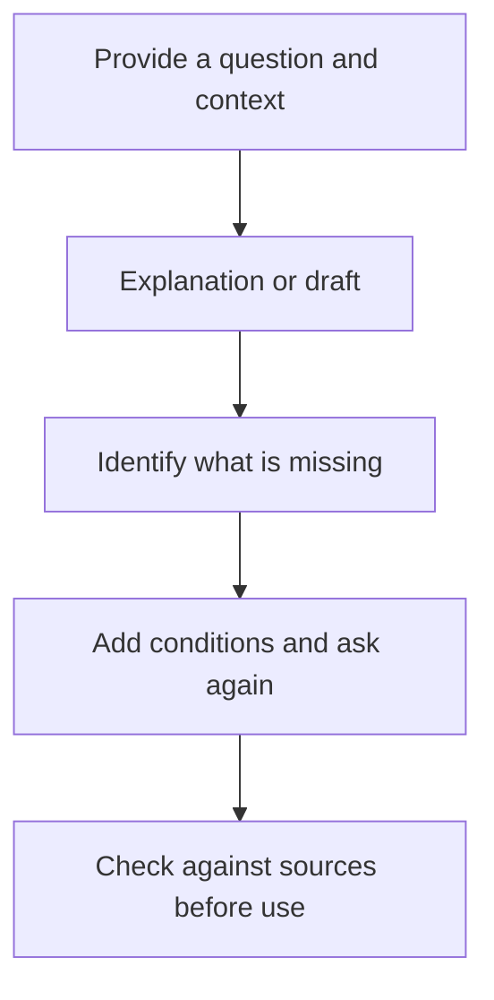

# ChatGPT Chat: understanding and drafting through conversation

## Summary

Sometimes a customer notice sounds awkward, or you do not know where to start with a new concept. **ChatGPT Chat** suits developing ideas and wording through questions, responses, and follow-up discussion. Official guidance lists questions, brainstorming, drafting, file summaries, and option comparisons as examples.[^choose]

Here, Chat means ChatGPT's conversation-centered way of working, not a particular model or subscription plan. Do not assume a fixed set of capabilities for every account; check the tools available to you. Read the [synthesis](chatgpt-and-codex-workflows.md) for the relationship between the three environments.

## Learning goals

- Distinguish refining a goal through conversation from delegating a finished deliverable.
- Write requests and follow-ups with context, audience, and output format.
- Separate plausible explanations from facts checked against original sources.

## Prerequisites

No programming knowledge is required. A **prompt** is a question or request sent to AI. **Context** is background that changes the answer. A **draft** is an initial result intended for review and revision.

## 101 · Understand the concept

### Conversation is part of the work

Your first request need not be perfect. State the goal, read the response, and add missing conditions. OpenAI recommends including the goal, context, output format, and relevant boundaries, then refining through follow-up messages.[^prompting]



Figure 1. An original conversation workflow. It does not automatically guarantee accurate answers.

### When is it useful?

| Situation | Example request | Result to check |
| --- | --- | --- |
| Learning an unfamiliar concept | “Explain indexing using a library analogy and give me a comprehension question.” | Whether you understand the analogy's limits |
| Revising a short notice | “Keep the meaning but make this notice understandable to first-time customers.” | Preservation of dates, prices, and conditions |
| Narrowing ideas | “Propose three titles and compare the audience each suits.” | Whether the selection criteria match your purpose |
| Understanding development work | “Explain this error message and identify information needed to investigate the cause.” | Separation of possible and confirmed causes |

These are suggested uses. Chat can also summarize material or use search. If creating and checking several actual files becomes central, consider [Work](chatgpt-work.md); if changing and testing a repository becomes central, consider [Codex CLI](codex-cli.md).[^choose]

## 201 · Apply it to an example

### Refine Haru Studio's pickup notice

**Assumptions:** Haru Studio is a fictional pottery studio. Pieces require firing and are collected in person about four weeks later; the exact date is communicated separately. These conditions are educational examples.

Choose Chat and enter the request below. UI labels and available tools may differ by account and platform.[^choose]

```text
Improve a pickup notice for first-time customers at Haru Studio.
Confirmed conditions: pieces require firing and are collected in person in about four weeks.
The exact pickup date is communicated separately.

Write one question heading and an answer of no more than three sentences.
Do not turn about four weeks into a guaranteed date or add a delivery service.
```

**Example expected result:**

> **When can I collect my piece?**
>
> After firing, your piece is collected at the studio in about four weeks. We will communicate the exact pickup date separately.

This is an original example, not an observed Chat response. Compare it with the source to ensure “about,” “in-person collection,” and “separate notification” are all preserved.

Instead of “Make it better,” continue with a specific request:

```text
Change the question to “Can I take it home the same day?” and answer feasibility in the first sentence.
Keep the remaining pickup conditions unchanged.
```

**Expected result and interpretation:** You can obtain wording suited to the customer's question and clarify your editorial criteria. This has not updated a real website or sent a notice. Specify the target and completion criteria if you also want those actions.

## 301 · Make decisions under constraints

### Decide whether to continue the conversation or change environments

Stay in Chat while jointly refining a perspective or wording. If the request grows into “Classify the inquiry files and finish a reviewable FAQ file,” consider Work. For “Apply this FAQ to the repository's page and run checks,” you need an environment such as Codex CLI with access to the files and development tools. These distinctions describe preferred workflows, not absolute capability boundaries.[^choose]

For ongoing work using the same sources, collect related chats, files, and instructions in a project. Official guidance says Chat and Work conversations can share a ChatGPT project, but creating that project does not automatically connect a folder on your computer.[^projects]

### State how you will evaluate the answer

Request search and source checks when current information matters, or specify that only supplied material may be used.[^prompting] In the studio example, preserving the original conditions matters more than elaborate wording. In the error explanation example, check that a hypothesis has not been presented as a confirmed cause.

## Check your understanding

**Question 1:** If the wording reads naturally, can you skip comparing pickup conditions with the original?

**Explanation:** No. Changing “about four weeks” to “exactly four weeks” changes the meaning. Compare important conditions first.

**Question 2:** Is Chat unable to discuss code, and is Work the only mode that can read files?

**Explanation:** That is not the distinction. Explanation and summarization are also Chat use cases. Choose based on tools, the final result, and the scope of execution you need.

## Evidence and limitations

Based on OpenAI documentation checked on 2026-09-10. The studio, prompts, expected response, and decision table are original learning material. This is not an experiment measuring a particular account's tools or response quality. Check actual availability by model, plan, platform, and rollout.

## Related knowledge

[Chat, Work, and Codex synthesis](chatgpt-and-codex-workflows.md) · [ChatGPT Work](chatgpt-work.md) · [Codex CLI](codex-cli.md) · [Model and effort selection](gpt-6-astra.md) · [Documents](index.md) · [한국어](../../ko/ai-engineering/chatgpt-chat.md)

## Sources

[^choose]: [OpenAI — Use ChatGPT](https://learn.chatgpt.com/docs/use-chatgpt)
[^prompting]: [OpenAI — Prompting](https://learn.chatgpt.com/docs/prompting)
[^projects]: [OpenAI — Projects and chats](https://learn.chatgpt.com/docs/projects)
