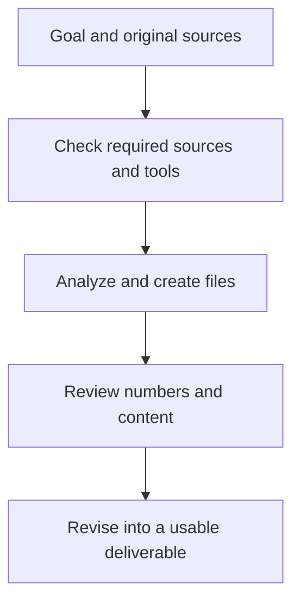

# ChatGPT Work: turning sources into reviewable deliverables

## Summary

Imagine needing a meeting report that requires classifying inquiries, preparing tables, and reconciling the explanation. **ChatGPT Work** lets you delegate that outcome through the necessary steps and tools to a result you can review. Official introductory guidance highlights documents, presentations, analysis, and recurring updates.[^work]

Work here names a way of working, not an organizational subscription plan. Its core capabilities overlap with Codex, with an experience focused on everyday work and finished outputs.[^choose] Start with **which sources should produce which result**, rather than which interface is more intelligent.

## Learning goals

- Specify a Work task through sources, output format, and completion criteria.
- Explain source-access differences between local and cloud work.
- Review generated files and develop stable tasks into recurring workflows.

## Prerequisites

No programming knowledge is required. A **deliverable** is an output such as a document, spreadsheet, or presentation that you can review and use. A **plugin** supplies connections to external services or reusable capabilities. Actual permissions determine what can be read or changed in a connected service.[^choose]

## 101 · Understand the concept

### Move from getting an explanation to delegating an outcome

“How do I analyze inquiries?” requests an explanation. “Use these inquiries to finish an FAQ review file and check the sources and totals” delegates a task. State the final format and review criteria when using Work.[^work][^files]



Figure 1. An original Work workflow. Missing sources or inaccessible tools require attention.

### Separate web, desktop, and execution location

| Execution option | Sources and operation | When to choose it |
| --- | --- | --- |
| Work on the web | A managed cloud environment uses uploaded files, connected tools, and approved websites. | Work can proceed from supplied sources without a particular computer folder. |
| Cloud option on desktop | Where available, work can continue after the app closes. | You want less dependence on keeping your computer awake. |
| Work locally option on desktop | Where available, work uses local files, apps, and the browser. | The task requires sources or apps on your computer. |

This distinction follows official usage and introductory guidance. Options depend on account, platform, rollout, and workspace settings. Do not assume cloud work automatically reads your computer's folders.[^choose][^work] Collecting sources in a ChatGPT project also differs from connecting a local folder.[^projects]

## 201 · Apply it to an example

### Turn inquiry information into an FAQ review file

**Assumptions:** Fictional Haru Studio has ten inquiries already grouped into the four topics below. These are not real customer records.

| Inquiry topic | Count | Operational fact to use |
| --- | --- | --- |
| Beginner participation | 4 | The class is for adults trying pottery for the first time. |
| Price | 3 | KRW 50,000 per person includes materials and tools. |
| Pickup | 2 | In-person collection in about four weeks; the date is communicated separately. |
| Cancellation | 1 | No cancellation conditions were supplied. |

Choose Work and provide the table with your request. For real work, attach original files or connect them through available plugins. This exercise uses the table itself as the input.

```text
Use the table above as the only input for improving Haru Studio's FAQ.
Create faq-review.xlsx and summary.md for the operator to review.

The spreadsheet needs “Inquiry summary” and “FAQ draft” sheets.
Include topic, count, and percentage of the total in Inquiry summary.
Include question, answer, supporting input item, and items needing confirmation in FAQ draft.
Explain which questions to review first and what the operator must decide in the summary document.

Mark cancellation conditions as needing confirmation instead of guessing.
Check totals and percentages and confirm that both files agree.
Provide downloadable files without publishing or sending them externally.
```

**Expected-result checks:** `4 + 3 + 2 + 1 = 10`, with percentages of `40%`, `30%`, `20%`, and `10%`. Cancellation conditions should remain unresolved instead of containing an invented answer. Frequency alone does not establish business importance, so the operator decides final priorities.

Open the files and check sheet names, columns, totals, and FAQ wording. A message saying a file was created and an actually usable file require separate checks. Official guidance also recommends opening or downloading generated files and requesting specific revisions.[^files]

```text
Shorten the pickup answer in the FAQ draft sheet to two sentences.
Keep “about four weeks,” “in-person collection,” and “date communicated separately.”
Leave counts and percentages in Inquiry summary unchanged and provide a new file.
```

These prompts and calculations are educational. They are not observations of an actual Work run, file creation, or reduction in customer inquiries.

## 301 · Make decisions under constraints

### Define task size and completion criteria

| Need | Suitable starting point | Example completion criterion |
| --- | --- | --- |
| Revise one sentence | Have a short conversation in [Chat](chatgpt-chat.md). | Wording that preserves original conditions |
| Analyze several sources into a report | Give Work the sources, audience, and file format. | Source-checked tables and explanations in files that open |
| Follow an existing template | Supply the template and structure to preserve. | Required sheets, columns, and document structure retained |
| Apply the FAQ to a repository | Choose [Codex CLI](codex-cli.md) or an environment with repository access. | Changed files, check results, and actual display review |

Work can also run code and work with repositories; Codex can also create documents and analysis. The table proposes starting points based on the result to review and the preferred interface.[^choose]

Run a recurring workflow once and review it before scheduling it.[^prompting] First resolve moving source locations or unstable classification rules. A schedule alone does not prove that each run reads current sources accurately.

### Check sources, tools, and usage together

Naming a plugin does not establish its connection or permissions. Check that the sources needed and those actually accessible agree. Features and usage depend on plan and environment; Work and Codex share usage limits.[^choose] Start large tasks with the necessary result, and consult the [model article](gpt-6-astra.md) for model and effort distinctions.

## Check your understanding

**Question 1:** Can cloud Work read a computer file if you only provide its path?

**Explanation:** Do not assume automatic access. Upload or connect the file, or choose an environment with the required local access.

**Question 2:** Since cancellation appears only once, can you invent a cancellation policy?

**Explanation:** No. Missing operational facts require confirmation regardless of frequency. Making the gap visible is itself useful.

## Evidence and limitations

Based on OpenAI documentation checked on 2026-09-10. The studio, table, prompts, and calculations are original hypothetical examples. No particular account's plugin connections, local or cloud options, scheduled tasks, or file outputs were tested. Prices, numerical usage allowances, and universal feature access are not guaranteed.

## Related knowledge

[Chat, Work, and Codex synthesis](chatgpt-and-codex-workflows.md) · [ChatGPT Chat](chatgpt-chat.md) · [Codex CLI](codex-cli.md) · [Model and effort selection](gpt-6-astra.md) · [Documents](index.md) · [한국어](../../ko/ai-engineering/chatgpt-work.md)

## Sources

[^work]: [OpenAI — Get started with ChatGPT Work](https://learn.chatgpt.com/docs/get-started-with-work)
[^choose]: [OpenAI — Use ChatGPT](https://learn.chatgpt.com/docs/use-chatgpt)
[^files]: [OpenAI — Work with files](https://learn.chatgpt.com/docs/artifacts-viewer)
[^projects]: [OpenAI — Projects and chats](https://learn.chatgpt.com/docs/projects)
[^prompting]: [OpenAI — Prompting](https://learn.chatgpt.com/docs/prompting)
