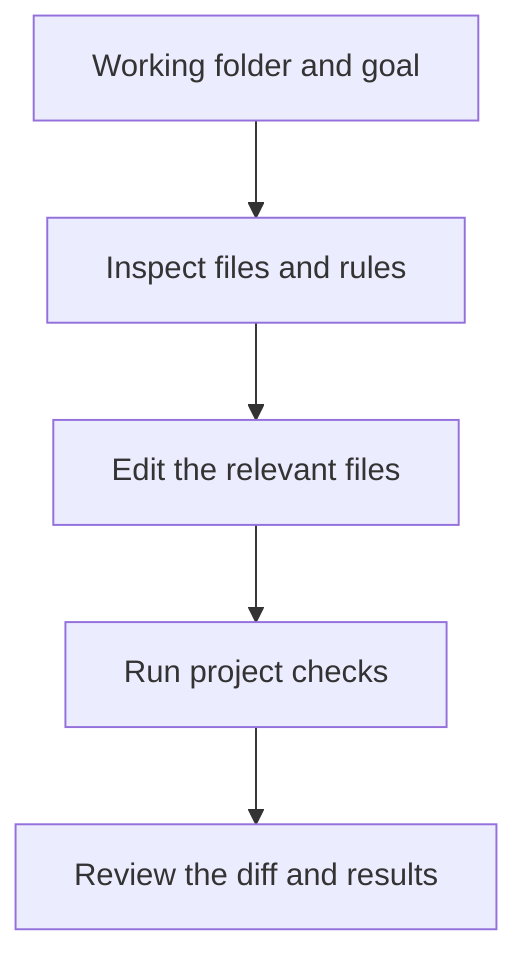

# Codex CLI: editing and verifying files from the terminal

## Summary

Imagine updating a project's information page. You need to find the right files, follow existing rules, run checks, and review the differences. **Codex CLI** is a terminal client for this work. It suits reading and editing a local repository and running development tools already installed on the machine.[^cli]

You can request actual file changes and verification as well as explanations. Non-developers working with Markdown or data files can use it too, provided they can check the working folder and changes. Consider [ChatGPT Work](chatgpt-work.md) if visual file review is easier. The CLI itself does not include a document preview or annotation interface.[^files]

## Learning goals

- Distinguish a Codex CLI working directory from a ChatGPT project.
- Make specific requests for investigation and file changes.
- Read differences and actual check results to assess completion.
- Distinguish interactive work from scripted `codex exec` use.

## Prerequisites

A **CLI (Command-Line Interface)** lets you use a program through text commands. A **terminal** is the window where you enter them. A **repository** manages project files and change history. A **Git diff** shows before-and-after differences. You should be able to identify the working folder and current file state.

## 101 · Understand the concept

### What does it read, and where does work run?

Codex CLI uses its starting directory as the project context; `-C` or `--cd` can set it explicitly. It does not provide the web ChatGPT Projects view. Durable project guidance can live in `AGENTS.md` or repository documentation.[^projects]



Figure 1. An original repository workflow. It requires appropriate write permissions and execution tools.

**Separate local execution from the model connection.** Local primarily describes where files and commands are handled. It does not mean a fully offline tool without authentication or service connections when using OpenAI models. Official authentication guidance distinguishes ChatGPT sign-in from API-key sign-in; API-key usage follows API account billing.[^cli][^auth]

### Access boundaries and approval policy are different settings

A **sandbox** limits command access, writes, and network use. An **approval policy** determines when confirmation is requested. Distinguish investigation settings from those for editing, and check connected-app permissions separately. One setting does not represent every tool's permissions.[^permissions]

## 201 · Apply it to an example

### Installation and first investigation

If it is not installed, choose an operating-system-appropriate method from the official guide. This example assumes **npm is already installed**. Installation was not executed while writing this article.[^cli]

```bash
npm install -g @openai/codex
```

Replace `my-project` with the actual working folder. The following starts an investigation before editing. Follow the available sign-in flow on first use.[^cli][^permissions]

```bash
cd my-project
codex --sandbox read-only --ask-for-approval on-request
```

After Codex opens, enter:

```text
Find and explain the files that display customer FAQs and the project's authoring rules.
Do not edit files yet.
Identify the recommended change location, explain why, and list checks to run afterward.
Confirm check commands from project documentation or configuration and distinguish guesses.
```

**Expected result and interpretation:** You can review the change location and verification method. A read-only investigation is not a completed implementation.

### Apply an approved FAQ

**Assumptions:** Fictional Haru Studio's project has an FAQ page. The operator has confirmed in-person pickup in about four weeks, with the date communicated separately. Assume the earlier investigation identifies actual file paths and checks.

Use `git status` and `git diff` to inspect existing changes. For editing, adjust permissions with `/permissions` or start a workspace-write session as needed.[^cli][^permissions]

```bash
codex --sandbox workspace-write --ask-for-approval on-request
```

```text
Apply the operator-confirmed pickup information at the FAQ location identified earlier.
Pieces are collected in person in about four weeks, with the exact date communicated separately.

Follow existing document and translation rules and avoid unrelated files.
Run the checks identified in the project.
Report changed files, reasons, checks run and their results, and checks you could not run.
This exercise ends with reviewable local changes; committing, pushing, and deployment are outside its scope.
```

If you started a new session, provide the file paths and check commands again. Do not assume knowledge of another session's conversation. Use `codex resume` to continue a saved conversation.[^projects]

**Completion criteria:** The original FAQ conditions are preserved, only intended files changed, and actual check results are available. “Checks are recommended” differs from “Checks ran and passed.” This example explains usage; it is not an actual FAQ modification experiment.

## 301 · Make decisions under constraints

### Choose situations where a terminal is useful

| Situation | How to use it | What to check |
| --- | --- | --- |
| Understanding an unfamiliar repository | Request file paths and flow explanations. | Whether explanations are grounded in actual files |
| Fixing a bug | Supply reproduction steps, expected behavior, and allowed scope. | Reproduction and relevant verification |
| Updating documents or configuration in bulk | Specify target files and rules to preserve. | Whether unrelated content changed |
| Adding repeated analysis to a script | Use non-interactive `codex exec`. | Permissions, input, output, and failure handling |

The following is a script example. **Non-interactive** means running a request without opening the conversation interface. With default output, progress goes to `stderr` and the final message to `stdout`, allowing a program to receive progress and results separately.[^exec]

```bash
codex exec --sandbox read-only "Read README.md and summarize how to run the project and any unconfirmed assumptions. Do not edit files."
```

Changing a file does not establish completed deployment. Local changes, checks, commits, remote updates, and deployment are distinct results. State the completion scope needed for your own work.

### The CLI is not always the most convenient choice

[Chat](chatgpt-chat.md) is a simple starting point for short explanations and wording revisions. Consider Work or a desktop environment when you want to inspect presentations or spreadsheets visually. The CLI can also produce files, so the review experience matters alongside capability.[^files]

## Check your understanding

**Question 1:** Is implementation finished after a read-only investigation identifies the target file?

**Explanation:** No. Investigation and actual changes are different results. If editing is needed, define the scope and permissions, then verify the result.

**Question 2:** Does a new CLI session know all the sources in an earlier ChatGPT project?

**Explanation:** Do not assume that. The CLI's working folder, actual files, and selected conversation matter. Provide necessary files and decisions explicitly.

## Evidence and limitations

Based on OpenAI documentation checked on 2026-09-10. The authoring environment reported `codex --version` as `0.154.0`; `codex --help` confirmed the listed execution options and commands. Installation, sign-in, new model requests, FAQ changes, and automation examples were not executed. Actual permissions and features may vary with operating system, client version, configuration, and workspace policy.

## Related knowledge

[Chat, Work, and Codex synthesis](chatgpt-and-codex-workflows.md) · [ChatGPT Chat](chatgpt-chat.md) · [ChatGPT Work](chatgpt-work.md) · [Model and effort selection](gpt-6-astra.md) · [Documents](index.md) · [한국어](../../ko/ai-engineering/codex-cli.md)

## Sources

[^cli]: [OpenAI — Codex CLI](https://learn.chatgpt.com/docs/codex/cli)
[^projects]: [OpenAI — Projects and chats](https://learn.chatgpt.com/docs/projects)
[^permissions]: [OpenAI — Agent approvals and security](https://learn.chatgpt.com/docs/agent-approvals-security)
[^auth]: [OpenAI — Authentication](https://learn.chatgpt.com/docs/auth)
[^exec]: [OpenAI — Non-interactive mode](https://learn.chatgpt.com/docs/non-interactive-mode)
[^files]: [OpenAI — Work with files](https://learn.chatgpt.com/docs/artifacts-viewer)
