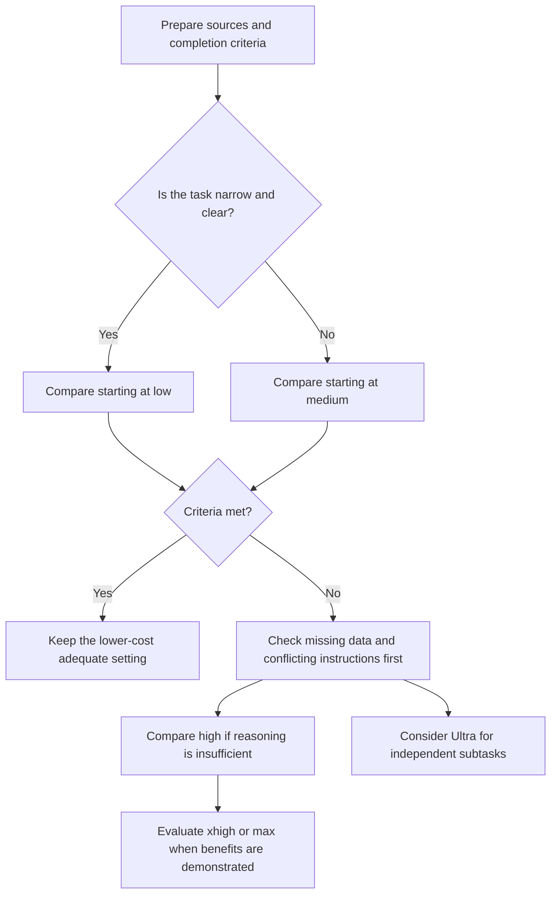

# GPT-6 Astra: choosing effort and comparing earlier models

## Summary

How much changes when you give the same request to another model or reasoning setting? A quick sentence edit benefits from a short wait, while a report comparing sources or a difficult bug investigation benefits from finding overlooked constraints. This document helps developers and non-developers choose GPT-6 Astra and an effort level for their work.

The official name of the model sometimes called “Chat GPT 6.0 Astra” is **GPT-6 Astra**, with API model ID **`gpt-6-astra`**. ChatGPT is a product; Astra is a model selected within a product or through the API. OpenAI positions Astra for difficult end-to-end work across code, apps, and research. This document uses **OpenAI documentation opened and checked on 2026-09-10**.[^astra][^work]

Choose the lowest setting that meets your requirements. Higher effort can help complex tasks but can increase time and token use. The use cases and evaluation procedure below are **conditional recommendations and hypothetical examples** based on official guidance, not measured results.[^reasoning][^work]

## Learning goals

- Distinguish what the model, reasoning effort, and product execution mode change.
- Explain `low`, `medium`, `high`, `xhigh`, `max`, and their difference from Ultra.
- Decide when to raise effort for development, documents, data, and research.
- Compare features, task quality, completion time, and cost separately across models.

## Prerequisites

Programming knowledge is optional. A **model** interprets requests and generates results. A **token** is a unit of content processed by a model, rather than necessarily a character or word. An **API** lets software call a model. A **tool** lets the model request external actions such as searching, processing files, or running code.

Start with the [reasoning effort glossary entry](../../../glossary/en/reasoning-effort.md) if the settings are unfamiliar. Developers can focus on the API example; non-developers can start with the report example.

## 101 · Understand the concepts

### Model, effort, and execution environment are separate choices

| Choice | What it changes | Example |
| --- | --- | --- |
| Model | Capabilities, processing characteristics, and pricing | Astra, Sol, Terra, Luna |
| Reasoning effort | How much thinking to encourage for a task | `low`, `high`, `max` |
| Execution environment | Available files, apps, tools, and permissions | ChatGPT Work, desktop app, Codex CLI, API |
| Delegation | Whether subagents perform separable work in parallel | A product's Ultra mode |

Changing models does not automatically provide missing data or tool access. Distinguish a model's documented tool support from whether your product can connect those tools.[^astra][^work]

Astra supports API efforts `low`, `medium`, `high`, `xhigh`, and `max`. Neither `none` nor `minimal` is in its supported list; the reasoning guide explicitly says `none` returns HTTP 400. An API enum covering multiple models is not the supported list for Astra.[^astra][^reasoning]

ChatGPT desktop, Work, and IDE interfaces label the lower effort **Light**; the CLI uses **Low**. Available options can vary by plan, rollout, and client. Do not assume every regular ChatGPT conversation offers these controls. The Astra model page checked for this document does not specify its server default effort: the `medium` starting point below is a recommendation, not a claim about the default.[^work][^astra]

### Strengths to expect from Astra

OpenAI emphasizes **following work through multiple steps and tools**. Its guide describes improved coherence on long tasks, incorporation of changed requirements, and instruction following compared with GPT-5.6 Sol and earlier models. It also notes that Astra may ask more questions when uncertainty could affect the outcome.[^guide]

| User and task | Potential benefit | What the user should provide |
| --- | --- | --- |
| Developer: feature spanning multiple files | Connect implementation, tool use, and verification | Relevant code, change boundaries, required checks |
| Developer: difficult-to-reproduce bug | Consider competing causes and constraints together | Reproduction conditions, logs, expected behavior, previous attempts |
| Non-developer: report assembled from sources | Continue from comparison through drafting and revision | Source material, audience, length, format, citation rules |
| Non-developer: spreadsheets and presentations | Combine data interpretation with communication structure | Data definitions, calculation rules, templates, completion criteria |
| Either: compare alternatives | Preserve constraints and reasons while supporting judgment | Real alternatives, priorities, budget, and schedule |

These recommendations apply officially described coding, computer-use, research, and document capabilities to practical requests. They do not guarantee a bug fix or consistently correct citations, calculations, or design.[^astra][^guide][^work]

### Adjusting how you work with the model

The guide explains that stronger instruction following can make Astra sensitive to unclear or conflicting instructions in skills and files such as `AGENTS.md`. If work stops unnecessarily, inspect the triggering instruction before raising effort.[^guide]

Specify length and tone because the model can favor detailed lists, tables, and Markdown. For coding, define proportionate completion checks because it may test small changes broadly. It may delegate less than desired, so specify which work should be divided and how results should be combined. These are documented tendencies, not fixed properties of every response.[^guide]

## 201 · Apply the concepts

### What can each effort level provide?

The reasoning guide associates lower effort with speed and token efficiency, and higher effort with complex planning and analysis. The model adapts its reasoning to task difficulty even at a single setting. Effort is therefore not a fixed waiting time, answer length, or accuracy grade.[^reasoning]

| API effort | Expectation from official guidance | Developer example | Non-developer example | Signal for considering escalation |
| --- | --- | --- | --- | --- |
| `low` | Efficient execution with limited reasoning | Small, clearly scoped change; initial error classification | Drafting or summarizing supplied text; clear extraction | Repeatedly misses important conditions or connections between steps |
| `medium` | Balance planning, judgment, quality, and latency | Feature implementation; moderately difficult code review | Report combining sources; spreadsheet or presentation structure | Alternatives or exceptions require deeper examination |
| `high` | More effort for hard reasoning, complex debugging, and deep planning | Investigating competing incident causes; design alternatives | Conflicting sources; plans with multiple constraints | Important dependencies or counterexamples remain unresolved |
| `xhigh` | Long research, asynchronous work, and demanding agent tasks | Difficult code or security review; complex change assessment | Research comparing many sources | Evaluation demonstrates an actual advantage over lower effort |
| `max` | Maximum reasoning effort for the hardest individual tasks | Comparing an upper setting for difficult diagnosis or design validation | Difficult research and synthesis with interacting criteria | Improvement over `xhigh` justifies extra time and usage |

The guide recommends `xhigh` when evaluations show a clear benefit, and asks existing `xhigh` users to evaluate whether `max` improves results. The specific workplace examples and escalation signals are suggestions derived from that guidance. Security review here does not mean certification that a system has no defects or a professional audit.[^reasoning]

### Distinguish Max from Ultra

**Max** gives the selected model more time to reason deeply about one task. **Ultra** is a product feature that distributes separable work among subagents. Do not read `low → medium → high → xhigh → max → ultra` as one API effort ladder. Astra's API effort list does not contain `ultra`.[^work][^astra]

For example, consider `high` or `max` when narrowing one bug's cause through dependent steps. Consider Ultra when three independent groups of sources can be investigated before synthesis. Delegation requires coordination, deduplication, and integration, so do not assume every task becomes faster. Official product documentation also says most tasks need neither Max nor Ultra.[^work]

This diagram is an explanatory decision procedure based on the official distinctions, not a measured performance or speed chart.



### Developer example: complete a feature change

**Assumptions:** Add a retry policy to an existing repository with tests. The change scope is agreed, and the environment permits code execution. Start at `medium` with a request such as:

```text
Implement a retry policy for external API calls.
Goal: retry only transient failures without increasing duplicate processing risk.
Sources: first read the current calling code, error logs, and existing tests.
Scope: change relevant modules only and preserve public function signatures.
Completion: test retry eligibility by error type and the retry limit.
Report: briefly explain changes, checks performed, and remaining uncertainty.
```

**Expected result and interpretation:** Judge whether the result explains retry conditions, duplicate processing risk, and actual checks, rather than code volume. If sufficient evidence is available but interactions or exceptions are missed, compare `high` under the same conditions. If logs or scope are missing, improve those first. This is a design exercise, not a measured Astra implementation.

### Non-developer example: a report with traceable evidence

**Assumptions:** Produce a decision report from three meeting records and a monthly performance spreadsheet. Tools can read the materials and produce the document. Start at `medium`; compare `high` when conflicts between sources require deeper analysis.

```text
Draft a decision report from the attached meeting records and performance table.
Audience: a department lead unfamiliar with the operational background.
Structure: conclusion, evidence, alternatives, and unresolved issues; at most two pages.
Do not invent numbers or causes. Cite sources for important claims.
When figures conflict, compare their periods, units, and definitions first.
Produce a reviewable draft, then list only questions that could change the conclusion.
```

**Expected result and interpretation:** Check matching periods and units, separation of facts from interpretation, and traceability of conclusions. Length and polish are insufficient criteria. Ultra may help if the three sources can be analyzed independently, but common definitions and responsibility for synthesis must be established. This is also hypothetical, not an observed report-quality evaluation.

### Configure the API

This conceptual Responses API request uses text without external tools. It has not been executed. Do not record API keys in documents or the repository.[^guide]

```json
{
  "model": "gpt-6-astra",
  "reasoning": { "effort": "medium" },
  "input": "Separate assumptions, alternatives, and points needing verification in this design: ..."
}
```

Migration requires more than changing the model ID. Astra tool calls require Responses; Chat Completions does not support tool calling for this model. Remove unsupported parameters such as `temperature`, `top_p`, and `top_logprobs`. The migration guide also directs users to remove Chat Completions `logprobs` and `message.output_text.logprobs` from Responses `include`.[^guide]

In standard single-agent mode, Astra can change effort during a conversation through `configuration_update` while preserving the initial prompt prefix for caching. Automatic compaction and truncation have compatibility restrictions. Check the detailed guide before adopting this feature; it is intentionally outside the simple example.[^reasoning]

## 301 · Make decisions under constraints

### What changed from earlier models?

This comparison summarizes official positioning and support. It does not convert stars or icons into performance scores or combine incompatible evaluations into a ranking.[^work][^guide][^sol][^gpt55]

| Model | Officially described strength or position | Selection relative to Astra |
| --- | --- | --- |
| GPT-6 Astra | The hardest end-to-end work across code, apps, and research; sustained reasoning and judgment | Evaluate first when long-task coherence and changing requirements matter |
| GPT-5.6 Sol | Complex, open-ended work requiring analysis, judgment, and polished results | Compare Astra's actual additional benefit if existing results are adequate |
| GPT-5.6 Terra | Balanced everyday model, described as competitive with GPT-5.5 at lower cost | Consider as a starting point for recurring general work |
| GPT-5.6 Luna | Fast, cost-efficient, clear, repeatable work | Consider for extraction, classification, transformation, and structured summaries |
| GPT-5.5 | Earlier-generation model for complex coding, computer use, knowledge work, and research | Use existing evaluations as a baseline for identical tasks |

**Newly described Astra features** include asynchronous tool calling while other independent work continues, mid-turn steering, and changing effort while retaining the cached prefix. Applications still execute asynchronous tools and manage pending results; the API path for mid-turn steering uses WebSockets. These capabilities require application integration.[^guide]

Computer use, Structured Outputs, streaming, multi-agent orchestration, and compaction were already available with GPT-5.6. Their existence is not an Astra-only innovation.[^guide]

| API model characteristic | GPT-5.5 | GPT-5.6 Sol | GPT-6 Astra |
| --- | --- | --- | --- |
| Context window | 1,050,000 tokens | 1,050,000 tokens | 1,050,000 tokens |
| Maximum output | 128,000 tokens | 128,000 tokens | 128,000 tokens |
| Documented knowledge cutoff | 2025-12-01 | 2026-02-16 | 2026-04-30 |
| Supported effort | `none`, `low`, `medium`, `high`, `xhigh` | `none`, `low`, `medium`, `high`, `xhigh`, `max` | `low`, `medium`, `high`, `xhigh`, `max` |

These are API model-page values. **A larger context window does not distinguish Astra from these two models.** Astra and Sol both list a maximum input of 922,000 tokens. The entire context window is not available for user input, and reasoning tokens also consume context. Actual product limits require separate checking.[^astra][^sol][^gpt55][^reasoning]

Astra accepts text and image input and produces text output. Support for an image-generation tool is different from direct image output by the model. A knowledge cutoff does not guarantee current accuracy; use search and original sources for recent facts.[^astra]

### A higher model or effort is not always advantageous

Reasoning tokens are billed as output tokens even though the API does not expose their contents. A short final answer can still consume substantial usage. OpenAI describes lower estimated task cost in some evaluations where Astra achieves better results with fewer output tokens; this is not a guarantee of savings on every user's workload.[^reasoning][^guide]

Compare retries, tool use, completion time, and human rework as well as token rates. API USD prices and product usage or credits are different units. Luna or Terra may suffice for recurring summaries, while completion quality may matter more for a long, complex Astra task.[^work]

There is no basis for an equation such as `GPT-5.5 high = Astra medium`. Product documentation says even GPT-5.5 and GPT-5.6 lack exact effort equivalence. Astra migration guidance recommends starting at `low` for existing `none` or `minimal` users, and otherwise preserving the current effective effort initially.[^work][^guide]

### Compare using your own tasks

The following procedure is a recommendation, not an official benchmark or measurement.

1. Select recurring tasks of different difficulty. Developers might use small edits, complex bugs, and design reviews; non-developers might use summaries, reports, and conflicting-source analysis.
2. Hold sources, prompts, tool permissions, and completion criteria constant. Record the actual model ID and effort, checking product availability first.
3. Repeat evaluations and record requirement fulfillment, factual or citation errors, rework, total completion time, and actual usage. Do not score quality by answer length.
4. Choose the lowest setting meeting the criteria. Separate missing data, tool failures, and ambiguous instructions from configuration problems.
5. Escalate important tasks to higher effort or Astra, and continue reviewing the results after switching.

| Record | Development criteria | Non-development criteria |
| --- | --- | --- |
| Requirement fulfillment | Requested behavior and compatibility | Audience, structure, length, and key questions |
| Accuracy | Reproduction, relevant tests, boundary conditions | Original-source checks, calculations, citation links |
| Completion efficiency | Additional changes and unnecessary checks | Rewriting and additional source preparation |
| Time and usage | Total execution time and actual usage records | Time including review and actual usage records |

## Check your understanding

**Question 1:** Does `max` always improve a simple title edit?

**Answer:** Official documentation makes no such guarantee. First check whether a low setting meets the criteria for a short, clear task. Higher effort is justified when improvement warrants the extra time and usage.

**Question 2:** Can you enable Ultra by sending `"effort": "ultra"` to the API?

**Answer:** No. Astra's API list ends at `max`; Ultra in product documentation means parallel delegation to subagents. Check support in the product or application you use.

**Question 3:** Should you migrate from Sol because Astra offers a larger context window?

**Answer:** The Astra, Sol, and GPT-5.5 API context windows compared here are equal. Base migration on actual improvement in coherence, tool use, judgment, and completion quality on your work.

## Evidence and limits

The official pages below were read and compared for supported settings, feature changes, and product behavior. Claims of stronger performance represent OpenAI's descriptions, not independent reproduction. Account-specific availability, accuracy, latency, usage by effort, and execution of the API example were not verified. Undocumented multipliers, scores, and fixed token budgets are not estimated.

Tables and the diagram reconstruct official distinctions for explanation. No generated benchmark illustration is presented as an official evaluation. Recheck after 30 days or sooner if official documentation changes because models and product settings change frequently.

## Related knowledge

[Reasoning effort](../../../glossary/en/reasoning-effort.md) · [AI Engineering](index.md) · [Change detection and knowledge verification](../testing/verification-vs-change-detection.md) · [한국어](../../ko/ai-engineering/gpt-6-astra.md)

## Sources

[^astra]: [OpenAI — GPT-6 Astra model](https://developers.openai.com/api/docs/models/gpt-6-astra)
[^guide]: [OpenAI — Using GPT-6 Astra](https://developers.openai.com/api/docs/guides/latest-model?model=gpt-6-astra)
[^reasoning]: [OpenAI — Reasoning models](https://developers.openai.com/api/docs/guides/reasoning)
[^work]: [OpenAI — Models: ChatGPT Work, apps, and Codex](https://learn.chatgpt.com/docs/models)
[^sol]: [OpenAI — GPT-5.6 Sol model](https://developers.openai.com/api/docs/models/gpt-5.6-sol)
[^gpt55]: [OpenAI — GPT-5.5 model](https://developers.openai.com/api/docs/models/gpt-5.5)
