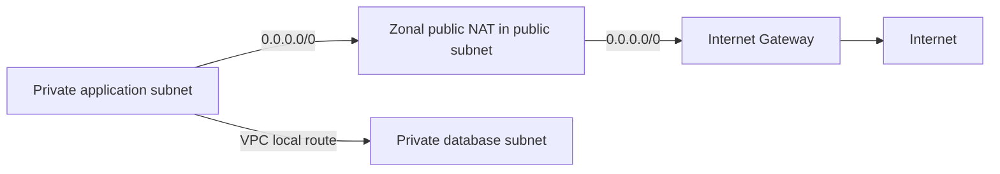

# Public and private subnets: a routing distinction

## Summary

Inspect direct internet-gateway routing rather than relying on subnet names.

## External facts

- A public subnet has a direct route to an internet gateway; a private subnet does not.[^subnets]

- Direct IPv4 internet access also needs a public IPv4/EIP and permitted traffic configuration. Neither the subnet name nor an address alone is sufficient.[^igw]

- Design private-subnet internet egress through an appropriate path such as NAT. Distinguish IPv6 routing and an egress-only internet gateway from IPv4 NAT.[^nat]

## Selection criteria and recommendations

- Separate internet entry points, applications, and databases, then define required egress.

- Private does not mean disconnected from the internet; an IGW route alone does not expose every instance.

- Review subnets for the required tiers in each AZ to separate failure domains.

## Design example

IPv4 example: public 0.0.0.0/0 → IGW; private application 0.0.0.0/0 → NAT. VPC-local traffic uses a separate local route. Validate actual traffic permissions as well as this illustrative routing.

This illustrates IPv4 routes with zonal public NAT. AZ redundancy, SG/NACL rules, and permissions are omitted; this is not an actual deployment diagram.

## Operational checks

- [ ] Have the associated route table and IPv4/IPv6 default routes been checked?
- [ ] Which resources require image, package, or external API access?
- [ ] Does the database avoid unnecessary public access paths?

## Evidence and limits

An agent compared the technical claims with the official sources below on 2026-09-08. Recommendations are conditional design judgments; examples are not AWS execution or personal experiment results. Before implementation, recheck support for the target Region, engine, and execution mode, along with relevant quotas and prices.

## Related knowledge

- [Amazon VPC: address space and connectivity boundaries](aws-vpc.md)
- [Route tables: destinations and next hops](aws-route-table.md)
- [NAT gateways: egress and availability modes](aws-nat-gateway.md)
- [Internet gateways: a target for VPC internet routing](aws-internet-gateway.md)

[한국어 원문](../../ko/cloud/aws-subnets.md)

## Sources

[^subnets]: [Subnets for your VPC](https://docs.aws.amazon.com/vpc/latest/userguide/configure-subnets.html)
[^igw]: [Connect to the internet using an internet gateway](https://docs.aws.amazon.com/vpc/latest/userguide/VPC_Internet_Gateway.html)
[^nat]: [NAT gateways](https://docs.aws.amazon.com/vpc/latest/userguide/vpc-nat-gateway.html)
