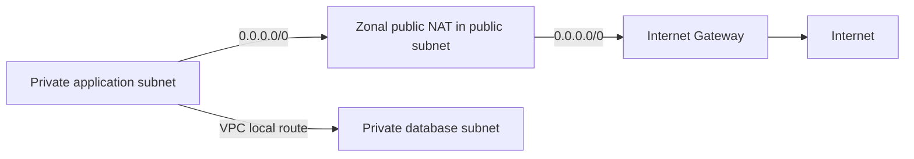

# Public and private subnets: a routing distinction

## Summary

A subnet is a range of IP addresses within a VPC. Public and private subnets are distinguished by a direct route to an internet gateway, not by their names. This distinction helps explain communication for public-facing and internal tiers.[^subnets]

## Learning objectives

Distinguish public and private subnets by routing, and trace internet-bound and VPC-local paths in an IPv4 example.

## Prerequisites

Read [VPC](aws-vpc.md) and [CIDR](../../../glossary/en/cidr.md) first. Routing chooses a path by destination; egress means outbound traffic.

## 101 · Understand the concept

### External facts

A public subnet has a direct route to an internet gateway; a private subnet does not.[^subnets]

Direct IPv4 internet access also needs a public IPv4/EIP and permitted traffic configuration. Neither the subnet name nor an address alone is sufficient.[^igw]

Design private-subnet internet egress through an appropriate path such as NAT. Distinguish IPv6 routing and an egress-only internet gateway from IPv4 NAT.[^nat]

## 201 · Apply the example

### Design example

Consider an IPv4 application accessing an external API and an internal DB. Assume the public subnet has a default route 0.0.0.0/0 → IGW and the private application has 0.0.0.0/0 → NAT. Traffic to the DB within the VPC uses a separate local route.

Trace the external API and internal DB paths in the diagram. Check priority if more specific routes exist. Actual communication also requires security-group and network-ACL permissions and service configuration. The diagram illustrates IPv4 with zonal public NAT and omits AZ redundancy, SG/NACL rules, and permissions.

## 301 · Make a conditional judgment

### Selection criteria and recommendations

- Separate internet entry points, applications, and databases, then define required egress.

- Private does not mean disconnected from the internet; an IGW route alone does not expose every instance.

- Review subnets for the required tiers in each AZ to separate failure domains.

### Operational checks

- [ ] Have the associated route table and IPv4/IPv6 default routes been checked?
- [ ] Which resources require image, package, or external API access?
- [ ] Does the database avoid unnecessary public access paths?

## Check your understanding

**Question:** Is an application in a private subnet unable to use an external API?

**Explanation:** Private means there is no direct IGW route. An outbound connection can be designed with a NAT path and the required permissions, as in this example. Review IPv6 separately.

## Evidence and limits

Examples explain concepts and support design exercises; they are not AWS execution results. Before applying recommendations, check support for the target Region, engine, and execution mode, along with quotas and prices. Source-comparison scope and translation review are recorded in the [document change log](../../../log.md).

## Related knowledge

- [Amazon VPC: address space and connectivity boundaries](aws-vpc.md)
- [Route tables: destinations and next hops](aws-route-table.md)
- [NAT gateways: egress and availability modes](aws-nat-gateway.md)
- [Internet gateways: a target for VPC internet routing](aws-internet-gateway.md)

[한국어 원문](../../ko/cloud/aws-subnets.md)

## Sources

[^subnets]: [Subnets for your VPC](https://docs.aws.amazon.com/vpc/latest/userguide/configure-subnets.html)
[^igw]: [Connect to the internet using an internet gateway](https://docs.aws.amazon.com/vpc/latest/userguide/VPC_Internet_Gateway.html)
[^nat]: [NAT gateways](https://docs.aws.amazon.com/vpc/latest/userguide/vpc-nat-gateway.html)
