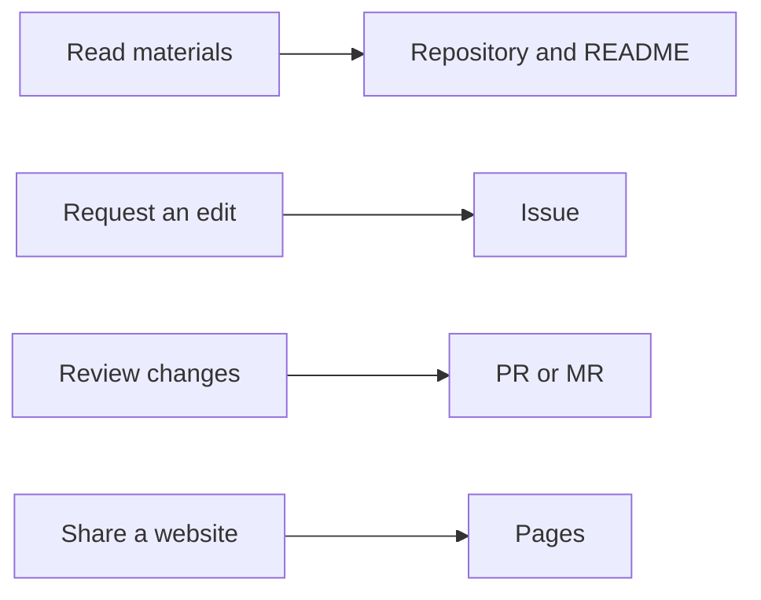

# GitHub and GitLab compared: what belongs where?

## Summary

GitHub and GitLab are **platforms connecting files and their history, tasks, and change reviews**. Developers can participate through code and technical documentation; non-developers can contribute requirements, guides, and review feedback. Initially, it helps to distinguish reading materials, making a request, reviewing changes, and sharing a website.[^github][^repository][^issues][^mr]

This article compares the shared workflow and different names. For first-use guidance in each interface, read [GitHub basics](github-fundamentals.md) and [GitLab basics](gitlab-fundamentals.md).

## Learning goals

- Explain how Git relates to GitHub and GitLab.
- Map Repository, Issue, PR/MR, and Pages to real tasks.
- Distinguish GitHub Projects from a GitLab Project.
- Judge completion together as requester, editor, and reviewer.

## Prerequisites

Experience with files, folders, and web links is enough. [Git](../../../glossary/en/git.md) tracks changes to files. GitHub and GitLab provide collaboration around Git repositories. Using Git does not require an account on either platform.[^github][^repository]

## 101 · Understanding the concepts

### Meet similar work under different names

| Task | GitHub | GitLab | What to remember first |
| --- | --- | --- | --- |
| Manage files and history | Repository | Repository inside a Project | Holds source materials and history. |
| Understand a project | README | README | Introduces where to start. |
| Record a problem, request, or task | Issue | Issue | Describes work and completion criteria. |
| Review proposed file changes | Pull Request, PR | Merge Request, MR | Shows before-and-after differences. |
| View requests together | Projects | Issue board | Organizes items in tables or cards. |
| Organize knowledge across pages | Wiki | Wiki | Collects usage or operating instructions. |
| Publish a website for visitors | GitHub Pages | GitLab Pages | Presents results at a published web address. |

This maps feature names; permissions, interfaces, and plans are not necessarily identical. GitHub Projects manages work, while a GitLab Project is a work unit containing a repository and other features. **Do not map a GitLab Project directly to a GitHub Projects board.**[^gh-projects][^repository][^boards]

Issues and PRs/MRs can be connected, but serve different roles. An Issue addresses “what needs doing and why”; a PR/MR addresses “what actually changed and whether to combine it.”[^gh-issues][^issues][^mr]



Figure 1. An illustrative way to choose an entry point by purpose. Every task does not need all four features.

### Distinguish Pages from a document view

Both platforms use Pages to publish static websites. Reading `README.md` on GitHub or GitLab differs from reading a guide at a Pages address. Saving a repository file or closing an Issue does not establish that the website has been published.[^gh-pages][^gl-pages]

For example, a recruitment guide for participants could go on Pages, operating knowledge in a Wiki or repository document, and “Please correct the application deadline” in an Issue. These are suggestions based on audience and purpose.[^gh-wiki][^gl-wiki]

## 201 · Applying an example

### Map the same club guide task onto both services

**Assumptions:** A fictional club guide omits the meeting time. The confirmed schedule is every Saturday at 2 p.m. A requester, editor, and reviewer divide the work; one person may practice all three roles. This is a design exercise, not an actual project creation or work result.

| Step and role | What is recorded | On GitHub | On GitLab |
| --- | --- | --- | --- |
| Requester explains the problem | Missing location, confirmed time, completion criteria | Issue | Issue |
| Editor records a change | Added README time and reason | Commit on a working branch | Commit on a working branch |
| Reviewer checks it | Correct Saturday and 2 p.m.; other guidance preserved | PR diff | MR diff |
| Authorized person incorporates it | Reviewed changes combined into the default branch | Merge | Merge |
| Requester checks completion | Reads time on the default branch and records result links | Update Issue | Update Issue |

The individual service guides cover browser steps for branches, commits, and merging. Here, **completion means the README is updated**. If the request also includes the visitor-facing website, add checking the actual Pages display to the criteria.

Make review feedback concrete:

```text
Saturday is the correct day.
The time should be 2 p.m., not 2 a.m.
After that correction, I will check the README on the default branch.
If website publishing is part of this request, I will also check the Pages address.
```

**Expected result and interpretation:** The request, reasons for edits, and review result are connected and findable. “Saved → review requested → merged → published” are distinct states. Check the stages required by the task before declaring completion.

## 301 · Making a judgment

### Start where your collaborators already work

| Situation | Recommended starting point | Reason |
| --- | --- | --- |
| Your team already uses one service. | Its README and Issues | Learn where the materials and responsible people are. |
| You want to join a particular public project. | The service hosting that project | Follow its existing participation and review guidance. |
| You are practicing alone for the first time. | Either service's README exercise | Learn the common workflow without managing two accounts at once. |
| You are a non-developer. | Reading → Issue → wording diff review | Contribute accurate requirements and results without commands. |
| You only need a guide website. | Check Pages publishing and access conditions | Storing files and publishing to the web require different preparation. |

These are introductory learning criteria. Organizational selection requires a separate review of existing accounts, access policies, operating environment, and costs. This guide does not rate either service as universally superior.

### Resolve common early confusion

- **Are Issues only for errors?** They also track improvements and tasks.[^gh-issues][^issues]
- **Are PRs/MRs only for developers?** Wording, translation, and requirement changes can also be reviewed through diffs. Access permission is required.
- **Does Pages automatically publish everything in a repository?** Configured publishing materials become the site. Check source and site access separately.[^gh-create-pages][^gl-access]
- **Must you study Actions or CI/CD first?** You can start by reading files, opening Issues, and reviewing wording. Publishing a Pages site involves publishing configuration and automated execution; detailed setup is a later step.[^gh-create-pages][^gl-pages]

## Check your understanding

1. **Where should a planner report an incorrect time?** Start with an Issue giving the file location and correct time. If an edit is already proposed, leave feedback on its PR/MR.
2. **Does creating a GitLab Project produce the same result as creating GitHub Projects?** The former creates a work unit containing a repository; the latter creates a work management view.
3. **Does merging a PR/MR necessarily update the reader-facing site?** Check the publishing connection and deployment result separately. If the task requires a site update, inspect the actual address.

## Evidence and limits

Feature descriptions use official GitHub and GitLab documentation; role assignments and starting sequences are introductory suggestions. Examples are fictional. Detailed Git commands, GitHub Actions, GitLab CI/CD, account pricing comparisons, and organizational migration are outside this article's scope.

## Related knowledge

- [GitHub basics](github-fundamentals.md)
- [GitLab basics](gitlab-fundamentals.md)
- [Git glossary entry](../../../glossary/en/git.md)
- [Delivery index](index.md)

## Sources

[^github]: [GitHub — What is GitHub?](https://docs.github.com/en/get-started/start-your-journey/what-is-github)
[^gh-issues]: [GitHub — About issues](https://docs.github.com/en/issues/tracking-your-work-with-issues/learning-about-issues/about-issues)
[^gh-projects]: [GitHub — About Projects](https://docs.github.com/en/issues/planning-and-tracking-with-projects/learning-about-projects/about-projects)
[^gh-wiki]: [GitHub — About wikis](https://docs.github.com/en/communities/documenting-your-project-with-wikis/about-wikis)
[^gh-pages]: [GitHub — What is GitHub Pages?](https://docs.github.com/en/pages/getting-started-with-github-pages/what-is-github-pages)
[^gh-create-pages]: [GitHub — Creating a GitHub Pages site](https://docs.github.com/en/pages/getting-started-with-github-pages/creating-a-github-pages-site)
[^repository]: [GitLab — Repository](https://docs.gitlab.com/user/project/repository/)
[^issues]: [GitLab — Issues](https://docs.gitlab.com/user/project/issues/)
[^mr]: [GitLab — Merge requests](https://docs.gitlab.com/user/project/merge_requests/)
[^boards]: [GitLab — Issue boards](https://docs.gitlab.com/user/project/issue_board/)
[^gl-wiki]: [GitLab — Wiki](https://docs.gitlab.com/user/project/wiki/)
[^gl-pages]: [GitLab — GitLab Pages](https://docs.gitlab.com/user/project/pages/)
[^gl-access]: [GitLab — GitLab Pages access control](https://docs.gitlab.com/user/project/pages/pages_access_control/)
