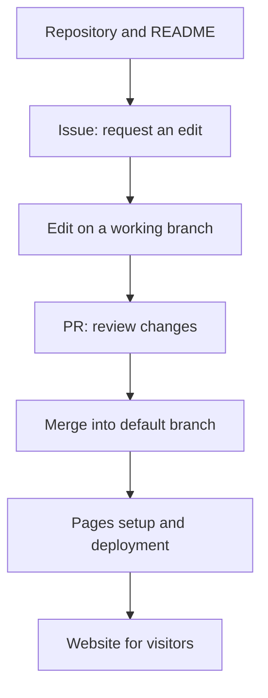

# GitHub basics: collaborate with repositories, Issues, and Pages

## Summary

Imagine several people editing a club guide until nobody knows whether to read `guide_final` or `guide_really_final`. GitHub stores files and their history, records work to do, and lets people review proposed changes together. This workflow also applies to guides, study notes, and project documentation.[^overview]

Start with the roles of **Repository → Issue → Pull Request → Pages**. Pages publishes a website when one is needed. Every repository does not need a website.

## Learning goals

- Understand a project through its files and README.
- Record a request in an Issue and inspect actual changes in a Pull Request.
- Decide what belongs in a README, Wiki, or Pages site.
- Explain how to change one line of a guide in a browser.

## Prerequisites

Experience opening files and folders is enough. [Git](../../../glossary/en/git.md) tracks file history; GitHub hosts Git repositories and provides collaboration features. **Markdown** formats documents with notation such as `# Heading` in `.md` files. The example requires an account but no terminal commands or Git installation.[^hello]

## 101 · Understanding the concepts

### Read a repository as a shared workspace

A **repository**, or repo, manages project files and their history. Its GitHub interface connects these files with collaboration features such as Issues and Pull Requests. The **README** is an introduction explaining what the project does and where to start reading.[^overview][^wiki]

| What you see | Plain explanation | Club guide example |
| --- | --- | --- |
| File list / Code | Where you find source materials | `README.md` and guide images |
| README | The project's introduction | Purpose, schedule, and how to participate |
| Issue | An item recording work and discussion | “Please add the Saturday meeting time” |
| Pull Request / PR | Proposed file changes for review and inclusion | An edit adding the time |
| Pages | A feature for publishing web materials from a repository | A guide website shared with participants |

Issues can track questions, improvements, and scheduling work as well as bugs. An **assignee** indicates who is handling an item; a **label** categorizes it. A PR displays the **diff**, or before-and-after differences, alongside feedback.[^issues][^hello]



Figure 1. An illustrative club guide workflow. The last two steps apply when Pages publishing is configured and ready.

### Understand Commit, Branch, and Merge as three actions

A **commit** records changes with an explanation. A **branch** is a separate line of work for editing without immediately changing the baseline. A **merge** combines reviewed changes into the target branch. Opening a PR does not mean it has been merged.[^hello]

### README, Wiki, and Pages serve different reading situations

A README suits an introduction, a **Wiki** suits instructions or knowledge organized across multiple pages, and **Pages** suits a website at a separate address. A Wiki supports collaborative documentation within the platform; Pages presents the result as a website.[^wiki][^pages]

**GitHub Projects** collects Issues and PRs into views such as tables and boards. For example, when guide requests grow, a board can help show work and progress. Projects is not the name for the repository itself.[^projects]

## 201 · Applying an example

### Edit one line of a guide in your browser

**Assumptions:** You create a practice repository named `club-guide` under your own account. The fictional club meets every Saturday at 2 p.m. This personal exercise assumes no additional approval rules or automated checks. No actual account, repository, or Issue was created for this example.

1. Choose `New repository`, enter a name, select visibility, and add a README. Public makes it publicly readable; Private limits reading to people granted access. A Private repository is fine for the initial personal exercise.[^create-repo]
2. Under `Issues`, create “Add the meeting time to README.” Describe the problem and completion criteria, as in the example below.
3. From the file view, create an `add-meeting-time` branch based on the default branch and open `README.md`.
4. Use the edit button to add `Meeting: every Saturday at 2 p.m.` Enter the commit message `Add meeting time information` and commit to the current working branch.[^edit]
5. Under `Pull requests`, open a new PR comparing your working branch with the default branch. Include a link to the Issue in the description.[^create-pr]
6. Check the time and scope of changes, then merge. Read the README on the default branch again. If it meets the criteria, record the result in the Issue and close it.[^hello][^issues]

```text
Title: Add the meeting time to README
Current situation: The guide omits the day and time, so participants ask again.
Request: State that the meeting is every Saturday at 2 p.m.
Completion criteria: The README on the default branch shows the correct day and time.
```

**Expected result and interpretation:** The Issue retains the reason for the request, the PR retains the edit and review, and the repository contains the updated file. Closing an Issue does not itself change a file. Use the actual Issue number assigned when it is created.

### Explore an existing Pages site first

Compare [this Fieldbook's source repository](https://github.com/KamiJeong/engineering-fieldbook) with [the reader-facing site](https://kamijeong.github.io/engineering-fieldbook/). The repository exposes files and history, while the website presents a reading interface.

To publish your own practice materials, prepare a repository eligible for Pages and the files to publish, then choose a publishing source in `Settings → Pages`. Follow the [official creation guide](https://docs.github.com/en/pages/getting-started-with-github-pages/creating-a-github-pages-site). Editing a README does not automatically publish every repository.[^create-pages]

GitHub Free supports Pages in public repositories. Private repository support depends on the plan, and a private source repository does not establish that its Pages site is private. Begin with materials suitable for public viewing and check publication and the actual site address.[^pages][^create-pages]

## 301 · Making a judgment

| Goal | Start with | How to check completion |
| --- | --- | --- |
| Understand a project | README and file list | Find its purpose and relevant files. |
| Report a typo or missing information | Issue | Include the location, current content, request, and completion criteria. |
| Check revised wording | PR | Read the diff and related Issue together. |
| See progress across requests | Projects | Check who is handling each item. |
| Organize detailed internal instructions | Wiki or repository documents | Check the team's chosen location and access scope. |
| Share a guide website with readers | Pages | Check content and access at the published address. |

These are suggestions for a small documentation project. You can begin with one README and one Issue, adding features as needed. If a menu is unavailable, check feature settings, permissions, and plan conditions.[^wiki][^pages]

## Check your understanding

1. **Does creating “Please add the time” as an Issue change the README?** No. Recording a request and editing a file are separate actions.
2. **What should you check if a PR is open but the text is missing from the default branch?** Check its target branch and merge status first.
3. **Does Pages immediately handle reservations and payments?** Pages hosts static sites. It can present interfaces and links, but storing reservations or processing payments on a server requires another service.[^pages]

## Evidence and limits

This introduction draws on official GitHub documentation. Menu locations and feature availability can change. The club workflow is fictional; Actions configuration, automated checks, and deployment troubleshooting are later topics. Pages serves prepared web files; this does not prohibit JavaScript running in the visitor's browser.[^pages]

## Related knowledge

- [GitHub and GitLab compared](github-and-gitlab.md)
- [GitLab basics](gitlab-fundamentals.md)
- [Git glossary entry](../../../glossary/en/git.md)
- [Delivery index](index.md)

## Sources

[^overview]: [GitHub — What is GitHub?](https://docs.github.com/en/get-started/start-your-journey/what-is-github)
[^hello]: [GitHub — Hello World](https://docs.github.com/en/get-started/using-github/hello-world)
[^issues]: [GitHub — About issues](https://docs.github.com/en/issues/tracking-your-work-with-issues/learning-about-issues/about-issues)
[^projects]: [GitHub — About Projects](https://docs.github.com/en/issues/planning-and-tracking-with-projects/learning-about-projects/about-projects)
[^wiki]: [GitHub — About wikis](https://docs.github.com/en/communities/documenting-your-project-with-wikis/about-wikis)
[^pages]: [GitHub — What is GitHub Pages?](https://docs.github.com/en/pages/getting-started-with-github-pages/what-is-github-pages)
[^create-pages]: [GitHub — Creating a GitHub Pages site](https://docs.github.com/en/pages/getting-started-with-github-pages/creating-a-github-pages-site)

[^create-repo]: [GitHub — Creating a new repository](https://docs.github.com/en/repositories/creating-and-managing-repositories/creating-a-new-repository)
[^edit]: [GitHub — Editing files](https://docs.github.com/en/repositories/working-with-files/managing-files/editing-files)
[^create-pr]: [GitHub — Creating a pull request](https://docs.github.com/en/pull-requests/how-tos/create-pull-requests/creating-a-pull-request)
