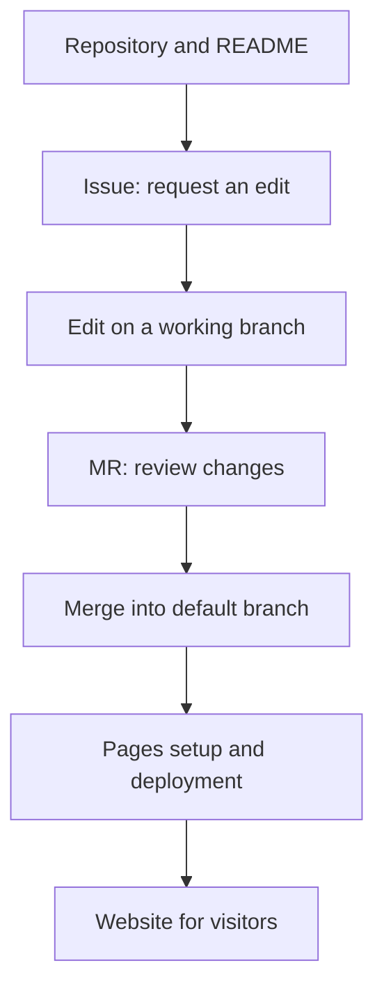

# GitLab basics: work together with Projects, Issues, and Pages

## Summary

Imagine a teammate asking you to put a guide in a GitLab project and open an Issue with your request. In GitLab, a **Project** connects a repository with work management features. Learning to read files, record work, and review edits lets you start without studying development automation.[^repository][^issues][^mr]

This guide covers features encountered on GitLab.com and on GitLab operated by an organization. An organization's version and administrator settings can affect menus and availability.[^create][^pages]

## Learning goals

- Distinguish the Repository, Issues, and Merge Requests inside a Project.
- Connect a guide update request with actual file changes.
- Choose between a README, Wiki, Issue board, and Pages by purpose.
- Explain how to propose an edit in a browser and what to review.

## Prerequisites

You can start if you can read files and folders. [Git](../../../glossary/en/git.md) tracks file history. A **README** introduces a project; **Markdown** formats documents with simple notation such as `# Heading`. The exercise requires signing in and permission to create and edit a project.[^create][^editor]

## 101 · Understanding the concepts

### A Project contains a repository

A GitLab **Project** contains a **Repository** holding files and history. Issues and Merge Requests also connect to project work. “Open the project” usually means entering this overall workspace.[^repository][^issues][^mr]

| Feature | Plain explanation | Club guide example |
| --- | --- | --- |
| Repository and README | Source files, history, and introduction | Read the club's purpose in `README.md`. |
| Issue | An item recording a request, problem, or task | “Add the meeting time.” |
| Merge Request / MR | A proposal to review and combine file changes | Review the added time. |
| Issue board | A view of Issues as cards and lists | Check progress across requests. |
| Wiki | A space organizing project documentation | Operating instructions and FAQ |
| Pages | A feature for publishing web materials as a site | A club guide website for participants |

An Issue's **assignee** identifies who is handling it; a **label** describes its category. Issue boards collect requests into a visual view. A Wiki is a documentation space separate from the code repository and can be edited on the web.[^issues][^boards][^wiki]



Figure 1. An illustrative GitLab project workflow from reading the README through requesting an edit to publishing a site. Pages connects to it when publishing has been prepared separately.

### An MR shows what changed and how

A **branch** is a separate line of work. A **commit** records changes with an explanation. A **merge** combines changes from a working branch into a target branch. An MR presents the **diff**, comments, and commits.[^repository][^editor][^mr]

For example, an Issue explains why meeting information is needed, while an MR proposes adding “Saturday at 2 p.m.” to the README. A reviewer checks the time, target file, and preservation of other wording. The person creating an MR is not always someone authorized to merge it.[^mr]

## 201 · Applying an example

### Update the club guide in a browser

**Assumptions:** In your own `club-guide` practice project, initialize a README and add the fictional meeting time “every Saturday at 2 p.m.” This personal exercise assumes permission to merge into the default branch and no additional approval or check requirements. It is not a record of creating an actual GitLab account or project.

1. Choose `New project/repository → Create blank project`, enter a name and visibility, and initialize the repository with a README. Public makes it publicly readable; Private limits reading to people granted access.[^create]
2. In `Plan → Work items → New item`, select the `Issue` type. Use the title “Add the meeting time to README” and the body below. Earlier versions may show an `Issues` menu; check your organization's version guidance.[^create-issue]
3. Open `README.md` in the repository and choose `Edit → Edit single file`. Add `Meeting: every Saturday at 2 p.m.`[^editor]
4. Under `Commit changes`, enter `Add meeting time information`. Choose to commit to a new branch named `add-meeting-time` and create an MR.[^editor]
5. Link the Issue in the MR description and confirm that it proposes changes from the working branch into the default branch. Read the diff, then merge when the merge requirements are met.[^mr]
6. Read the README on the default branch again. If the correct time is present, record the result and MR link in the Issue, then close it.

```text
Title: Add the meeting time to README
Current situation: The meeting time cannot be found.
Request: Add “every Saturday at 2 p.m.”
Completion criteria: The README on the default branch shows the correct day and time.
```

**Expected result and interpretation:** The request and reasons for the change are connected, and the final guide is readable on the default branch. A closed MR alone does not establish that it was merged. Check both merge status and the target file. If a button is unavailable in a company project, check permissions and merge conditions with the project contact.[^mr]

### Meet Pages when presenting the result

**GitLab Pages** publishes static sites from web files in a repository. A static site serves prepared files to visitors. JavaScript can run in the browser, but Pages itself does not execute server-side programs such as PHP.[^pages]

Start by opening your team's existing Pages site or examples in the official documentation. Check the actual published address under `Deploy → Pages`. GitLab.com uses `gitlab.io` domains by default, but unique or custom domains can be used, so do not construct an address by guessing.[^pages][^domains]

Publishing your own site requires web files and publishing configuration. Official guidance offers UI-assisted setup and templates. **GitLab CI/CD runs the publishing process.** At this stage, understand the relationship; YAML, Runners, and pipeline authoring are later topics.[^pages]

## 301 · Making a judgment

| Situation | Start with | Judgment criterion |
| --- | --- | --- |
| You have just joined a project. | README and Repository | Find its purpose, relevant files, and participation guidance. |
| You need to request a change without development knowledge. | Issue | Describe the situation, desired result, and completion criteria. |
| You are reviewing wording. | MR | Compare the diff with the Issue's requirements. |
| You lose track of many requests. | Issue board | Agree on assignees and list categories with the team. |
| You organize operating knowledge across documents. | Wiki | Check for duplication with the team's existing documentation. |
| You show a finished guide to external participants. | Pages | Check the actual address and visitor access. |

These suggestions suit a small documentation project; you do not need every feature. **Check Project visibility and Pages audience separately.** Pages access control depends on project and administrator settings.[^access]

## Check your understanding

1. **Do Project and Repository mean exactly the same thing?** In GitLab, the repository is a component of the project, which also contains work management features and settings.[^repository]
2. **Can a planner review an MR?** With access, they can review wording and requirements through the diff. Share judgments about code execution with someone who has the necessary knowledge.
3. **Will a Pages link from a Private project always be limited to members?** Do not assume so. Check the actual Pages access control setting.[^access]

## Evidence and limits

This guide uses the current concepts and menus in official GitLab documentation. Organizational installations can differ in version, enabled features, and permissions. The example is not a record of creating, editing, merging, or publishing on GitLab. Detailed CI/CD setup and operational troubleshooting are outside its scope.

## Related knowledge

- [GitHub and GitLab compared](github-and-gitlab.md)
- [GitHub basics](github-fundamentals.md)
- [Git glossary entry](../../../glossary/en/git.md)
- [Delivery index](index.md)

## Sources

[^create]: [GitLab — Create a project](https://docs.gitlab.com/user/project/)
[^repository]: [GitLab — Repository](https://docs.gitlab.com/user/project/repository/)
[^issues]: [GitLab — Issues](https://docs.gitlab.com/user/project/issues/)
[^create-issue]: [GitLab — Create an issue](https://docs.gitlab.com/user/project/issues/create_issues/)
[^editor]: [GitLab — Web Editor](https://docs.gitlab.com/user/project/repository/web_editor/)
[^mr]: [GitLab — Merge requests](https://docs.gitlab.com/user/project/merge_requests/)
[^boards]: [GitLab — Issue boards](https://docs.gitlab.com/user/project/issue_board/)
[^wiki]: [GitLab — Wiki](https://docs.gitlab.com/user/project/wiki/)
[^pages]: [GitLab — GitLab Pages](https://docs.gitlab.com/user/project/pages/)
[^access]: [GitLab — GitLab Pages access control](https://docs.gitlab.com/user/project/pages/pages_access_control/)

[^domains]: [GitLab — GitLab Pages default domain names and URLs](https://docs.gitlab.com/user/project/pages/getting_started_part_one/)
