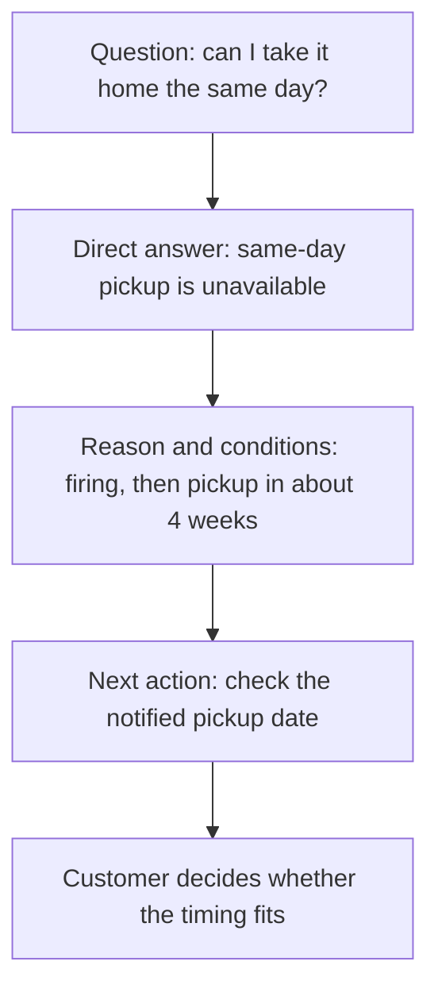

# AEO: creating content that answers customer questions

## Summary

Imagine customers repeatedly asking “Can I take my finished piece home the same day?” after reading your class page. **AEO (Answer Engine Optimization)** concerns organizing information so it can be used to answer questions. Start by helping people find what they want to know and understand the answer's conditions.

HubSpot uses AEO broadly, including generative AI answers. This article focuses on **the completeness of an answer to a question** within that scope. It does not imply universal agreement on the term's boundaries.[^hubspot]

## Learning goals

- Distinguish promotional statements from answers that resolve a question.
- Add necessary conditions and next actions to a short answer.
- Separate good answer writing from selection by search or AI systems.

## Prerequisites

No coding knowledge is required. An **FAQ** collects frequently asked questions and answers. A **direct answer** presents information that addresses a question instead of only providing a link. An **exception** is a situation in which the answer changes.

## 101 · Understand the concept

### Brevity alone does not make a good answer

“You can create a wonderful piece” misses the point of a question about same-day pickup. State whether it is possible, then explain the reason and conditions. This article proposes **question → direct answer → conditions → next action** as an editorial guide. It is not an official exposure formula or a prescribed sentence length.

Figure 1. A fictional studio answer structure. The four parts do not each require a separate heading.

### How do featured snippets differ from generative answers?

A Google **featured snippet** prominently displays part of a page in search results. Publishers cannot designate their own page as a featured snippet; the system selects it.[^snippets] [GEO](geo-generative-discovery.md) also covers answers synthesized from multiple sources. AEO should not be confined to one search screen or FAQ format.[^hubspot]

## 201 · Apply it to an example

### Write an answer that resolves the pickup question

**Assumptions:** Pottery made at fictional Haru Studio requires firing and is collected in person about four weeks later. The exact pickup date is communicated separately. These are not conditions of a real business.

**Before:** “We carefully finish your piece. Contact us for details.”

**Example improvement:**

> **Can I take my finished piece home the same day?**
>
> Same-day pickup is unavailable. Firing is required, so you collect it at the studio about four weeks later. The exact pickup date is communicated separately; check the date you receive.

| Check | Content included | Explanation |
| --- | --- | --- |
| Core question | Same-day pickup is unavailable. | Answer the customer's feasibility question first. |
| Reason | Firing is required. | Explain the wait. |
| Conditions | In-person pickup in about four weeks | Avoid implying a fixed date or delivery service. |
| Next action | Check the separately communicated date | Explain what to wait for and confirm. |

Have the customer service owner verify the facts, then ask a first-time reader to explain when and how collection works in their own words. Improve any missing understanding. Do not invent unconfirmed conditions such as delivery availability.

**Expected result and interpretation:** You can check whether the answer resolves the question without omitting conditions. This example does not measure fewer inquiries or increased AI citations.

## 301 · Make decisions under constraints

### Which answers should you improve first?

Start with repeated inquiries, questions blocking booking decisions, and conditions whose misunderstanding causes inconvenience. Place answers where the question arises rather than turning every sentence into an FAQ. For example, make cancellation conditions easy to find beside booking information.

| Situation | Editorial decision |
| --- | --- |
| One sentence fully answers the question. | Keep it short without adding unnecessary explanation. |
| The answer depends on audience or schedule. | State the applicable conditions and distinguish cases. |
| Several services need comparison. | Provide comparison criteria and evidence alongside answers; continue to GEO. |
| Internal materials disagree. | Confirm facts with the owner before polishing the answer. |

Google says AI search does not require fixed-length content chunks or special structured data.[^google-ai] **Structured data** adds machine-readable labels to information. Do not treat FAQ counts or answer lengths as guarantees of exposure.

Evaluate two things separately. First, check whether readers find the answer and understand its conditions, and which inquiries recur. Then record actual search or AI selection alongside the question, service, and date. Answer quality and external exposure are distinct observations.

## Check your understanding

**Question 1:** Is shortening the answer to “Four weeks” better AEO?

**Explanation:** That sentence leaves it unclear whether four weeks is approximate or fixed, and whether collection is in person. Preserve the conditions needed to answer the question.

**Question 2:** Does adding an FAQ secure a Google featured snippet or AI citation?

**Explanation:** No. Preparing content and being selected by a system are different events. Check exposure separately.

## Evidence and limitations

Based on HubSpot's terminology and Google documentation checked on 2026-09-10. HubSpot's classification is not treated as a standard for every platform. The four-part answer structure and studio example are original learning suggestions. Their effects on inquiries, featured snippets, and AI citations were not tested.

## Related knowledge

[Synthesis of four perspectives](search-and-ai-discovery.md) · [SEO](seo-foundations.md) · [GEO](geo-generative-discovery.md) · [AIO](aio-strategy.md) · [AEO term](../../../glossary/en/aeo.md) · [Documents](index.md) · [한국어](../../ko/digital-marketing/aeo-answer-content.md)

## Sources

[^hubspot]: [HubSpot — Answer engine optimization best practices](https://blog.hubspot.com/marketing/answer-engine-optimization-best-practices)
[^snippets]: [Google — Featured snippets and your website](https://developers.google.com/search/docs/appearance/featured-snippets)
[^google-ai]: [Google — Optimizing your website for generative AI features on Google Search](https://developers.google.com/search/docs/fundamentals/ai-optimization-guide)
