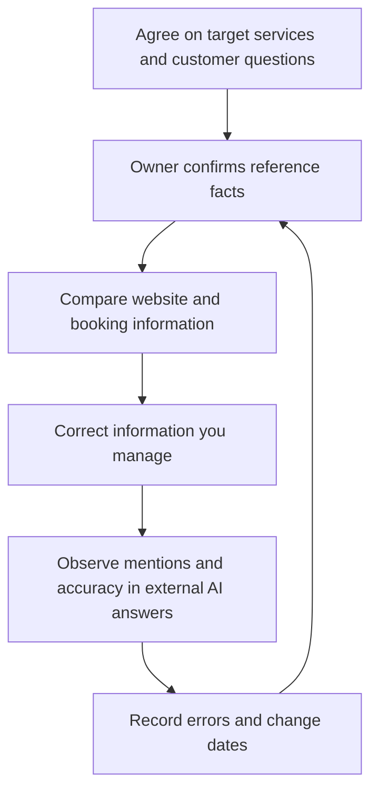

# AIO: defining scope and managing information across AI touchpoints

## Summary

When asked to “do AIO,” first establish the intended result. FGS Global uses **AI Optimization**, while Brainlabs uses AIO for **AI Overviews** and **AI Overview Optimization**. The abbreviation alone cannot define a task's scope.[^aio-usage][^aio-alternate]

This article defines AIO as **a broad perspective on managing discovery and brand information through AI**. This is a working definition for this article. The focus is checking information across touchpoints and assigning ongoing maintenance to owners.

## Learning goals

- Distinguish AI Optimization from uses related to Google AI Overviews.
- Agree on target services, customer questions, authoritative facts, owners, and observation metrics.
- Check source updates separately from changes in external AI answers.

## Prerequisites

No coding knowledge is required. **Brand information** includes a business name, services, prices, and conditions that help customers understand it. A **touchpoint** is somewhere customers encounter information, such as a website, booking instructions, or an AI answer. An **authoritative source** is the reference where an owner confirms facts and manages changes.

## 101 · Understand the concept

### The same abbreviation can mean different work

| Usage | How this article reads it | What to clarify before commissioning work |
| --- | --- | --- |
| AI Optimization | Broad work on discovery and information across AI touchpoints | Target services and intended results |
| AI Overviews | Google's AI summary feature in Search | Whether the request means the feature or work addressing it |
| AI Overview Optimization | A usage describing optimization for that feature | Which Google results will be measured |

This table separates FGS Global and Brainlabs terminology from Google's feature description. It is not a universal industry taxonomy.[^aio-usage][^aio-alternate][^ai-features] Also distinguish writing with AI. Using a production tool does not establish that external AI answers describe the business accurately.

### Start with information you can manage

Figure 1. The operating process proposed in this article. Correcting your materials does not mean external AI updates immediately.

## 201 · Apply it to an example

### Reconcile conflicting prices for Haru Studio

**Assumptions:** Fictional Haru Studio currently charges KRW 50,000 per person, including materials and tools. Its website has this price, but booking information still shows an older price. This is not a real business or an observed result.

| Reference item | What to establish | Example management method |
| --- | --- | --- |
| Business name | Haru Studio | Compare names in public profiles and booking information. |
| Price and inclusions | KRW 50,000 per person, materials and tools included | Keep a reference confirmed by the operator. |
| Effective date | Actual change date and applicable bookings | Separately confirm whether existing bookings are affected. |
| Update owner | Website and booking information owners | Record completion dates for each correction. |
| Observation question | What is the total cost of the beginner class? | Keep the target AI service, language, and observation date with it. |

**Example task definition:** “Align the website and booking information with operator-confirmed class facts, then periodically check answers and sources for the total-cost question in agreed AI services. Deliver a reference fact sheet, change log, and error observation log.”

First confirm the actual price and applicable conditions, then correct information you directly manage. If you find an outdated third-party page, record its URL and whether a correction was requested. Observe external AI answers again later without promising a change by a particular date.

**Expected result and interpretation:** Managed materials become more consistent, with a record of who changed what. External answer changes are a separate result. This example does not establish increased AI exposure or bookings.

## 301 · Make decisions under constraints

### Evaluate results that match the agreed scope

| Request | Deliverables to agree on | Result to check |
| --- | --- | --- |
| Accurate business information across AI services | Reference facts, channel change records, observation questions | Factual agreement in each service's answers |
| Work focused on Google AI Overviews | Target Google pages, participation conditions, measurement scope | Observed exposure within the relevant Google reporting scope |
| AI assistance with content production | Drafting, editing, and fact-review process | Production time and review quality; external citations checked separately |

This table is a proposal for agreeing on work. Specify targets and results instead of combining everything into an “AIO score.” See [GEO measurement guidance](geo-generative-discovery.md) for observing comparisons and citations and understanding product reporting scope.

### Separate Google participation from training permission

For Google, check reading and indexing eligibility alongside **Settings → Search generative AI** inclusion in Search Console. This control concerns the use of content and links in features such as AI Overviews and AI Mode. It is separate from ordinary Search inclusion and ranking, and from AI training permission. Training restrictions require checking the separate Google-Extended guidance.[^ai-control]

Do not treat “Should we appear in AI?” and “Should model training use our content?” as one setting. This article explains the distinction; it is not a record of changing an actual site's settings.

## Check your understanding

**Question 1:** Can you begin Google AI Overviews work based solely on a request for AIO?

**Explanation:** First clarify the abbreviation and target services. The request might concern brand accuracy across several AI services.

**Question 2:** After updating a website price, can you report that all AI answers are current?

**Explanation:** No. Updating a managed source and changing an external response are separate events. Record observations by service, question, and date.

## Evidence and limitations

Based on FGS Global and Brainlabs terminology and Google documentation checked on 2026-09-10. Company terminology does not establish universal standards or guaranteed results. The operating tables, diagram, and task definition are original proposals. This article does not document actual publication-setting changes, business correction requests, or AI response experiments.

## Related knowledge

[Synthesis of four perspectives](search-and-ai-discovery.md) · [SEO](seo-foundations.md) · [AEO](aeo-answer-content.md) · [GEO](geo-generative-discovery.md) · [AIO term](../../../glossary/en/aio.md) · [Documents](index.md) · [한국어](../../ko/digital-marketing/aio-strategy.md)

## Sources

[^aio-usage]: [FGS Global — Digital Insights, August 2025: AIO](https://fgsglobal.com/insights/newsletters/digital-insights/august-2025)
[^aio-alternate]: [Brainlabs — Navigating the New Era of AI Search, p. 4](https://www.brainlabsdigital.com/wp-content/uploads/2025/07/Navigating-AI-Search_Brainlabs_JUL2025.pdf)
[^ai-features]: [Google — AI features and your website](https://developers.google.com/search/docs/appearance/ai-features)
[^ai-control]: [Google — Search generative AI control](https://support.google.com/webmasters/answer/16908024)
