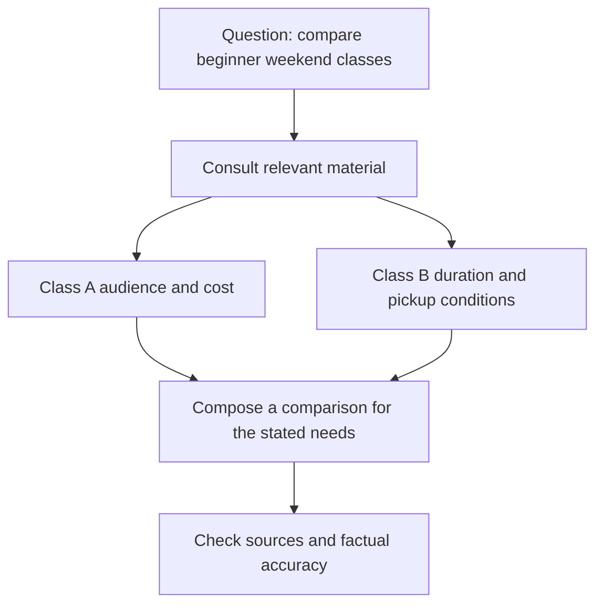

# GEO: creating evidence for AI comparisons and synthesis

## Summary

Imagine a customer asking AI to “Compare weekend pottery classes for beginners.” Your page needs more than an online presence: it needs **evidence** that supports comparison. **GEO (Generative Engine Optimization)** concerns how content becomes visible and is used in generative answers.[^geo-paper]

This article focuses on information useful for synthesis across sources and ways to observe the result. Read [AEO](aeo-answer-content.md) for constructing an answer to one question, and the [synthesis](search-and-ai-discovery.md) for the wider relationship.

## Learning goals

- Distinguish finding a page from synthesizing an answer across sources.
- Organize comparison criteria and verifiable service facts.
- Observe brand mentions, source citations, and factual accuracy separately.

## Prerequisites

Experience finding information in an AI conversation is enough. A **generative answer** composes new sentences using source material. A **mention** names something; a **citation** identifies material as a source. A **URL** is a web address. Having your name appear differs from having your page linked as a source.

## 101 · Understand the concept

### What does a comparison answer need?

The original GEO research addresses content visibility in engines that synthesize multiple sources. Visibility concerns how content appears in an answer; it is not revenue.[^geo-paper] Google also describes generative search as using search systems and relevant material.[^google-ai]

Figure 1. A conceptual illustration of comparison and synthesis. It is not a specific AI system's internal sequence or a guarantee that citations always appear.

### Prepare decision evidence beyond promotional claims

“The best class” does not help beginners and experienced participants make the same decision. Audience, capacity, total cost, technique, and pickup conditions allow readers to compare against their circumstances. The following example is an editorial proposal for preparing that information. Actual AI selection requires separate observation.

## 201 · Apply it to an example

### Make Haru Studio's information comparable

**Assumptions:** Haru Studio is fictional. Its two-hour Saturday class is for adult beginners, with six places, costing KRW 50,000 per person including materials and tools. Finished pieces are collected in person about four weeks later. These conditions and prices do not describe a real business or market rates.

| Comparison criterion | Fact to publish | What customers can decide |
| --- | --- | --- |
| Audience | Adults trying pottery for the first time | Whether experience is required |
| Duration and capacity | Two hours on Saturday, up to six people | Whether the schedule and class size fit |
| Total cost | KRW 50,000 per person, materials and tools included | What the stated cost includes |
| Pickup conditions | In-person collection in about four weeks, date communicated separately | Whether it fits a trip or gift deadline |

1. Confirm each condition with the owner. Do not guess missing items such as the making technique.
2. Keep facts consistent across the title, body, and booking information. For real publication, establish an effective date and an owner for changes.
3. Evaluate “Does this suit a traveler who needs the finished item that day?” These conditions let you explain that it does not meet a same-day finished-piece requirement.

**Expected result and interpretation:** Readers gain evidence for judging suitable and unsuitable circumstances. This does not establish superiority over competitors or secure an AI recommendation. Do not invent reviews or comparison scores.

## 301 · Make decisions under constraints

### Do not judge success by citation counts alone

| Observation | Question |
| --- | --- |
| Mention | Does the studio's name appear? |
| Citation | Is my material's URL shown as a source? |
| Accuracy | Are audience, price, and pickup conditions correct? |
| Customer action | Did relevant visits, inquiries, or bookings follow? |

**Hypothetical calculation:** If ten questions are checked twice and five of the twenty answers mention the studio, the sample mention rate is `5 ÷ 20 = 25%`. This does not mean 25% of customers saw the studio. Count source links and accurate descriptions separately. Record consistent questions, service, language, and date conditions; treat changed questions as a separate sample. This is a custom observation metric, not official market share.

Google Search Console's **Generative AI performance report** covers impressions in AI Overviews and AI Mode. It is not a report of citations across all AI services or revenue.[^ai-report] Bing Webmaster Tools' **AI Performance** provides citation counts and URLs across supported Microsoft AI experiences; counts do not represent answer rank or importance. Do not combine figures without matching their measurement scope.[^bing]

### What should you improve first?

If an answer gives the wrong price, compare prices and dates in original and public materials before adding more text. If it cites the correct page but misstates a condition, check whether that condition is clear in the body. This cannot guarantee an immediate change in the answer.

Google says SEO principles remain relevant to generative search and special AI files are unnecessary.[^google-ai] Review access problems with [SEO](seo-foundations.md) and information operations across touchpoints with [AIO](aio-strategy.md).

## Check your understanding

**Question 1:** Is it success if AI cites the studio but says same-day pickup is available?

**Explanation:** A citation was observed, but accuracy failed. Check whether the roughly four-week collection condition is clear and record the error.

**Question 2:** Can you announce the example's 25% mention rate as market share?

**Explanation:** No. It describes twenty selected answers. It does not represent exposure or purchasing behavior across all customers.

## Evidence and limitations

Based on the original GEO research and Google and Bing documentation checked on 2026-09-10. Effects from specific research experiments are not generalized to every platform or business. Examples, diagrams, and sample calculations are educational, not actual AI response experiments or revenue analysis. Reporting features and scope may change.

## Related knowledge

[Synthesis of four perspectives](search-and-ai-discovery.md) · [SEO](seo-foundations.md) · [AEO](aeo-answer-content.md) · [AIO](aio-strategy.md) · [GEO term](../../../glossary/en/geo.md) · [Documents](index.md) · [한국어](../../ko/digital-marketing/geo-generative-discovery.md)

## Sources

[^geo-paper]: [Aggarwal et al. — GEO: Generative Engine Optimization, KDD 2024](https://arxiv.org/abs/2311.09735)
[^google-ai]: [Google — Optimizing your website for generative AI features on Google Search](https://developers.google.com/search/docs/fundamentals/ai-optimization-guide)
[^bing]: [Bing — Introducing AI Performance in Bing Webmaster Tools](https://blogs.bing.com/webmaster/February-2026/Introducing-AI-Performance-in-Bing-Webmaster-Tools-Public-Preview)
[^ai-report]: [Google — Generative AI performance report](https://support.google.com/webmasters/answer/16984139)
