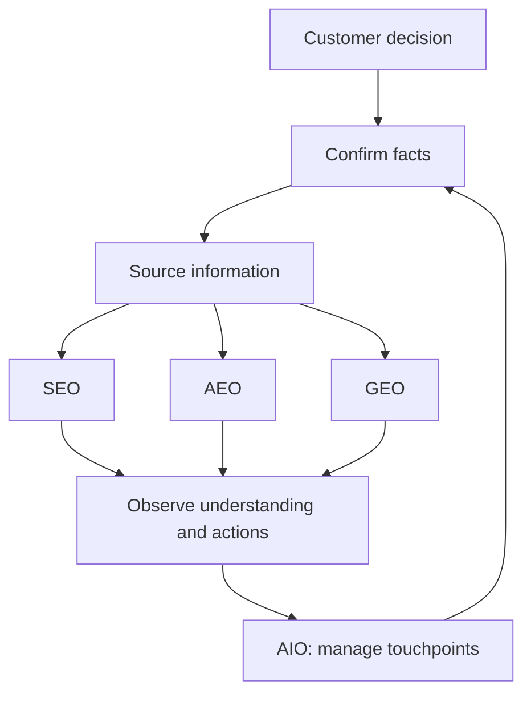

# SEO, GEO, AEO, and AIO: differences and practical judgment

## Summary

**Start by finding what customers lack when discovering and evaluating information, rather than launching four separate programs.** Read SEO through page discovery and understanding, AEO through answers to questions, and GEO through evidence for comparison and synthesis. First agree on what AIO means, then use it to define information operations across AI touchpoints.

This article combines the topics to explain **differences, relationships, priorities, and interpretation of results**. The independent articles below provide definitions and detailed examples. The scope is discovery through search and AI within digital marketing; these abbreviations do not cover all advertising, email, social media, or post-purchase experiences.

| Independent article | Question it addresses |
| --- | --- |
| [SEO: making pages discoverable in search](seo-foundations.md) | Can customers and search engines find and understand the page? |
| [AEO: creating content that answers customer questions](aeo-answer-content.md) | Can readers find the answer and conditions their question needs? |
| [GEO: creating evidence for AI comparisons and synthesis](geo-generative-discovery.md) | Is there evidence for deciding whether the service fits among alternatives? |
| [AIO: defining scope and managing information across AI touchpoints](aio-strategy.md) | Which AI touchpoints are targeted, and who maintains and checks information? |

## Learning goals

- Distinguish the terms while explaining their overlap.
- Review the same content through four perspectives and reduce duplicate work.
- Choose improvement order and owners based on customer problems.
- Separate completed work, external exposure, and customer actions when evaluating results.

## Prerequisites

Experience with search or AI conversations is enough. **Content** is information conveyed through text, photos, or video. A **conversion** is a predefined customer action such as booking, inquiry, or purchase. For quick definitions, use [SEO](../../../glossary/en/seo.md), [GEO](../../../glossary/en/geo.md), [AEO](../../../glossary/en/aeo.md), and [AIO](../../../glossary/en/aio.md).

## 101 · Understand the concepts

### What differs, and what overlaps?

Figure 1. An original comparison illustration, not a real search interface or observed exposure result. The four perspectives can be applied together.

| Perspective | Name and central question | Information to examine | Result to check | What it cannot establish alone |
| --- | --- | --- | --- | --- |
| SEO | Search Engine Optimization · Can the page be found and understood? | Accessibility to engines, titles, content, links | Discovery and visits from relevant searches | Whether visitors will book |
| AEO | Answer Engine Optimization · Does the content resolve the question? | Direct answer, reason, applicable conditions | Answer completeness and actual use in answers | External exposure merely because an FAQ was added |
| GEO | Generative Engine Optimization · Is there evidence for comparison and synthesis? | Audience, costs, conditions, verifiable material | Mentions, citations, and accuracy in generative answers | Revenue impact from citation counts alone |
| AIO | AI Optimization in this article · How is information managed across AI touchpoints? | Target services, reference facts, owners, change records | Factual agreement across touchpoints and agreed goals | Exact scope from the abbreviation alone |

SEO draws on Google guidance, GEO on the original research, and AEO on HubSpot's usage. AIO uses FGS Global's AI Optimization terminology as the basis for this article's scope. The table's questions and practical results are an explanatory reconstruction.[^seo][^geo-paper][^hubspot][^aio-usage]

### These are not technology generations or exclusive channels

Google describes generative AI search work as an extension of SEO. HubSpot groups activities such as GEO within a broad AEO category. The table therefore offers work perspectives, not a replacement sequence of SEO followed by AEO and then GEO.[^google-ai][^hubspot]

AEO overlaps with GEO when an answer contributes to a comparison. The same page can support ordinary search and AI answers. Dividing AEO into “Google only” and GEO into “chatbots only” is also unhelpful. Brainlabs additionally uses AIO for AI Overviews and AI Overview Optimization, so AIO cannot always be declared an official umbrella above the other three.[^aio-alternate]

**Reading perspective:** Use SEO to check discovery fundamentals and AEO and GEO to review answers and evidence. Use AIO, as defined here, to organize targets and information operations. This relationship is a practical interpretation.

## 201 · Apply them to an example

### Review one description through four perspectives

**Assumptions:** Fictional Haru Studio offers a two-hour Saturday pottery class for adult beginners. There are six places; KRW 50,000 per person includes materials and tools. Pieces are collected in person about four weeks later. All prices, conditions, and improvement scenarios below are educational examples.

**Starting point:** Assume the description says only “The best pottery experience for special memories,” and booking information shows a different price from the website.

| Improvement | Connected perspectives | Why it helps across them |
| --- | --- | --- |
| The operator confirms price, audience, and pickup conditions. | AIO information operations → all perspectives | Avoid increasing the visibility of incorrect facts. |
| Rename the page “Beginner pottery workshop — Haru Studio.” | SEO + AEO | Clarify the service and the audience question. |
| Answer “Can I take it home the same day?” with in-person pickup in about four weeks. | AEO + GEO | Resolve a direct question and provide comparison conditions for travelers or gift buyers. |
| Make audience, duration, capacity, and cost available in one description. | SEO + GEO | Let visitors understand the service and compare classes. |
| Align website and booking information, then observe AI answers. | AIO + GEO | Check managed-source corrections separately from external answer accuracy. |

**Expected result and interpretation:** One description becomes more specific and consistent. Completing that work is separate from increased search exposure, AI citations, or bookings. You do not need four copies of similar service information, one per abbreviation. Split documents when readers have different questions and reading purposes, as with these learning articles.

Figure 2. A proposed way to apply the perspectives together. Search, answers, and synthesis need not happen sequentially, and conversion is not guaranteed.

### How can non-developers and developers collaborate?

Operators and marketers can gather customer questions, confirm prices, audiences, and conditions, and improve explanations. Customer service staff can identify repeated inquiries and misunderstandings. Website operators or developers can check access and indexing settings and whether mobile content and booking paths work. For a small team, assigning **who confirms facts, who publishes them, and who observes results** makes work clearer than assigning an owner to each abbreviation.

## 301 · Make decisions under constraints

### Locate the problem before allocating budget

| Current problem | First action and reason | Continue with |
| --- | --- | --- |
| The page cannot be read or found in search. | Check access, indexing, and titles. Unreadable information blocks the start of discovery. | [SEO](seo-foundations.md) |
| Visitors repeat the same questions. | Check whether answers and conditions appear where needed. Existing information may still be hard to find or understand. | [AEO](aeo-answer-content.md) |
| Distinguishing facts for comparison are unclear. | State audience, costs, and limitations as verifiable facts. Customers need criteria for fit. | [GEO](geo-generative-discovery.md) |
| Channels show different prices or AI states outdated conditions. | Compare reference facts, owners, and dates. Separate source inconsistency from external answer errors. | [AIO](aio-strategy.md) |
| Visits and explanations are sufficient but bookings are low. | Check service fit, price explanations, and booking steps. Exposure alone cannot explain the problem. | Operations and marketing review |

This table proposes problem-based priorities. A small team can choose one description important to a customer decision, complete a cycle of **fact confirmation → explanation improvements → reading and booking checks → observation**, then expand the scope. There is no basis here for dividing budget equally among four abbreviations.

Google recommends useful content and SEO principles over tactics such as special AI files or fixed sentence lengths.[^google-ai] Evaluate proposals by the specific materials they will improve and what they will observe in which service, rather than a promise of guaranteed citations.

### Think about results in three stages

| Stage | Example checks | Interpretation |
| --- | --- | --- |
| What we changed | Corrected conflicting prices, completed answers, resolved access problems | Execution results; they do not prove external selection. |
| What we observed externally | Search impressions and clicks, AI mentions, citations, and accuracy | Observations by service, question, and date; not all customers' experience. |
| What happened for customers | Relevant inquiries, completed bookings, changes in recurring questions | Business and experience outcomes; consider advertising, seasonality, and price changes too. |

**Decision principle:** Optimization should extend beyond raising a score for each abbreviation. Check whether relevant customers encounter accurate information, assess fit, and take their next action. If exposure grows but conditions are wrong, improve accuracy first. If exposure stays flat but repetitive inquiries decline, evaluate that effect separately. Claims about actual effects need observations collected on a consistent basis.

Product reports and sample calculations are covered in [GEO](geo-generative-discovery.md); Google participation controls and their distinction from training permission are covered in [AIO](aio-strategy.md).

## Check your understanding

**Question 1:** Do the four perspectives require four service description pages?

**Explanation:** No. The same facts and description can be reviewed through several perspectives. Separate documents can serve distinct reader purposes, but duplicate descriptions with different abbreviations are unnecessary.

**Question 2:** If AI describes an old price, should you first write more GEO-oriented sentences?

**Explanation:** Compare the reference price and public information first. Separate correcting source inconsistencies from checking whether external answers change.

**Question 3:** If citations rise but bookings stay flat, can you immediately declare success or failure?

**Explanation:** Report citations as an observed result and bookings as a business outcome separately. Assess accuracy, visitor intent, booking steps, and other changes before judging causes.

## Evidence and limitations

The comparison uses Google documentation, original GEO research, and HubSpot, FGS Global, and Brainlabs terminology checked on 2026-09-10. Company usage is not treated as an official standard across platforms. Classification tables, operating order, and responsibilities are practical interpretations informed by sources, not internal algorithm rules.

The studio, prices, improvement scenarios, and illustrations are fictional learning material. This article does not validate actual website or AI response performance. Check the individual topic sources for detailed conditions and changes in official features.

## Related knowledge

[SEO details](seo-foundations.md) · [AEO details](aeo-answer-content.md) · [GEO details](geo-generative-discovery.md) · [AIO details](aio-strategy.md) · [Digital Marketing](index.md) · [한국어](../../ko/digital-marketing/search-and-ai-discovery.md)

## Sources

[^seo]: [Google — SEO Starter Guide](https://developers.google.com/search/docs/fundamentals/seo-starter-guide)
[^google-ai]: [Google — Optimizing your website for generative AI features on Google Search](https://developers.google.com/search/docs/fundamentals/ai-optimization-guide)
[^geo-paper]: [Aggarwal et al. — GEO: Generative Engine Optimization, KDD 2024](https://arxiv.org/abs/2311.09735)
[^hubspot]: [HubSpot — Answer engine optimization best practices](https://blog.hubspot.com/marketing/answer-engine-optimization-best-practices)
[^aio-usage]: [FGS Global — Digital Insights, August 2025: AIO](https://fgsglobal.com/insights/newsletters/digital-insights/august-2025)
[^aio-alternate]: [Brainlabs — Navigating the New Era of AI Search, p. 4](https://www.brainlabsdigital.com/wp-content/uploads/2025/07/Navigating-AI-Search_Brainlabs_JUL2025.pdf)
