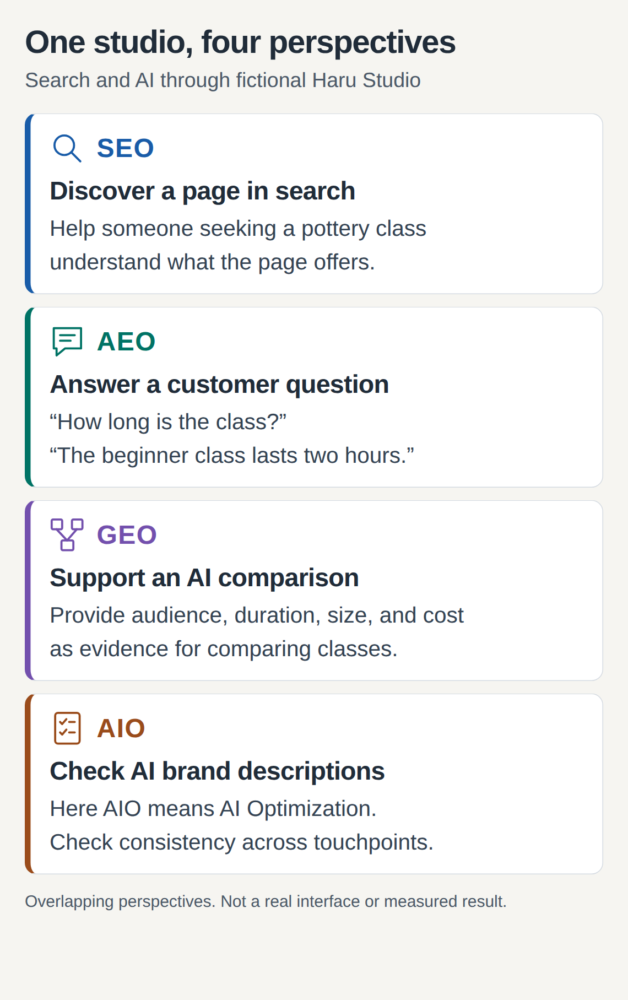
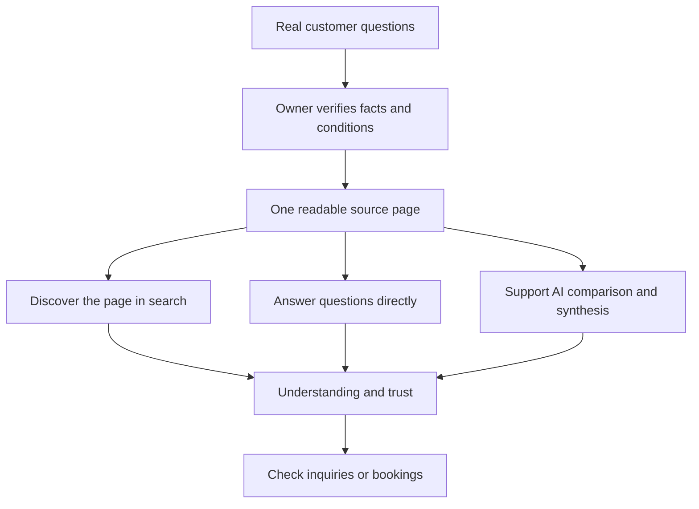

# Digital marketing: understanding SEO, GEO, AEO, and AIO

## Summary

Imagine running a small craft studio. One customer finds its website in search results; another asks an AI assistant to compare weekend pottery classes for beginners. Both need accurate information to decide whether to book. SEO, GEO, AEO, and AIO offer **perspectives on improving discovery and communication**.

Digital marketing involves reaching customers and maintaining relationships online. This document focuses on discovery through search and AI. The four acronyms do not cover every aspect of advertising, email, social media, or the experience after purchase.

The terms overlap rather than forming successive technology generations. Google treats generative search optimization as part of SEO, while HubSpot groups activities such as GEO under AEO. The distinctions below explain work rather than a shared certification standard.[^google-ai][^hubspot]

## Learning goals

- Explain each acronym and what customers encounter.
- Distinguish AIO as AI Optimization from AI Overviews usage.
- Identify missing service information without development knowledge.
- Measure search visibility, AI citations, and actual inquiries or bookings separately.

## Prerequisites

Experience using search or an AI conversation is sufficient. **Content** means information such as text, photographs, and video. A **search query** is what someone types into search. A **citation** identifies material used as a source. A **conversion** is a predefined customer action such as booking, inquiring, or buying. A click is not the same as a conversion.

For quick definitions, read [SEO](../../../glossary/en/seo.md), [GEO](../../../glossary/en/geo.md), [AEO](../../../glossary/en/aeo.md), and [AIO](../../../glossary/en/aio.md).

## 101 · Understand the concepts

### Start with a picture

Figure 1. An original explanatory illustration, not a real search interface or measured result. The perspectives can be applied together.

| Term | Full name | Plain-language meaning | Result of interest |
| --- | --- | --- | --- |
| **SEO** | Search Engine Optimization | Help engines and people understand and find pages. | Discovery and visits from relevant searches |
| **GEO** | Generative Engine Optimization | Improve how information can serve as evidence when AI synthesizes sources. | Mentions, citations, and accurate descriptions in generated answers |
| **AEO** | Answer Engine Optimization | Organize information so it can answer users' questions. | Content and sources used in direct answers |
| **AIO** | AI Optimization | Here, a broad perspective on discovery and brand communication through AI. | Consistent, accurate information across AI touchpoints |

The definitions draw on Google for SEO, the original GEO paper, HubSpot's AEO usage, and FGS Global's use of AI Optimization. The practical focus is an explanatory reconstruction.[^seo][^geo-paper][^hubspot][^aio-usage]

### SEO: create an explanation people can find

SEO helps search users understand a site and why they might visit it. Think of **crawling** as reading pages and **indexing** as organizing information for retrieval. Publishing does not guarantee immediate discovery or first place.[^seo]

**Hypothetical example:** “Beginner pottery workshop — Haru Studio” explains a service more clearly than “A special experience.” Include the audience, duration, price, location, and booking instructions. This illustrates a reader-oriented improvement, not a measured ranking gain.

### AEO: answer the customer's question

AEO asks whether the material can answer a customer's question accurately. **Hypothetical example:** Follow “How long is the class?” with “The beginner class lasts two hours and includes materials and tools,” then explain exceptions.

AEO is not limited to short answers. HubSpot uses it broadly to include generative AI responses. A traditional **featured snippet** prominently presents an extract, which differs from a newly synthesized answer drawing on multiple sources. Google's systems decide which pages become featured snippets.[^hubspot][^snippets]

### GEO: provide evidence for comparison and synthesis

GEO addresses content visibility in generated responses. The original research evaluates visibility in engines synthesizing multiple sources. Results from a specific experiment cannot be interpreted as revenue growth for every business.[^geo-paper]

**Hypothetical example:** A customer asks for a comparison of weekend pottery classes suitable for beginners. “The best studio” provides little basis for comparison. Beginner eligibility, class size, total cost, technique, and collection timing help distinguish alternatives. Whether an AI system actually selects that page is a separate question.

### AIO: agree on the acronym first

FGS Global uses **AI Optimization**. Brainlabs' 2025 material uses AIO for **AI Overviews** and **AI Overview Optimization**. The same abbreviation can therefore refer to different scopes.[^aio-usage][^aio-alternate]

Here, AIO means broadly checking how AI helps people discover and understand a brand. For example, reconcile conflicting studio names or class conditions across the website and booking information, then check how AI describes them. This is not a claim that the whole industry agrees on one taxonomy.

**Google AI Overviews** names an AI summary feature in Google Search. When someone requests AIO work, specify whether it concerns brand information across AI services or Google AI Overviews. Using AI to write content is also different from having that content used as evidence in an AI answer.[^ai-features]

### Why the perspectives overlap

One class page can appear in search results, answer a question, and support a comparison. Read **SEO as the foundation, AEO and GEO as overlapping answer perspectives, and AIO as the broader review scope defined here**. Do not assign AEO exclusively to Google or GEO exclusively to one chatbot.[^google-ai][^hubspot]

## 201 · Apply the concepts

### Improve Haru Studio's information

**Assumptions:** Haru Studio is fictional. Its beginner class runs for two hours on Saturdays, holds six people, costs KRW 50,000 per person including materials, and offers collection roughly four weeks later. All conditions and prices are for learning, not a real business or market quotation.

**Before:** “The best pottery experience for special memories! Inquire now.”

**An improved example:**

> **Beginner pottery workshop — Haru Studio**
>
> A two-hour Saturday class for adults trying pottery for the first time. Up to six people can participate. The KRW 50,000 fee includes materials and tool use.
>
> **Can I take the piece home that day?** Firing is required, so collection is approximately four weeks later. We will confirm the actual date separately.
>
> Check the schedule and cancellation terms before booking. Select an available date on the booking page.

| Perspective | Change | Benefit to the reader |
| --- | --- | --- |
| SEO | Put the service and studio name in the title | Decide whether the page covers the service needed |
| AEO | Answer the collection question with conditions | Understand the basics without another inquiry |
| GEO | Provide audience, duration, capacity, total cost, and collection details | Compare classes using consistent criteria |
| AIO | Cross-check facts across the website, booking information, and public profiles | Reduce contradictory descriptions across touchpoints |

**Expected result and interpretation:** The demonstrated improvement is specific, reviewable information, not a measured increase in ranking or citations. Before publication, finalize the address, cancellation terms, and booking link, and replace the example with real facts.

### Five steps for non-developers

This is a proposed workflow for a small business or team, not an official ranking formula.

1. **Collect customer questions.** Find recurring questions about eligibility, total cost, duration, and cases where the service is unsuitable.
2. **Verify facts.** Confirm prices, schedules, inclusions, and limits with the responsible person, and assign ownership for updates.
3. **Make answers easy to find on one page.** Combine clear headings, short answers, necessary explanation, and photographs. Match information in images to the text.
4. **Ask the website operator to check readability.** Verify crawling and indexing eligibility, mobile access to important content, and the booking path.
5. **Record discovery and action separately.** Distinguish search visibility, what AI cites, and actual inquiries or bookings.

Figure 2. An original workflow showing how several paths can use one source. It does not guarantee visibility or conversion.

## 301 · Make decisions under constraints

### What should you improve first?

| Current problem | First action | People involved |
| --- | --- | --- |
| The page does not clearly explain the service | Improve the title and core explanation | Operator and marketer |
| The same inquiries recur | Add answers and exceptions | Customer support |
| AI gives an old price or another business's information | Compare dates, names, and conditions in original and public information | Operator and content owner |
| Engines cannot read the page | Check access, indexing, and publication settings | Website operator or developer |
| Visits do not lead to bookings | Review suitability, price explanation, and booking steps | Marketing, sales, and operations |

These are proposed priorities. Define the customer problem before dividing a budget among four acronyms.

### There is no guaranteed shortcut to visibility

Google applies existing SEO principles to generative search. It does not require special AI files, a fixed answer length, or dedicated structured data. **Structured data** adds machine-readable labels to information such as prices, products, and businesses. Match it to visible content rather than treating it as a visibility certificate.[^google-ai][^ai-features]

Avoid publishing the same question in many superficial variations or fabricating reviews and evidence. Google cautions against scaled content primarily intended to manipulate search or AI answers, and against seeking inauthentic mentions.[^google-ai]

For Google AI features, check Search Console's **Search generative AI** inclusion setting as well as crawling and indexing requirements. This control is separate from AI training permission. This document explains the setting; it does not change any site's publication or blocking controls.[^ai-control]

### What should you measure?

A **mention** names a brand; a **citation** identifies a source; a **visit** brings someone to the website. None alone proves revenue or trust.

| What to check | Example record | Interpretation limit |
| --- | --- | --- |
| Search discovery | Relevant queries, page impressions, clicks | High ranking does not guarantee bookings |
| AI responses | Question, service, date, brand mention, source URL | One answer does not represent every user's experience |
| Accuracy | Matching price, audience, inclusions, and restrictions | Frequent but incorrect mentions still require improvement |
| Business results | Relevant inquiries, completed bookings, acquisition source | Consider advertising, seasonality, and price changes |

Google Search Console's **Generative AI performance report** provides impressions for AI Overviews and AI Mode. The checked documentation focuses on impressions; this is not a tool measuring citations and revenue across all AI services. If it is absent, check documented conditions such as insufficient data.[^ai-report]

Bing Webmaster Tools' **AI Performance** reports source citations and URLs across supported Microsoft AI experiences. Citation counts do not indicate rank or importance within an answer. The products cover different populations, so do not simply add their figures.[^bing]

**Hypothetical calculation:** Check ten fixed questions twice each. If five of the twenty answers mention the studio, the observed mention rate is `5 ÷ 20 = 25%`. This is a custom observation metric, not official market share. Count linked answers and accurate descriptions separately. Keep tools, language, questions, and dates comparable; record changed questions as a separate sample.

## Check your understanding

**Question 1:** Does adding an FAQ guarantee AI citations?

**Answer:** No. Questions and answers help readers, but engines decide selection and presentation. Check publication and actual citation separately.

**Question 2:** Should you stop SEO when starting GEO?

**Answer:** No. The same source can support multiple discovery paths, and Google says SEO principles remain relevant to generative search.

**Question 3:** What should you clarify first in an AIO request?

**Answer:** Specify whether AIO means AI Optimization, Google AI Overviews, or optimization for that feature, then define the services and desired results.

**Question 4:** Does a 25% AI mention rate mean one in four customers saw the studio?

**Answer:** No. The example reports observations from twenty predefined answers. Customer exposure, visits, and bookings are different measures.

## Evidence and limits

This document draws on Google and Bing documentation, companies' own terminology, and the original GEO research, checked on 2026-09-10. FGS Global, Brainlabs, and HubSpot establish their own usage; their marketing claims are not treated as universal platform mechanics. Service-specific selection algorithms, visibility improvements, and actual studio search or booking outcomes were not verified.

The illustrations, studio example, and calculation are original learning material. Boundaries between AEO and GEO, and the meaning of AIO, depend on context. For Google participation controls and impression reporting, the newer optimization guide and dedicated help pages take precedence over the older AI-features overview. Recheck features and measurement scope in 30 days or when official documentation changes.

## Related knowledge

[SEO](../../../glossary/en/seo.md) · [GEO](../../../glossary/en/geo.md) · [AEO](../../../glossary/en/aeo.md) · [AIO](../../../glossary/en/aio.md) · [Digital Marketing](index.md) · [한국어](../../ko/digital-marketing/search-and-ai-discovery.md)

## Sources

[^seo]: [Google — SEO Starter Guide](https://developers.google.com/search/docs/fundamentals/seo-starter-guide)
[^google-ai]: [Google — Optimizing your website for generative AI features on Google Search](https://developers.google.com/search/docs/fundamentals/ai-optimization-guide)
[^ai-features]: [Google — AI features and your website](https://developers.google.com/search/docs/appearance/ai-features)
[^snippets]: [Google — Featured snippets and your website](https://developers.google.com/search/docs/appearance/featured-snippets)
[^geo-paper]: [Aggarwal et al. — GEO: Generative Engine Optimization, KDD 2024](https://arxiv.org/abs/2311.09735)
[^hubspot]: [HubSpot — Answer engine optimization best practices](https://blog.hubspot.com/marketing/answer-engine-optimization-best-practices)
[^aio-usage]: [FGS Global — Digital Insights, August 2025: AIO](https://fgsglobal.com/insights/newsletters/digital-insights/august-2025)
[^aio-alternate]: [Brainlabs — Navigating the New Era of AI Search, p. 4](https://www.brainlabsdigital.com/wp-content/uploads/2025/07/Navigating-AI-Search_Brainlabs_JUL2025.pdf)
[^ai-control]: [Google — Search generative AI control](https://support.google.com/webmasters/answer/16908024)
[^ai-report]: [Google — Generative AI performance report](https://support.google.com/webmasters/answer/16984139)
[^bing]: [Bing — Introducing AI Performance in Bing Webmaster Tools](https://blogs.bing.com/webmaster/February-2026/Introducing-AI-Performance-in-Bing-Webmaster-Tools-Public-Preview)
