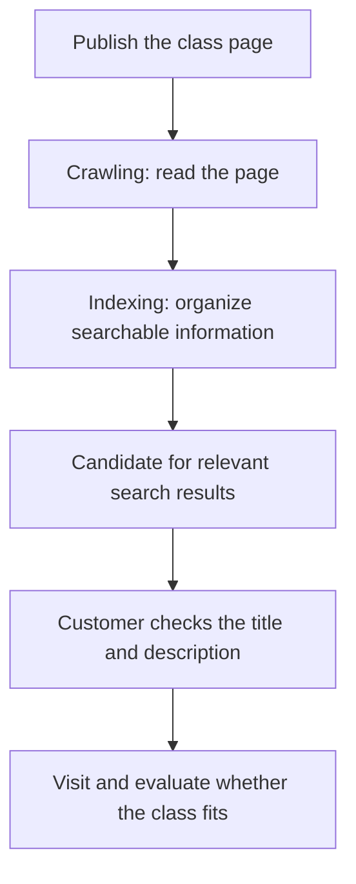

# SEO: making pages discoverable in search

## Summary

Imagine publishing a studio website that customers struggle to find or understand. **SEO (Search Engine Optimization)** helps search engines understand content and people discover relevant pages. Think of it as improving both a shop sign and the information inside.[^seo]

This article covers SEO fundamentals and application. Continue with the [synthesis](search-and-ai-discovery.md) for the relationships and priorities across all four terms.

## Learning goals

- Explain the differences between crawling, indexing, search results, and visits.
- Turn a vague service description into information a searcher can evaluate.
- Separate content you can improve from matters to check with a website operator.

## Prerequisites

Experience using a search box is enough. A **query** is what someone types into search, and a **page title** names a document's subject. **Search intent** is the task the person wants to accomplish. People searching for “pottery classes” may want a one-time workshop or instructor certification.

## 101 · Understand the concept

### What needs to happen before search discovery?

**Crawling** means an engine visits and reads a page. **Indexing** means organizing information so it can be searched. The system then selects results for a relevant question, and people decide whether to visit. Publication does not guarantee indexing or first place.[^seo]

Figure 1. A simplified explanation of search discovery. Arrows do not guarantee progression to the next stage.

### Some SEO work does not require coding

Content owners can review clear titles, readable descriptions, and links to relevant pages. Providing useful information is more fundamental than repeating search terms. SEO is distinct from buying search advertisements.[^seo]

For example, if photos alone do not explain pricing and booking conditions, make those conditions readable in the body too. This is an editorial suggestion to help customers decide, not an experiment proving a ranking effect.

## 201 · Apply it to an example

### Improve Haru Studio's class page

**Assumptions:** Haru Studio is a fictional pottery studio offering a two-hour Saturday class for adult beginners, with six places. All conditions are educational examples.

| Area | Before | Example improvement | Reason |
| --- | --- | --- | --- |
| Title | A special experience | Beginner pottery workshop — Haru Studio | Identify the service immediately. |
| Opening description | Make the best memories | A two-hour Saturday class for adults trying pottery for the first time. Six places are available. | Evaluate audience and duration. |
| Navigation link | Learn more | Check class dates and booking conditions | Understand what the destination provides. |

1. Find the language customers use in real inquiries. Here, “Can beginners join?” informs the audience description.
2. Confirm audience, duration, and capacity with the owner, then update the title and body together.
3. Read it on a phone and follow the booking link. For real publication, also confirm and state the price, address, and cancellation conditions.

**Expected result and interpretation:** Readers can more easily assess what the page offers and whom it suits. Indexing and increased visits require separate observation. An edited title alone does not establish a ranking improvement.

## 301 · Make decisions under constraints

### Check content and access issues separately

| Observation | First check | Example owner |
| --- | --- | --- |
| Visitors repeatedly ask whom the class is for. | Read whether the title and opening match the actual audience. | Operator or content owner |
| The new page cannot be found in internal navigation. | Check for a link from relevant information. | Content owner or website operator |
| Search engines cannot read or index the page. | Inspect access restrictions and publication settings. | Website operator or developer |
| Visits occur but bookings are low. | Review service fit, conditions, and the booking process. | Operations or marketing |

Track **search impressions**, **clicks**, and **actual inquiries or bookings** separately. Compare the same period and pages, while noting advertising, seasonality, and price changes. This operating suggestion does not automatically isolate the effect of SEO.

### Does SEO still matter in AI search?

Google explains that SEO fundamentals apply to generative AI search too. There is no need to treat SEO as something to finish and replace with an entirely different system.[^google-ai] Also consider [AEO](aeo-answer-content.md) when answers are hard to find, and [GEO](geo-generative-discovery.md) when evidence for comparing services is missing.

## Check your understanding

**Question 1:** Does publishing a page and improving its title put it on the first search screen immediately?

**Explanation:** There is no guarantee. Publication, crawling, indexing, and result selection are separate stages. First identify where progress is blocked.

**Question 2:** If relevant search visits increase but bookings do not, should you keep changing the title?

**Explanation:** The title is not necessarily the cause. Check whether visitor intent fits the class, conditions are understandable, and booking can be completed.

## Evidence and limitations

Based on Google documentation checked on 2026-09-10. The diagram, studio example, and division of responsibilities are original explanations. No actual site's access settings, rankings, or booking performance were tested. Google's guidance does not establish identical rules for every search service.

## Related knowledge

[Synthesis of four perspectives](search-and-ai-discovery.md) · [AEO](aeo-answer-content.md) · [GEO](geo-generative-discovery.md) · [AIO](aio-strategy.md) · [SEO term](../../../glossary/en/seo.md) · [Documents](index.md) · [한국어](../../ko/digital-marketing/seo-foundations.md)

## Sources

[^seo]: [Google — SEO Starter Guide](https://developers.google.com/search/docs/fundamentals/seo-starter-guide)
[^google-ai]: [Google — Optimizing your website for generative AI features on Google Search](https://developers.google.com/search/docs/fundamentals/ai-optimization-guide)
