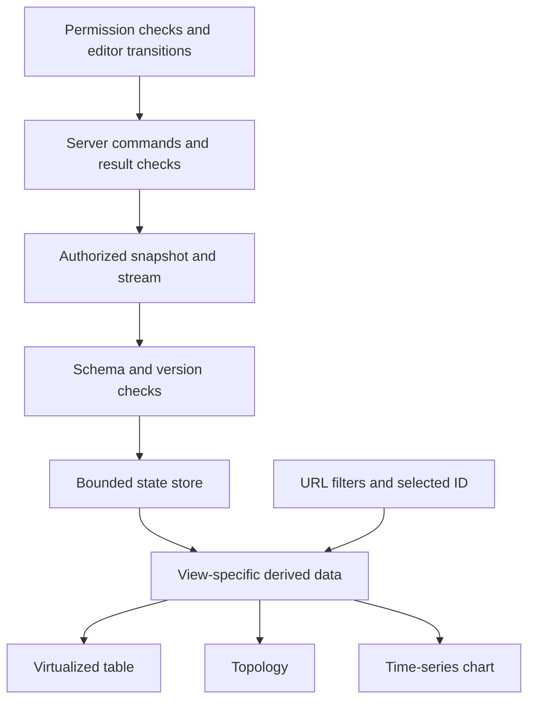

# Frontend

Learn real-time data, large views, permissions, and complex interactions through an operations dashboard. Device lists, CPU trends, service dependencies, and restart actions share one design context. The examples are independent by topic, not an integrated finished application. After screen implementation, study Micro Frontend team and deployment boundaries, real cases, and a lab building two React apps independently.

## Prerequisites and environment

Assume JavaScript arrays, objects, and promises; TypeScript types and unions; React components, props, useState and useEffect; and HTTP requests and responses. This is not a complete React syntax course. Start with components and state in [React Learn](https://react.dev/learn) if needed.

In an existing React + TypeScript browser project, place the TSX examples from the first eight topics separately in `src/App.tsx`. Hooks used here exist in React 18 and later. CSS resets or global styles may affect row height. SSR frameworks require a browser component boundary and the separate SSR conditions described in the chapters. Run installation commands in a separate practice project, not this documentation repository.

| Topic | Extra package | Requirements |
| --- | --- | --- |
| State, real-time, search, charts, permissions | None beyond React/React DOM/TypeScript | Local fixture or mock |
| Virtualized table | `npm install @tanstack/react-virtual@3` | Check fixed-height assumptions |
| Topology | `npm install @xyflow/react@12` | Library CSS and parent height |
| WebSocket/SSE | None | Server implementing the documented frame and sequence contract |

The Micro Frontend lab is a separate project with multiple files and two servers. Follow its own file structure, versions, and commands.

## Reading order

1. [Complex state models: ownership and transitions](complex-state-models.md)
2. [Real-time state updates: ingestion and publication](realtime-state-updates.md)
3. [WebSocket and SSE: connection, retry, and recovery](websocket-sse.md)
4. [Large-data rendering: transfer, computation, and DOM costs](large-data-rendering.md)
5. [Virtualized table: separate row count from DOM count](virtualized-table.md)
6. [Topology visualization: separate relationships from layout](topology-visualization.md)
7. [Time-series chart: time, missing data, and aggregation](time-series-chart.md)
8. [Permission-based UI: authorization and action state](permission-based-ui.md)

9. [Micro Frontends: independent deployment boundaries and real-world use](micro-frontends.md)
10. [React Micro Frontend lab: separate builds and failure boundaries](micro-frontends-react.md)

## Integrating a screen

Share selection by ID and keep time ranges and filters in URLs for direct access and sharing. Avoid separate server-data copies per view; let tables and graphs read the same version. A tenant switch changes permission caches, data, and connections together. Distinguish connectivity from freshness with last-reception time and resynchronization status.

## Integration verification scenarios

| Situation | Expected behavior and evidence |
| --- | --- |
| Duplicate events and out-of-order responses | Preserve current version; no repeated operation |
| Disconnect and expired cursor | Stale indicator, retry, snapshot resynchronization when needed |
| User or tenant switch | Clear old connections and caches; no mixed data |
| Scrolling and sorting during search | Measure input latency, retain selected ID and position policy |
| Live changes during editing and save timeouts | Preserve drafts, handle conflicts or query operation status |
| Missing, reversed, duplicate chart samples | Time order, visible gaps, consistent duplicate policy |
| Action immediately after revocation | Server denial, capability refresh, sensitive data boundaries |
| Keyboard, zoom, and mobile | Accessible table alternatives, focus, scrolling, and pan checks |

## Example verification scope

The record below covers the first eight screen examples. The two-artifact builds and browser checks for Micro Frontends are recorded separately in [that lab](micro-frontends-react.md).

On 2026-09-14, all eight TSX examples were extracted into an isolated temporary project and passed TypeScript 5.9.3 strict checking. The environment was React/React DOM 19.2.4, @types/react 19.2.14, @types/react-dom 19.2.3, TanStack React Virtual 3.14.12, and React Flow 12.11.6. Eight temporary Bun tests (31 assertions) passed for save ordering, retained drafts after failure, invalid transitions, publication coalescing and cleanup, message validation, chart normalization and gap splitting, and permission-dependent server rendering. These tests target document examples, not the repository website application.

API evidence and Korean/English meaning were reviewed. Fixture sizes and update rates are not performance guarantees. Real servers, reconnection, replay, production load, browser interactions, and assistive technology compatibility were not exercised. Execution on React 18 also requires separate checking.

[Frontend terminology](../../../glossary/en/index.md) · [All domains](../index.md) · [한국어](../../ko/frontend/index.md)
