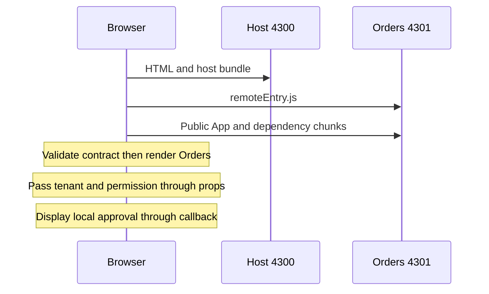

# React Micro Frontend lab: separate builds and failure boundaries

## Situation, goals, and prerequisites

Assume separate teams own an operations console and orders, producing different artifacts while users approve orders on one screen. This lab builds two React apps separately and connects them with Module Federation, demonstrating remote changes without rebuilding the host. It also checks loading and rendering failures, permission presentation, and tenant switching.

Prerequisites are [Micro Frontend concepts and cases](micro-frontends.md), React props, state and Suspense, TypeScript, npm, and terminal usage. Also read [complex state models](complex-state-models.md) and [permission UI](permission-based-ui.md). This learning mock has no real orders or authentication server; its approval display is not a business approval.

## 101 · How are the apps connected?

This example uses **webpack 5’s built-in ModuleFederationPlugin**. The remote declares public modules with exposes. After starting rendering, the host uses container APIs to load the remote entry and required chunks. The resulting component joins the same React tree.[^webpack][^plugin]



The check goes beyond separating code into folders. There are independent `dist/host` and `dist/orders` artifacts; after rebuilding only orders, the unchanged host files must load the new UI. Sharing a package.json, configuration, and type file makes the lab convenient. Production teams still need separate pipelines and contract-version policies.

React itself does not supply a remote-delivery protocol. lazy connects a promise-returned module’s default component to rendering. Suspense handles loading; an Error Boundary handles rejection or descendant rendering failures.[^lazy][^boundary]

## 201 · Create files and run the lab

### 1. Separate project and versions

Create a new `react-mfe-lab` folder instead of changing this documentation repository’s package.json. Copy the files below using this structure. The environment baseline is Node 24.15.0 and Python 3.10 or later, with npm and two terminals. The package.json pins the versions actually checked. Verify future updates with the lockfile.

```text
react-mfe-lab/
  package.json
  tsconfig.json
  webpack.config.cjs
  contracts.ts
  host/
    index.ts
    bootstrap.tsx
    federation.d.ts
    loadOrders.ts
    App.tsx
  orders/
    index.ts
    bootstrap.tsx
    App.tsx
```

**package.json**

```json
{
  "name": "react-mfe-lab",
  "private": true,
  "scripts": {
    "build:host": "webpack --config webpack.config.cjs --env app=host",
    "build:orders": "webpack --config webpack.config.cjs --env app=orders",
    "typecheck": "tsc --noEmit"
  },
  "dependencies": {
    "react": "19.2.4",
    "react-dom": "19.2.4"
  },
  "devDependencies": {
    "webpack": "5.110.3",
    "webpack-cli": "7.2.3",
    "html-webpack-plugin": "5.6.8",
    "typescript": "5.9.3",
    "ts-loader": "9.6.2",
    "@types/react": "19.2.14",
    "@types/react-dom": "19.2.3"
  }
}
```

**tsconfig.json**

```json
{
  "compilerOptions": {
    "target": "ES2022",
    "module": "ESNext",
    "moduleResolution": "Bundler",
    "jsx": "react-jsx",
    "strict": true,
    "esModuleInterop": true,
    "skipLibCheck": true,
    "lib": [
      "ES2022",
      "DOM"
    ],
    "outDir": "./.types"
  },
  "include": [
    "host",
    "orders",
    "contracts.ts"
  ]
}
```

Retain the package-lock.json generated by npm install in the practice project. Subsequent npm ci runs can install that dependency set. Pinning direct dependencies alone does not permanently pin transitive dependencies.

### 2. Two independent build configurations

**webpack.config.cjs**

```js
const path = require("node:path");
const HtmlWebpackPlugin = require("html-webpack-plugin");
const { ModuleFederationPlugin } = require("webpack").container;
module.exports = (env) => {
  const app = env.app;
  if (!["host", "orders"].includes(app)) throw new Error("Use --env app=host or orders");
  const shared = Object.fromEntries(
    ["react", "react-dom", "react/jsx-runtime", "react-dom/client"].map(name => [name, {
      singleton: true, strictVersion: true, requiredVersion: "19.2.4",
    }]),
  );
  return {
    mode: "production", devtool: false,
    entry: path.resolve(__dirname, app, "index.ts"),
    output: { path: path.resolve(__dirname, "dist", app), clean: true,
      filename: "[name].[contenthash].js", chunkFilename: "[name].[contenthash].js",
      publicPath: "auto", uniqueName: `lab_${app}` },
    resolve: { extensions: [".tsx", ".ts", ".js"] },
    module: { rules: [{ test: /\.tsx?$/, exclude: /node_modules/,
      use: { loader: "ts-loader", options: { onlyCompileBundledFiles: true } } }] },
    plugins: [
      new ModuleFederationPlugin({
        name: app, shared,
        ...(app === "orders"
          ? { filename: "remoteEntry.js", exposes: { "./App": "./orders/App.tsx" } }
          : {}),
      }),
      new HtmlWebpackPlugin({ title: `${app} microfrontend lab`,
        templateContent: '<!doctype html><html lang="en"><head><meta charset="utf-8"><meta name="viewport" content="width=device-width,initial-scale=1"></head><body><div id="root"></div></body></html>' }),
    ],
  };
};
```

`--env app=host` and `--env app=orders` select different entries, output directories, and federation settings. `publicPath: "auto"` loads remote chunks from the remote asset location, while uniqueName avoids webpack runtime name collisions. Async bootstrap provides a loading boundary for shared-module initialization.[^webpack]

Because this lab composes components in one React tree, it shares React-related modules as singletons with exact required versions. strictVersion fails when the requirement cannot be satisfied; it does not make incompatible versions compatible.[^plugin] Review these settings with the contract when changing package versions.

### 3. Public contract and TypeScript declarations

**contracts.ts**

```ts
export type Approved = { schemaVersion: 1; tenantId: string; orderId: string };
export type OrdersProps = {
  tenantId: string;
  canApprove: boolean;
  onApproved: (event: Approved) => void;
  simulateCrash?: boolean;
};
```

**host/federation.d.ts**

```ts
declare function __webpack_init_sharing__(scope: string): Promise<void>;
declare const __webpack_share_scopes__: { default: object };
```

The contract passes tenant, a UI capability, and a small approval notification. It does not pass another application’s complete Redux store or QueryClient. Here contractVersion describes module loading and schemaVersion describes the notification; these are example contract fields.

federation.d.ts declares webpack’s share-scope APIs. Contract types and declaration files do not prove the actual shape of downloaded JavaScript. The loader below checks the container and public module’s version and exports. These checks do not make arbitrary untrusted remotes safe to execute.

### 4. Component supplied by the orders team

**orders/App.tsx**

```tsx
import { useState } from "react";
import type { OrdersProps } from "../contracts";
export const contractVersion = 1;
export default function OrdersApp({ tenantId, canApprove, onApproved, simulateCrash }: OrdersProps) {
  const [approved, setApproved] = useState(false);
  if (simulateCrash) throw new Error("Demo render failure");
  return <section aria-label="Orders" style={{ border: "1px solid #64748b", padding: 16 }}>
    <h2>Orders release v1</h2>
    <p>Tenant: {tenantId}; order: order-42</p>
    <button disabled={!canApprove || approved} onClick={() => {
      if (!canApprove || approved) return;
      // Local mock: real approval requires an authorized, idempotent API request.
      setApproved(true);
      onApproved({ schemaVersion: 1, tenantId, orderId: "order-42" });
    }}>Approve order</button>
    <p role="status">{approved ? "Approved locally" : canApprove ? "Awaiting approval" : "No approval permission"}</p>
  </section>;
}
```

Orders owns its approval display and notifies the host with a small fact. canApprove is a presentation mock. Real approval must authorize the current user, tenant, and order on the server, then update the display after success. Timeouts, repeated clicks, and retries require separate idempotency keys and operation-status queries.[^auth]

### 5. Host loading and error boundaries

**host/loadOrders.ts**

```ts
import type { ComponentType } from "react";
import type { OrdersProps } from "../contracts";
type Container = {
  init: (scope: object) => void | Promise<void>;
  get: (name: string) => Promise<() => unknown>;
};
type OrdersModule = { default: ComponentType<OrdersProps>; contractVersion: 1 };

export function loadOrders(): Promise<OrdersModule> {
  return new Promise((resolve, reject) => {
    const script = document.createElement("script");
    // Fixed, trusted local demo endpoint; never accept a URL from user input.
    script.src = "http://localhost:4301/remoteEntry.js";
    script.async = true;
    const finish = () => {
      clearTimeout(timer); script.onload = null; script.onerror = null; script.remove();
    };
    const timer = setTimeout(() => {
      finish(); reject(new Error("Orders load timeout"));
    }, 5000);
    script.onerror = () => { finish(); reject(new Error("Orders entry failed")); };
    script.onload = async () => {
      try {
        await __webpack_init_sharing__("default");
        const remote = (window as Window & { orders?: Container }).orders;
        if (!remote || typeof remote.init !== "function" || typeof remote.get !== "function") {
          throw new Error("Invalid orders container");
        }
        await remote.init(__webpack_share_scopes__.default);
        const factory = await remote.get("./App");
        const module = factory() as Partial<OrdersModule> | null;
        if (!module || module.contractVersion !== 1 || typeof module.default !== "function") {
          throw new Error("Unsupported orders contract");
        }
        resolve(module as OrdersModule);
      } catch (error) { reject(error); }
      finally { finish(); }
    };
    document.head.appendChild(script);
  });
}
```

A static remotes declaration with a simple import is another option, but share initialization can wait for a remote entry and delay the shell’s first render. This example does not register a static remote in the host configuration. After shell rendering starts, its lazy loader fetches the script, passes the host share scope to the container, and obtains the exposed module factory with `get("./App")`. This follows webpack’s dynamic remote and container APIs.[^webpack]

The manual loader assumes one remote and one page lifetime. For multiple remotes or automatic retry, compare established runtimes for duplicate initialization, concurrent loading, and manifest handling. Removing a script element does not guarantee cancellation of evaluation already in progress.

**host/App.tsx**

```tsx
import { Component, Suspense, lazy, useState, type ReactNode } from "react";
import type { Approved } from "../contracts";

import { loadOrders } from "./loadOrders";

const Orders = lazy(loadOrders);

class RemoteBoundary extends Component<{ children: ReactNode }, { failed: boolean }> {
  state = { failed: false };
  static getDerivedStateFromError() { return { failed: true }; }
  render() {
    if (this.state.failed) return <section role="alert">
      <h2>Orders is unavailable</h2>
      <p>The rest of this console remains available.</p>
      <button onClick={() => window.location.reload()}>Reload page</button>{" "}
      <a href="http://localhost:4301/">Open standalone orders</a>
    </section>;
    return this.props.children;
  }
}
export default function App() {
  const [tenantId, setTenantId] = useState("tenant-a");
  const [canApprove, setCanApprove] = useState(false);
  const [message, setMessage] = useState("No local approvals");
  const simulateCrash = new URLSearchParams(location.search).get("demo") === "crash";
  function onApproved(event: Approved) {
    if (event.schemaVersion !== 1 || event.tenantId !== tenantId) return;
    setMessage(`Local approval: ${event.orderId} in ${event.tenantId}`);
  }
  return <main>
    <h1>Operations console</h1>
    <label>Tenant <select value={tenantId} onChange={event => {
      setTenantId(event.target.value); setCanApprove(false); setMessage("No local approvals");
    }}><option value="tenant-a">Tenant A</option><option value="tenant-b">Tenant B</option></select></label>
    <label><input type="checkbox" checked={canApprove}
      onChange={event => setCanApprove(event.target.checked)} />Mock approval permission</label>
    <p role="status">{message}</p>
    <RemoteBoundary key={tenantId}>
      <Suspense fallback={<p role="status">Loading orders…</p>}>
        <Orders key={tenantId} tenantId={tenantId} canApprove={canApprove}
          onApproved={onApproved} simulateCrash={simulateCrash} />
      </Suspense>
    </RemoteBoundary>
  </main>;
}
```

Users can see the shell title and tenant selector while orders loads. Five seconds is a lab limit, not a service SLO. Rejecting the promise does not cancel a late download or code execution. Network failure or a mismatched contractVersion produces a fallback only in the orders region.

lazy caches its loader and result. Changing only an error boundary’s key can reuse the same rejected promise, so the example offers explicit page reload.[^lazy] Real products need manifest refresh, retry budgets, previous-version fallback, and preservation of work in progress. Reloading loses this lab’s local state.

Changing tenant resets the permission mock and shell message and remounts Orders. With real APIs or streams, effect cleanup must release previous requests and subscriptions. Removing a component does not cancel server work already underway. The callback operates inside one trusted demo; it is not a security-validation message bus.

### 6. Entry points for both apps

**host/index.ts**

```ts
import("./bootstrap");
export {};
```

**host/bootstrap.tsx**

```tsx
import { StrictMode } from "react";
import { createRoot } from "react-dom/client";
import App from "./App";
createRoot(document.getElementById("root")!).render(<StrictMode><App /></StrictMode>);
```

**orders/index.ts**

```ts
import("./bootstrap");
export {};
```

**orders/bootstrap.tsx**

```tsx
import { createRoot } from "react-dom/client";
import OrdersApp from "./App";
createRoot(document.getElementById("root")!).render(
  <OrdersApp tenantId="standalone-demo" canApprove={false} onApproved={() => {}} />,
);
```

The host uses StrictMode to help expose lifecycle problems during local development. However, the build below uses production mode, so it does not demonstrate the extra development-mode effect checks. Standalone orders is for isolated viewing and denies approval by default.

### 7. Build and start two servers

Install dependencies and create both artifacts from the practice folder.

```sh
npm install
npm run typecheck
npm run build:orders
npm run build:host
```

Start the host in the first terminal.

```sh
python3 -m http.server 4300 --bind 127.0.0.1 --directory dist/host
```

Start orders in the second terminal.

```sh
python3 -m http.server 4301 --bind 127.0.0.1 --directory dist/orders
```

Open `http://localhost:4300` to see Operations console and Orders release v1 together. `http://localhost:4301` displays standalone orders. Match localhost and ports to the fixed address in the host loader. These commands serve files locally; they are not production deployment servers.

| Action | Expected result and interpretation |
| --- | --- |
| First visit | Orders release v1 with approval disabled |
| Check Mock approval permission, then approve | Local approval appears inside the remote and shell |
| Change to Tenant B | Order display, permission, and shell message reset |
| Stop orders, then open a new tab or reload without cache | Orders fallback; shell remains |
| Delay the orders response beyond five seconds | Loading message then fallback; download cancellation is not guaranteed |
| Visit `http://localhost:4300/?demo=crash` | Rendering-error fallback; remove the query to recover |
| Change remote contractVersion to 2 and rebuild only orders | Host rejects the unsupported contract |

### 8. Change only orders without rebuilding the host

Change Orders release v1 to Orders release v2 in orders/App.tsx, then run only:

```sh
npm run build:orders
```

Leave the host server running, disable browser caching, and reload the host to see v2. This is not hot replacement of code in an already-loaded tab. Comparing SHA-256 hashes of dist/host files before and after establishes whether host artifacts changed. Restore v1 and contractVersion 1 after the exercise.

## 301 · Decisions before production

### Runtime and React boundaries

This is a CSR example, not Next.js App Router, RSC, or SSR composition. SSR requires separate checks for matching server and browser release combinations and output, remote execution, streaming, and hydration failures. Do not transplant webpack settings without checking the framework’s official support.

One React tree simplifies props and context integration but requires React and design-system compatibility. Context instances from different builds are not identical merely because their names match. When different React majors are essential during migration, compare routes, independent roots, bridges, and iframes. None should be assumed to isolate all main-thread costs or DOM access automatically.

### Deployment, caching, and rollback

The fixed remoteEntry URL and clean output are conveniences for local verification. Overwriting the same production path and deleting old chunks can break long-lived tabs. Upload immutable files under `orders/releases/<release-id>/`, then switch a manifest or routing pointer after compatibility checks. Differentiate short-lived manifests and long-lived hashed assets while verifying actual CDN behavior.

The example fixes the remote URL in the host loader. It does not implement fetching a runtime production manifest. When extending it, allow only approved origins and releases and define artifact retention, preview combinations, and rollback. Rolling back a pointer does not undo JavaScript already executed or server approvals.

### Errors, security, and state

| Problem | Example coverage | Production additions |
| --- | --- | --- |
| Entry or chunk load failure | Timeout and boundary fallback | Bounded retries, alternative releases, remote-specific telemetry |
| Rendering exception | Orders-region fallback | Release and journey error reporting with minimal personal data |
| Event-handler or asynchronous API failure | No real API | Operation-level try/catch, error states, retry policies |
| Infinite CPU loop or malicious remote | Not isolated | Redesign trust boundaries, sandbox, or different composition |
| Tenant change | Reset component and permission mock | Request cancellation, epoch checks, cache and SSE/WS cleanup |
| Global CSS collisions | Only region-local inline styles | CSS Modules, token contracts, global-reset limits |
| New remote with old host | contractVersion 1 check | Supported version matrix and automated contract checks |

React Error Boundaries do not handle every exception in event handlers or ordinary asynchronous callbacks.[^boundary] Apply server authorization when remotes call APIs, following [permission UI](permission-based-ui.md). Scripts downloaded from another origin still execute as code in the host page in this composition model; CORS permission is not a security sandbox.

## Check your understanding

- **Must the host be rebuilt to show v2?** If the public contract and address remain compatible, rebuild only orders and load a new page. Compare host artifact hashes.
- **Does manipulating the checkbox approve a real order?** There is no orders server here. In production, client state cannot replace server authorization.
- **Can code still execute after the five-second timeout?** Yes. Promise rejection does not cancel script fetching or module evaluation already started.
- **Does an Error Boundary guarantee security and performance isolation?** No. Distinguish UI recovery from some rendering errors from other isolation needs.
- **Does passing type checking prove the CDN contract is correct?** No. Verify deployed versions, missing assets, and actual props changes through integration checks.

## Execution evidence and limits

On 2026-09-14, these files passed TypeScript 5.9.3 strict checking and webpack 5.110.3 production builds in a separate local project. The environment used React/React DOM 19.2.4, Node 24.15.0, and Chromium through Playwright 1.58.2. Eight browser scenarios covered remote composition with default denial and callback, tenant reset, standalone mode, entry failure, a five-second timeout, rendering failure, a remote-only rebuild, and an incompatible contract. After rebuilding the remote as v2 and displaying it on a new page, all host artifact SHA-256 hashes remained unchanged. The normal flow had no unhandled pageerror; intentional failures were checked through fallback results.

These results come from running document code in a separate project, not reproducing a company’s production system. They exclude persistent orders, login, real authorization, CDN, SSR, assistive technologies, and production load. Deploying the documentation website is separate from deploying this lab as a production application.

[Concepts and cases](micro-frontends.md) · [Frontend learning path](index.md) · [한국어](../../ko/frontend/micro-frontends-react.md)

## Sources

[^webpack]: [webpack Module Federation and dynamic containers](https://webpack.js.org/concepts/module-federation/)
[^plugin]: [webpack ModuleFederationPlugin](https://webpack.js.org/plugins/module-federation-plugin/)
[^lazy]: [React lazy](https://react.dev/reference/react/lazy)
[^boundary]: [React Error Boundaries](https://react.dev/reference/react/Component#catching-rendering-errors-with-an-error-boundary)
[^auth]: [OWASP Authorization Cheat Sheet](https://cheatsheetseries.owasp.org/cheatsheets/Authorization_Cheat_Sheet.html)
