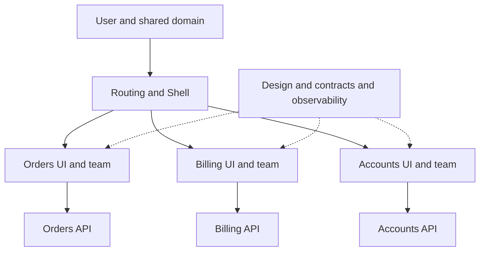

# Micro Frontends: independent deployment boundaries and real-world use

## Situation and learning goals

Imagine waiting for billing and account teams before releasing a small change to an orders screen. The problem may be less about code size and more about teams with different responsibilities sharing one frontend deployment unit. Micro Frontends address this organizational and release coupling.

This chapter covers the definition, the difference from modularization, composition methods available today, public case studies, and adoption, operation, and reversal decisions. By the end, answer “Which team can change and own what independently?” before “How many apps should we split into?” The [React Module Federation lab](micro-frontends-react.md) runs two separate artifacts.

## Prerequisites

Assume React components, props, and effects; HTTP, URLs, browser JavaScript, builds, and deployment. Read [complex state models](complex-state-models.md) for ownership and [permission UI](permission-based-ui.md) for presentation versus server authorization. The [Micro Frontend glossary entry](../../../glossary/en/micro-frontend.md) provides a short definition.

## 101 · What does this architecture separate?

### Definition and essential conditions

Micro Frontend, also written microfrontend, divides a coherent user experience into frontend business areas that teams can develop, verify, and deploy. The key is independently deployable units that users experience as one service.[^vercel-docs][^single-spa]

“Micro” does not prescribe a button-sized unit or a file count. Start with cohesive business areas and reasons for change, such as order lookup and approval, billing, and accounts. If every change requires deploying all other apps, splitting files provides little release independence. Conversely, separate artifacts, pipelines, and releases can exist inside one monorepo.

This chapter recommends four questions to assess independence.

1. Does an identifiable team own the area’s user features, APIs, and data responsibilities?
2. Can it release compatible changes without rebuilding other areas?
3. Can it detect failure and roll back to an earlier release with clear authority and procedures?
4. Are URL, props, event, and design contracts with other areas explicit?

### Differences from related concepts

| Concept | What it separates | Relationship to Micro Frontends |
| --- | --- | --- |
| React component decomposition | Code and rendering responsibilities | Components may belong to one build; this does not imply independent deployment. |
| Code splitting and lazy loading | Download timing and chunks | Possible within a single release. |
| Modular monolith | Internal business modules | One deployment can still have good boundaries; an important alternative. |
| Monorepo / polyrepo | Source location | Repository count and deployment-unit count are separate. |
| Design-system package | Shared tokens and components | Reuses UI, usually requiring consumer rebuilds. |
| Module Federation | Loading and sharing modules across builds | A composition technology, not the complete architecture defining teams or permissions.[^webpack] |
| Backend microservice | Server responsibilities and deployment | One SPA calling multiple APIs can remain a single frontend. |

### Shell and business areas

A shell or host connects navigation, login entry, overall layout, and business areas. A remote provides business UI or modules as a separate artifact. With path-based composition, a proxy can select applications instead of a browser shell.

This illustrates responsibility, not server counts or network isolation. Putting all business data, global stores, and validation back into the shell makes areas depend on shell releases. Manage the boundary between shared platform concerns and business logic.

## 201 · How is it used today?

### Choosing composition

The following compares official documentation checked on 2026-09-14 with design tradeoffs derived from it. It is not an adoption ranking or a survey claiming all companies work this way.

| Method | Where and how composition happens | Suitable conditions | Costs to own |
| --- | --- | --- | --- |
| Path or page separation | Proxy sends `/orders/*` and `/billing/*` to different apps | Clear page ownership and infrequent cross-area navigation | Route and asset conflicts, cross-app navigation, session and tracing continuity |
| Runtime composition on one page | Host loads remote modules and renders them | Independent teams contribute features to one page | Runtime compatibility, dependency and CSS collisions, partial failure |
| Server or edge fragments | Server combines HTML fragments | Initial HTML and SEO matter; a composition tier is operable | Fragment timeouts, cache keys, hydration and streaming consistency |
| iframe | App runs in a separate browsing context | Stronger isolation needs, external or legacy applications | Sizing, focus, keyboard, accessibility, messaging, and authentication |
| Build-time packages | Consumer includes versioned UI packages | Reuse is the goal and coordinated releases are acceptable | Consumers must rebuild; distinguish this from runtime release independence |

Web Components provide an integration surface through custom elements and mechanisms such as Shadow DOM.[^web-components] They do not themselves provide deployment pipelines, authentication, routing, or a security sandbox. iframe isolation also depends on origin and sandbox settings. For external application messages, check targetOrigin, incoming origin and source, and payload shape.[^iframe][^postmessage]

### Reading the current tool landscape

Next.js Multi-Zones describes independently deployed apps under one domain with path boundaries. Navigation is soft within a zone and hard between zones; assetPrefix and proxy configuration also matter. Read the recommendation to keep frequently visited pages in the same zone alongside the capability.[^zones]

Current Vercel Microfrontends documentation provides application groups, path routing, independent deployment, and a local proxy. Creating multiple repositories is not enough: JS, CSS, and image paths must also reach their owning app. A particular hosting platform is not required by the architecture.[^vercel-docs][^vercel-quickstart]

For composition within a page, options include webpack 5 Module Federation and separate Module Federation ecosystem tooling. The built-in webpack plugin, enhanced runtime, and bundler-specific plugins are not the same package; the official integration list distinguishes webpack, Rspack, Rsbuild, Vite, and other setups. Do not mix configuration or support assumptions based on names alone.[^webpack][^mf] single-spa coordinates application registration, activation conditions, and bootstrap, mount, and unmount lifecycles. Module delivery, release policy, and server authorization remain separate decisions.[^single-spa-config]

### An operations dashboard design exercise

Assume separate orders, billing, and accounts teams, with frequent orders changes. Three teams is a fictional scenario, not an organizational threshold recommendation.

A first step could move `/orders/*` to an orders app while the existing app handles the rest. Keep the orders table, filters, approval form, and state model together. Splitting remotes by visual categories such as tables, charts, and buttons can make one business change require releases from multiple teams.

If an independently deployable order summary must appear alongside other features, consider runtime composition. The [React lab](micro-frontends-react.md) implements this second case at a small scale. This differs from turning an existing table or chart library into an MFE.

| Contract | Responsibility in this scenario | Acceptance criteria |
| --- | --- | --- |
| URL | Shell selects area; orders owns subroutes | Direct access, refresh, back, and 404 agree |
| Authentication and tenant | Platform passes session and tenant; server authorizes requests | Clear old requests, caches, and subscriptions on tenant change |
| Data | Orders owns its API and cache semantics | Other apps do not mutate orders store internals |
| Events | Small facts such as `orders.approved.v1` | Check schema, tenant, and order ID; do not trust an event as proof of server approval |
| Design | Shared tokens and accessibility standards, team implementation | Consistent labels, errors, and keyboard behavior |
| Deployment | Orders produces immutable releases; platform manages exposure | Older-shell compatibility, independent rollback, identifiable releases |

## Public cases and their time boundaries

### Vercel: path boundaries with a monorepo

In its 2024-10-22 article, Vercel describes splitting a large Next.js application covering its website and logged-in dashboard into logical path areas. It retained a monorepo and reported over 40% improvement in preview builds and local compilation. The account also discusses hard navigation and preview and local integration.[^vercel-case]

The lesson is to examine original build and dependency costs and viable boundaries, not to expect every MFE to be 40% faster. These are the team’s own reported results, not a guarantee for this project. Product documentation checked in 2026 demonstrates current capabilities, but does not prove that the internal 2024 architecture remains identical today.

### Vercel Community: incremental coexistence of Discourse and Next.js

The 2026-03-10 account describes Vercel Community proxying existing Discourse while serving paths such as `/live/:path*` through Next.js. Both apps share a domain, retain authentication through Sign in with Vercel, and add routes when new pages are ready.[^vercel-community]

This is a real example of modernizing features while retaining an existing platform. It illustrates the need to design route boundaries and session continuity. The description covers the configuration at publication time.

### American Express One App: a React module platform and its maintenance boundary

Public One App material describes Node.js, React, and Holocron modules that can be developed, verified, and deployed separately. Its repository displays “One App is now InnerSource” and an archive date of 2024-05-03.[^amex][^amex-overview]

This is a real example of operating independent React modules through a platform. Public archival does not establish that internal use ended. Equally, it should not be recommended for a new service as currently maintained public OSS. Examine tooling, security-patch, and ownership lifetimes as well as runtime sharing.

### Zalando Tailor: a historical server-side HTML composition example

Tailor was designed as a streaming layout service in Zalando’s Project Mosaic, composing HTML from fragment services on the server. Its public repository was archived on 2022-12-05.[^tailor]

It demonstrates that MFE is not limited to browser remote imports. Treat it as a reference for initial HTML and partial failure at a composition tier, not evidence establishing Zalando’s entire production stack in 2026.

### Spotify Web Player: sometimes reducing separation is appropriate

Spotify’s 2019-03-25 retrospective describes an older web player that isolated views with iframes for team releases, but incurred repeated JS and CSS downloads, different aging stacks, and costly changes across views. A smaller dedicated team subsequently built a new player using React and Redux.[^spotify]

This proves neither that all MFEs fail nor that every Spotify product is a single app today. It is a historical example of reconsidering once-useful separation when organizational and product conditions change. Lists containing only company names miss this reversal.

## 301 · Adoption, operation, and reversal decisions

### Compare alternatives before adoption

The following are conditional design recommendations. First assess whether a modular single app can solve the problem through business boundaries, build caching, affected-area checks, feature flags, and shared packages. MFE adds network loading, contracts, and release combinations.

| Observed problem | First compare | Signal to consider MFE |
| --- | --- | --- |
| Slow builds | Bundle analysis, caching, incremental builds | Unnecessary full-area builds remain and release boundaries truly differ |
| Hard-to-navigate code | Module boundaries, public APIs, owners | Multiple teams own areas with independent lifecycles |
| Difficult legacy replacement | Page-level incremental migration | Old and new apps can coexist behind URL boundaries |
| Slow design changes | Versioned design system | Revisit boundaries if shared changes require simultaneous remote releases |
| Long cross-team approval waits | Permissions and process improvements | The technical deployment unit actually blocks independent releases |

### Independent deployment requires compatibility management

If Shell v3 and Orders v7 can run together, testing only the latest versions is insufficient. Specify combinations covering the minimum supported shell, new remote, previous remote, and rollback. Allow additive props and event fields first, then remove old fields after consumers migrate. TypeScript declarations are development-time contracts, not validation of JavaScript fetched from a CDN.

Retain immutable chunks within release directories. Upload and verify new chunks before changing a manifest or routing pointer. Old tabs may still request old chunks, so do not delete them immediately. Rolling back the pointer does not automatically replace code already running in a tab. Specify reload or remount policy and service-worker and CDN caching behavior.

### Failure, security, and UX boundaries

Remotes in the same JavaScript environment can affect host DOM, memory, and privileges. Fetching code from another CDN does not provide iframe-like sandboxing. Manage approved artifact origins, deployment permissions, dependencies, CSP, and supply-chain controls. Do not mistake login checks or hidden buttons for security boundaries; servers authorize every request.[^auth]

React Error Boundaries can replace some rendering failures with fallback UI, but cannot isolate infinite loops, all asynchronous errors, or authorization compromise.[^boundary] CSS collisions, focus movement, duplicated headings, and inconsistent loading UI also affect the whole product. Assign ownership for complete-page keyboard navigation and recovery.

### Observability and release checks

| Observation | Record or check | Why |
| --- | --- | --- |
| Release combination | Shell and remote versions, manifest revision | Reproduce the failing combination |
| Loading | remoteEntry, chunk, and API times and failure rates | Separate delivery, rendering, and data failures |
| User experience | Real-user LCP, INP, CLS, critical-task success | Check whether faster builds also improve user performance |
| Integration | Direct URLs, language, tenant, back, logout | Preserve state and route continuity |
| Change safety | Contract tests, preview combinations, limited rollout, independent rollback | Pair team independence with regression protection |
| Ownership | Team, contact route, partial-outage messaging, recovery objectives | Avoid making the shell team responsible for every remote incident |

Do not indiscriminately record user identifiers or tokens in observability tags. Security, accessibility, and privacy standards are not choices for each team to vary freely.

### Incremental rollout and stopping criteria

1. Record current release waiting time, build duration, and failure rates with consistent definitions.
2. Examine co-changing code and user navigation to select one candidate area.
3. Document URL, data, event, and design contracts and rollback ownership.
4. Expose it to a limited audience and compare task success, latency, and errors.
5. Expand after demonstrated improvement; merge boundaries or return to a single app if global-store dependence, simultaneous releases, or user latency increase.

For a small single-team CRUD app, strongly shared editing transactions, or no independent-release demand, start by considering a modular single app. Possible future growth alone does not justify distributed-release costs today.

## Check your understanding

- **Do four repositories make an MFE?** If all four must ship together, only source location may have changed. Check business ownership and independent releases.
- **Should a shared button be a remote?** A design package is usually simpler. Consider runtime composition when changing it without consumer redeployment justifies compatibility and outage costs.
- **Can different React versions be composed directly?** Components in one React tree require compatibility contracts. If different versions are essential, examine independent roots, bridges, iframes, or path boundaries and reassess their isolation and costs.
- **Can Vercel’s improvement be our forecast?** Cite it separately from your own measurements. Do not generalize across different bottlenecks, navigation patterns, and teams.
- **Does One App’s archive mean use ended?** The evidence establishes a read-only public repository and an InnerSource notice, not the current state of internal usage.

## Evidence and limits

Official APIs, operators’ public articles, and owner repositories were checked on 2026-09-14. Current capabilities, historical claims, and this chapter’s recommendations are distinguished. Current internal company operations, adoption rates, and reproduced business outcomes were not verified. The [React lab](micro-frontends-react.md) records execution separately. This change does not convert the Fieldbook website itself to MFE.

[Frontend learning path](index.md) · [React lab](micro-frontends-react.md) · [한국어](../../ko/frontend/micro-frontends.md)

## Sources

[^vercel-docs]: [Vercel Microfrontends](https://vercel.com/docs/microfrontends)
[^single-spa]: [single-spa Microfrontends overview](https://single-spa.js.org/docs/microfrontends-concept/)
[^webpack]: [webpack Module Federation and dynamic containers](https://webpack.js.org/concepts/module-federation/)
[^web-components]: [MDN Web Components](https://developer.mozilla.org/en-US/docs/Web/API/Web_components)
[^iframe]: [MDN iframe](https://developer.mozilla.org/en-US/docs/Web/HTML/Reference/Elements/iframe)
[^postmessage]: [MDN postMessage](https://developer.mozilla.org/en-US/docs/Web/API/Window/postMessage)
[^zones]: [Next.js Multi-Zones](https://nextjs.org/docs/app/guides/multi-zones)
[^vercel-quickstart]: [Vercel Microfrontends quickstart](https://vercel.com/docs/microfrontends/quickstart)
[^mf]: [Module Federation integrations](https://module-federation.io/integrations/index.html)
[^single-spa-config]: [single-spa configuration and lifecycles](https://single-spa.js.org/docs/configuration/)
[^vercel-case]: [How Vercel adopted microfrontends — 2024-10-22](https://vercel.com/blog/how-vercel-adopted-microfrontends)
[^amex]: [American Express One App — archived 2024-05-03](https://github.com/americanexpress/one-app)
[^amex-overview]: [One App overview](https://github.com/americanexpress/one-app/blob/main/docs/overview/README.md)
[^tailor]: [Zalando Tailor — archived 2022-12-05](https://github.com/zalando/tailor)
[^spotify]: [Building Spotify’s New Web Player — 2019-03-25](https://engineering.atspotify.com/2019/3/building-spotifys-new-web-player)
[^auth]: [OWASP Authorization Cheat Sheet](https://cheatsheetseries.owasp.org/cheatsheets/Authorization_Cheat_Sheet.html)
[^boundary]: [React Error Boundaries](https://react.dev/reference/react/Component#catching-rendering-errors-with-an-error-boundary)

[^vercel-community]: [How we run Vercel’s CDN in front of Discourse — 2026-03-10](https://vercel.com/blog/how-we-run-vercels-cdn-in-front-of-discourse)
