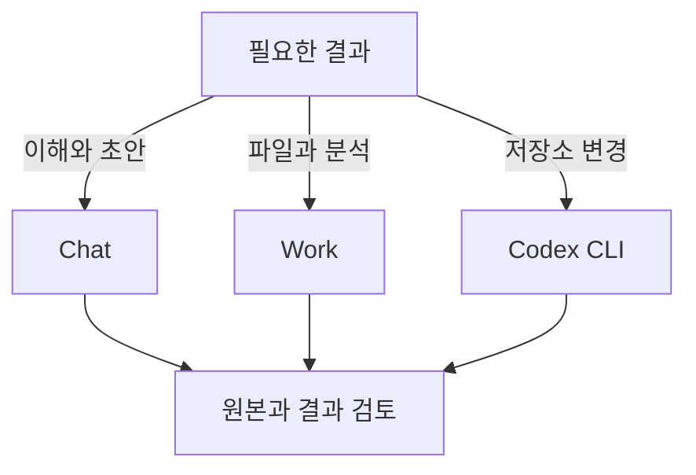

# Chat·Work·Codex CLI 종합: 언제 무엇을 사용할까요?

## 요약

**답을 함께 생각하고 싶으면 Chat, 자료를 맡겨 검토 가능한 결과물까지 만들고 싶으면 Work, 프로젝트 파일과 명령을 직접 다루려면 Codex CLI를 출발점으로 삼습니다.** 이는 상황에 따른 선택 제안이며 능력의 우열표가 아닙니다. OpenAI도 Chat·Work·Codex를 목적과 작업 경험으로 구분하고, Work와 Codex의 기능이 겹친다고 설명합니다.[^choose]

이 문서는 세 환경의 차이와 조합 방법을 종합합니다. 각 환경을 처음 사용하는 방법과 요청 예시는 독립 문서에서 읽습니다.

| 문서 | 중심 질문 |
| --- | --- |
| [ChatGPT Chat](chatgpt-chat.md) | 대화로 개념을 이해하고 아이디어·문장을 어떻게 다듬을까요? |
| [ChatGPT Work](chatgpt-work.md) | 자료를 제공해 문서·분석·표를 어떻게 완성하게 할까요? |
| [Codex CLI](codex-cli.md) | 작업 폴더의 파일을 어떻게 조사·수정·검증할까요? |

## 학습 목표

- 작업 방식·클라이언트·모델·실행 위치를 구분합니다.
- 직무 대신 필요한 결과와 검토 방식으로 환경을 선택합니다.
- 여러 환경을 사용할 때 자료와 완료 기준을 넘기는 방법을 설명합니다.
- 결과물 작성과 실제 반영·게시를 별도로 확인합니다.

## 선수 지식

개발 지식은 필수가 아닙니다. **작업 방식**은 대화를 이어 갈지 결과를 맡길지의 차이입니다. **클라이언트**는 서비스를 이용하는 프로그램입니다. **모델**은 요청을 해석하고 결과를 만드는 엔진입니다. **실행 위치**는 파일이나 도구 작업이 이루어지는 곳입니다.

## 101 · 개념 이해

### 같은 층위의 이름은 아닙니다

Chat과 Work는 ChatGPT 안에서 고르는 작업 방식이고, Codex CLI는 Codex를 터미널에서 사용하는 클라이언트입니다. 따라서 이 문서에서는 이름의 분류보다 **일을 시작하고 결과를 검토하는 방식**을 비교합니다.[^choose][^cli]

| 구분 | 고르는 것 | 판단할 질문 |
| --- | --- | --- |
| 작업 방식 | Chat 또는 Work | 대화를 발전시킬지, 완료할 결과를 맡길지 |
| 작업 인터페이스 | 웹·데스크톱·Codex CLI 등 | 파일 미리보기, 코드 차이, 터미널 중 무엇으로 검토할지 |
| 모델과 effort | 사용 가능한 모델·추론 강도 | 작업 난도에 맞는 추론과 처리 특성이 무엇인지 |
| 실행 위치와 접근 | 로컬·클라우드·연결 자료 | 필요한 파일과 도구가 실제로 있는지 |

모델과 effort의 자세한 선택은 [GPT-6 Astra 문서](gpt-6-astra.md)에서 다룹니다. 모델을 바꿔도 없는 파일이나 연결 권한이 자동으로 생긴다고 보지 않습니다. 실제 선택지는 요금제·환경·조직 설정에 따라 확인합니다.[^choose]

### 세 환경의 실무 차이

| 비교 기준 | ChatGPT Chat | ChatGPT Work | Codex CLI |
| --- | --- | --- | --- |
| 좋은 출발점 | 질문·아이디어·초안 | 맡길 목표와 결과물 | 작업 폴더와 원하는 변경 |
| 제공할 입력 | 배경, 짧은 자료, 조건 | 원본 파일, 필요한 연결 자료, 양식 | 파일 경로, 프로젝트 규칙, 재현 조건 |
| 대표 결과 | 설명, 비교, 문장 초안 | 검토할 문서·표·발표자료·분석 | 파일 변경, 검사 결과, 작업 요약 |
| 검토 방식 | 답변을 읽고 후속 질문 | 파일을 열어 내용·수치·구성 확인 | diff·명령·검사 결과 확인 |
| 추가로 확인할 것 | 필요한 도구의 실제 제공 여부 | 실행 위치, 자료 접근, 결과 파일 | 작업 폴더, 명령 도구, 쓰기 범위 |

표는 공식 기능 설명을 실무 기준으로 재구성했습니다. Chat도 파일을 요약할 수 있고 Work도 코드를 실행할 수 있습니다. Codex도 보고서나 발표자료를 만들 수 있으므로 업무를 “개발자 전용/비개발자 전용”으로 나누지 않습니다.[^choose][^files]

그림 1. 직접 작성한 출발점 선택 그림입니다. 세 갈래는 배타적인 기능 구분이 아니며 함께 사용할 수 있습니다.

## 201 · 예제에 적용하기

### 하루공방의 FAQ를 개선합니다

**가정:** 가상의 공방이 고객 문의를 바탕으로 FAQ를 개선하려고 합니다. 운영 사실은 담당자가 확정하고, 웹사이트는 파일과 변경 이력을 관리하는 저장소에 있다고 가정합니다.

| 단계 | 사용할 환경의 예 | 구체적인 요청 | 다음 단계로 넘길 것 |
| --- | --- | --- | --- |
| 질문과 표현 정리 | Chat | “처음 오는 고객이 궁금할 질문을 제안하고 수령 안내 문장을 다듬어 주세요.” | 선택한 질문, 확정한 문구, 모르는 조건 |
| 문의 분석과 검토 파일 | Work | “문의 집계와 운영 사실로 FAQ 검토 파일을 만들고 합계와 근거를 확인해 주세요.” | 검토한 파일, 사실 출처, 미결정 사항 |
| 사이트에 반영 | Codex CLI | “확정된 FAQ를 기존 페이지에 반영하고 프로젝트 검사를 실행해 주세요.” | 변경 diff, 검사 결과, 표시 확인 |

**기대 결과와 해석:** 대화에서 정한 내용을 검토 파일과 실제 사이트 변경으로 이어 갈 수 있습니다. 세 단계를 모두 거쳐야 한다는 뜻은 아닙니다. FAQ 문구가 이미 확정됐다면 CLI에서 시작할 수 있고, 보고서까지만 필요하면 Work에서 끝낼 수 있습니다. 이 표는 가상 운영 예제이며 실제 작업 시간이나 품질을 비교한 실험이 아닙니다.

### 환경을 바꿀 때 무엇을 넘기나요?

다음 다섯 가지를 짧게 묶어 제공합니다.

1. **목표:** 고객에게 보여 줄 FAQ를 개선합니다.
2. **원본:** 사용할 문의 집계와 운영자가 확정한 사실을 지정합니다.
3. **결정 사항:** 승인한 문구와 보존해야 할 조건을 적습니다.
4. **남은 질문:** 취소 조건 등 아직 결정되지 않은 항목을 표시합니다.
5. **완료 기준:** 검토 파일까지인지, 로컬 변경까지인지, 게시까지인지 적습니다.

ChatGPT 프로젝트는 관련 Chat·Work 대화의 파일과 지침을 모으는 데 사용할 수 있습니다. CLI는 지정한 작업 폴더를 기준으로 일합니다. 같은 계정이라는 이유만으로 다른 환경의 대화·파일·로그인 상태가 모두 전달됐다고 가정하지 않습니다.[^projects][^auth] 필요한 파일을 실제로 제공하고, 새 작업에서 확인한 입력을 점검합니다.

## 301 · 조건에 따라 판단하기

### 직무보다 지금 할 일을 기준으로 선택합니다

| 지금 필요한 일 | 시작 제안 | 이유 |
| --- | --- | --- |
| 비개발자가 기술 용어를 이해합니다. | Chat | 설명 수준을 대화로 조정하기 쉽습니다. |
| 개발자가 설계 대안의 장단점을 정리합니다. | Chat 또는 현재 Codex 환경 | 설명·판단만 필요한지 실제 저장소 맥락이 필요한지에 따라 고릅니다. |
| 기획자가 여러 파일로 회의 자료를 만듭니다. | Work | 원본과 결과 형식을 지정해 검토할 파일을 맡길 수 있습니다. |
| 비개발자가 저장소의 Markdown 문서를 고칩니다. | CLI에 익숙하면 Codex CLI | 문서 파일과 프로젝트 검사까지 같은 흐름으로 다룰 수 있습니다. |
| 개발자가 버그를 수정하고 테스트합니다. | Codex CLI 또는 선호하는 Codex 인터페이스 | 실제 파일·개발 도구·변경 차이를 다루는 일이 중심입니다. |
| 기존 파일을 화면에서 보며 수정합니다. | Work 또는 데스크톱 | 미리보기로 문서·표·시각 구성을 확인하기 편합니다. |

위 표는 선택 제안입니다. 익숙한 환경에서 필요한 도구와 검토 방법이 모두 제공된다면, 이름에 맞추려고 작업을 옮길 필요는 없습니다. 공식 안내도 문서·조사 같은 업무를 계속 Codex에서 수행할 수 있다고 설명합니다.[^work]

### 함께 알아둘 인접 도구

**데스크톱의 Codex**는 코드 차이와 개발 검토 정보를 화면에서 보고 싶을 때, **IDE 확장**은 코드 편집기에서 열린 파일과 함께 일하고 싶을 때 살펴볼 수 있습니다. CLI의 모든 기능과 화면이 그대로 제공된다고 가정하지는 않습니다.[^choose][^projects] 자체 서비스에 AI 호출을 넣는 목적은 사용 화면 선택과 다른 개발 문제이므로 [API와 모델 설명](gpt-6-astra.md)으로 이어서 읽습니다.

### 어떤 결과를 성공으로 볼까요?

| 확인 단계 | 예 | 섞어 해석하면 생기는 문제 |
| --- | --- | --- |
| 내용 | 조건·수치·출처가 맞는지 확인 | 자연스러운 문장이 정확한 사실처럼 보일 수 있습니다. |
| 산출물 | 파일이 열리고 원하는 형식을 갖췄는지 확인 | “완료”라는 메시지만 보고 파일 누락을 놓칠 수 있습니다. |
| 실제 반영 | 저장소 변경·게시·발송 여부 확인 | 초안 작성과 외부 반영을 같은 결과로 오해할 수 있습니다. |

요청에는 목표·원본·형식·중요한 제약을 담고, 결과에서 확인할 기준을 지정합니다.[^prompting] 단순한 문장 수정에 큰 작업을 맡기기보다 필요한 결과부터 시작합니다. 반대로 파일과 검증이 필요한 일을 계속 설명만 받는 대화로 끝내지 않도록 완료 범위를 명확히 합니다.

## 이해 확인

**질문 1:** Work가 Chat보다 항상 더 좋은 답을 주나요?

**해설:** 작업 방식만으로 품질의 우열을 단정할 수 없습니다. 입력 자료·모델·도구·검토 기준과 원하는 결과를 함께 봅니다.

**질문 2:** 비개발자는 Codex CLI를 쓰면 안 되나요?

**해설:** 직무가 기준은 아닙니다. 파일과 명령을 다루는 방식이 편하고 변경을 확인할 수 있다면 문서 작업에도 사용할 수 있습니다. 시각적 검토가 더 편하면 Work나 데스크톱을 선택합니다.

**질문 3:** Work에서 FAQ 파일을 만들었으면 사이트에도 반영됐나요?

**해설:** 파일 생성과 사이트 변경은 다른 결과입니다. 대상 저장소·페이지와 반영 범위를 정하고 실제 변경을 확인해야 합니다.

## 근거와 한계

2026-09-10에 확인한 OpenAI 공식 안내를 근거로 작성했습니다. 선택 표·공방 사례·인계 항목은 직접 제안한 실무 해석입니다. 세 환경의 응답 품질·속도·비용을 동일 조건에서 측정한 비교 실험이 아닙니다. 특정 계정에서의 기능·연결·사용량은 해당 환경에서 확인해야 합니다.

## 관련 지식

[ChatGPT Chat](chatgpt-chat.md) · [ChatGPT Work](chatgpt-work.md) · [Codex CLI](codex-cli.md) · [모델과 effort 선택](gpt-6-astra.md) · [AI Engineering](index.md) · [English](../../en/ai-engineering/chatgpt-and-codex-workflows.md)

## 출처

[^choose]: [OpenAI — Use ChatGPT](https://learn.chatgpt.com/docs/use-chatgpt)
[^work]: [OpenAI — Get started with ChatGPT Work](https://learn.chatgpt.com/docs/get-started-with-work)
[^cli]: [OpenAI — Codex CLI](https://learn.chatgpt.com/docs/codex/cli)
[^projects]: [OpenAI — Projects and chats](https://learn.chatgpt.com/docs/projects)
[^files]: [OpenAI — Work with files](https://learn.chatgpt.com/docs/artifacts-viewer)
[^prompting]: [OpenAI — Prompting](https://learn.chatgpt.com/docs/prompting)
[^auth]: [OpenAI — Authentication](https://learn.chatgpt.com/docs/auth)
