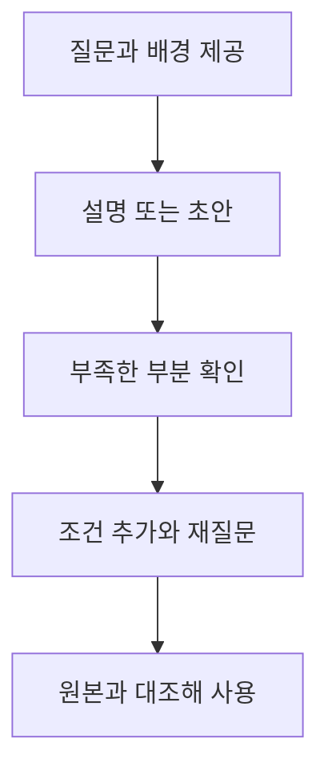

# ChatGPT Chat: 대화로 이해하고 초안 다듬기

## 요약

고객에게 보낼 안내 문장이 어색하거나, 새 개념을 어디서부터 이해해야 할지 막막할 때가 있습니다. **ChatGPT Chat**은 질문하고 답을 읽은 뒤 다시 묻는 대화를 통해 생각과 문장을 발전시키는 데 적합합니다. 공식 안내는 질문·브레인스토밍·초안·파일 요약·선택지 비교 등을 Chat의 활용 예로 제시합니다.[^choose]

이 문서에서 Chat은 ChatGPT의 대화 중심 작업 방식을 뜻합니다. 특정 모델명이나 요금제 이름을 뜻하지 않습니다. 기능 전체를 Chat 하나의 고정된 범위로 단정하지 않고, 계정에서 제공하는 도구를 확인합니다. 세 환경의 관계는 [종합 비교](chatgpt-and-codex-workflows.md)에서 읽습니다.

## 학습 목표

- 대화를 통해 목표를 좁히는 상황과 완성된 결과물을 맡길 상황을 구분합니다.
- 배경·독자·원하는 형식을 담은 요청과 후속 질문을 작성합니다.
- 그럴듯한 설명과 원본으로 확인한 사실을 구분합니다.

## 선수 지식

프로그래밍 지식은 필요하지 않습니다. **프롬프트**(prompt)는 AI에게 보내는 질문이나 요청입니다. **맥락**(context)은 답을 바꾸는 배경 정보입니다. **초안**은 수정과 확인을 전제로 만든 첫 결과입니다.

## 101 · 개념 이해

### 대화가 작업의 일부입니다

처음부터 완벽한 요청을 만들 필요는 없습니다. 목적을 말하고 결과를 읽은 뒤 빠진 조건을 추가할 수 있습니다. OpenAI는 목표·맥락·결과 형식·필요한 경계를 요청에 담고 후속 메시지로 다듬도록 안내합니다.[^prompting]



그림 1. 직접 작성한 대화 활용 흐름입니다. 답변의 정확성을 자동으로 보장하는 절차는 아닙니다.

### 언제 활용하면 좋을까요?

| 상황 | 요청 예 | 확인할 결과 |
| --- | --- | --- |
| 낯선 개념을 배웁니다. | “색인을 도서관에 비유해 설명하고 이해 확인 질문을 주세요.” | 비유의 한계까지 이해했는지 |
| 짧은 안내를 고칩니다. | “이 공지의 뜻을 유지하면서 처음 오는 고객이 이해하기 쉽게 고쳐 주세요.” | 날짜·금액·조건이 보존됐는지 |
| 아이디어를 좁힙니다. | “세 가지 제목을 제안하고 어떤 독자에게 맞는지 비교해 주세요.” | 선택 기준이 자신의 목적과 맞는지 |
| 개발 내용을 이해합니다. | “제공한 오류 메시지를 설명하고 원인 확인에 필요한 정보를 알려 주세요.” | 가능한 원인과 확인된 원인이 구분됐는지 |

이 표는 활용 제안입니다. Chat에서도 자료를 요약하거나 검색을 활용할 수 있습니다. 다만 실제 파일을 여러 개 만들고 점검하는 일이 중심이라면 [Work](chatgpt-work.md), 저장소를 직접 수정하고 검사하는 일이 중심이라면 [Codex CLI](codex-cli.md)를 함께 검토합니다.[^choose]

## 201 · 예제에 적용하기

### 하루공방의 수령 안내를 다듬습니다

**가정:** 하루공방은 가상의 도예 공방입니다. 작품은 굽는 과정이 필요해 약 4주 뒤 방문 수령하며, 정확한 날짜는 별도로 안내합니다. 이 조건은 학습용입니다.

Chat을 선택하고 다음 요청을 입력합니다. UI 명칭과 제공 도구는 계정·플랫폼에 따라 다를 수 있습니다.[^choose]

```text
하루공방의 처음 방문하는 고객을 위한 수령 안내를 다듬어 주세요.
확정된 조건: 작품은 굽는 과정이 필요하고 약 4주 뒤 방문 수령합니다.
정확한 수령일은 별도로 안내합니다.

질문 제목 하나와 답변 세 문장 이내로 작성해 주세요.
약 4주를 확정 날짜로 바꾸거나 택배 제공 조건을 추가하지 마세요.
```

**예상 결과의 예:**

> **작품은 언제 받을 수 있나요?**
>
> 작품은 굽는 과정을 거쳐 약 4주 뒤 공방에서 수령합니다. 정확한 수령일은 별도로 안내해 드립니다.

이는 직접 작성한 예시이며 Chat을 실행해 얻은 관찰 결과가 아닙니다. “약”, “방문 수령”, “별도 안내”가 모두 보존됐는지 원본과 대조합니다.

“좀 더 좋게” 대신 다음처럼 구체적으로 이어 갑니다.

```text
질문을 “당일 가져갈 수 있나요?”로 바꾸고, 답의 첫 문장에서 가능 여부를 말해 주세요.
나머지 수령 조건은 그대로 유지해 주세요.
```

**기대 결과와 해석:** 고객 질문에 맞는 문장을 얻고 편집 기준을 명확히 할 수 있습니다. 공지를 실제 홈페이지에 반영하거나 발송한 것은 아닙니다. 그 작업까지 원하면 대상과 완료 기준을 별도로 지정합니다.

## 301 · 조건에 따라 판단하기

### 대화를 계속할지, 실행 환경을 바꿀지 판단합니다

설명의 관점이나 문장을 함께 조정하는 중이라면 Chat을 계속 사용합니다. 요청이 “문의 파일을 분류하고 검토 가능한 FAQ 파일을 완성해 주세요”로 커지면 Work의 작업 방식이 맞는지 봅니다. “이 FAQ를 저장소의 페이지에 반영하고 검사해 주세요”라면 Codex CLI처럼 해당 파일과 개발 도구에 접근할 환경이 필요합니다. 이 구분은 선호하는 작업 방식이며 기능의 절대적인 경계는 아닙니다.[^choose]

같은 자료로 계속 일한다면 프로젝트에 관련 대화·파일·지침을 모을 수 있습니다. 공식 안내상 같은 ChatGPT 프로젝트에 Chat과 Work 대화를 둘 수 있지만, 프로젝트를 만들었다고 내 컴퓨터 폴더가 자동으로 연결되는 것은 아닙니다.[^projects]

### 답을 평가하는 기준을 요청에 넣습니다

최신 정보가 필요한 질문은 검색과 출처 확인을 요청하고, 제공한 자료만 써야 한다면 그 범위를 적습니다.[^prompting] 이 공방 예제의 평가 기준은 문장의 화려함보다 원래 조건의 보존입니다. 오류 설명 예제라면 원인 가설을 사실로 확정하지 않았는지가 기준이 됩니다.

## 이해 확인

**질문 1:** 답변이 자연스러우면 수령 조건을 원본과 비교하지 않아도 되나요?

**해설:** 아닙니다. “약 4주”를 “정확히 4주”로 바꾸면 뜻이 달라집니다. 중요한 조건을 먼저 대조합니다.

**질문 2:** Chat으로 코드 질문을 할 수 없고 Work만 파일을 읽을 수 있나요?

**해설:** 그렇게 구분하지 않습니다. 설명·요약도 Chat의 활용 예입니다. 필요한 도구와 최종 결과, 직접 실행할 범위로 환경을 선택합니다.

## 근거와 한계

2026-09-10에 확인한 OpenAI 공식 안내를 근거로 작성했습니다. 공방·프롬프트·예상 답변·판단 표는 직접 만든 학습 자료입니다. 특정 계정의 Chat 도구나 응답 품질을 실험한 문서가 아니며, 모델·요금제·플랫폼·배포 단계에 따른 차이는 실제 화면에서 확인합니다.

## 관련 지식

[Chat·Work·Codex 종합 비교](chatgpt-and-codex-workflows.md) · [ChatGPT Work](chatgpt-work.md) · [Codex CLI](codex-cli.md) · [모델과 effort 선택](gpt-6-astra.md) · [문서 목록](index.md) · [English](../../en/ai-engineering/chatgpt-chat.md)

## 출처

[^choose]: [OpenAI — Use ChatGPT](https://learn.chatgpt.com/docs/use-chatgpt)
[^prompting]: [OpenAI — Prompting](https://learn.chatgpt.com/docs/prompting)
[^projects]: [OpenAI — Projects and chats](https://learn.chatgpt.com/docs/projects)
