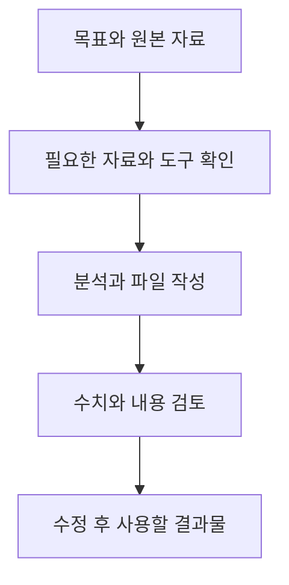

# ChatGPT Work: 자료를 검토 가능한 결과물로 완성하기

## 요약

회의에서 쓸 보고서가 필요한데 문의 자료를 분류하고 표를 만들고 설명까지 맞춰야 한다고 가정합니다. **ChatGPT Work**는 이런 목표를 맡겨 필요한 단계와 도구를 거쳐 검토할 수 있는 결과물까지 만들도록 하는 작업 방식입니다. 공식 시작 안내는 문서·발표자료·분석·반복 업데이트를 대표 사례로 소개합니다.[^work]

여기서 Work는 작업 방식의 이름입니다. 조직용 요금제를 뜻하는 말로 사용하지 않습니다. Codex와 핵심 기능이 겹치며, 일반 업무의 결과물을 중심으로 소통하는 경험에 초점을 둡니다.[^choose] 무엇이 더 똑똑한지보다 **어떤 자료로 무엇을 완성할지**를 먼저 정합니다.

## 학습 목표

- Work에 맡길 목표를 자료·결과 형식·완료 기준으로 구체화합니다.
- 로컬과 클라우드 작업에서 접근할 수 있는 자료의 차이를 설명합니다.
- 생성된 파일을 검토하고 안정된 업무를 반복 작업으로 발전시킵니다.

## 선수 지식

프로그래밍 지식은 필요하지 않습니다. **결과물**(deliverable)은 검토하고 실제로 사용할 문서·표·발표자료 같은 산출물입니다. **플러그인**(plugin)은 외부 서비스 연결이나 재사용할 작업 기능을 제공합니다. 연결된 서비스에서 무엇을 읽고 바꿀 수 있는지는 실제 권한에 따라 달라집니다.[^choose]

## 101 · 개념 이해

### 설명을 받는 것에서 완료할 일을 맡기는 것으로 확장합니다

“문의 분석은 어떻게 하나요?”는 설명을 요청합니다. “이 문의 자료로 FAQ 검토 파일을 만들고 원본과 합계를 확인해 주세요”는 완료할 작업을 맡깁니다. Work에는 최종 형식과 확인 기준까지 알려 주는 편이 유용합니다.[^work][^files]



그림 1. 직접 만든 Work 활용 흐름입니다. 자료가 빠지거나 도구에 접근할 수 없으면 해당 부분을 확인해야 합니다.

### 웹·데스크톱·실행 위치를 구분합니다

| 실행 방식 | 자료 접근과 활용 | 선택 상황 |
| --- | --- | --- |
| 웹의 Work | 관리되는 클라우드 환경에서 업로드 파일·연결 도구·허용된 웹사이트를 사용합니다. | 컴퓨터의 특정 폴더 없이 제공한 자료로 작업합니다. |
| 데스크톱의 Cloud 옵션 | 제공되는 경우 앱을 닫은 뒤에도 작업을 이어 갈 수 있습니다. | 내 컴퓨터가 켜져 있어야 한다는 조건을 줄이고 싶습니다. |
| 데스크톱의 Work locally 옵션 | 제공되는 경우 컴퓨터의 로컬 파일·앱·브라우저를 사용합니다. | 내 컴퓨터의 자료나 앱이 작업에 필요합니다. |

이 구분은 공식 사용·시작 안내에 근거합니다. 실제 옵션은 계정·플랫폼·배포 단계·조직 설정에 따라 다릅니다. 클라우드 작업이 내 컴퓨터 폴더를 자동으로 읽는다고 가정하지 않습니다.[^choose][^work] ChatGPT 프로젝트에 자료를 모으는 일과 로컬 폴더를 연결하는 일도 구분합니다.[^projects]

## 201 · 예제에 적용하기

### 문의 자료를 FAQ 검토 파일로 만듭니다

**가정:** 가상의 하루공방에 문의 10건이 있고, 아래 네 주제로 이미 집계했다고 가정합니다. 실제 고객 자료는 아닙니다.

| 문의 주제 | 건수 | 사용할 운영 사실 |
| --- | --- | --- |
| 초보자 참여 | 4 | 처음 배우는 성인을 위한 수업입니다. |
| 가격 | 3 | 1인 50,000원이며 재료와 도구 사용이 포함됩니다. |
| 작품 수령 | 2 | 약 4주 뒤 방문 수령하며 날짜는 별도로 안내합니다. |
| 예약 취소 | 1 | 취소 조건은 제공되지 않았습니다. |

Work를 선택하고 위 표를 요청과 함께 제공합니다. 실제 자료를 쓸 때는 원본 파일을 첨부하거나 사용 가능한 플러그인으로 연결합니다. 다음은 표를 그대로 입력 자료로 사용하는 연습 요청입니다.

```text
위 표를 하루공방 FAQ 개선을 위한 유일한 입력 자료로 사용해 주세요.
운영자가 검토할 faq-review.xlsx와 summary.md를 만들어 주세요.

스프레드시트에는 “문의 요약”과 “FAQ 초안” 시트를 만듭니다.
문의 요약에는 주제·건수·전체 대비 비율을 넣습니다.
FAQ 초안에는 질문·답변·근거가 된 입력 항목·확인 필요 사항을 넣습니다.
요약 문서는 우선 검토할 질문과 운영자가 결정해야 할 사항을 설명해 주세요.

취소 조건은 추측하지 말고 확인 필요로 표시해 주세요.
건수 합계와 비율을 검사하고 두 파일의 설명이 일치하는지 확인해 주세요.
다운로드할 수 있는 파일로 제공하고 외부에 게시하거나 발송하지 마세요.
```

**기대 결과의 확인 기준:** `4 + 3 + 2 + 1 = 10`이며 비율은 각각 `40%`, `30%`, `20%`, `10%`입니다. 취소 조건에는 창작한 답 대신 확인 필요가 남아야 합니다. 문의 빈도만으로 사업상 중요도가 확정되는 것은 아니므로, 최종 우선순위는 운영자가 판단합니다.

파일을 열어 시트 이름·열·합계·FAQ 문구를 확인합니다. 파일을 생성했다는 메시지와 실제 사용할 수 있는 파일은 따로 확인해야 합니다. 공식 안내도 생성 파일을 열거나 내려받아 검토하고 구체적으로 수정을 요청하도록 설명합니다.[^files]

```text
FAQ 초안 시트의 작품 수령 답변을 두 문장으로 줄여 주세요.
“약 4주”, “방문 수령”, “날짜 별도 안내”는 유지해 주세요.
문의 요약 시트의 건수와 비율은 그대로 두고 새 파일을 제공해 주세요.
```

이 프롬프트와 계산은 학습용입니다. 실제 Work 실행·파일 생성이나 고객 문의 감소를 관찰한 결과는 아닙니다.

## 301 · 조건에 따라 판단하기

### 맡길 일의 크기와 완료 기준을 정합니다

| 필요 | 적절한 시작점 | 완료 기준의 예 |
| --- | --- | --- |
| 문장 하나를 고칩니다. | [Chat](chatgpt-chat.md)으로 짧게 대화합니다. | 원래 조건을 유지한 문장 |
| 여러 자료를 분석해 보고서를 만듭니다. | Work에 원본·독자·파일 형식을 제공합니다. | 원본과 대조한 표와 설명, 열리는 파일 |
| 기존 양식에 맞춰 결과를 만듭니다. | 양식 파일과 보존할 구조를 제공합니다. | 지정한 시트·열·문서 구조 유지 |
| 저장소에 FAQ를 반영합니다. | [Codex CLI](codex-cli.md) 또는 저장소에 접근할 수 있는 환경을 선택합니다. | 변경 파일, 검사 결과, 실제 표시 확인 |

Work도 코드와 저장소 작업을 할 수 있으며, Codex도 문서와 분석을 수행할 수 있습니다. 위 표는 검토할 결과와 선호하는 인터페이스에 따른 제안입니다.[^choose]

반복 업무는 먼저 한 번 수행해 결과를 검토한 뒤 예약 작업으로 확장합니다.[^prompting] 입력 자료가 매번 다른 위치에 있거나 집계 기준이 불안정하다면 그 부분부터 정리합니다. 반복 설정을 했다는 사실이 매번 최신 자료를 정확히 읽었다는 증거는 아닙니다.

### 자료·도구·사용량을 함께 확인합니다

플러그인 이름을 요청에 적는 것만으로 연결과 권한이 생기지는 않습니다. 사용할 자료와 실제 접근 가능한 자료가 같은지 확인합니다. 기능과 사용량은 요금제·환경에 따라 다르며 Work와 Codex는 사용량 한도를 공유합니다.[^choose] 큰 작업은 필요한 결과부터 좁혀 시작하고, 선택 모델과 effort의 차이는 [별도 모델 문서](gpt-6-astra.md)에서 확인합니다.

## 이해 확인

**질문 1:** 클라우드 Work에 파일 경로만 적으면 컴퓨터의 파일을 읽을 수 있나요?

**해설:** 자동으로 접근한다고 가정할 수 없습니다. 파일을 업로드·연결하거나, 필요한 로컬 접근을 제공하는 환경을 선택합니다.

**질문 2:** 취소 문의가 1건이므로 취소 규정을 임의로 작성해도 되나요?

**해설:** 아닙니다. 빈도가 적어도 제공되지 않은 운영 사실은 확인이 필요합니다. 누락을 드러내는 것도 유용한 결과입니다.

## 근거와 한계

2026-09-10에 확인한 OpenAI 공식 안내를 사용했습니다. 공방·표·프롬프트·계산은 직접 만든 가상 예제입니다. 특정 계정의 플러그인 연결, 로컬·클라우드 옵션, 예약 작업, 파일 결과를 실험하지 않았습니다. 가격·사용량 수치나 모든 계정의 기능 제공을 보장하지 않습니다.

## 관련 지식

[Chat·Work·Codex 종합 비교](chatgpt-and-codex-workflows.md) · [ChatGPT Chat](chatgpt-chat.md) · [Codex CLI](codex-cli.md) · [모델과 effort 선택](gpt-6-astra.md) · [문서 목록](index.md) · [English](../../en/ai-engineering/chatgpt-work.md)

## 출처

[^work]: [OpenAI — Get started with ChatGPT Work](https://learn.chatgpt.com/docs/get-started-with-work)
[^choose]: [OpenAI — Use ChatGPT](https://learn.chatgpt.com/docs/use-chatgpt)
[^files]: [OpenAI — Work with files](https://learn.chatgpt.com/docs/artifacts-viewer)
[^projects]: [OpenAI — Projects and chats](https://learn.chatgpt.com/docs/projects)
[^prompting]: [OpenAI — Prompting](https://learn.chatgpt.com/docs/prompting)
