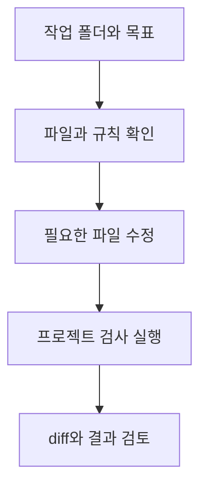

# Codex CLI: 터미널에서 파일을 수정하고 검증하기

## 요약

프로젝트의 안내 페이지를 고쳐야 한다고 가정합니다. 필요한 파일을 찾고, 기존 규칙에 맞게 수정하고, 검사 명령을 실행한 뒤 차이를 확인해야 합니다. **Codex CLI**는 이런 일을 터미널에서 수행하는 Codex 클라이언트입니다. 로컬 저장소를 읽고 수정하며 이미 설치된 개발 도구를 실행하는 흐름에 적합합니다.[^cli]

코드 설명뿐 아니라 실제 파일 변경과 검증을 요청할 수 있습니다. Markdown 문서나 자료 파일을 다루는 비개발자도 사용할 수 있지만, 작업 폴더와 변경 내용을 확인할 준비가 필요합니다. 시각적인 파일 미리보기가 더 편하면 [ChatGPT Work](chatgpt-work.md)를 함께 검토합니다. CLI 자체에는 문서 미리보기·주석 인터페이스가 없습니다.[^files]

## 학습 목표

- Codex CLI의 작업 폴더와 ChatGPT 프로젝트를 구분합니다.
- 읽기 위주의 조사와 파일 수정 작업을 구체적으로 요청합니다.
- 변경 차이와 실제 검사 결과를 읽고 완료 여부를 판단합니다.
- 대화형 실행과 스크립트에서 사용하는 `codex exec`를 구분합니다.

## 선수 지식

**CLI**(Command-Line Interface)는 텍스트 명령으로 프로그램을 사용하는 방식입니다. **터미널**은 그 명령을 입력하는 창입니다. **저장소**(repository)는 프로젝트 파일과 변경 이력을 관리하는 공간입니다. **Git diff**는 수정 전후의 차이를 보여 줍니다. 명령을 실행할 폴더와 현재 파일 상태를 확인할 수 있어야 합니다.

## 101 · 개념 이해

### 무엇을 읽고 어디에서 실행하나요?

Codex CLI는 시작한 디렉터리를 프로젝트의 기준으로 사용하며 `-C` 또는 `--cd`로 위치를 지정할 수도 있습니다. 웹의 ChatGPT Projects 화면을 제공하는 것은 아닙니다. 지속적인 프로젝트 규칙은 `AGENTS.md`나 저장소 문서에 남길 수 있습니다.[^projects]



그림 1. 직접 만든 저장소 작업 흐름입니다. 수정 권한과 필요한 실행 환경이 있어야 진행할 수 있습니다.

**로컬 실행과 모델 연결은 구분합니다.** 여기서 로컬은 주로 파일과 명령이 실행되는 위치를 뜻합니다. OpenAI 모델을 사용하는 인증·서비스 연결까지 없어지는 완전한 오프라인 도구라는 뜻은 아닙니다. 공식 인증 안내는 ChatGPT 로그인과 API 키 로그인을 구분하며, API 키 사용은 API 계정의 과금 경로를 따릅니다.[^cli][^auth]

### 읽기 범위와 실행 승인도 다른 설정입니다

**샌드박스**(sandbox)는 명령의 파일 접근·쓰기·네트워크 범위를 제한하는 실행 경계입니다. **승인 정책**은 작업 중 언제 확인을 요청하는지 정합니다. 읽기 전용으로 조사할 때와 파일을 수정할 때의 설정을 구분하고, 연결 앱의 권한도 별도로 확인합니다. 한 설정이 모든 도구의 권한을 대표하지는 않습니다.[^permissions]

## 201 · 예제에 적용하기

### 설치와 첫 조사

아직 설치하지 않았다면 공식 설치 안내에서 운영체제에 맞는 방법을 고릅니다. 다음은 **npm이 이미 설치된 환경**의 설치 예입니다. 이 문서를 작성하며 설치를 실행한 것은 아닙니다.[^cli]

```bash
npm install -g @openai/codex
```

`my-project`를 실제 작업 폴더로 바꿉니다. 다음 요청은 수정 전의 구조 조사 예제입니다. 첫 실행에서는 제공되는 로그인 절차를 따릅니다.[^cli][^permissions]

```bash
cd my-project
codex --sandbox read-only --ask-for-approval on-request
```

Codex가 열린 뒤 다음처럼 입력합니다.

```text
이 프로젝트에서 고객 FAQ를 표시하는 파일과 작성 규칙을 찾아 설명해 주세요.
아직 파일을 수정하지 마세요.
추천 변경 위치, 그 이유, 변경 후 실행할 검사 명령을 알려 주세요.
검사 명령은 프로젝트 문서나 설정에서 확인하고 추측한 것은 구분해 주세요.
```

**기대 결과와 해석:** 변경할 위치와 검증 방법을 검토할 수 있습니다. 읽기 전용 조사만 수행했다면 “수정 완료”로 보고할 단계는 아닙니다.

### 확정된 FAQ를 반영합니다

**가정:** 가상의 하루공방 프로젝트에 FAQ 페이지가 있고, 운영자가 “작품은 약 4주 뒤 방문 수령하며 날짜는 별도 안내”라고 확정했습니다. 실제 저장소의 파일 경로와 검사는 앞선 조사로 확인한다고 가정합니다.

작업 폴더의 기존 변경을 `git status`와 `git diff`로 확인합니다. 수정 작업에는 `/permissions`에서 권한을 조정하거나, 필요한 경우 아래처럼 작업 폴더 쓰기를 허용한 세션을 시작합니다.[^cli][^permissions]

```bash
codex --sandbox workspace-write --ask-for-approval on-request
```

```text
앞서 확인한 FAQ 위치에 운영자가 확정한 수령 안내를 반영해 주세요.
작품은 약 4주 뒤 방문 수령하며, 정확한 날짜는 별도로 안내합니다.

기존 문서 형식과 번역 규칙을 따르고 관련 없는 파일은 수정하지 마세요.
프로젝트에서 확인한 검사를 실행해 주세요.
끝나면 변경 파일, 수정 이유, 실행한 검사와 결과, 실행하지 못한 검사를 알려 주세요.
이번 연습은 검토 가능한 로컬 변경까지이며 커밋·푸시·배포는 포함하지 않습니다.
```

새 세션을 시작했다면 “앞서 확인한 위치”에 해당하는 파일 경로와 검사 명령을 다시 제공합니다. 다른 세션의 대화를 알고 있다고 가정하지 않습니다. 저장한 대화를 이어 가려면 `codex resume`을 사용할 수 있습니다.[^projects]

**완료 기준:** FAQ의 원래 조건이 보존됐고, 요청 범위의 파일만 바뀌었으며, 실행한 검사 결과가 확인돼야 합니다. “검사를 권장합니다”와 “검사를 실행해 통과했습니다”는 다른 보고입니다. 위 예제는 사용법 설명이며 실제 FAQ 수정 실험이 아닙니다.

## 301 · 조건에 따라 판단하기

### 터미널이 유용한 상황을 고릅니다

| 상황 | 활용 방법 | 확인할 점 |
| --- | --- | --- |
| 익숙하지 않은 저장소를 이해합니다. | 파일 경로와 흐름을 설명하도록 요청합니다. | 설명이 실제 파일을 근거로 하는지 |
| 버그를 수정합니다. | 재현 조건·기대 동작·허용 범위를 제공합니다. | 재현과 관련 검사가 확인됐는지 |
| 문서나 설정을 일괄 정리합니다. | 대상 파일과 보존할 규칙을 지정합니다. | 관련 없는 내용이 바뀌지 않았는지 |
| 반복 분석을 스크립트에 넣습니다. | `codex exec`로 비대화형 실행을 구성합니다. | 권한·입력·출력·실패 처리 기준이 있는지 |

스크립트 예시는 다음과 같습니다. **비대화형**은 대화 화면을 열지 않고 한 요청을 실행하는 방식입니다. 기본 출력에서는 진행 정보가 `stderr`, 최종 메시지가 `stdout`으로 나갑니다. 이는 프로그램이 진행 로그와 결과를 구분해 받을 수 있다는 뜻입니다.[^exec]

```bash
codex exec --sandbox read-only "README.md를 읽고 프로젝트 실행 방법과 확인되지 않은 전제를 정리해 주세요. 파일은 수정하지 마세요."
```

파일 하나를 바꿨다는 사실만으로 배포까지 완료됐다고 보지 않습니다. 로컬 변경, 검사, 커밋, 원격 반영, 배포는 확인 대상이 다릅니다. 자신의 업무에서는 필요한 완료 범위를 요청에 명시합니다.

### CLI가 항상 가장 편한 선택은 아닙니다

짧은 설명이나 문장 수정을 주고받는다면 [Chat](chatgpt-chat.md)이 간단한 출발점입니다. 발표자료·스프레드시트를 화면에서 검토하며 고치고 싶다면 Work나 데스크톱 환경을 고려합니다. CLI에서도 파일을 만들 수 있으므로 기능 유무보다 결과를 확인하는 방식이 중요한 선택 기준입니다.[^files]

## 이해 확인

**질문 1:** 읽기 전용 조사에서 수정할 파일을 찾았으면 구현이 끝난 것인가요?

**해설:** 아닙니다. 조사 결과와 실제 변경은 다릅니다. 수정이 필요하다면 범위와 권한을 정한 뒤 결과를 검증합니다.

**질문 2:** 새 CLI 세션을 열면 이전 ChatGPT 프로젝트의 자료를 모두 알고 있나요?

**해설:** 그렇게 가정하지 않습니다. CLI의 작업 폴더, 실제 파일, 선택한 대화가 기준입니다. 필요한 파일과 결정 사항을 명시적으로 제공합니다.

## 근거와 한계

2026-09-10에 확인한 OpenAI 공식 안내에 근거합니다. 작성 환경의 `codex --version`은 `0.154.0`이었고 `codex --help`에서 위 실행 옵션과 명령의 존재를 확인했습니다. 설치·로그인·새 모델 요청·FAQ 변경·자동화 예제는 실행하지 않았습니다. 운영체제·클라이언트 버전·설정·조직 정책에 따라 실제 권한과 기능은 다를 수 있습니다.

## 관련 지식

[Chat·Work·Codex 종합 비교](chatgpt-and-codex-workflows.md) · [ChatGPT Chat](chatgpt-chat.md) · [ChatGPT Work](chatgpt-work.md) · [모델과 effort 선택](gpt-6-astra.md) · [문서 목록](index.md) · [English](../../en/ai-engineering/codex-cli.md)

## 출처

[^cli]: [OpenAI — Codex CLI](https://learn.chatgpt.com/docs/codex/cli)
[^projects]: [OpenAI — Projects and chats](https://learn.chatgpt.com/docs/projects)
[^permissions]: [OpenAI — Agent approvals and security](https://learn.chatgpt.com/docs/agent-approvals-security)
[^auth]: [OpenAI — Authentication](https://learn.chatgpt.com/docs/auth)
[^exec]: [OpenAI — Non-interactive mode](https://learn.chatgpt.com/docs/non-interactive-mode)
[^files]: [OpenAI — Work with files](https://learn.chatgpt.com/docs/artifacts-viewer)
