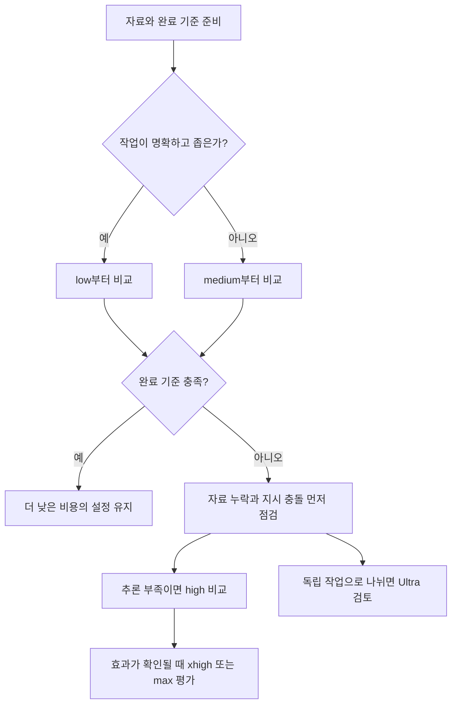

# GPT-6 Astra: effort별 활용과 이전 모델 비교

## 요약

같은 요청에 모델과 추론 강도만 바꾸면 결과가 얼마나 달라질까요? 짧은 문장 수정에는 기다리는 시간이 중요하지만, 여러 자료를 대조하는 보고서나 복잡한 버그 분석에서는 누락된 조건을 찾는 능력이 더 중요합니다. 이 문서는 개발자와 비개발자가 자신의 작업에 맞는 GPT-6 Astra와 effort를 선택하도록 돕습니다.

사용자가 흔히 말하는 “Chat GPT 6.0 Astra”의 공식 모델명은 **GPT-6 Astra**, API 모델 ID는 **`gpt-6-astra`**입니다. ChatGPT는 사용하는 제품이고 Astra는 그 안이나 API에서 선택하는 모델입니다. OpenAI는 Astra를 코드·앱·리서치를 오가는 어려운 전체 작업에 적합한 모델로 설명합니다. 이 문서는 **2026-09-10에 열어 확인한 OpenAI 공식 문서**를 기준으로 합니다.[^astra][^work]

핵심은 모든 작업을 최대 effort로 실행하는 것이 아니라, 필요한 결과를 만드는 가장 낮은 설정을 찾는 것입니다. 높은 effort는 복잡한 작업에 도움이 될 수 있지만 시간과 토큰 사용량이 증가할 수 있습니다. 아래 활용 사례와 평가 절차는 공식 설명을 바탕으로 작성한 **조건부 권고와 가상 예제**이며, 직접 측정한 성능 결과는 아닙니다.[^reasoning][^work]

## 학습 목표

- 모델, 추론 강도, 제품의 실행 방식이 무엇을 바꾸는지 구분합니다.
- `low`·`medium`·`high`·`xhigh`·`max`와 Ultra의 차이를 설명합니다.
- 개발·문서·데이터·리서치 작업에서 effort를 올릴 이유와 올리지 않을 이유를 판단합니다.
- 이전 모델과 비교할 때 지원 기능, 작업 품질, 완료 시간과 비용을 나누어 평가합니다.

## 선수 지식

프로그래밍 지식은 필수가 아닙니다. **모델**은 요청을 해석하고 결과를 생성하는 엔진이며, **토큰**은 모델이 처리하는 텍스트 등의 단위입니다. 토큰 수는 글자 수나 단어 수와 같지 않습니다. **API**는 프로그램에서 모델을 호출하는 인터페이스이고, **도구**는 모델이 검색·파일 처리·코드 실행 같은 외부 작업을 요청하는 수단입니다.

[추론 강도 용어](../../../glossary/ko/reasoning-effort.md)를 먼저 읽으면 설정 이름을 이해하기 쉽습니다. 개발자는 “API에서 설정하기” 예제를, 비개발자는 “보고서 작성 예제”를 중심으로 읽어도 됩니다.

## 101 · 개념 이해

### 모델·effort·실행 환경은 서로 다른 선택입니다

| 선택 | 바뀌는 것 | 예 |
| --- | --- | --- |
| 모델 | 선택한 모델의 능력·처리 특성·요금 | Astra, Sol, Terra, Luna |
| 추론 강도 | 한 작업을 수행할 때 얼마나 생각하도록 유도하는지 | `low`, `high`, `max` |
| 실행 환경 | 사용할 수 있는 파일·앱·도구와 권한 | ChatGPT Work, 데스크톱 앱, Codex CLI, API |
| 작업 분담 방식 | 여러 하위 에이전트로 분리된 일을 병렬 수행할지 | 제품의 Ultra 모드 |

모델을 바꿔도 필요한 자료나 도구 접근이 자동으로 생기지는 않습니다. 공식 모델 가이드의 도구 지원과 실제 사용하는 제품에서 그 도구를 연결할 수 있는지는 구분해서 확인합니다.[^astra][^work]

API의 Astra 지원 effort는 `low`, `medium`, `high`, `xhigh`, `max`입니다. `none`과 `minimal`은 이 모델의 지원 목록에 없으며, `none`은 HTTP 400 오류를 반환한다고 명시돼 있습니다. 여러 모델을 포괄하는 API의 전체 enum을 Astra의 지원 목록으로 읽으면 안 됩니다.[^astra][^reasoning]

ChatGPT 데스크톱 앱·Work·IDE에서는 낮은 강도를 **Light**, CLI에서는 **Low**로 표현합니다. 화면에 나타나는 옵션은 요금제·배포 단계·클라이언트에 따라 다를 수 있습니다. 일반 ChatGPT 대화 화면까지 같은 선택 항목이 제공된다고 확대 해석하지 않습니다. Astra의 서버 기본 effort는 이 문서에서 확인한 모델 페이지에 명시돼 있지 않으므로, 아래 `medium` 출발점은 사용 권고이며 기본값이라는 주장이 아닙니다.[^work][^astra]

### Astra에서 기대할 수 있는 강점

OpenAI의 설명에서 두드러지는 것은 **여러 단계와 도구를 거치는 작업을 이어 가는 능력**입니다. 공식 모델 가이드는 GPT-5.6 Sol 및 이전 모델보다 긴 작업에서 맥락을 일관되게 유지하고, 변경된 요구를 반영하며, 지시를 따르는 능력이 개선됐다고 설명합니다. 동시에 결과를 바꿀 만한 불확실성에는 확인 질문을 더 할 수 있다고 안내합니다.[^guide]

| 사용자와 작업 | 기대할 수 있는 이점 | 사용자가 제공할 조건 |
| --- | --- | --- |
| 개발자: 여러 파일에 걸친 기능 변경 | 구현·도구 사용·검증을 하나의 작업으로 이어 가기 | 관련 코드, 허용 변경 범위, 통과해야 할 검사 |
| 개발자: 재현이 어려운 버그 분석 | 여러 원인 가설과 제약을 함께 검토하기 | 재현 조건, 로그, 기대 동작, 이미 시도한 방법 |
| 비개발자: 자료를 모아 보고서 작성 | 자료 비교부터 초안·수정·결과물 정리까지 이어 가기 | 원본 자료, 독자, 분량, 문서 양식, 인용 기준 |
| 비개발자: 표·발표자료 작업 | 수치 해석과 전달 구조를 함께 다루기 | 데이터 정의, 계산 규칙, 템플릿, 완료 기준 |
| 공통: 여러 대안의 장단점 비교 | 조건과 선택의 근거를 유지하며 판단 보조하기 | 실제 선택지, 우선순위, 예산·일정 등의 제약 |

이 표는 공식적으로 설명된 코딩·컴퓨터 사용·리서치·문서 작업 강점을 실제 요청에 적용한 권고입니다. 특정 버그를 반드시 해결하거나, 인용·계산·디자인이 항상 정확하다는 보장은 아닙니다.[^astra][^guide][^work]

### 능력 향상과 함께 달라지는 사용 습관

공식 가이드는 Astra가 긴 지시를 더 잘 따르는 만큼 `AGENTS.md`나 스킬 파일의 모호하거나 충돌하는 지시에도 민감할 수 있다고 설명합니다. 불필요한 중단이 생기면 effort부터 올리기보다 어떤 지시가 중단을 유발했는지 확인하는 편이 좋습니다.[^guide]

글쓰기에서는 상세한 목록·표·Markdown을 선호할 수 있으므로 원하는 길이와 문체를 지정합니다. 코딩에서는 작은 변경에도 검증을 넓게 수행할 수 있으므로 완료에 필요한 검사 범위를 알려줍니다. 하위 에이전트 분담도 원하는 수준보다 적을 수 있어, 필요한 경우 분담할 작업과 합칠 기준을 명시합니다. 이는 공식 가이드가 안내하는 행동 경향이며, 모든 응답의 고정된 특성은 아닙니다.[^guide]

## 201 · 예제에 적용하기

### effort별로 무엇을 기대할까요?

공식 추론 가이드는 낮은 effort를 속도·토큰 효율에, 높은 effort를 복잡한 계획·분석에 연결합니다. 모델은 같은 effort에서도 작업 난도에 맞춰 사용하는 추론량을 조절합니다. 따라서 effort는 고정된 대기 시간, 답변 길이, 정확도 등급이 아닙니다.[^reasoning]

| API effort | 공식 설명에 따른 기대 | 개발자 적용 예 | 비개발자 적용 예 | 올릴지 판단할 신호 |
| --- | --- | --- | --- | --- |
| `low` | 제한된 추론으로 빠르고 효율적인 실행 | 수정 범위가 명확한 작은 변경, 오류 메시지의 첫 분류 | 제공된 글의 초안·요약, 명확한 항목 추출 | 중요한 조건이나 여러 단계 연결을 반복해서 놓침 |
| `medium` | 계획·판단·품질과 응답 시간 사이의 균형 | 기능 구현, 보통 난도의 코드 검토 | 여러 자료를 반영한 보고서, 표·발표자료 구성 | 대안이나 예외 조건을 더 깊게 검토해야 함 |
| `high` | 어려운 추론·복잡한 디버깅·깊은 계획에 더 많은 노력 | 원인 가설이 여러 개인 장애 분석, 설계 대안 검토 | 상충하는 자료 비교, 여러 제약이 있는 실행 계획 | 긴 작업에서 중요한 상호 의존성이나 반례가 남음 |
| `xhigh` | 긴 연구·비동기 작업·어려운 에이전트 작업 | 까다로운 코드·보안 검토, 복잡한 변경 검토 | 다수 출처를 대조하는 심층 조사 | 평가에서 더 낮은 effort보다 실제 이득이 확인됨 |
| `max` | 가장 복잡한 단일 작업에 최대 추론 노력 | 어려운 원인 분석이나 설계 검증의 상위 설정 비교 | 판단 조건이 얽힌 고난도 조사·종합 | `xhigh` 대비 결과 개선이 추가 시간·사용량을 정당화함 |

공식 가이드는 `xhigh`를 평가에서 명확한 이점이 확인될 때 사용하고, 기존 `xhigh` 사용자에게 `max`가 더 나은 결과를 내는지 평가하도록 권합니다. 위의 구체적인 직무 사례와 승급 신호는 그 지침을 바탕으로 작성한 제안입니다. 보안 검토 예시는 결함이 없다는 인증이나 전문 감사를 뜻하지 않습니다.[^reasoning]

### Max와 Ultra를 구분합니다

**Max**는 선택한 모델이 한 작업을 더 깊게 추론하도록 시간을 더 줍니다. **Ultra**는 하위 에이전트가 분리 가능한 일을 나누어 처리하는 제품 기능입니다. 따라서 `low → medium → high → xhigh → max → ultra`를 하나의 API effort 사다리로 이해하면 안 됩니다. Astra의 API 지원 목록에는 `ultra`가 없습니다.[^work][^astra]

예를 들어 한 오류의 원인을 연속적으로 좁혀야 한다면 `high`나 `max`를 비교할 수 있습니다. 세 개의 독립적인 자료군을 조사한 뒤 종합한다면 Ultra의 작업 분담을 검토할 수 있습니다. 후자는 분담·중복 제거·결과 통합이 필요하므로 모든 작업이 빨라진다고 가정하지 않습니다. 공식 문서도 대부분의 작업에는 Max나 Ultra가 필요하지 않다고 안내합니다.[^work]

다음 도식은 공식 설정 구분을 바탕으로 작성한 선택 절차입니다. 모델 성능이나 속도의 측정 그래프가 아닙니다.



### 개발자 예제: 기능 변경을 끝까지 수행하기

**가정:** 테스트가 있는 기존 저장소에 요청 재시도 정책을 추가합니다. 변경 범위는 이미 합의됐고 실제 코드 실행 권한이 있는 환경입니다. 처음에는 `medium`으로 아래와 같이 요청합니다.

```text
외부 API 호출의 재시도 정책을 구현해 주세요.
목표: 일시적 오류에만 재시도하며 중복 처리 위험을 늘리지 않습니다.
자료: 현재 호출 코드, 오류 로그, 기존 테스트를 먼저 읽어 주세요.
범위: 관련 모듈만 수정하고 공개 함수 시그니처는 유지해 주세요.
완료 기준: 오류 종류별 재시도 여부와 횟수 제한을 테스트로 확인합니다.
보고: 변경 이유, 실행한 검사, 남은 불확실성을 간결하게 적어 주세요.
```

**기대 결과와 해석:** 좋은 결과는 코드 분량보다 재시도 조건·중복 처리 위험·실제 검사 결과를 설명하는지로 판단합니다. 충분한 자료를 제공했는데도 호출 사이의 상호작용이나 예외 조건을 놓치면 같은 조건에서 `high`를 비교합니다. 로그 자체가 없거나 변경 허용 범위가 모호하다면 자료와 요청을 먼저 보완합니다. 이는 설계 연습이며 Astra로 위 기능을 구현·측정한 결과는 아닙니다.

### 비개발자 예제: 근거가 보이는 보고서 만들기

**가정:** 회의록 세 개와 월간 실적표를 바탕으로 의사결정용 보고서를 만듭니다. 자료를 읽을 수 있는 도구와 문서 출력 방식이 제공돼 있습니다. `medium`에서 시작하고, 출처 사이의 충돌을 깊게 분석할 때 `high`를 비교합니다.

```text
첨부한 회의록과 실적표로 의사결정 보고서 초안을 작성해 주세요.
독자: 실무 배경을 모르는 부서 책임자.
구성: 핵심 결론, 근거, 선택지, 미확정 사항. 본문은 2쪽 이내입니다.
자료에 없는 수치나 원인을 만들지 말고, 중요한 주장에 출처를 붙여 주세요.
수치가 충돌하면 각각의 기간·단위·정의를 먼저 비교해 주세요.
먼저 검토 가능한 초안을 만들고, 결론을 바꿀 질문만 따로 정리해 주세요.
```

**기대 결과와 해석:** 보고서가 길고 그럴듯한지보다 수치의 기간·단위를 맞췄는지, 사실과 해석을 구분했는지, 결론의 근거를 찾을 수 있는지를 봅니다. 세 자료를 서로 독립적으로 분석할 수 있다면 Ultra를 검토할 수 있지만, 공통 정의와 최종 종합 책임을 정해야 합니다. 이 역시 가상 예제이며 실제 보고서 품질 평가가 아닙니다.

### API에서 설정하기

다음은 Responses API 요청 본문의 개념 예제입니다. 외부 도구를 연결하지 않은 텍스트 요청이며 실제 API 호출은 수행하지 않았습니다. API 키를 문서나 저장소에 기록하지 않습니다.[^guide]

```json
{
  "model": "gpt-6-astra",
  "reasoning": { "effort": "medium" },
  "input": "다음 설계안의 전제, 대안, 검증이 필요한 부분을 구분해 주세요: ..."
}
```

이전 코드에서 옮긴다면 모델 ID만 바꾸지 않습니다. Astra의 도구 호출은 Responses API를 사용해야 하며, Chat Completions에서 도구 호출은 지원하지 않습니다. `temperature`, `top_p`, `top_logprobs` 같은 미지원 파라미터도 제거해야 합니다. Chat Completions의 `logprobs`와 Responses의 `include` 안 `message.output_text.logprobs`도 이전 가이드에서 제거 대상으로 안내합니다.[^guide]

추가로 Astra는 표준 단일 에이전트 모드에서 대화 중 `configuration_update`로 effort를 바꾸면서 캐시용 초기 프롬프트를 유지할 수 있습니다. 자동 compaction·자동 truncation과의 조합에는 제한이 있으므로, 이 기능을 도입할 때는 상세 공식 문서를 확인합니다. 단순 예제에는 이 기능을 섞지 않았습니다.[^reasoning]

## 301 · 조건에 따라 판단하기

### 이전 모델과 무엇이 달라졌나요?

아래는 공식 문서의 위치 설명과 지원 범위를 요약한 비교입니다. 별·아이콘 개수를 성능 점수로 환산하거나, 서로 다른 평가의 점수를 섞어 순위를 만든 표가 아닙니다.[^work][^guide][^sol][^gpt55]

| 모델 | 공식적으로 설명하는 강점·위치 | Astra와 비교해 선택할 때 |
| --- | --- | --- |
| GPT-6 Astra | 코드·앱·리서치를 아우르는 가장 어려운 전체 작업, 지속적인 추론과 판단 | 여러 단계의 맥락 유지와 요구 변경 반영이 중요할 때 우선 평가 |
| GPT-5.6 Sol | 복잡하고 열린 문제, 분석·판단·결과물 완성도가 중요한 작업 | 기존 결과가 충분히 좋다면 Astra의 실제 추가 이득을 비교 |
| GPT-5.6 Terra | 일상 작업의 균형형 모델, GPT-5.5와 경쟁적인 성능을 더 낮은 비용으로 제공한다는 설명 | 반복되는 일반 업무의 출발점으로 고려 |
| GPT-5.6 Luna | 빠르고 비용 효율적인 명확한 반복 작업 | 추출·분류·변환·정형 요약처럼 정답 기준이 분명한 작업에 고려 |
| GPT-5.5 | 복잡한 코딩·컴퓨터 사용·지식 작업·리서치를 위한 이전 세대 모델 | 보유한 평가 결과를 기준선으로 삼아 동일 작업을 비교 |

**Astra에서 새롭게 안내하는 기능**에는 도구가 실행되는 동안 다른 독립 작업을 이어 가는 비동기 도구 호출, 실행 중 추가 지시를 반영하는 mid-turn steering, 캐시를 보존하면서 대화 중 effort를 바꾸는 기능이 있습니다. 비동기 도구 실행과 대기 결과 관리는 애플리케이션의 책임이며, mid-turn steering의 API 경로는 WebSocket을 사용합니다. 이름만 모델 요청에 넣으면 앱에 자동으로 구현되는 기능은 아닙니다.[^guide]

반면 컴퓨터 사용·Structured Outputs·스트리밍·다중 에이전트 구성·compaction 등은 GPT-5.6에서도 제공하던 기능입니다. 이 기능들의 존재 자체를 Astra만의 신기능으로 소개하지 않습니다.[^guide]

| API 모델 특성 | GPT-5.5 | GPT-5.6 Sol | GPT-6 Astra |
| --- | --- | --- | --- |
| 컨텍스트 창 | 1,050,000 토큰 | 1,050,000 토큰 | 1,050,000 토큰 |
| 최대 출력 | 128,000 토큰 | 128,000 토큰 | 128,000 토큰 |
| 문서에 표시된 지식 기준일 | 2025-12-01 | 2026-02-16 | 2026-04-30 |
| 지원 effort | `none`, `low`, `medium`, `high`, `xhigh` | `none`, `low`, `medium`, `high`, `xhigh`, `max` | `low`, `medium`, `high`, `xhigh`, `max` |

위 수치는 API 모델 페이지 기준입니다. **컨텍스트 창이 더 커졌다는 것이 Astra와 이 두 모델의 차이는 아닙니다.** Astra와 Sol 페이지의 최대 입력은 각각 922,000 토큰으로 표시됩니다. 컨텍스트 창을 전부 사용자 입력에 쓸 수 있다는 뜻이 아니며, 추론 토큰도 컨텍스트를 차지합니다. 제품 화면의 실제 사용 가능량은 별도 확인이 필요합니다.[^astra][^sol][^gpt55][^reasoning]

Astra는 텍스트·이미지 입력과 텍스트 출력을 지원합니다. 이미지 생성 도구 지원을 모델의 직접 이미지 출력과 혼동하지 않습니다. 지식 기준일은 실시간 정보의 정확성을 보장하지 않으므로 최신 사실은 검색·원문 확인으로 보완합니다.[^astra]

### 더 높은 모델·effort가 항상 유리하지는 않습니다

추론 토큰은 API에서 그대로 보이지 않아도 출력 토큰으로 과금됩니다. 따라서 최종 답변이 짧아도 사용량이 작다고 단정할 수 없습니다. OpenAI는 Astra가 일부 평가에서 더 적은 출력 토큰으로 더 좋은 결과를 내어 작업당 추정 비용을 낮췄다고 설명하지만, 이것을 모든 사용자 작업의 비용 절감 보장으로 읽지 않습니다.[^reasoning][^guide]

비용을 비교할 때는 토큰 단가뿐 아니라 재시도, 도구 사용, 완료 시간과 사용자가 다시 수정하는 시간을 함께 봅니다. API의 USD 요금과 ChatGPT 제품의 사용량·크레딧도 같은 단위로 취급하지 않습니다. 정해진 횟수만큼 요약하는 업무라면 Luna·Terra가 충분할 수 있고, 오래 걸리는 복합 작업이라면 Astra의 완료 품질이 더 중요할 수 있습니다.[^work]

또한 `GPT-5.5 high = Astra medium` 같은 등식을 만들 근거는 없습니다. 공식 제품 문서는 GPT-5.5와 GPT-5.6 사이에도 정확한 effort 대응이 없다고 설명합니다. Astra 이전 가이드는 기존 `none`·`minimal`은 `low`에서 비교하고, 그 외에는 현재 사용하던 유효 effort를 유지하는 것부터 시작하라고 안내합니다.[^work][^guide]

### 자신의 작업으로 비교하는 방법

다음은 평가를 위한 제안이며 공식 벤치마크나 측정값은 아닙니다.

1. 자주 하는 작업을 고릅니다. 개발자는 작은 수정·복잡한 버그·설계 검토, 비개발자는 요약·보고서·자료 간 충돌 분석처럼 난도가 다른 작업을 포함합니다.
2. 같은 자료·프롬프트·도구 권한·완료 기준을 사용하고 실제 모델 ID와 effort를 기록합니다. 제품이 제공하는 모델과 옵션을 먼저 확인합니다.
3. 반복 평가하면서 요구사항 충족, 사실·인용 오류, 재작업 횟수, 전체 완료 시간, 실제 사용량을 기록합니다. 답변 길이를 품질 점수로 사용하지 않습니다.
4. 기준을 충족하는 가장 낮은 설정을 선택합니다. 자료 부족·도구 실패·모호한 지시는 설정 문제와 분리합니다.
5. 중요한 작업만 상위 effort나 Astra로 올리고, 전환 후에도 실제 결과를 검토합니다.

| 기록 항목 | 개발 작업의 확인 기준 | 비개발 작업의 확인 기준 |
| --- | --- | --- |
| 요구사항 충족 | 요청한 동작과 호환성 조건 충족 | 독자·구성·분량·핵심 질문 충족 |
| 정확성 | 재현·관련 테스트·경계 조건 | 원문 대조·계산·출처 연결 |
| 완료 효율 | 추가 수정과 불필요한 검사 부담 | 재작성과 추가 자료 정리 부담 |
| 시간·사용량 | 전체 실행 시간과 실제 사용 기록 | 결과 검토까지 포함한 시간과 사용 기록 |

## 이해 확인

**질문 1:** 간단한 제목 수정을 `max`로 실행하면 항상 더 좋은 결과가 나오나요?

**해설:** 공식 문서는 이를 보장하지 않습니다. 명확하고 짧은 작업은 낮은 설정으로 기준을 충족하는지 먼저 확인합니다. 큰 effort는 추가 시간·사용량을 정당화하는 개선이 있을 때 선택합니다.

**질문 2:** Ultra를 사용하려고 API에 `"effort": "ultra"`를 넣으면 되나요?

**해설:** 아닙니다. Astra API의 effort 목록은 `max`까지이며, 공식 제품 문서의 Ultra는 하위 에이전트 병렬 분담 방식입니다. 사용하는 제품이나 애플리케이션의 지원을 확인해야 합니다.

**질문 3:** Astra가 더 긴 컨텍스트를 제공하므로 Sol에서 옮기는 것인가요?

**해설:** 이 문서에서 비교한 Astra·Sol·GPT-5.5의 API 컨텍스트 창은 모두 같습니다. 전환 이유는 자신의 작업에서 맥락 유지·도구 활용·판단·완료 품질이 실제로 개선되는지에 두는 것이 맞습니다.

## 근거와 한계

모델 지원 목록·기능 변화·제품 설정 설명은 아래 공식 페이지를 직접 읽고 대조했습니다. “더 강하다”는 비교는 OpenAI의 설명이며 독립 재현 결과가 아닙니다. 계정별 접근 가능 여부, effort별 정확도·소요 시간·사용량, 실제 API 예제 실행은 확인하지 않았습니다. 공개되지 않은 배수·점수·effort별 고정 토큰 예산은 추정하지 않습니다.

표와 도식은 공식 문서의 구분을 이해하기 위해 재구성한 설명입니다. 공식 평가 이미지로 오해할 수 있는 생성형 벤치마크 그림은 사용하지 않았습니다. 모델·제품 설정 변화가 잦으므로 30일 뒤 또는 공식 문서 변경 시 먼저 재검토합니다.

## 관련 지식

[추론 강도](../../../glossary/ko/reasoning-effort.md) · [AI Engineering](index.md) · [변경 감지와 지식 검증](../testing/verification-vs-change-detection.md) · [English](../../en/ai-engineering/gpt-6-astra.md)

## 출처

[^astra]: [OpenAI — GPT-6 Astra 모델](https://developers.openai.com/api/docs/models/gpt-6-astra)
[^guide]: [OpenAI — Using GPT-6 Astra](https://developers.openai.com/api/docs/guides/latest-model?model=gpt-6-astra)
[^reasoning]: [OpenAI — Reasoning models](https://developers.openai.com/api/docs/guides/reasoning)
[^work]: [OpenAI — Models: ChatGPT Work·앱·Codex](https://learn.chatgpt.com/docs/models)
[^sol]: [OpenAI — GPT-5.6 Sol 모델](https://developers.openai.com/api/docs/models/gpt-5.6-sol)
[^gpt55]: [OpenAI — GPT-5.5 모델](https://developers.openai.com/api/docs/models/gpt-5.5)
