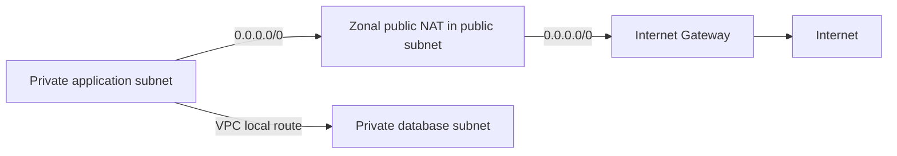

# Public / Private Subnet: 라우팅으로 구분하기

## 요약

서브넷(subnet)은 VPC 안에서 나눈 IP 주소 범위입니다. Public과 Private의 구분은 이름이 아니라 인터넷 게이트웨이로 직접 향하는 경로의 유무로 결정됩니다. 이 차이를 알면 인터넷에 공개할 계층과 내부에 둘 계층의 통신을 설명할 수 있습니다.[^subnets]

## 학습 목표

Public·Private Subnet을 경로로 구분하고, IPv4 예제에서 인터넷 방향과 VPC 내부 방향을 추적합니다.

## 선수 지식

[VPC](aws-vpc.md)와 [CIDR](../../../glossary/ko/cidr.md)을 먼저 읽습니다. 라우팅은 목적지에 따라 통신을 보낼 경로를 고르는 것이며, egress는 외부로 나가는 통신을 뜻합니다.

## 101 · 개념 이해

### 외부 사실

Public Subnet은 Internet Gateway로 직접 가는 경로가 있고, Private Subnet은 그 직접 경로가 없습니다.[^subnets]

직접 IPv4 인터넷 통신에는 경로 외에도 리소스의 공인 IPv4/EIP와 허용된 통신 설정이 필요합니다. 이름이나 공인 IP 하나로 판단하지 않습니다.[^igw]

Private Subnet의 인터넷 egress는 NAT 등의 경로로 설계합니다. IPv6의 경로와 egress-only Internet Gateway는 IPv4 NAT 구성과 구분합니다.[^nat]

## 201 · 예제에 적용하기

### 설계 예시

IPv4 애플리케이션이 외부 API와 내부 DB에 접근하는 상황입니다. Public Subnet의 기본 경로는 0.0.0.0/0 → IGW이고, Private 애플리케이션의 기본 경로는 0.0.0.0/0 → NAT라고 가정합니다. VPC 내부 DB로 가는 통신은 별도의 local 경로를 사용합니다.

아래 그림에서 외부 API 방향과 내부 DB 방향을 각각 따라가 봅니다. 더 구체적인 경로가 있다면 그 우선순위도 확인해야 합니다. 실제 통신에는 보안 그룹·네트워크 ACL의 허용과 서비스 설정도 필요합니다. 그림은 IPv4와 Zonal Public NAT의 개념 예시이며 AZ 이중화·SG/NACL·권한을 생략했습니다.

## 301 · 조건에 따라 판단하기

### 선택 기준과 권고

- 인터넷 진입점·애플리케이션·DB의 역할을 먼저 나누고 필요한 egress만 정의합니다.

- Private이 곧 인터넷 단절이라는 뜻은 아닙니다. 반대로 IGW 경로만으로 모든 인스턴스가 공개되는 것도 아닙니다.

- 장애 영역 분리를 위해 AZ별로 필요한 계층의 Subnet을 검토합니다.

### 운영 확인

- [ ] 실제 연결된 Route Table과 IPv4/IPv6 default route를 확인했나요?
- [ ] 이미지·패키지·외부 API 접근이 필요한 자원을 구분했나요?
- [ ] DB가 불필요한 공인 접근 경로를 갖지 않나요?

## 이해 확인

**질문:** Private Subnet에 있는 애플리케이션은 외부 API를 사용할 수 없을까요?

**해설:** 직접 IGW 경로가 없다는 뜻입니다. 예제처럼 NAT를 통한 경로와 필요한 허용 설정이 있다면 외부 연결을 설계할 수 있습니다. IPv6는 별도로 검토합니다.

## 근거와 한계

예제는 개념 설명과 설계 연습이며 AWS에서 실행한 결과가 아닙니다. 권고를 적용할 때는 대상 리전·엔진·실행 모드의 지원 범위, 할당량과 가격을 확인합니다. 출처 대조 범위와 번역 검토는 [문서 변경 이력](../../../log.md)에 기록합니다.

## 관련 지식

- [Amazon VPC: 주소 공간과 연결 경계](aws-vpc.md)
- [Route Table: 목적지와 다음 경로](aws-route-table.md)
- [NAT Gateway: egress와 가용성 모드](aws-nat-gateway.md)
- [Internet Gateway: VPC 인터넷 연결의 경로 대상](aws-internet-gateway.md)

[English](../../en/cloud/aws-subnets.md)

## 출처

[^subnets]: [Subnets for your VPC](https://docs.aws.amazon.com/vpc/latest/userguide/configure-subnets.html)
[^igw]: [Connect to the internet using an internet gateway](https://docs.aws.amazon.com/vpc/latest/userguide/VPC_Internet_Gateway.html)
[^nat]: [NAT gateways](https://docs.aws.amazon.com/vpc/latest/userguide/vpc-nat-gateway.html)
