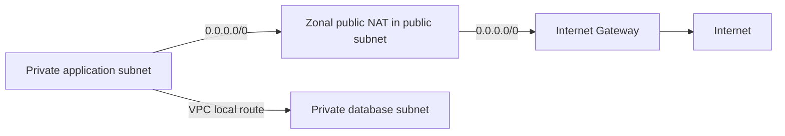

# Public / Private Subnet: 라우팅으로 구분하기

## 요약

Subnet 이름 대신 Internet Gateway로 향하는 직접 경로를 확인한다.

## 외부 사실

- Public Subnet은 Internet Gateway로 직접 가는 경로가 있고, Private Subnet은 그 직접 경로가 없다.[^subnets]

- 직접 IPv4 인터넷 통신에는 경로 외에도 리소스의 공인 IPv4/EIP와 허용된 통신 설정이 필요하다. 이름이나 공인 IP 하나로 판단하지 않는다.[^igw]

- Private Subnet의 인터넷 egress는 NAT 등의 경로로 설계한다. IPv6의 경로와 egress-only Internet Gateway는 IPv4 NAT 구성과 구분한다.[^nat]

## 선택 기준과 권고

- 인터넷 진입점·애플리케이션·DB의 역할을 먼저 나누고 필요한 egress만 정의한다.

- Private이 곧 인터넷 단절이라는 뜻은 아니다. 반대로 IGW 경로만으로 모든 인스턴스가 공개되는 것도 아니다.

- 장애 영역 분리를 위해 AZ별로 필요한 계층의 Subnet을 검토한다.

## 설계 예시

IPv4 예: Public의 0.0.0.0/0 → IGW, Private 애플리케이션의 0.0.0.0/0 → NAT. VPC 내부 통신은 별도 local 경로를 사용한다. 이는 개념 예시이며 실제 허용 규칙까지 검증해야 한다.

다음은 IPv4와 Zonal Public NAT의 경로 예시다. AZ 이중화·SG/NACL·권한은 생략했으며 실제 배포 구성도가 아니다.

## 운영 확인

- [ ] 실제 연결된 Route Table과 IPv4/IPv6 default route를 확인했는가?
- [ ] 이미지·패키지·외부 API 접근이 필요한 자원을 구분했는가?
- [ ] DB가 불필요한 공인 접근 경로를 갖지 않는가?

## 근거와 한계

2026-09-08에 아래 공식 출처와 기술적 주장을 Agent가 대조했다. 권고는 적용 조건을 따져야 하는 설계 판단이며, 예시는 AWS 실행·개인 실험 결과가 아니다. 실제 적용 전 대상 리전·엔진·실행 모드의 지원 범위와 필요한 할당량·가격을 다시 확인한다.

## 관련 지식

- [Amazon VPC: 주소 공간과 연결 경계](aws-vpc.md)
- [Route Table: 목적지와 다음 경로](aws-route-table.md)
- [NAT Gateway: egress와 가용성 모드](aws-nat-gateway.md)
- [Internet Gateway: VPC 인터넷 연결의 경로 대상](aws-internet-gateway.md)

[English](../../en/cloud/aws-subnets.md)

## 출처

[^subnets]: [Subnets for your VPC](https://docs.aws.amazon.com/vpc/latest/userguide/configure-subnets.html)
[^igw]: [Connect to the internet using an internet gateway](https://docs.aws.amazon.com/vpc/latest/userguide/VPC_Internet_Gateway.html)
[^nat]: [NAT gateways](https://docs.aws.amazon.com/vpc/latest/userguide/vpc-nat-gateway.html)
