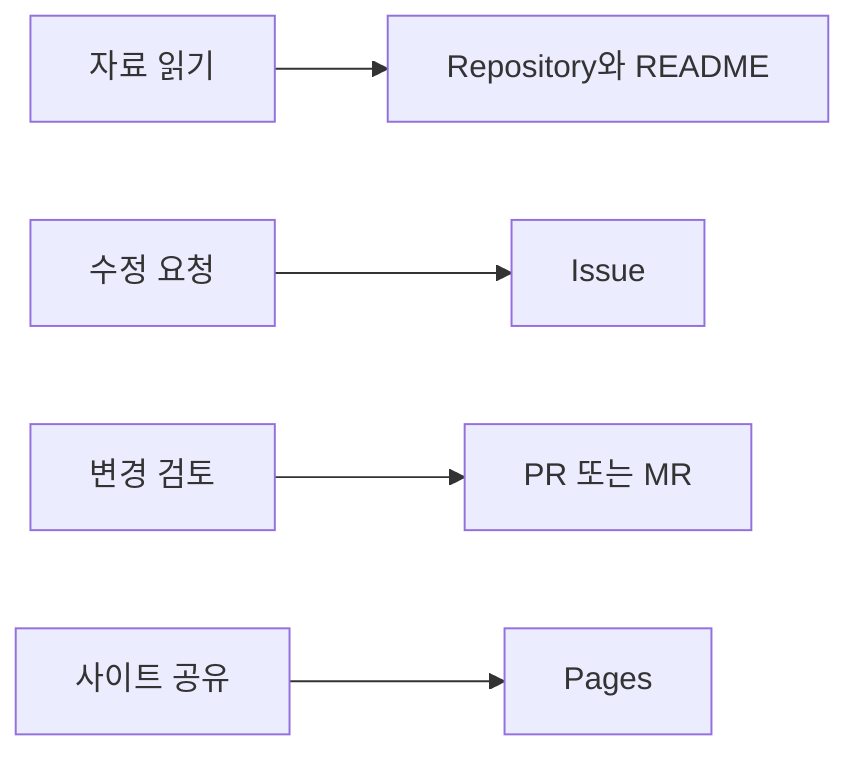

# GitHub·GitLab 종합: 무엇을 어디에서 하면 될까요?

## 요약

GitHub와 GitLab은 **파일과 변경 이력, 할 일, 수정 검토를 연결하는 플랫폼**입니다. 개발자는 코드와 기술 문서를, 비개발자는 요구사항·안내문·검토 의견을 중심으로 참여할 수 있습니다. 처음에는 기능의 개수보다 “지금 하려는 일이 자료 읽기인지, 요청인지, 변경 검토인지, 사이트 공유인지”를 구분하는 것이 도움이 됩니다.[^github][^repository][^issues][^mr]

이 문서는 두 서비스의 공통 흐름과 다른 이름을 비교합니다. 화면별 첫 사용은 [GitHub 입문](github-fundamentals.md)과 [GitLab 입문](gitlab-fundamentals.md)에서 각각 읽습니다.

## 학습 목표

- Git과 GitHub·GitLab의 관계를 설명합니다.
- Repository·Issue·PR/MR·Pages를 실제 할 일에 연결합니다.
- GitHub Projects와 GitLab Project를 혼동하지 않습니다.
- 요청 작성자·수정자·검토자가 함께 완료를 판단합니다.

## 선수 지식

파일·폴더·웹 링크를 사용해 본 경험이면 충분합니다. [Git](../../../glossary/ko/git.md)은 파일의 변경 이력을 관리하는 도구입니다. GitHub와 GitLab은 Git 저장소를 바탕으로 협업 기능을 제공합니다. Git을 사용한다고 두 서비스 중 하나에 반드시 가입해야 하는 것은 아닙니다.[^github][^repository]

## 101 · 개념 이해

### 같은 일을 서로 다른 이름으로 만납니다

| 하려는 일 | GitHub | GitLab | 처음 기억할 것 |
| --- | --- | --- | --- |
| 파일과 변경 이력 관리 | Repository | Project 안의 Repository | 원본 자료와 이력이 있습니다. |
| 프로젝트의 목적 읽기 | README | README | 어디부터 볼지 알려 주는 안내문입니다. |
| 문제·요청·할 일 기록 | Issue | Issue | 해야 할 일과 완료 기준을 적습니다. |
| 파일 수정안 검토 | Pull Request, PR | Merge Request, MR | 변경 전후의 차이를 확인합니다. |
| 여러 요청을 모아 보기 | Projects | Issue board | 항목을 표나 카드로 정리합니다. |
| 여러 페이지로 지식 정리 | Wiki | Wiki | 사용법이나 운영 안내를 모읍니다. |
| 방문자용 사이트 게시 | GitHub Pages | GitLab Pages | 게시된 웹 주소로 결과를 보여 줍니다. |

기능 명칭의 비교이며, 세부 권한·화면·요금제까지 동일하다는 뜻은 아닙니다. GitHub의 Projects는 작업 관리 기능이고, GitLab의 Project는 저장소 등을 포함한 작업 단위입니다. **GitLab Project를 GitHub Projects 보드와 일대일로 대응시키지 않습니다.**[^gh-projects][^repository][^boards]

GitHub·GitLab의 Issue와 PR/MR은 연결할 수 있지만 역할이 다릅니다. Issue는 “무엇을 왜 해야 하는가”, PR/MR은 “실제로 무엇을 바꿨으며 합쳐도 되는가”를 확인하는 데 사용합니다.[^gh-issues][^issues][^mr]



그림 1. 사용 목적에 따라 첫 진입점을 고르는 설명용 그림입니다. 모든 일에서 네 기능을 전부 거칠 필요는 없습니다.

### Pages와 일반 문서 화면을 구분합니다

Pages는 두 플랫폼 모두 정적 사이트를 게시하는 기능입니다. GitHub·GitLab에서 `README.md`를 읽는 화면과, Pages 주소에서 안내 사이트를 읽는 화면은 다릅니다. 저장소 파일을 저장하거나 Issue를 닫는 것만으로 사이트 게시가 완료되지는 않습니다.[^gh-pages][^gl-pages]

예를 들어 참가자가 읽는 모집 안내는 Pages, 운영자가 남기는 운영 지식은 Wiki나 저장소 문서, “신청 마감일을 고쳐 주세요”라는 요청은 Issue에 적을 수 있습니다. 이는 문서의 독자와 목적에 따른 활용 제안입니다.[^gh-wiki][^gl-wiki]

## 201 · 예제에 적용하기

### 같은 동아리 안내를 두 서비스에 대입합니다

**가정:** 가상의 동아리 안내에 모임 시간이 빠져 있습니다. 확정된 시간은 매주 토요일 오후 2시이며, 요청자·수정자·검토자가 역할을 나눕니다. 한 사람이 세 역할을 연습해도 됩니다. 아래는 설계 예제이며 실제 프로젝트 생성이나 처리 결과가 아닙니다.

| 순서와 담당 | 남기는 내용 | GitHub에서 | GitLab에서 |
| --- | --- | --- | --- |
| 요청자가 문제 설명 | 빠진 위치, 확정된 시간, 완료 기준 | Issue | Issue |
| 수정자가 변경 기록 | README에 시간 추가와 변경 이유 | 작업 브랜치의 commit | 작업 브랜치의 commit |
| 검토자가 확인 | 토요일·오후 2시가 맞는지, 다른 안내가 보존됐는지 | PR의 diff | MR의 diff |
| 권한 있는 사람이 반영 | 검토된 변경을 기본 브랜치에 합침 | merge | merge |
| 요청자가 완료 확인 | 기본 브랜치에서 시간을 읽고 결과 링크 기록 | Issue 정리 | Issue 정리 |

브랜치·커밋·병합의 화면별 절차는 각 서비스 입문 문서에 있습니다. 이 연습에서 **완료 기준은 README 반영**입니다. 방문자용 사이트까지 고치는 요청이라면 Pages의 실제 표시 확인을 완료 기준에 추가합니다.

검토 의견은 다음처럼 구체적으로 적습니다.

```text
요일은 토요일로 맞습니다.
시간은 오전 2시가 아니라 오후 2시여야 합니다.
이 부분을 고친 뒤 기본 브랜치에 반영된 README를 확인하겠습니다.
사이트 게시까지 요청한 작업이면 Pages 주소에서도 같은 안내를 확인하겠습니다.
```

**기대 결과와 해석:** 요청, 수정 근거, 검토 결과를 서로 연결해 찾을 수 있습니다. “저장함 → 검토를 요청함 → 병합함 → 게시함”은 서로 다른 상태입니다. 필요한 단계까지 확인해야 작업을 완료했다고 말할 수 있습니다.

## 301 · 조건에 따라 판단하기

### 처음에는 함께 일하는 곳에서 시작합니다

| 상황 | 권장 시작점 | 이유 |
| --- | --- | --- |
| 팀이 이미 한 서비스를 사용합니다. | 그 팀의 README와 Issue | 자료와 담당자가 있는 곳에서 배우는 편이 수월합니다. |
| 특정 공개 프로젝트에 참여하고 싶습니다. | 그 프로젝트가 있는 서비스 | 기존 참여 안내와 검토 규칙을 따를 수 있습니다. |
| 혼자 처음 연습합니다. | 둘 중 하나의 README 수정 예제 | 두 계정을 동시에 운영할 필요 없이 공통 흐름을 배웁니다. |
| 개발자가 아닙니다. | 읽기 → Issue → 문구 diff 검토 | 명령어 없이도 요구와 결과의 정확성에 기여할 수 있습니다. |
| 안내 사이트만 필요합니다. | Pages의 게시·접근 조건 확인 | 파일 저장과 웹 공개의 준비가 다르기 때문입니다. |

이 표는 입문 학습을 위한 판단 기준입니다. 조직용 서비스 선택은 기존 계정·접근 정책·운영 환경·비용 조건까지 따로 검토해야 하며, 여기서는 어느 서비스가 보편적으로 우월하다고 평가하지 않습니다.

### 처음 자주 생기는 혼동을 정리합니다

- **Issue는 오류 전용인가요?** 개선 요청과 할 일에도 사용합니다.[^gh-issues][^issues]
- **MR/PR은 개발자만 보는 화면인가요?** 문구·번역·요구사항 변경도 차이를 읽고 검토할 수 있습니다. 접근 권한은 필요합니다.
- **Pages는 저장소의 모든 것을 자동 공개하나요?** 설정된 게시 자료가 사이트가 됩니다. 원본 접근 권한과 사이트 접근 권한을 각각 확인합니다.[^gh-create-pages][^gl-access]
- **Actions나 CI/CD를 먼저 배워야 하나요?** 파일 읽기·Issue 작성·문구 검토부터 시작할 수 있습니다. Pages를 직접 게시할 때는 게시 설정과 자동 실행 과정이 연결되며, 그 세부 구성은 다음 단계입니다.[^gh-create-pages][^gl-pages]

## 이해 확인

1. **기획자가 “안내 시간이 틀렸다”고 알릴 곳은 어디일까요?** 해당 파일 위치와 올바른 시간을 적은 Issue가 시작점입니다. 이미 수정안이 있다면 PR/MR에 검토 의견을 남길 수 있습니다.
2. **“GitLab 프로젝트를 만들었다”와 “GitHub Projects를 만들었다”는 같은 결과일까요?** 전자는 저장소를 포함하는 작업 단위를, 후자는 작업 관리 화면을 만드는 의미입니다.
3. **PR/MR이 병합되면 독자용 사이트도 반드시 바뀔까요?** 게시 연결과 배포 결과를 별도로 확인해야 합니다. 요청의 완료 기준이 사이트 반영이라면 실제 주소까지 확인합니다.

## 근거와 한계

기능 설명은 GitHub·GitLab 공식 문서에 근거하고, 역할 분담과 시작 순서는 입문자를 위한 제안입니다. 예제는 가상입니다. Git 명령어 상세, GitHub Actions, GitLab CI/CD, 계정 요금 비교와 조직 이전 절차는 이 문서의 범위에 포함하지 않습니다.

## 관련 지식

- [GitHub 입문](github-fundamentals.md)
- [GitLab 입문](gitlab-fundamentals.md)
- [Git 용어](../../../glossary/ko/git.md)
- [Delivery 목차](index.md)

## 출처

[^github]: [GitHub — What is GitHub?](https://docs.github.com/en/get-started/start-your-journey/what-is-github)
[^gh-issues]: [GitHub — About issues](https://docs.github.com/en/issues/tracking-your-work-with-issues/learning-about-issues/about-issues)
[^gh-projects]: [GitHub — About Projects](https://docs.github.com/en/issues/planning-and-tracking-with-projects/learning-about-projects/about-projects)
[^gh-wiki]: [GitHub — About wikis](https://docs.github.com/en/communities/documenting-your-project-with-wikis/about-wikis)
[^gh-pages]: [GitHub — What is GitHub Pages?](https://docs.github.com/en/pages/getting-started-with-github-pages/what-is-github-pages)
[^gh-create-pages]: [GitHub — Creating a GitHub Pages site](https://docs.github.com/en/pages/getting-started-with-github-pages/creating-a-github-pages-site)
[^repository]: [GitLab — Repository](https://docs.gitlab.com/user/project/repository/)
[^issues]: [GitLab — Issues](https://docs.gitlab.com/user/project/issues/)
[^mr]: [GitLab — Merge requests](https://docs.gitlab.com/user/project/merge_requests/)
[^boards]: [GitLab — Issue boards](https://docs.gitlab.com/user/project/issue_board/)
[^gl-wiki]: [GitLab — Wiki](https://docs.gitlab.com/user/project/wiki/)
[^gl-pages]: [GitLab — GitLab Pages](https://docs.gitlab.com/user/project/pages/)
[^gl-access]: [GitLab — GitLab Pages access control](https://docs.gitlab.com/user/project/pages/pages_access_control/)
