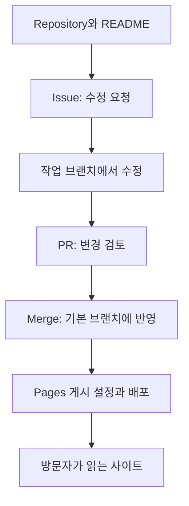

# GitHub 입문: 저장소·Issue·Pages로 협업 시작하기

## 요약

동아리 안내문을 여러 사람이 수정하다 보니 `안내_최종`, `안내_진짜최종` 중 무엇을 읽어야 할지 헷갈린다고 가정합니다. GitHub에서는 파일과 변경 이력을 저장하고, 고칠 내용을 기록하며, 수정안을 함께 검토할 수 있습니다. 개발 코드뿐 아니라 안내문·학습 노트·프로젝트 문서에도 이 흐름을 적용할 수 있습니다.[^overview]

처음에는 **Repository → Issue → Pull Request → Pages**의 역할부터 익힙니다. Pages는 필요한 경우에 사용하는 웹사이트 게시 기능입니다. 모든 저장소가 웹사이트를 만들 필요는 없습니다.

## 학습 목표

- 저장소의 파일과 README에서 프로젝트의 목적을 파악합니다.
- Issue에 요청을 기록하고 Pull Request에서 실제 수정 내용을 확인합니다.
- README·Wiki·Pages에 무엇을 담을지 구분합니다.
- 브라우저에서 안내문 한 줄을 바꾸는 흐름을 설명합니다.

## 선수 지식

파일과 폴더를 열어 본 경험이면 충분합니다. [Git](../../../glossary/ko/git.md)은 파일의 변경 이력을 관리하는 도구이고, GitHub는 Git 저장소와 협업 기능을 제공하는 플랫폼입니다. **Markdown**은 `# 제목`처럼 간단한 기호로 문서를 작성하는 방식이며 `.md` 파일에 사용합니다. 아래 예제에는 계정이 필요하지만 터미널 명령이나 Git 설치는 필요하지 않습니다.[^hello]

## 101 · 개념 이해

### 저장소를 공동 작업 공간으로 읽습니다

**저장소**(repository, 줄여서 repo)는 프로젝트 파일과 그 변경 이력을 관리합니다. GitHub의 저장소 화면에는 파일 외에도 Issue나 Pull Request 같은 협업 기능이 연결됩니다. **README**는 “무엇을 하는 프로젝트인지, 어디부터 읽으면 되는지”를 알려 주는 첫 안내문입니다.[^overview][^wiki]

| 화면에서 만나는 것 | 쉬운 설명 | 동아리 안내문 예시 |
| --- | --- | --- |
| 파일 목록 / Code | 원본 자료를 찾아 읽는 곳 | `README.md`, 안내 이미지 |
| README | 프로젝트의 첫 안내문 | 모임 목적, 일정, 참여 방법 |
| Issue | 해야 할 일과 논의를 기록하는 항목 | “토요일 모임 시간을 적어 주세요” |
| Pull Request / PR | 실제 파일 변경을 보여 주고 반영을 제안하는 곳 | 안내문에 시간을 추가한 수정안 |
| Pages | 저장소의 웹 자료를 사이트로 게시하는 기능 | 참가자에게 공유하는 안내 사이트 |

Issue는 버그 신고 외에도 질문·개선 요청·일정 정리에 사용할 수 있습니다. **담당자**(assignee)는 누가 진행할지, **라벨**(label)은 어떤 종류의 일인지 표시합니다. PR에서는 변경 전후의 차이인 **diff**와 의견을 함께 확인합니다.[^issues][^hello]



그림 1. 동아리 안내문을 위한 설명용 흐름입니다. Pages 연결과 배포가 준비돼 있을 때 마지막 두 단계를 진행합니다.

### Commit·Branch·Merge는 세 가지 동작으로 이해합니다

**커밋**(commit)은 무엇을 바꿨는지 설명과 함께 남기는 변경 기록입니다. **브랜치**(branch)는 기준 파일을 바로 바꾸지 않고 작업하는 별도의 흐름입니다. **병합**(merge)은 검토한 변경을 대상 브랜치에 합치는 일입니다. PR을 열었다는 사실만으로 병합이 끝난 것은 아닙니다.[^hello]

### README·Wiki·Pages는 읽는 상황이 다릅니다

README는 입구 안내, **Wiki**는 여러 페이지로 정리한 사용법이나 지식 문서, **Pages**는 별도 주소로 방문하는 웹사이트에 어울립니다. Wiki는 플랫폼 안에서 문서를 공동 편집하고, Pages는 사이트로 만든 결과를 보여 줍니다.[^wiki][^pages]

**GitHub Projects**는 Issue와 PR을 표·보드 등으로 모아 관리하는 기능입니다. 예를 들어 안내문 수정 요청이 늘었을 때 할 일과 진행 상황을 한눈에 볼 수 있습니다. 저장소 자체를 부르는 이름은 아닙니다.[^projects]

## 201 · 예제에 적용하기

### 브라우저에서 안내문 한 줄을 고칩니다

**가정:** 본인 계정으로 관리하는 연습용 저장소 `club-guide`를 만듭니다. 가상의 동아리는 매주 토요일 오후 2시에 모입니다. 다른 사람의 승인 규칙이나 자동 검사가 없는 개인 연습을 가정하며, 여기서 실제 계정·저장소·Issue를 생성한 것은 아닙니다.

1. `New repository`에서 이름을 정하고 공개 범위를 선택한 뒤 README를 추가합니다. Public은 공개, Private은 접근을 허용한 사람만 읽는 범위입니다. 처음에는 개인 연습용 Private로 시작해도 됩니다.[^create-repo]
2. `Issues`에서 “README에 모임 시간 추가”를 작성합니다. 본문에는 아래 예시처럼 현재 문제와 완료 기준을 적습니다.
3. 파일 화면에서 기본 브랜치를 기준으로 `add-meeting-time` 브랜치를 만들고 `README.md`를 엽니다.
4. 편집 버튼으로 `모임: 매주 토요일 오후 2시`를 추가합니다. 커밋 메시지는 `모임 시간 안내 추가`로 적고 현재 작업 브랜치에 커밋합니다.[^edit]
5. `Pull requests`에서 새 PR을 만들고 작업 브랜치의 변경을 기본 브랜치와 비교합니다. 설명에는 앞서 만든 Issue의 링크를 넣습니다.[^create-pr]
6. 시간과 수정 범위를 확인한 뒤 병합합니다. 기본 브랜치의 README를 다시 읽고, 완료 기준을 만족했다면 Issue에 결과를 남기고 닫습니다.[^hello][^issues]

```text
제목: README에 모임 시간 추가
현재: 안내문에 요일과 시간이 없어 참가자가 다시 문의합니다.
요청: 모임 시간을 “매주 토요일 오후 2시”로 적어 주세요.
완료 기준: 기본 브랜치의 README에서 정확한 요일과 시간을 읽을 수 있습니다.
```

**기대 결과와 해석:** Issue에는 요청의 이유, PR에는 수정 내용과 검토, 저장소에는 반영된 파일이 남습니다. Issue를 닫는 동작 자체가 파일을 바꾸지는 않습니다. 실제 Issue 번호는 생성 결과를 사용합니다.

### Pages는 게시된 예시부터 구경합니다

Pages를 감 잡기 위해 [이 Fieldbook의 원본 저장소](https://github.com/KamiJeong/engineering-fieldbook)와 [독자가 읽는 사이트](https://kamijeong.github.io/engineering-fieldbook/)를 나란히 봅니다. 원본에서는 파일과 이력을, 사이트에서는 읽기 화면을 보는 차이를 확인합니다.

내 연습 자료도 사이트로 만들고 싶다면, Pages를 사용할 수 있는 저장소와 게시할 파일을 준비한 다음 `Settings → Pages`에서 게시 원본을 지정합니다. 준비 과정은 [공식 생성 안내](https://docs.github.com/en/pages/getting-started-with-github-pages/creating-a-github-pages-site)를 따릅니다. README 편집만으로 모든 저장소가 자동 게시되지는 않습니다.[^create-pages]

GitHub Free의 Pages는 공개 저장소에서 이용할 수 있습니다. 비공개 저장소 지원은 요금제에 따라 다르며, 원본이 비공개라는 이유만으로 Pages도 비공개라고 판단하면 안 됩니다. 처음에는 공개해도 되는 연습 자료로 게시 여부와 실제 접속 주소를 확인합니다.[^pages][^create-pages]

## 301 · 조건에 따라 판단하기

| 하고 싶은 일 | 먼저 사용할 기능 | 완료를 확인하는 방법 |
| --- | --- | --- |
| 프로젝트를 이해하기 | README와 파일 목록 | 목적과 읽을 파일을 찾았는지 확인합니다. |
| 오탈자나 빠진 안내를 전달하기 | Issue | 위치·현재 내용·요청·완료 기준이 있는지 봅니다. |
| 수정된 문구가 정확한지 검토하기 | PR | diff와 관련 Issue를 함께 읽습니다. |
| 여러 요청의 진행 상황 보기 | Projects | 누가 어떤 항목을 진행하는지 확인합니다. |
| 자세한 내부 사용법 정리하기 | Wiki 또는 저장소 문서 | 팀이 정한 문서 위치와 접근 범위를 확인합니다. |
| 일반 독자에게 안내 사이트 공유하기 | Pages | 게시된 주소에서 내용과 접근 범위를 확인합니다. |

이 표는 작은 문서 프로젝트를 위한 활용 제안입니다. 처음에는 README 하나와 Issue 하나로 시작하고, 필요가 생길 때 기능을 늘려도 됩니다. 메뉴가 없다면 저장소의 기능 설정·권한·요금제 조건을 확인합니다.[^wiki][^pages]

## 이해 확인

1. **“시간을 적어 주세요”라는 Issue를 만들면 README가 바뀔까요?** 바뀌지 않습니다. 요청 기록과 파일 수정은 별도입니다.
2. **PR을 열었는데 기본 브랜치에 문구가 안 보이면 무엇을 볼까요?** PR의 대상 브랜치와 병합 상태를 먼저 확인합니다.
3. **Pages가 있으면 예약 접수와 결제도 바로 처리할까요?** Pages는 정적 사이트 게시 기능입니다. 화면과 링크는 만들 수 있지만 서버에서 예약 정보를 저장하거나 결제를 처리하려면 별도의 서비스 연결이 필요합니다.[^pages]

## 근거와 한계

GitHub 공식 문서에 근거한 입문 설명입니다. 메뉴 위치·기능 사용 조건은 바뀔 수 있습니다. 동아리 절차는 가상의 연습이며 GitHub Actions 설정, 자동 검사, 배포 오류 해결은 후속 범위입니다. Pages는 미리 만든 웹 파일을 제공하며, 브라우저에서 실행되는 JavaScript까지 금지한다는 뜻은 아닙니다.[^pages]

## 관련 지식

- [GitHub·GitLab 종합 비교](github-and-gitlab.md)
- [GitLab 입문](gitlab-fundamentals.md)
- [Git 용어](../../../glossary/ko/git.md)
- [Delivery 목차](index.md)

## 출처

[^overview]: [GitHub — What is GitHub?](https://docs.github.com/en/get-started/start-your-journey/what-is-github)
[^hello]: [GitHub — Hello World](https://docs.github.com/en/get-started/using-github/hello-world)
[^issues]: [GitHub — About issues](https://docs.github.com/en/issues/tracking-your-work-with-issues/learning-about-issues/about-issues)
[^projects]: [GitHub — About Projects](https://docs.github.com/en/issues/planning-and-tracking-with-projects/learning-about-projects/about-projects)
[^wiki]: [GitHub — About wikis](https://docs.github.com/en/communities/documenting-your-project-with-wikis/about-wikis)
[^pages]: [GitHub — What is GitHub Pages?](https://docs.github.com/en/pages/getting-started-with-github-pages/what-is-github-pages)
[^create-pages]: [GitHub — Creating a GitHub Pages site](https://docs.github.com/en/pages/getting-started-with-github-pages/creating-a-github-pages-site)

[^create-repo]: [GitHub — Creating a new repository](https://docs.github.com/en/repositories/creating-and-managing-repositories/creating-a-new-repository)
[^edit]: [GitHub — Editing files](https://docs.github.com/en/repositories/working-with-files/managing-files/editing-files)
[^create-pr]: [GitHub — Creating a pull request](https://docs.github.com/en/pull-requests/how-tos/create-pull-requests/creating-a-pull-request)
