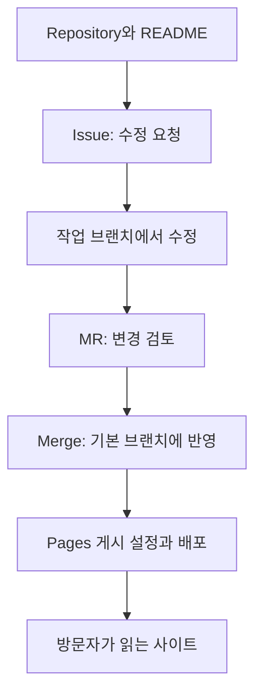

# GitLab 입문: Project·Issue·Pages로 함께 작업하기

## 요약

팀에서 “GitLab 프로젝트에 안내문을 올리고 Issue로 요청해 주세요”라는 말을 들었다고 가정합니다. GitLab에서는 하나의 **Project** 안에 저장소와 작업 관리 기능이 연결됩니다. 파일을 읽고, 해야 할 일을 기록하고, 수정안을 검토하는 순서로 익히면 처음부터 개발 자동화 설정을 배울 필요는 없습니다.[^repository][^issues][^mr]

이 문서는 GitLab.com과 회사가 운영하는 GitLab 환경에서 공통으로 만나는 기능을 설명합니다. 회사 환경은 설치 버전과 관리자의 설정에 따라 메뉴와 이용 조건이 달라질 수 있습니다.[^create][^pages]

## 학습 목표

- Project 안에서 Repository·Issue·Merge Request의 역할을 구분합니다.
- 안내문 수정 요청과 실제 파일 변경을 연결합니다.
- README·Wiki·Issue board·Pages를 목적에 맞게 고릅니다.
- 브라우저에서 수정안을 만들고 무엇을 검토해야 하는지 설명합니다.

## 선수 지식

파일과 폴더를 읽을 수 있으면 시작할 수 있습니다. [Git](../../../glossary/ko/git.md)은 파일의 변경 이력을 관리합니다. **README**는 프로젝트의 첫 안내문이고, **Markdown**은 `# 제목`처럼 간단한 기호로 문서를 작성하는 방식입니다. 아래 연습에는 로그인과 프로젝트를 만들고 수정할 권한이 필요합니다.[^create][^editor]

## 101 · 개념 이해

### Project는 저장소를 포함하는 작업 단위입니다

GitLab의 **프로젝트**(Project) 안에는 파일과 이력을 보관하는 **저장소**(Repository)가 있습니다. Issue와 Merge Request도 프로젝트 작업과 연결됩니다. “프로젝트를 열어 주세요”는 보통 이 전체 작업 공간으로 들어오라는 의미입니다.[^repository][^issues][^mr]

| 기능 | 쉬운 설명 | 동아리 안내문 예시 |
| --- | --- | --- |
| Repository와 README | 원본 파일·변경 이력과 첫 안내 | `README.md`에서 모임 목적 읽기 |
| Issue | 요청·문제·할 일을 기록하는 항목 | “모임 시간 안내 추가” |
| Merge Request / MR | 파일 변경을 검토하고 합치도록 제안 | 시간을 적은 수정안 검토 |
| Issue board | 여러 Issue를 카드와 목록으로 보는 화면 | 요청별 진행 상황 확인 |
| Wiki | 프로젝트의 여러 문서를 정리하는 공간 | 운영 방법과 FAQ |
| Pages | 웹 자료를 사이트로 게시하는 기능 | 참가자용 동아리 안내 사이트 |

Issue의 **담당자**(assignee)는 누가 진행할지, **라벨**(label)은 어떤 종류의 요청인지 표현합니다. Issue board는 요청들을 보기 쉽게 모아 보여 줍니다. Wiki는 코드 저장소와 구분된 문서 공간이며 웹에서 편집할 수 있습니다.[^issues][^boards][^wiki]



그림 1. GitLab 프로젝트에서 README를 읽고 수정 요청부터 사이트 게시까지 진행하는 설명용 흐름입니다. Pages는 별도로 게시를 준비한 경우에 연결합니다.

### MR은 “무엇을 어떻게 바꿨는지” 읽는 곳입니다

**브랜치**(branch)는 수정 작업을 진행하는 별도의 흐름이고, **커밋**(commit)은 변경을 설명과 함께 기록하는 단위입니다. **병합**(merge)은 작업 브랜치의 변경을 대상 브랜치에 합칩니다. MR에서는 변경 전후의 **diff**, 댓글, 커밋을 확인할 수 있습니다.[^repository][^editor][^mr]

예를 들어 Issue에 “시간 안내가 필요하다”는 이유를 적고, MR에는 “README에 토요일 오후 2시를 추가했다”는 결과를 제시합니다. 검토자는 시간·대상 파일·다른 문구의 손상 여부를 확인합니다. MR 작성자와 병합할 권한이 있는 사람이 항상 같은 것은 아닙니다.[^mr]

## 201 · 예제에 적용하기

### 브라우저에서 동아리 안내를 수정합니다

**가정:** 본인이 관리하는 `club-guide` 연습 프로젝트에 README를 만들고, 가상의 동아리 시간 “매주 토요일 오후 2시”를 추가합니다. 기본 브랜치에 병합할 권한이 있으며 별도의 승인·검사 규칙이 없는 개인 연습을 가정합니다. 실제 GitLab 계정이나 프로젝트를 생성한 실험은 아닙니다.

1. `New project/repository → Create blank project`에서 이름과 공개 범위를 정합니다. Public은 공개, Private은 접근을 허용한 사람만 읽는 범위입니다. README 초기화 옵션을 선택해 프로젝트를 만듭니다.[^create]
2. 프로젝트의 `Plan → Work items → New item`에서 유형을 `Issue`로 선택합니다. 제목은 “README에 모임 시간 추가”, 본문은 아래처럼 작성합니다. 이전 버전에서는 메뉴에 `Issues`가 보일 수 있으므로 조직의 버전 안내를 확인합니다.[^create-issue]
3. 저장소의 `README.md`에서 `Edit → Edit single file`을 열어 `모임: 매주 토요일 오후 2시`를 추가합니다.[^editor]
4. `Commit changes`에서 메시지 `모임 시간 안내 추가`를 적고, 새 브랜치 `add-meeting-time`에 커밋하는 옵션과 MR 생성 옵션을 선택합니다.[^editor]
5. MR의 설명에 Issue 링크를 넣고, 작업 브랜치에서 기본 브랜치로 보내는 변경인지 확인합니다. diff를 읽고 병합 조건을 만족했을 때 병합합니다.[^mr]
6. 기본 브랜치의 README를 다시 읽습니다. 정확한 시간이 보이면 Issue에 결과와 MR 링크를 남기고 닫습니다.

```text
제목: README에 모임 시간 추가
현재: 모임 시간을 찾을 수 없습니다.
요청: “매주 토요일 오후 2시”라는 안내를 추가해 주세요.
완료 기준: 기본 브랜치의 README에서 요일과 시간이 정확히 보입니다.
```

**기대 결과와 해석:** 요청과 변경의 근거가 연결되고, 기본 브랜치에서 최종 안내를 읽을 수 있습니다. MR을 닫았다는 표시만으로 병합을 판단하지 않습니다. 병합 상태와 대상 파일을 함께 확인합니다. 회사 프로젝트에서 버튼을 누를 수 없다면 프로젝트 담당자와 권한·병합 조건을 확인합니다.[^mr]

### Pages는 결과를 보여 주는 단계에서 만납니다

**GitLab Pages**는 저장소의 웹 파일로 정적 사이트를 게시합니다. 정적 사이트는 미리 준비한 파일을 방문자에게 제공하는 방식입니다. 브라우저에서 JavaScript를 실행할 수 있지만, Pages 자체가 서버에서 PHP 같은 프로그램을 실행해 주지는 않습니다.[^pages]

처음에는 팀의 기존 Pages 사이트를 열거나 공식 문서의 예시를 살펴보고, 프로젝트의 `Deploy → Pages`에서 실제 게시 주소를 확인합니다. GitLab.com의 기본 도메인은 `gitlab.io` 계열이며, 고유 도메인이나 사용자 지정 도메인을 쓸 수 있으므로 주소를 추측해 만들지 않습니다.[^pages][^domains]

직접 게시하려면 웹 파일과 게시 설정이 필요합니다. 공식 안내에는 화면에서 설정을 만들거나 템플릿으로 시작하는 경로가 있습니다. **게시 과정에는 GitLab CI/CD가 사용됩니다.** 이 단계에서는 연결 관계만 이해하고 YAML·Runner·파이프라인 작성은 후속 학습으로 남깁니다.[^pages]

## 301 · 조건에 따라 판단하기

| 상황 | 시작할 기능 | 판단 기준 |
| --- | --- | --- |
| 처음 프로젝트에 참여했습니다. | README와 Repository | 목적·관련 파일·참여 방법을 찾습니다. |
| 개발 지식 없이 수정 요청을 전달합니다. | Issue | 현상·원하는 결과·완료 기준을 적습니다. |
| 문구 수정안을 검토합니다. | MR | diff의 내용과 Issue의 요구가 맞는지 봅니다. |
| 요청이 많아 진행 상태를 놓칩니다. | Issue board | 담당자와 목록 분류를 팀과 맞춥니다. |
| 운영 지식을 여러 문서로 정리합니다. | Wiki | 팀에서 쓰는 문서 위치와 중복되지 않는지 봅니다. |
| 외부 참가자에게 완성된 안내를 보여 줍니다. | Pages | 실제 주소와 방문자의 접근 가능 여부를 확인합니다. |

위 표는 작은 문서 프로젝트를 위한 제안입니다. 기능을 모두 채울 필요는 없습니다. **Project가 Private인지와 Pages를 누가 볼 수 있는지는 따로 확인합니다.** Pages 접근 제어는 프로젝트 설정과 관리자 설정의 영향을 받습니다.[^access]

## 이해 확인

1. **Project와 Repository는 완전히 같은 말일까요?** GitLab에서 저장소는 프로젝트의 구성 요소입니다. 프로젝트에는 작업 관리 기능과 설정도 있습니다.[^repository]
2. **기획자도 MR을 검토할 수 있을까요?** 접근 권한이 있다면 문구와 요구사항을 diff로 검토할 수 있습니다. 코드 실행을 판단하는 일은 필요한 지식을 가진 사람과 나눕니다.
3. **Private 프로젝트의 Pages 주소를 공유하면 항상 구성원만 볼까요?** 그렇게 단정할 수 없습니다. Pages 접근 제어의 실제 설정을 확인해야 합니다.[^access]

## 근거와 한계

GitLab 공식 문서의 현재 메뉴와 개념에 근거합니다. 회사가 운영하는 GitLab은 버전·기능 활성화·권한에 차이가 있을 수 있습니다. 예제의 생성·편집·병합·게시를 실제 GitLab에서 수행한 기록은 아니며, CI/CD 상세 설정과 운영 문제 해결은 다루지 않습니다.

## 관련 지식

- [GitHub·GitLab 종합 비교](github-and-gitlab.md)
- [GitHub 입문](github-fundamentals.md)
- [Git 용어](../../../glossary/ko/git.md)
- [Delivery 목차](index.md)

## 출처

[^create]: [GitLab — Create a project](https://docs.gitlab.com/user/project/)
[^repository]: [GitLab — Repository](https://docs.gitlab.com/user/project/repository/)
[^issues]: [GitLab — Issues](https://docs.gitlab.com/user/project/issues/)
[^create-issue]: [GitLab — Create an issue](https://docs.gitlab.com/user/project/issues/create_issues/)
[^editor]: [GitLab — Web Editor](https://docs.gitlab.com/user/project/repository/web_editor/)
[^mr]: [GitLab — Merge requests](https://docs.gitlab.com/user/project/merge_requests/)
[^boards]: [GitLab — Issue boards](https://docs.gitlab.com/user/project/issue_board/)
[^wiki]: [GitLab — Wiki](https://docs.gitlab.com/user/project/wiki/)
[^pages]: [GitLab — GitLab Pages](https://docs.gitlab.com/user/project/pages/)
[^access]: [GitLab — GitLab Pages access control](https://docs.gitlab.com/user/project/pages/pages_access_control/)

[^domains]: [GitLab — GitLab Pages default domain names and URLs](https://docs.gitlab.com/user/project/pages/getting_started_part_one/)
