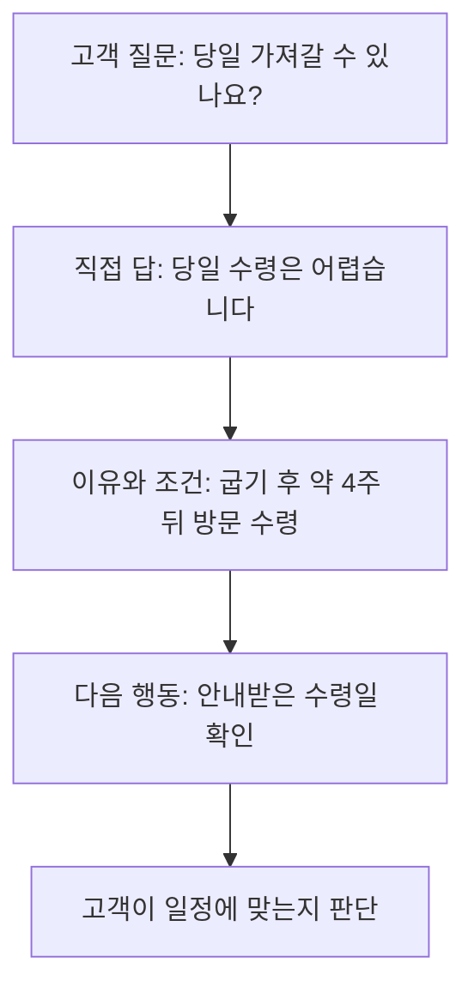

# AEO: 고객의 질문에 답하는 콘텐츠 만들기

## 요약

고객이 수업 안내를 읽은 뒤에도 “완성품을 당일 가져갈 수 있나요?”를 반복해서 묻는다고 가정합니다. **AEO(Answer Engine Optimization, 답변 엔진 최적화)**는 질문에 답하는 데 쓸 수 있도록 정보를 정리하는 관점입니다. 고객이 궁금한 것을 찾고, 답의 조건까지 이해하게 하는 데서 시작합니다.

HubSpot은 AEO를 생성형 AI 답변까지 포함하는 넓은 의미로 사용합니다. 이 문서는 그중 **질문에 대한 답의 완결성**에 초점을 맞춥니다. 업계 전체가 같은 범위로 정의한다는 뜻은 아닙니다.[^hubspot]

## 학습 목표

- 단순한 홍보 문장과 질문을 해결하는 답변을 구분합니다.
- 짧은 답에 필요한 조건과 다음 행동을 덧붙입니다.
- 답변을 잘 작성한 사실과 검색·AI가 선택한 결과를 구분합니다.

## 선수 지식

개발 지식은 필요하지 않습니다. **FAQ**는 자주 묻는 질문과 답을 모은 안내입니다. **직접 답변**은 링크만 제시하는 대신 질문에 대한 내용을 바로 보여주는 방식입니다. **예외 조건**은 답이 달라지는 상황입니다.

## 101 · 개념 이해

### 답은 짧기만 하면 되는 것이 아닙니다

“당일 수령 가능 여부”를 물었는데 “멋진 작품을 만들 수 있습니다”라고 답하면 핵심이 빠져 있습니다. 먼저 가능 여부를 말하고, 이유와 실제 조건을 설명합니다. 이 문서에서는 **질문 → 직접 답 → 조건 → 다음 행동**을 편집 기준으로 제안합니다. 공식 노출 공식이나 정해진 문장 길이가 아닙니다.

그림 1. 가상의 공방 답변 구성입니다. 네 부분을 매번 별도 제목으로 써야 한다는 뜻은 아닙니다.

### 추천 스니펫과 생성형 답변은 어떻게 다른가요?

Google의 **추천 스니펫(featured snippet)**은 페이지 일부를 검색 결과에서 두드러지게 보여주는 형식입니다. 사이트 운영자가 자신의 페이지를 추천 스니펫으로 지정할 수는 없고 시스템이 선택합니다.[^snippets] 여러 자료를 종합해 새 답변을 구성하는 경우는 [GEO](geo-generative-discovery.md)에서도 다룹니다. AEO를 특정 검색 화면이나 FAQ 형식 하나로만 이해하지 않습니다.[^hubspot]

## 201 · 예제에 적용하기

### 수령 문의를 실제로 해결하는 답을 씁니다

**가정:** 가상의 하루공방에서 만든 도예 작품은 굽는 과정을 거쳐 약 4주 뒤 방문 수령합니다. 정확한 수령일은 별도로 안내합니다. 실제 업체의 조건이 아닙니다.

**개선 전:** “작품은 정성껏 완성해 드립니다. 자세한 사항은 문의하세요.”

**개선 후의 예:**

> **완성품을 당일 가져갈 수 있나요?**
>
> 당일에는 가져갈 수 없습니다. 굽는 과정이 필요해 약 4주 뒤 공방에 방문해 수령합니다. 정확한 수령일은 별도로 안내하므로 안내받은 날짜를 확인해 주세요.

| 점검 | 답변에 들어간 내용 | 해설 |
| --- | --- | --- |
| 질문의 핵심 | 당일에는 가져갈 수 없습니다. | 고객이 묻는 가능 여부부터 답합니다. |
| 이유 | 굽는 과정이 필요합니다. | 기다려야 하는 이유를 설명합니다. |
| 조건 | 약 4주 뒤 방문 수령 | 확정 날짜로 오해하거나 택배를 기대하지 않게 합니다. |
| 다음 행동 | 별도로 안내받은 날짜 확인 | 고객이 무엇을 기다리고 확인할지 알려 줍니다. |

고객 응대 담당자가 사실을 확인하고, 처음 읽는 사람이 “언제, 어떻게 받는가”를 자기 말로 설명해 보게 합니다. 설명하지 못하는 부분은 보강합니다. 택배 제공 여부처럼 확인되지 않은 조건은 임의로 추가하지 않습니다.

**기대 결과와 해석:** 답이 질문을 해결하고 조건을 빠뜨리지 않는지 확인할 수 있습니다. 실제 문의 감소나 AI 인용 증가는 이 예제에서 측정하지 않았습니다.

## 301 · 조건에 따라 판단하기

### 어떤 답변을 먼저 고칠까요?

반복 문의, 예약 결정을 막는 질문, 오해하면 불편이 커지는 조건부터 정리합니다. 모든 문장을 FAQ로 바꾸기보다 고객이 질문을 떠올리는 위치에 답을 둡니다. 예약 취소 조건이라면 예약 안내 옆에서 찾을 수 있게 하는 식입니다.

| 상황 | 편집 판단 |
| --- | --- |
| 답이 한 문장으로 충분합니다. | 짧게 답하고 불필요한 설명을 늘리지 않습니다. |
| 대상·일정에 따라 답이 달라집니다. | 답에 적용 조건을 붙이고 경우를 구분합니다. |
| 여러 서비스를 비교해야 합니다. | 질문별 답과 함께 비교 기준·근거를 제공합니다. GEO 문서로 이어집니다. |
| 내부 자료끼리 조건이 다릅니다. | 답변을 다듬기 전에 담당자에게 사실을 확정받습니다. |

Google은 AI 검색을 위해 고정된 길이로 내용을 잘게 나누거나 특별한 구조화 데이터를 넣을 필요가 없다고 설명합니다.[^google-ai] **구조화 데이터**는 정보에 기계가 읽을 수 있는 이름표를 붙이는 방식입니다. FAQ 개수나 답변 글자 수를 노출 보장 조건으로 삼지 않습니다.

평가는 두 갈래로 합니다. 먼저 독자가 답을 찾고 조건을 이해하는지, 같은 문의가 어떤 내용으로 반복되는지 확인합니다. 다음으로 검색·AI에서 실제로 선택됐는지를 질문·서비스·날짜와 함께 기록합니다. 답변 품질과 외부 노출은 서로 다른 확인 대상입니다.

## 이해 확인

**질문 1:** 답을 “4주입니다”로 줄이면 더 좋은 AEO인가요?

**해설:** 그 문장만으로는 약 4주인지 확정 4주인지, 방문 수령인지 알기 어렵습니다. 질문에 필요한 조건을 보존하는 것이 우선입니다.

**질문 2:** FAQ를 추가하면 Google 추천 스니펫이나 AI 인용을 확보한 것인가요?

**해설:** 아닙니다. 콘텐츠를 준비한 것과 시스템이 선택한 것은 다릅니다. 노출 여부는 별도로 확인해야 합니다.

## 근거와 한계

2026-09-10에 확인한 HubSpot의 용어 사용과 Google 공식 안내를 참고했습니다. HubSpot의 분류를 모든 플랫폼의 표준으로 취급하지 않습니다. 네 부분의 답변 구성과 공방 예제는 직접 제안한 학습 자료이며, 실제 문의 감소·추천 스니펫·AI 인용 효과는 검증하지 않았습니다.

## 관련 지식

[네 관점 종합 비교](search-and-ai-discovery.md) · [SEO](seo-foundations.md) · [GEO](geo-generative-discovery.md) · [AIO](aio-strategy.md) · [AEO 용어](../../../glossary/ko/aeo.md) · [문서 목록](index.md) · [English](../../en/digital-marketing/aeo-answer-content.md)

## 출처

[^hubspot]: [HubSpot — Answer engine optimization best practices](https://blog.hubspot.com/marketing/answer-engine-optimization-best-practices)
[^snippets]: [Google — Featured snippets and your website](https://developers.google.com/search/docs/appearance/featured-snippets)
[^google-ai]: [Google — Optimizing your website for generative AI features on Google Search](https://developers.google.com/search/docs/fundamentals/ai-optimization-guide)
