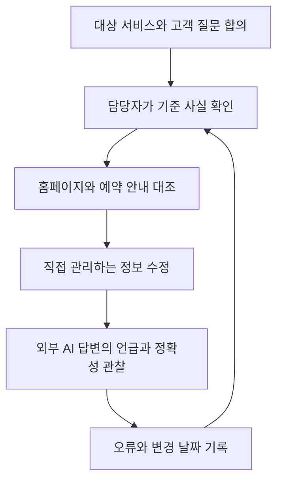

# AIO: 범위를 정하고 AI 접점의 정보를 관리하기

## 요약

“AIO를 해 주세요”라는 요청을 받으면 먼저 어떤 결과를 원하는지 확인해야 합니다. FGS Global은 **AI Optimization(AI 최적화)**이라는 용어를 사용하고, Brainlabs 자료는 **AI Overviews** 및 **AI Overview Optimization**에 AIO라는 표기를 사용합니다. 약어만으로 업무 범위를 확정하기 어렵습니다.[^aio-usage][^aio-alternate]

이 문서에서는 AIO를 **AI를 통한 발견과 브랜드 정보 전달을 폭넓게 관리하는 관점**으로 정합니다. 이는 이 문서의 작업상 정의입니다. 여러 접점의 정보를 확인하고 담당자가 지속적으로 갱신하는 방법에 집중합니다.

## 학습 목표

- AI Optimization과 Google AI Overviews 관련 용례를 구분합니다.
- 대상 서비스·고객 질문·원본 정보·담당자·관찰 지표를 합의합니다.
- 원본 수정과 외부 AI 응답의 변화를 별개로 확인합니다.

## 선수 지식

개발 지식은 필요하지 않습니다. **브랜드 정보**는 업체명·서비스·가격·이용 조건처럼 고객이 업체를 이해하는 데 쓰는 정보입니다. **접점**은 홈페이지, 예약 안내, AI 답변처럼 고객이 정보를 만나는 곳입니다. **원본**은 담당자가 사실을 확정하고 변경을 관리하는 기준 자료입니다.

## 101 · 개념 이해

### 같은 약어가 다른 일을 가리킬 수 있습니다

| 용례 | 이 문서에서 읽는 방법 | 의뢰 전에 확인할 것 |
| --- | --- | --- |
| AI Optimization | 여러 AI 접점의 발견과 정보 전달을 다루는 넓은 표현 | 대상 서비스와 개선할 결과 |
| AI Overviews | Google 검색의 AI 요약 기능 이름 | 기능 자체를 말하는지, 대응 업무를 말하는지 |
| AI Overview Optimization | 그 기능에 대한 최적화 활동을 가리키는 용례 | Google 안에서 어느 결과를 측정할지 |

표는 FGS Global·Brainlabs의 용례와 Google의 기능 설명을 구분해 정리한 것입니다. 업계 전체의 통일된 분류 체계는 아닙니다.[^aio-usage][^aio-alternate][^ai-features] AI로 글을 쓰는 작업도 별도로 구분합니다. 제작 도구를 사용했다는 사실만으로 AI 답변에서 정확하게 소개되는 결과가 성립하지는 않습니다.

### 관리할 수 있는 정보부터 정리합니다

그림 1. 이 문서에서 제안하는 운영 흐름입니다. 우리 자료를 수정했다고 외부 AI가 즉시 갱신된다는 뜻은 아닙니다.

## 201 · 예제에 적용하기

### 하루공방의 다른 가격 안내를 정리합니다

**가정:** 가상의 하루공방 수업료는 현재 1인 50,000원이며 재료와 도구 사용을 포함합니다. 홈페이지에는 이 금액이 있지만 예약 안내에는 예전 가격이 남아 있다고 가정합니다. 실제 업체나 관찰 결과가 아닙니다.

| 기준 항목 | 확정할 내용 | 관리 방법의 예 |
| --- | --- | --- |
| 업체명 | 하루공방 | 공개 프로필과 예약 안내의 이름을 대조합니다. |
| 가격과 포함 항목 | 1인 50,000원, 재료·도구 포함 | 운영자가 확인한 기준 자료를 둡니다. |
| 적용 시점 | 실제 변경일과 적용 대상 | 기존 예약에도 적용되는지 별도로 확인합니다. |
| 수정 담당자 | 홈페이지·예약 안내 담당자 | 각 수정 완료일을 기록합니다. |
| 확인할 질문 | 초보자 수업의 총비용은 얼마인가요? | 대상 AI 서비스·언어·확인 날짜와 함께 보관합니다. |

**간단한 업무 정의 예:** “운영자가 확정한 수업 정보를 홈페이지와 예약 안내에 맞추고, 합의한 AI 서비스에서 총비용 질문의 답과 출처를 주기적으로 확인합니다. 산출물은 기준 정보표, 수정 기록, 오류 관찰 기록입니다.”

먼저 실제 가격과 적용 조건을 확정하고 직접 관리하는 안내를 수정합니다. 외부 업체의 오래된 페이지가 확인되면 그 주소와 정정 요청 여부를 기록합니다. 외부 AI 답변은 이후 다시 관찰하되 특정 날짜까지 바뀐다고 약속하지 않습니다.

**기대 결과와 해석:** 관리하는 자료의 불일치를 줄이고 누가 무엇을 고쳤는지 알 수 있습니다. 외부 답변의 변화는 별도 결과입니다. 이 예제에서 AI 노출이나 예약 증가를 검증하지 않았습니다.

## 301 · 조건에 따라 판단하기

### 작업 범위에 맞는 결과를 확인합니다

| 요청 | 합의할 산출물 | 확인할 결과 |
| --- | --- | --- |
| 여러 AI에서 업체 정보가 정확했으면 합니다. | 기준 정보·채널별 수정 기록·관찰 질문 | 각 서비스 답변의 사실 일치 여부 |
| Google AI Overviews 대응이 목적입니다. | Google 대상 페이지·참여 조건·측정 범위 | Google의 해당 보고 범위 안에서 관찰한 노출 |
| AI로 콘텐츠 제작을 돕고 싶습니다. | 초안·편집·사실 검토 절차 | 제작 시간과 검토 품질; 외부 인용은 별도 확인 |

이 표는 업무 합의를 위한 제안입니다. 모든 일을 하나의 “AIO 점수”로 합치기보다 대상과 결과를 적습니다. 비교·인용 관찰 방법과 제품별 보고서 범위는 [GEO의 측정 설명](geo-generative-discovery.md)에서 확인합니다.

### Google 참여 설정과 학습 허용을 구분합니다

Google을 대상으로 한다면 읽기·색인 조건과 함께 Search Console의 **Settings → Search generative AI** 포함 설정을 확인합니다. 해당 설정은 AI Overviews·AI Mode 등의 기능에서 자료와 링크가 사용되는 범위에 관한 것입니다. 일반 검색의 포함·순위 및 AI 학습 허용과는 구분됩니다. AI 학습 제한은 별도의 Google-Extended 안내를 확인해야 합니다.[^ai-control]

따라서 “AI에 보이고 싶은가?”와 “모델 학습에 사용하도록 허용할 것인가?”를 같은 설정으로 취급하지 않습니다. 이 문서는 설정의 차이를 설명하며 실제 사이트 설정을 변경한 작업 기록은 아닙니다.

## 이해 확인

**질문 1:** “AIO가 필요하다”는 요청만으로 Google AI Overviews 작업을 시작해도 되나요?

**해설:** 먼저 약어의 뜻과 대상 서비스를 확인합니다. 여러 AI 서비스의 브랜드 정확성을 원하는 요청일 수도 있습니다.

**질문 2:** 홈페이지 가격을 수정했으면 모든 AI의 답변도 최신이라고 보고할 수 있나요?

**해설:** 아닙니다. 직접 관리하는 원본 수정과 외부 응답의 변화는 별도 사건입니다. 서비스·질문·날짜별 관찰 결과를 남겨야 합니다.

## 근거와 한계

2026-09-10에 확인한 FGS Global·Brainlabs의 용어 사용과 Google 공식 도움말을 참고했습니다. 회사의 용어 사용을 보편적 표준이나 성과 보장으로 해석하지 않습니다. 운영 표·그림·업무 정의는 직접 작성한 제안입니다. 실제 공개 설정 변경, 업체 정정 요청, AI 응답 실험을 수행한 문서가 아닙니다.

## 관련 지식

[네 관점 종합 비교](search-and-ai-discovery.md) · [SEO](seo-foundations.md) · [AEO](aeo-answer-content.md) · [GEO](geo-generative-discovery.md) · [AIO 용어](../../../glossary/ko/aio.md) · [문서 목록](index.md) · [English](../../en/digital-marketing/aio-strategy.md)

## 출처

[^aio-usage]: [FGS Global — Digital Insights, August 2025: AIO](https://fgsglobal.com/insights/newsletters/digital-insights/august-2025)
[^aio-alternate]: [Brainlabs — Navigating the New Era of AI Search, p. 4](https://www.brainlabsdigital.com/wp-content/uploads/2025/07/Navigating-AI-Search_Brainlabs_JUL2025.pdf)
[^ai-features]: [Google — AI features and your website](https://developers.google.com/search/docs/appearance/ai-features)
[^ai-control]: [Google — Search generative AI control](https://support.google.com/webmasters/answer/16908024)
