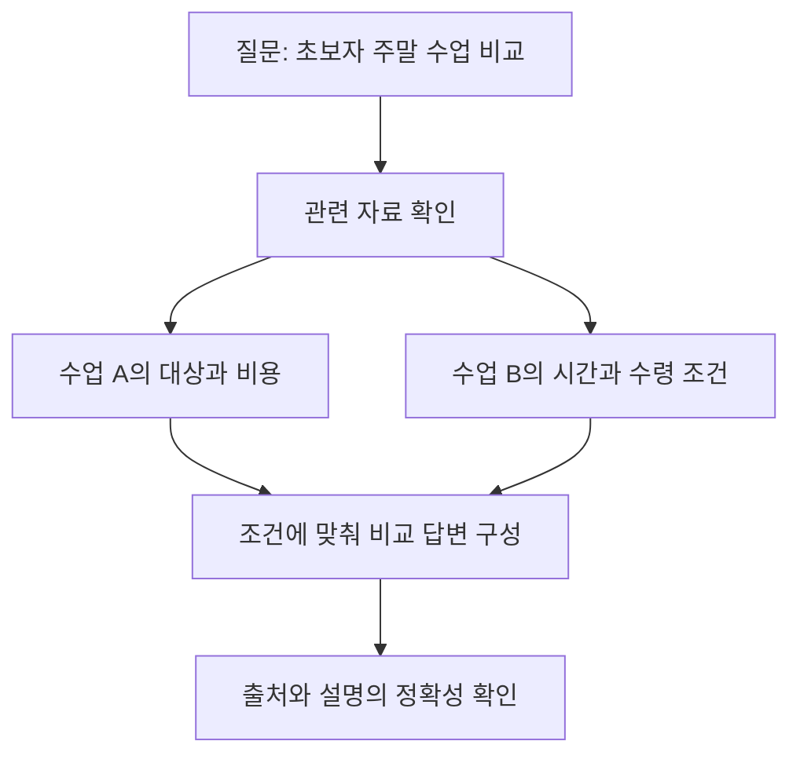

# GEO: AI가 비교하고 종합할 근거 만들기

## 요약

고객이 AI에게 “초보자가 갈 만한 주말 도예 수업을 비교해 줘”라고 묻는다고 가정합니다. 이때 중요한 것은 우리 페이지의 존재뿐 아니라, 수업을 비교할 **근거**가 있는지입니다. **GEO(Generative Engine Optimization, 생성형 엔진 최적화)**는 생성형 답변에서 콘텐츠가 드러나고 활용되는 방식을 다루는 용어입니다.[^geo-paper]

이 문서는 여러 자료를 종합할 때 도움이 되는 정보와 그 결과를 관찰하는 방법에 집중합니다. 질문 하나의 답변 구성은 [AEO](aeo-answer-content.md), 전체 관계는 [종합 비교](search-and-ai-discovery.md)에서 읽습니다.

## 학습 목표

- 페이지를 찾는 것과 여러 자료를 종합해 답하는 것을 구분합니다.
- 서비스 비교에 필요한 기준과 확인 가능한 사실을 정리합니다.
- 브랜드 언급·출처 인용·정보 정확성을 따로 관찰합니다.

## 선수 지식

AI 대화로 정보를 찾아본 경험이면 충분합니다. **생성형 답변**은 자료를 바탕으로 새 문장을 구성한 답변입니다. **언급**은 이름이 나오는 일이고, **인용**은 자료가 출처로 표시되는 일입니다. **URL**은 웹페이지의 주소입니다. 이름만 등장한 것과 내 페이지가 출처로 연결된 것은 다릅니다.

## 101 · 개념 이해

### 비교 답변은 무엇을 필요로 하나요?

GEO 원 연구는 여러 자료를 종합하는 엔진에서 콘텐츠의 가시성을 다룹니다. 여기서 가시성은 답변에 콘텐츠가 드러나는 정도이며, 그 자체가 매출은 아닙니다.[^geo-paper] Google도 생성형 검색이 검색 시스템과 관련 자료를 활용하는 방식으로 작동한다고 설명합니다.[^google-ai]

그림 1. 비교와 종합을 설명하는 개념 그림입니다. 특정 AI의 내부 처리 순서나 항상 인용을 제공한다는 보장은 아닙니다.

### 홍보 표현보다 판단 근거를 준비합니다

“가장 좋은 수업”만으로는 처음 참여하는 사람과 경험자가 같은 결정을 내릴 수 없습니다. 수업 대상·정원·총비용·제작 방식·수령 조건을 알면 자신의 상황과 비교할 수 있습니다. 다음 예제는 이런 정보를 준비하는 편집 제안입니다. AI가 해당 페이지를 실제로 선택할지는 별도로 확인합니다.

## 201 · 예제에 적용하기

### 하루공방을 비교할 수 있는 안내로 바꿉니다

**가정:** 하루공방은 가상의 공방입니다. 성인 초보자를 위한 토요일 2시간 수업이며 정원 6명, 1인 50,000원에 재료와 도구 사용이 포함됩니다. 완성품은 약 4주 뒤 방문 수령합니다. 금액과 조건은 실제 업체나 시장 가격이 아닙니다.

| 비교 기준 | 게시할 사실 | 고객이 판단할 수 있는 것 |
| --- | --- | --- |
| 참여 대상 | 처음 도예를 배우는 성인 | 경험 없이 참여 가능한지 |
| 시간·정원 | 토요일 2시간, 최대 6명 | 일정과 수업 규모가 맞는지 |
| 총비용 | 1인 50,000원, 재료·도구 포함 | 알려진 비용에 무엇이 포함되는지 |
| 수령 조건 | 약 4주 뒤 방문 수령, 날짜 별도 안내 | 여행 중 방문하거나 선물을 준비할 때 맞는지 |

1. 담당자에게 표의 조건을 확인합니다. 제작 방식처럼 아직 모르는 항목은 추측해 채우지 않습니다.
2. 같은 사실을 제목·본문·예약 안내에서 일치시킵니다. 실제 게시물에는 적용 날짜와 변경 책임자를 정합니다.
3. “당일 결과물이 필요한 여행자에게 맞는가?”를 읽고 판단해 봅니다. 위 조건이라면 당일 완성품을 가져가려는 요구에는 맞지 않는다고 설명할 수 있습니다.

**기대 결과와 해석:** 적합한 고객과 맞지 않는 상황을 판단할 근거가 생깁니다. 경쟁 업체보다 우수하다는 주장도, AI 추천을 확보했다는 주장도 아닙니다. 확인되지 않은 후기나 비교 점수를 만들지 않습니다.

## 301 · 조건에 따라 판단하기

### 인용 수 하나로 성공을 판단하지 않습니다

| 관찰 항목 | 확인 질문 |
| --- | --- |
| 언급 | 공방명이 등장했나요? |
| 인용 | 내 자료의 URL이 출처로 표시됐나요? |
| 정확성 | 대상·가격·수령 조건을 맞게 전달했나요? |
| 고객 행동 | 관련 방문·문의·예약으로 이어졌나요? |

**가상 계산:** 질문 10개를 각각 2회 확인한 답변 20개 중 5개에 공방명이 있으면 이 표본의 언급 비율은 `5 ÷ 20 = 25%`입니다. 고객의 25%가 공방을 보았다는 뜻은 아닙니다. 출처 링크 수와 정확한 설명 수는 별도로 셉니다. 같은 질문·서비스·언어·날짜 조건을 기록하고, 질문을 바꿨다면 별도 표본으로 남깁니다. 이 방법은 직접 정한 관찰 지표이며 공식 시장 점유율이 아닙니다.

Google Search Console의 **Generative AI performance report**는 AI Overviews·AI Mode의 노출을 다룹니다. 모든 AI 서비스의 인용이나 매출 보고서로 해석하지 않습니다.[^ai-report] Bing Webmaster Tools의 **AI Performance**는 지원하는 Microsoft AI 경험에서 출처로 표시된 횟수와 URL 등을 제공하며, 인용 횟수는 답변 내 순위나 중요도를 뜻하지 않습니다. 두 도구의 집계 범위를 맞추지 않고 수치를 합산하지 않습니다.[^bing]

### 무엇을 먼저 고칠까요?

답변에 잘못된 가격이 나오면 문장을 늘리기 전에 원본과 공개 안내의 가격·날짜를 대조합니다. 올바른 페이지가 인용됐지만 조건이 잘못 전달됐다면 해당 조건이 본문에서 분명한지 확인합니다. 이것으로 즉시 답변이 바뀐다고 보장할 수는 없습니다.

Google은 생성형 검색에도 SEO 원칙이 유효하며 특별한 AI용 파일이 필요하지 않다고 설명합니다.[^google-ai] 접근 문제는 [SEO](seo-foundations.md), 여러 접점의 정보 운영은 [AIO](aio-strategy.md)와 함께 검토합니다.

## 이해 확인

**질문 1:** AI가 공방을 출처로 인용했지만 “당일 수령 가능”이라고 설명했다면 성공인가요?

**해설:** 인용은 관찰됐지만 정확성에는 문제가 있습니다. 약 4주 뒤 수령이라는 사실이 분명한지 확인하고, 관찰 기록에 오류를 남깁니다.

**질문 2:** 위 예제의 언급 비율 25%를 시장 점유율이라고 발표해도 되나요?

**해설:** 아닙니다. 정해 둔 20개 답변의 관찰 비율입니다. 실제 고객 전체의 노출이나 구매 행동을 대표하지 않습니다.

## 근거와 한계

2026-09-10에 확인한 GEO 원 연구와 Google·Bing 공식 자료를 사용했습니다. 원 연구의 특정 실험 효과를 모든 플랫폼이나 업체의 성과로 일반화하지 않습니다. 예제·그림·표본 계산은 학습용이며 실제 AI 응답 실험이나 매출 분석이 아닙니다. 보고서 기능과 집계 범위는 변경될 수 있습니다.

## 관련 지식

[네 관점 종합 비교](search-and-ai-discovery.md) · [SEO](seo-foundations.md) · [AEO](aeo-answer-content.md) · [AIO](aio-strategy.md) · [GEO 용어](../../../glossary/ko/geo.md) · [문서 목록](index.md) · [English](../../en/digital-marketing/geo-generative-discovery.md)

## 출처

[^geo-paper]: [Aggarwal et al. — GEO: Generative Engine Optimization, KDD 2024](https://arxiv.org/abs/2311.09735)
[^google-ai]: [Google — Optimizing your website for generative AI features on Google Search](https://developers.google.com/search/docs/fundamentals/ai-optimization-guide)
[^bing]: [Bing — Introducing AI Performance in Bing Webmaster Tools](https://blogs.bing.com/webmaster/February-2026/Introducing-AI-Performance-in-Bing-Webmaster-Tools-Public-Preview)
[^ai-report]: [Google — Generative AI performance report](https://support.google.com/webmasters/answer/16984139)
