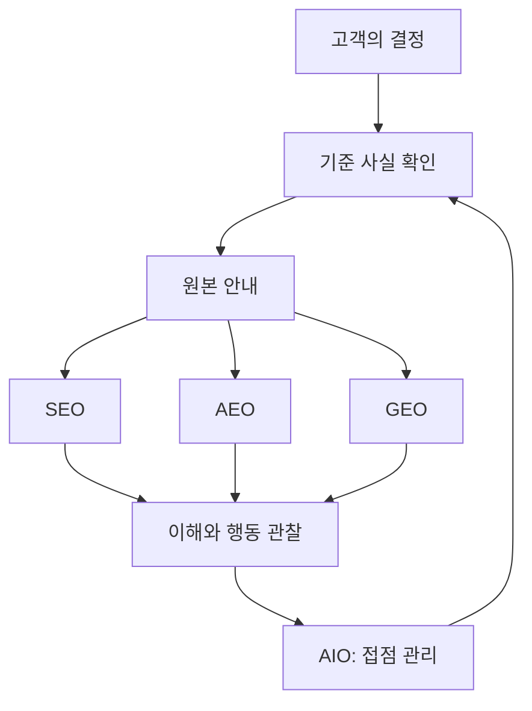

# SEO·GEO·AEO·AIO 종합: 차이와 실무 판단

## 요약

**네 용어를 각각 별도 사업으로 시작하기보다, 고객이 정보를 발견하고 판단하는 과정에서 무엇이 부족한지 살펴봅니다.** SEO는 페이지 발견과 이해, AEO는 질문에 대한 답, GEO는 비교·종합에 필요한 근거에 초점을 두어 읽을 수 있습니다. AIO는 먼저 뜻을 합의한 뒤 AI 접점의 정보 운영 범위를 정하는 데 사용합니다.

이 문서는 네 주제를 묶어 **차이·관계·우선순위·성과 해석**을 설명합니다. 개별 정의와 자세한 예제는 아래 독립 문서에서 읽습니다. 디지털 마케팅 중 검색과 AI를 통한 발견이 범위이며, 광고·이메일·SNS·구매 이후의 경험 전체를 네 약어로 설명하지는 않습니다.

| 독립 문서 | 다루는 질문 |
| --- | --- |
| [SEO: 검색에서 발견되는 페이지 만들기](seo-foundations.md) | 고객과 검색 엔진이 페이지를 찾고 이해할 수 있나요? |
| [AEO: 고객의 질문에 답하는 콘텐츠 만들기](aeo-answer-content.md) | 질문에 필요한 답과 조건을 바로 찾을 수 있나요? |
| [GEO: AI가 비교하고 종합할 근거 만들기](geo-generative-discovery.md) | 여러 후보 중 우리 서비스가 맞는지 판단할 근거가 있나요? |
| [AIO: 범위를 정하고 AI 접점의 정보를 관리하기](aio-strategy.md) | 어떤 AI 접점을 대상으로 누가 정보를 관리하고 확인하나요? |

## 학습 목표

- 네 용어를 구분하되 서로 겹치는 이유를 설명합니다.
- 같은 콘텐츠를 네 관점에서 검토하고 중복 작업을 줄입니다.
- 고객 문제를 기준으로 개선 순서와 담당자를 정합니다.
- 작업 완료·외부 노출·고객 행동을 구분해 성과를 해석합니다.

## 선수 지식

검색이나 AI 대화를 사용해 본 경험이면 충분합니다. **콘텐츠**는 글·사진·영상으로 전달하는 정보입니다. **전환**은 예약·문의·구매처럼 미리 정한 고객 행동입니다. 용어만 찾으려면 [SEO](../../../glossary/ko/seo.md) · [GEO](../../../glossary/ko/geo.md) · [AEO](../../../glossary/ko/aeo.md) · [AIO](../../../glossary/ko/aio.md)를 읽습니다.

## 101 · 개념 이해

### 무엇이 다르고, 무엇이 겹치나요?

그림 1. 직접 만든 비교 그림입니다. 실제 검색 화면이나 노출 성과가 아니며 네 관점은 함께 적용할 수 있습니다.

| 관점 | 이름과 중심 질문 | 주로 살펴볼 정보 | 확인할 결과 | 단독으로 알 수 없는 것 |
| --- | --- | --- | --- | --- |
| SEO | Search Engine Optimization · 페이지를 찾고 이해할 수 있나요? | 접근 가능성, 제목, 본문, 연결 | 관련 검색의 페이지 발견과 방문 | 방문자가 예약할지 |
| AEO | Answer Engine Optimization · 질문을 해결하나요? | 직접 답, 이유, 적용 조건 | 답의 완결성, 실제 답변 활용 여부 | FAQ를 넣었다는 사실만으로 외부 노출 여부 |
| GEO | Generative Engine Optimization · 비교와 종합에 쓸 근거가 있나요? | 대상, 비용, 조건, 확인 가능한 자료 | 생성형 답변의 언급·인용·정확성 | 인용 횟수만으로 매출 효과 |
| AIO | 이 문서에서는 AI Optimization · AI 접점의 정보를 어떻게 관리하나요? | 대상 서비스, 기준 사실, 담당자, 변경 기록 | 접점별 사실 일치와 합의한 목표 | 약어만으로 정확한 작업 범위 |

SEO는 Google 안내, GEO는 원 연구, AEO는 HubSpot의 용례를 참고했습니다. AIO는 FGS Global의 AI Optimization 용례를 바탕으로 이 문서의 범위를 정했습니다. 표의 중심 질문과 실무 결과는 이를 재구성한 설명입니다.[^seo][^geo-paper][^hubspot][^aio-usage]

### 기술 세대나 서로 배타적인 채널로 나누지 않습니다

Google은 생성형 AI 검색 대응도 SEO의 연장으로 설명합니다. HubSpot은 GEO 등을 넓은 AEO 범주로 묶습니다. 따라서 위 표는 업무를 이해하는 관점이며 “SEO 다음은 AEO, 그다음은 GEO”라는 대체 순서가 아닙니다.[^google-ai][^hubspot]

AEO의 답이 비교 답변에 활용되면 GEO와 겹칩니다. 같은 페이지가 일반 검색과 AI 답변에 쓰일 수도 있습니다. AEO는 Google 전용, GEO는 챗봇 전용이라는 식의 채널 구분도 적절하지 않습니다. 또한 Brainlabs는 AIO를 AI Overviews 및 AI Overview Optimization에도 사용하므로, AIO가 언제나 나머지 세 용어를 포함하는 공식 상위 개념이라고 단정하지 않습니다.[^aio-alternate]

**읽는 관점:** SEO로 발견의 기본을 점검하고, AEO와 GEO로 답과 근거의 품질을 살펴봅니다. AIO는 이 문서의 정의에 따라 대상과 정보 운영을 정리하는 데 사용합니다. 이 관계는 실무를 위한 해석입니다.

## 201 · 예제에 적용하기

### 같은 안내를 네 관점에서 검토합니다

**가정:** 가상의 하루공방은 성인 초보자에게 토요일 2시간 도예 수업을 제공합니다. 정원 6명, 1인 50,000원에 재료·도구가 포함되며, 작품은 약 4주 뒤 방문 수령합니다. 아래 금액·조건·개선 상황은 모두 학습용입니다.

**출발점:** 안내에는 “특별한 추억을 만드는 최고의 도예 체험”만 있고, 예약 안내의 가격도 홈페이지와 다르다고 가정합니다.

| 개선 | 연결되는 관점 | 왜 함께 도움이 되나요? |
| --- | --- | --- |
| 운영자가 가격·대상·수령 조건을 확정합니다. | AIO의 정보 운영 → 모든 관점 | 틀린 사실을 더 잘 노출하는 일을 피합니다. |
| 제목을 “초보자 도예 원데이 수업 — 하루공방”으로 고칩니다. | SEO + AEO | 페이지의 서비스와 대상 질문이 분명해집니다. |
| “당일 가져갈 수 있나요?”에 약 4주 뒤 방문 수령이라고 답합니다. | AEO + GEO | 직접 질문에 답하면서 여행자나 선물 준비자의 비교 조건을 제공합니다. |
| 대상·시간·정원·비용을 한 안내에서 확인하게 합니다. | SEO + GEO | 방문자가 내용을 이해하고 다른 수업과 비교할 수 있습니다. |
| 홈페이지·예약 안내를 맞추고 이후 AI 답변을 관찰합니다. | AIO + GEO | 직접 수정한 사실과 외부 답변의 정확성을 구분해 확인합니다. |

**기대 결과와 해석:** 하나의 안내가 더 구체적이고 일관되게 됩니다. 이 과정의 작업 완료와 검색 노출·AI 인용·예약 증가는 별개의 결과입니다. 약어마다 비슷한 안내를 네 개 복제할 필요는 없습니다. 문서를 나눌 때는 지금의 학습 문서처럼 독자의 질문과 읽는 목적이 다른지를 기준으로 판단합니다.

그림 2. 네 관점을 함께 쓰는 운영 제안입니다. 검색·답변·종합이 반드시 순서대로 일어나거나 전환을 보장한다는 뜻은 아닙니다.

### 비개발자와 개발자는 어떻게 함께 일하나요?

운영자와 마케터는 고객 질문을 모으고 가격·대상·조건을 확정하며 설명을 고칠 수 있습니다. 고객 응대 담당자는 반복 문의와 오해를 알려 줍니다. 웹 운영자나 개발자는 페이지 접근·색인 설정, 모바일에서 내용과 예약 경로가 동작하는지 확인합니다. 약어별 담당자보다 **사실을 확정하는 사람, 게시하는 사람, 결과를 관찰하는 사람**을 정하는 편이 작은 팀의 업무를 명확하게 합니다.

## 301 · 조건에 따라 판단하기

### 예산보다 먼저 문제의 위치를 찾습니다

| 현재 문제 | 먼저 할 일과 이유 | 이어서 볼 문서 |
| --- | --- | --- |
| 페이지가 읽히거나 검색되지 않습니다. | 접근·색인과 제목을 확인합니다. 읽을 수 없는 안내는 발견의 출발점이 막혀 있습니다. | [SEO](seo-foundations.md) |
| 방문해도 같은 질문을 반복합니다. | 답과 조건이 필요한 위치에 있는지 확인합니다. 정보가 있어도 찾거나 이해하지 못할 수 있습니다. | [AEO](aeo-answer-content.md) |
| 비교 답변에 쓸 차이점이 불분명합니다. | 대상·비용·제약을 확인 가능한 사실로 정리합니다. 적합성을 판단할 기준이 필요합니다. | [GEO](geo-generative-discovery.md) |
| 채널마다 가격이 다르거나 AI가 오래된 조건을 말합니다. | 기준 사실·변경 담당자·날짜를 대조합니다. 원본 불일치와 외부 답변 오류를 구분해야 합니다. | [AIO](aio-strategy.md) |
| 방문과 설명은 충분한데 예약이 적습니다. | 서비스 적합성·가격 설명·예약 절차를 확인합니다. 노출 문제만으로 설명할 수 없습니다. | 운영·마케팅 검토 |

이 표는 문제에 따른 우선순위 제안입니다. 작은 팀이라면 고객 결정에 중요한 안내 하나를 골라 **사실 확인 → 설명 개선 → 읽기·예약 확인 → 관찰**을 한 차례 수행한 뒤 범위를 넓힙니다. 네 약어에 예산을 똑같이 나눠야 할 근거는 없습니다.

Google은 특별한 AI용 파일이나 고정 문장 길이 같은 요령보다 유용한 콘텐츠와 SEO 원칙을 권합니다.[^google-ai] “인용 보장”이라는 표현보다 어떤 자료를 어떻게 고치고, 어느 서비스에서 무엇을 확인할지 구체적으로 적은 작업 제안을 평가합니다.

### 성과를 세 단계로 나눠 생각합니다

| 단계 | 확인 예시 | 해석 |
| --- | --- | --- |
| 우리가 바꾼 것 | 가격 불일치 수정, 질문의 답 보강, 접근 문제 해결 | 실행 결과입니다. 외부 선택을 증명하지 않습니다. |
| 외부에서 관찰한 것 | 검색 노출·클릭, AI 언급·인용·설명 정확성 | 서비스·질문·날짜별 관찰입니다. 고객 전체로 일반화하지 않습니다. |
| 고객에게 일어난 것 | 관련 문의, 예약 완료, 반복 문의의 내용 변화 | 사업과 고객 경험의 결과입니다. 광고·계절·가격 변화도 함께 봅니다. |

**생각할 기준:** 최적화의 목적은 약어별 점수를 올리는 데서 끝나지 않습니다. 필요한 고객이 정확한 정보를 만나 적합성을 판단하고 다음 행동을 할 수 있는지 봅니다. 노출이 늘어도 잘못된 조건을 전달하면 정보 품질을 먼저 고칩니다. 노출이 늘지 않아도 반복 문의가 줄었다면 그 효과를 따로 평가할 수 있습니다. 실제 효과를 말하려면 같은 기준으로 수집한 관찰이 필요합니다.

제품별 보고서와 표본 계산은 [GEO](geo-generative-discovery.md), Google 참여 설정과 AI 학습 허용의 차이는 [AIO](aio-strategy.md)에 정리했습니다.

## 이해 확인

**질문 1:** 네 관점에 대응하려면 같은 서비스 소개 페이지를 네 개 만들어야 하나요?

**해설:** 아닙니다. 하나의 사실과 안내를 여러 관점으로 검토할 수 있습니다. 독자의 목적이 다르면 별도 문서를 만들되, 약어만 바꾼 중복 안내는 필요하지 않습니다.

**질문 2:** AI가 오래된 가격을 설명한다면 GEO용 문장을 더 쓰는 것이 먼저인가요?

**해설:** 기준 가격과 각 공개 안내부터 대조합니다. 원본의 불일치를 고치는 일과 외부 응답이 바뀌었는지 확인하는 일을 나눕니다.

**질문 3:** 인용 수는 늘었지만 예약이 그대로라면 성공 또는 실패를 바로 확정할 수 있나요?

**해설:** 인용이라는 관찰 결과와 예약이라는 사업 결과를 따로 보고합니다. 답의 정확성·유입 목적·예약 과정과 다른 변화를 확인한 뒤 원인을 판단합니다.

## 근거와 한계

2026-09-10에 확인한 Google 공식 안내, GEO 원 연구, HubSpot·FGS Global·Brainlabs의 자체 용어 사용을 근거로 비교했습니다. 회사의 용어 사용을 모든 플랫폼의 공식 규격으로 취급하지 않습니다. 분류표·운영 순서·역할 분담은 근거를 바탕으로 작성한 실무 해석이며 특정 알고리즘의 내부 규칙이 아닙니다.

공방·금액·개선 상황·그림은 가상 학습 자료입니다. 실제 사이트나 AI 응답의 성과를 검증한 문서는 아닙니다. 공식 기능의 세부 조건과 변화는 각 주제 문서의 출처에서 확인합니다.

## 관련 지식

[SEO 상세](seo-foundations.md) · [AEO 상세](aeo-answer-content.md) · [GEO 상세](geo-generative-discovery.md) · [AIO 상세](aio-strategy.md) · [Digital Marketing](index.md) · [English](../../en/digital-marketing/search-and-ai-discovery.md)

## 출처

[^seo]: [Google — SEO Starter Guide](https://developers.google.com/search/docs/fundamentals/seo-starter-guide)
[^google-ai]: [Google — Optimizing your website for generative AI features on Google Search](https://developers.google.com/search/docs/fundamentals/ai-optimization-guide)
[^geo-paper]: [Aggarwal et al. — GEO: Generative Engine Optimization, KDD 2024](https://arxiv.org/abs/2311.09735)
[^hubspot]: [HubSpot — Answer engine optimization best practices](https://blog.hubspot.com/marketing/answer-engine-optimization-best-practices)
[^aio-usage]: [FGS Global — Digital Insights, August 2025: AIO](https://fgsglobal.com/insights/newsletters/digital-insights/august-2025)
[^aio-alternate]: [Brainlabs — Navigating the New Era of AI Search, p. 4](https://www.brainlabsdigital.com/wp-content/uploads/2025/07/Navigating-AI-Search_Brainlabs_JUL2025.pdf)
