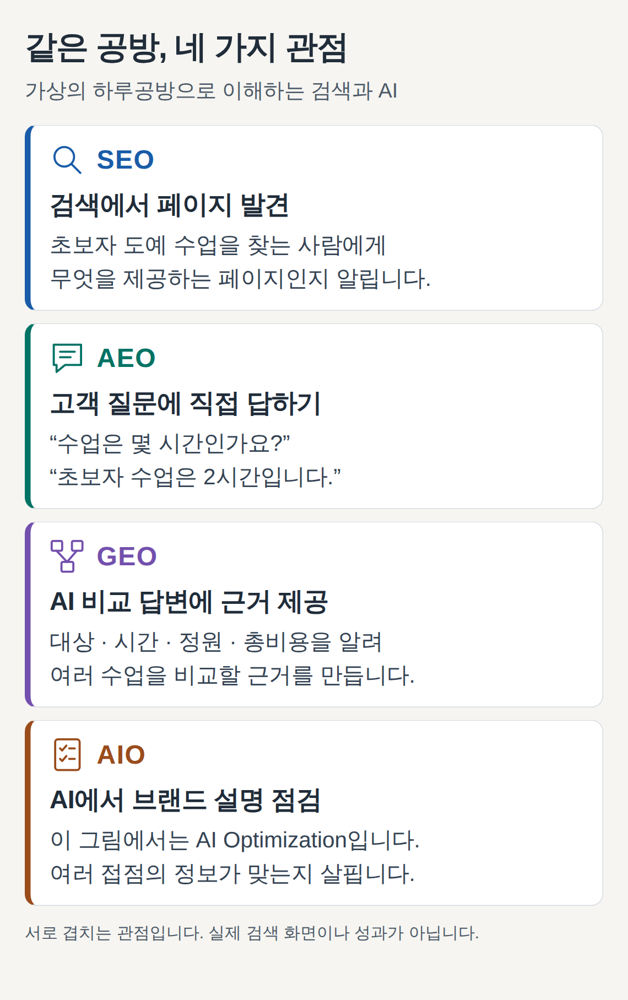
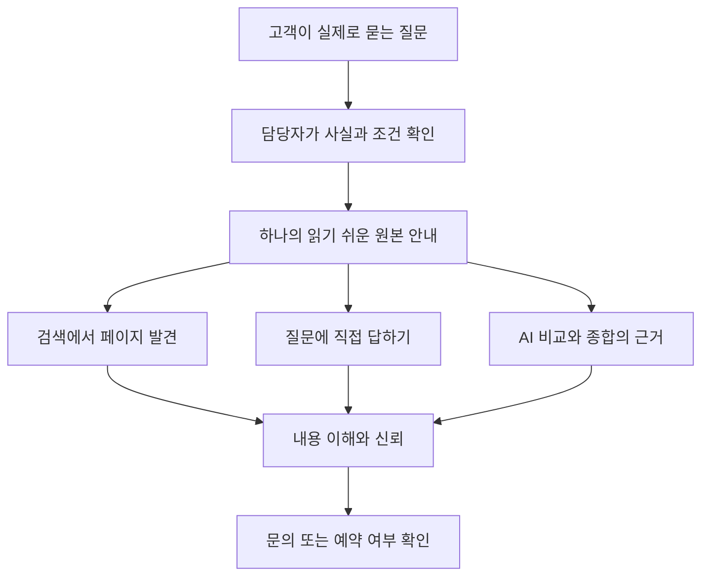

# 디지털 마케팅: SEO·GEO·AEO·AIO 쉽게 이해하기

## 요약

작은 공방을 운영한다고 가정합니다. 어떤 고객은 검색 결과에서 공방 홈페이지를 찾고, 다른 고객은 AI에게 “초보자가 주말에 갈 만한 도예 수업을 비교해 줘”라고 묻습니다. 두 고객 모두 정확한 정보를 만나야 예약을 판단할 수 있습니다. SEO·GEO·AEO·AIO는 이런 **발견과 정보 전달을 개선하는 관점**입니다.

디지털 마케팅은 온라인에서 고객을 만나고 관계를 이어 가는 활동입니다. 이 문서는 그중 검색과 AI를 통한 발견에 집중합니다. 광고·이메일·SNS 운영·구매 이후의 경험까지 네 약어로 모두 설명하지는 않습니다.

네 용어는 서로 겹치며, 정해진 순서로 대체되는 기술 세대가 아닙니다. Google은 생성형 AI 검색 대응도 SEO의 연장으로 설명하고, HubSpot은 GEO 등의 활동을 AEO라는 이름으로 묶습니다. 아래 구분은 업무를 이해하기 위한 설명이며 공통 인증 규격은 아닙니다.[^google-ai][^hubspot]

## 학습 목표

- 네 약어의 뜻과 고객이 접하는 결과를 설명합니다.
- AIO의 AI Optimization과 AI Overviews 용례를 구분합니다.
- 개발 지식 없이 서비스 소개 페이지의 부족한 정보를 찾습니다.
- 검색 노출·AI 인용·실제 문의와 예약을 구분해 측정합니다.

## 선수 지식

검색창이나 AI 대화를 사용한 경험이면 충분합니다. **콘텐츠**는 글·사진·영상 등 전달하는 정보이고, **검색어**는 사용자가 검색창에 넣는 말입니다. **출처 인용**은 답변이 참고한 자료를 표시하는 일입니다. **전환**은 예약·문의·구매처럼 미리 정한 고객 행동입니다. 클릭과 전환은 같지 않습니다.

용어만 빠르게 찾으려면 [SEO](../../../glossary/ko/seo.md) · [GEO](../../../glossary/ko/geo.md) · [AEO](../../../glossary/ko/aeo.md) · [AIO](../../../glossary/ko/aio.md)를 읽습니다.

## 101 · 개념 이해

### 그림으로 먼저 비교합니다

그림 1. 직접 만든 개념 그림입니다. 실제 검색 화면이나 노출 성과가 아니며, 아래 네 관점은 함께 적용할 수 있습니다.

| 용어 | 풀어 쓴 이름 | 쉽게 말하면 | 관심을 두는 결과 |
| --- | --- | --- | --- |
| **SEO** | Search Engine Optimization · 검색 엔진 최적화 | 검색 엔진과 사람이 페이지 내용을 이해하고 찾도록 돕습니다. | 관련 검색에서 페이지 발견과 방문 |
| **GEO** | Generative Engine Optimization · 생성형 엔진 최적화 | AI가 여러 자료를 종합할 때 우리 정보를 근거로 활용하도록 개선합니다. | 생성형 답변의 언급·출처·정확한 설명 |
| **AEO** | Answer Engine Optimization · 답변 엔진 최적화 | 사용자의 질문에 답하는 데 쓰기 좋게 정보를 정리합니다. | 직접 답변에 활용되는 내용과 출처 |
| **AIO** | AI Optimization · AI 최적화 | 이 문서에서는 AI를 통한 발견과 브랜드 정보 전달을 폭넓게 점검하는 관점입니다. | 여러 AI 접점에서 일관되고 정확한 정보 전달 |

SEO의 정의는 Google 안내, GEO는 원 연구, AEO는 HubSpot의 용례를 참고했습니다. AIO는 FGS Global이 사용하는 AI Optimization을 이 문서의 기준으로 삼았습니다. 표의 실무 초점은 이를 재구성한 설명입니다.[^seo][^geo-paper][^hubspot][^aio-usage]

### SEO: 찾을 수 있는 설명서를 만듭니다

SEO는 검색 결과에서 내 사이트를 이해하고 방문할 이유를 전달하는 일입니다. 검색 엔진의 **크롤링**은 페이지를 읽으러 오는 일, **색인**은 검색할 수 있도록 정보를 정리해 두는 일로 이해하면 됩니다. 공개했다고 바로 검색되거나 첫 순위가 보장되지는 않습니다.[^seo]

**가상 예:** 제목이 “특별한 경험”인 페이지보다 “초보자 도예 원데이 수업 — 하루공방”인 페이지가 어떤 서비스를 소개하는지 파악하기 쉽습니다. 수업 대상·시간·가격·위치·예약 방법까지 읽을 수 있게 정리합니다. 이는 독자를 위한 개선 예시이며 순위 상승을 측정한 결과는 아닙니다.

### AEO: 고객의 질문에 바로 답합니다

AEO의 핵심 질문은 “이 자료로 고객의 질문에 정확히 답할 수 있는가?”입니다. **가상 예:** “수업은 몇 시간인가요?”라는 제목 다음에 “초보자 수업은 2시간이며 재료와 도구가 제공됩니다”라고 답하고 예외 조건을 덧붙입니다.

AEO를 짧은 답변에만 한정하지 않습니다. HubSpot은 생성형 AI 답변까지 포함하는 넓은 의미로 사용합니다. 전통적인 검색의 **추천 스니펫**은 본문의 일부를 두드러지게 보여주는 형식이며, 여러 출처를 새로 종합하는 생성형 답변과는 다릅니다. Google에서 어떤 페이지를 추천 스니펫으로 선택할지는 Google의 시스템이 정합니다.[^hubspot][^snippets]

### GEO: 비교와 종합에 쓸 근거를 제공합니다

GEO는 생성형 AI 답변에서 콘텐츠가 어떻게 드러나는지를 다루는 용어입니다. 원 연구는 여러 자료를 종합하는 엔진에서 콘텐츠 가시성을 평가합니다. 연구의 특정 실험 결과를 모든 사업장의 매출 증가로 해석할 수는 없습니다.[^geo-paper]

**가상 예:** “초보자에게 맞는 주말 도예 수업을 비교해 줘”라는 질문을 생각합니다. “최고의 공방”이라는 문구만으로는 비교가 어렵습니다. 초보자 참여 여부, 정원, 총비용, 제작 방식, 완성품 수령 시점이 있으면 무엇이 다른지 판단할 근거가 생깁니다. AI가 실제로 그 페이지를 선택할지는 별개의 문제입니다.

### AIO: 먼저 약어의 뜻을 합의합니다

FGS Global은 **AI Optimization**이라는 용어를 사용합니다. 반면 Brainlabs의 2025년 자료는 **AI Overviews** 및 **AI Overview Optimization**에 AIO라는 표기를 사용합니다. 같은 약어라도 가리키는 범위가 다릅니다.[^aio-usage][^aio-alternate]

이 문서에서 AIO는 AI를 통해 브랜드가 발견되고 설명되는 방식을 점검하는 넓은 관점입니다. 예를 들어 홈페이지와 예약 안내에서 공방명·수업 조건이 서로 다르면 먼저 바로잡고, AI 답변이 이를 정확히 전달하는지 확인합니다. 이것이 업계 전체가 합의한 분류 체계라는 뜻은 아닙니다.

**Google AI Overviews**는 Google 검색의 AI 요약 기능 이름입니다. AIO 관련 업무를 의뢰받으면 “여러 AI 서비스에서 브랜드 정보를 개선하는 일인지, Google의 AI Overviews 대응인지”부터 문서에 적습니다. AI로 글을 작성하는 행위와 AI 답변에 근거로 활용되는 결과도 구분합니다.[^ai-features]

### 서로 겹치는 이유

동일한 수업 안내 페이지가 검색 결과에 나오고, 질문의 답으로 활용되고, 비교 답변의 근거가 될 수 있습니다. **SEO는 기반, AEO와 GEO는 겹치는 답변 관점, AIO는 이 문서에서 정한 넓은 점검 범위**로 읽으면 됩니다. AEO는 Google 전용, GEO는 특정 챗봇 전용이라는 식으로 나누지 않습니다.[^google-ai][^hubspot]

## 201 · 예제에 적용하기

### 하루공방 안내를 고쳐 봅니다

**가정:** 하루공방은 가상의 도예 공방입니다. 초보자 수업은 토요일 2시간, 정원 6명, 1인 50,000원이며 재료비가 포함됩니다. 완성품은 약 4주 뒤 방문 수령합니다. 모든 조건과 금액은 학습용이며 실제 업체나 시장 가격을 뜻하지 않습니다.

**개선 전:** “특별한 추억을 만드는 최고의 도예 체험! 지금 문의하세요.”

**개선 후의 예:**

> **초보자 도예 원데이 수업 — 하루공방**
>
> 처음 도예를 배우는 성인을 위한 토요일 2시간 수업입니다. 정원은 6명이며, 1인 50,000원에 재료와 도구 사용이 포함됩니다.
>
> **완성품을 당일 가져갈 수 있나요?** 굽는 과정이 필요해 약 4주 뒤 방문 수령합니다. 실제 수령일은 별도로 안내합니다.
>
> 예약 전 수업 일정과 취소 조건을 확인해 주세요. 예약 페이지에서 참여 가능한 날짜를 선택할 수 있습니다.

| 관점 | 바꾼 내용 | 독자에게 생기는 이점 |
| --- | --- | --- |
| SEO | 수업 종류와 공방명을 제목에 표시 | 찾은 페이지가 필요한 서비스인지 판단 |
| AEO | 당일 수령 질문에 답과 조건을 함께 제공 | 추가 문의 없이 기본 조건 이해 |
| GEO | 대상·시간·정원·총비용·수령 정보를 제시 | 다른 수업과 같은 기준으로 비교 |
| AIO | 홈페이지·예약 안내·공개 프로필의 사실 대조 | 접점마다 다른 설명을 만날 위험 감소 |

**기대 결과와 해석:** 정보가 구체적이고 검토 가능해진 것이 이 예제의 성과입니다. 검색 순위나 AI 인용이 올랐다고 주장하지 않습니다. 실제로 게시한다면 주소·취소 조건·예약 링크도 확정해 제공하고, 예시 문구를 실제 사실로 바꿔야 합니다.

### 비개발자가 시작하는 다섯 단계

다음은 작은 사업장이나 팀이 사용할 수 있는 실행 제안입니다. 정해진 공식 순위 공식이 아닙니다.

1. **고객 질문을 모읍니다.** 최근 문의에서 “누가 이용하나요?”, “총비용은?”, “얼마나 걸리나요?”, “어떤 경우에 맞지 않나요?”를 고릅니다.
2. **사실을 확인합니다.** 담당자와 가격·일정·포함 항목·제약을 확인하고 변경 책임자를 정합니다.
3. **한 페이지에서 답을 찾게 합니다.** 쉬운 제목, 짧은 답, 필요한 설명과 사진을 함께 배치합니다. 사진 속 조건도 본문과 맞춥니다.
4. **운영 담당자에게 읽기 가능 여부를 확인합니다.** 검색 엔진이 페이지를 읽고 색인할 수 있는지, 모바일에서 핵심 내용과 예약 경로가 보이는지 확인합니다.
5. **발견과 행동을 따로 기록합니다.** 검색에서 보였는지, AI가 무엇을 인용했는지, 실제 문의·예약이 생겼는지 구분합니다.

그림 2. 직접 만든 운영 흐름입니다. 여러 경로가 같은 원본을 활용할 수 있음을 나타내며, 노출이나 전환을 보장하는 경로도는 아닙니다.

## 301 · 조건에 따라 판단하기

### 무엇부터 개선할까요?

| 현재 문제 | 먼저 할 일 | 함께 일할 사람 |
| --- | --- | --- |
| 페이지의 서비스가 무엇인지 불분명함 | 제목과 핵심 설명부터 수정 | 운영자·마케터 |
| 같은 문의가 반복됨 | 질문에 대한 답과 예외 조건 보강 | 고객 응대 담당자 |
| AI가 오래된 가격이나 다른 업체 정보를 제시함 | 원본과 공개 정보의 날짜·명칭·조건 대조 | 운영자·콘텐츠 담당자 |
| 검색 엔진이 페이지를 읽지 못함 | 접근·색인 문제와 게시 설정 확인 | 웹사이트 운영자·개발자 |
| 방문은 있지만 예약이 없음 | 상품 적합성·가격 설명·예약 절차 검토 | 마케팅·영업·운영 담당자 |

이 표는 문제별 우선순위 제안입니다. 예산을 네 약어로 나누기 전에 어떤 고객 문제를 해결할지 정합니다.

### 노출을 보장하는 지름길은 없습니다

Google은 생성형 AI 검색에도 기존 SEO 원칙을 적용하며, 특별한 AI용 파일·고정 문장 길이·전용 구조화 데이터가 필요하지 않다고 안내합니다. **구조화 데이터**는 가격·상품·업체 같은 정보에 기계가 읽을 수 있는 이름표를 붙이는 방식입니다. 실제 본문과 맞게 적용하되 이를 노출 보증서로 취급하지 않습니다.[^google-ai][^ai-features]

같은 질문을 표현만 바꿔 대량 게시하거나 실제로 없는 후기·근거를 만들지 않습니다. Google은 검색이나 AI 답변 조작을 주목적으로 하는 대량 콘텐츠와 허위 언급에 기대는 접근을 경계합니다.[^google-ai]

Google AI 기능에 참여하려면 읽기·색인 조건뿐 아니라 Search Console의 **Search generative AI** 포함 설정도 확인합니다. 이 설정은 AI 학습 허용과 별개입니다. 이 문서는 설명만 제공하며 실제 사이트의 공개·차단 설정을 변경하지 않습니다.[^ai-control]

### 무엇을 측정해야 하나요?

**언급**은 이름이 등장하는 일, **인용**은 자료가 출처로 표시되는 일, **방문**은 사이트에 들어오는 일입니다. 어느 하나만으로 매출이나 신뢰가 증명되지는 않습니다.

| 확인할 것 | 기록 예시 | 주의할 해석 |
| --- | --- | --- |
| 검색 발견 | 관련 검색어, 페이지 노출과 클릭 | 높은 순위가 예약을 보장하지 않음 |
| AI 답변 | 질문·서비스·확인 날짜·브랜드 언급·출처 URL | 한 번의 답변을 모든 사용자 경험으로 일반화하지 않음 |
| 정보 정확성 | 가격·대상·포함 항목·제약의 일치 여부 | 자주 언급돼도 틀린 설명이면 개선 필요 |
| 사업 결과 | 관련 문의 수, 예약 완료 수, 유입 경로 | 광고·계절·가격 변경 등의 영향을 함께 검토 |

Google Search Console의 **Generative AI performance report**는 AI Overviews·AI Mode의 노출을 확인하는 공식 보고서입니다. 확인한 도움말은 노출 중심으로 설명하므로 모든 AI 서비스의 인용·매출을 한 번에 측정하는 도구로 소개하지 않습니다. 화면이 없다면 데이터 부족 등 도움말의 조건을 확인합니다.[^ai-report]

Bing Webmaster Tools의 **AI Performance**는 지원하는 Microsoft AI 경험에서 출처로 표시된 횟수와 URL 등을 보여줍니다. 인용 수는 답변 내 순위나 중요도를 뜻하지 않습니다. 제품별 집계 범위가 다르므로 두 보고서의 숫자를 단순 합산하지 않습니다.[^bing]

**가상 계산:** 고정한 질문 10개를 각각 2회 확인해 답변 20개 중 5개에 공방명이 있었다면, 이 표본의 언급 비율은 `5 ÷ 20 = 25%`입니다. 이는 직접 정한 관찰 지표이며 공식 시장 점유율이 아닙니다. 링크가 나온 답변 수와 설명이 정확한 답변 수는 따로 셉니다. 도구·언어·질문·날짜를 맞춰 반복 비교하고 질문을 바꾸면 별도 표본으로 기록합니다.

## 이해 확인

**질문 1:** FAQ를 넣으면 AI가 반드시 인용하나요?

**해설:** 아닙니다. 질문과 답은 사람의 이해를 돕지만 선택과 노출은 엔진이 결정합니다. 게시한 사실과 실제 인용 여부를 따로 확인합니다.

**질문 2:** GEO를 시작하면 SEO를 중단해야 하나요?

**해설:** 아닙니다. 같은 원본이 여러 발견 경로에 사용될 수 있고, Google은 생성형 검색에도 SEO 원칙이 유효하다고 설명합니다.

**질문 3:** “AIO를 해 주세요”라는 요청에서 먼저 확인할 것은 무엇인가요?

**해설:** 약어가 AI Optimization인지, Google AI Overviews 또는 그 최적화인지 확인하고 대상 서비스와 개선할 결과를 명시합니다.

**질문 4:** AI 언급 비율이 25%이면 고객 네 명 중 한 명이 공방을 보았다는 뜻인가요?

**해설:** 아닙니다. 위 예제에서는 정해 둔 20개 답변의 관찰 비율입니다. 실제 고객 노출·방문·예약과는 다른 수치입니다.

## 근거와 한계

2026-09-10에 확인한 Google·Bing 공식 문서, 용어를 사용하는 회사의 원문, GEO 원 연구를 근거로 작성했습니다. FGS Global·Brainlabs·HubSpot은 자사 용어 사용의 근거이며, 이들의 마케팅 주장을 모든 플랫폼의 작동 원리로 확정하지 않습니다. 실제 서비스별 선택 알고리즘, 노출 상승률, 공방의 검색·예약 성과는 검증하지 않았습니다.

그림과 공방 예제·계산은 직접 작성한 학습 자료입니다. AEO·GEO의 경계와 AIO의 뜻은 문맥에 따라 달라질 수 있습니다. Google의 기존 AI 기능 안내보다 새 최적화 가이드와 전용 도움말에서 제공하는 참여 설정·노출 보고서를 우선 확인했습니다. 기능과 측정 범위는 30일 뒤 또는 공식 변경 시 재검토합니다.

## 관련 지식

[SEO](../../../glossary/ko/seo.md) · [GEO](../../../glossary/ko/geo.md) · [AEO](../../../glossary/ko/aeo.md) · [AIO](../../../glossary/ko/aio.md) · [Digital Marketing](index.md) · [English](../../en/digital-marketing/search-and-ai-discovery.md)

## 출처

[^seo]: [Google — SEO Starter Guide](https://developers.google.com/search/docs/fundamentals/seo-starter-guide)
[^google-ai]: [Google — Optimizing your website for generative AI features on Google Search](https://developers.google.com/search/docs/fundamentals/ai-optimization-guide)
[^ai-features]: [Google — AI features and your website](https://developers.google.com/search/docs/appearance/ai-features)
[^snippets]: [Google — Featured snippets and your website](https://developers.google.com/search/docs/appearance/featured-snippets)
[^geo-paper]: [Aggarwal et al. — GEO: Generative Engine Optimization, KDD 2024](https://arxiv.org/abs/2311.09735)
[^hubspot]: [HubSpot — Answer engine optimization best practices](https://blog.hubspot.com/marketing/answer-engine-optimization-best-practices)
[^aio-usage]: [FGS Global — Digital Insights, August 2025: AIO](https://fgsglobal.com/insights/newsletters/digital-insights/august-2025)
[^aio-alternate]: [Brainlabs — Navigating the New Era of AI Search, p. 4](https://www.brainlabsdigital.com/wp-content/uploads/2025/07/Navigating-AI-Search_Brainlabs_JUL2025.pdf)
[^ai-control]: [Google — Search generative AI control](https://support.google.com/webmasters/answer/16908024)
[^ai-report]: [Google — Generative AI performance report](https://support.google.com/webmasters/answer/16984139)
[^bing]: [Bing — Introducing AI Performance in Bing Webmaster Tools](https://blogs.bing.com/webmaster/February-2026/Introducing-AI-Performance-in-Bing-Webmaster-Tools-Public-Preview)
