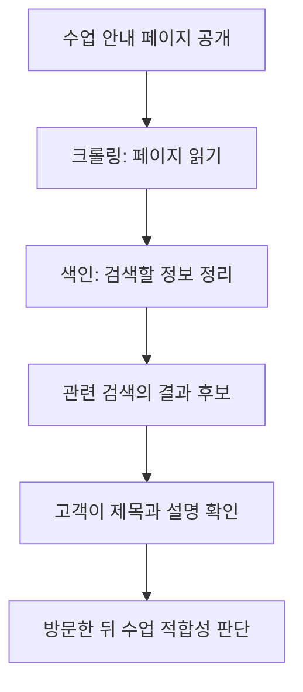

# SEO: 검색에서 발견되는 페이지 만들기

## 요약

공방 홈페이지를 만들었지만 고객이 어떤 수업인지 알아보지 못하거나 검색에서 찾기 어렵다고 가정합니다. **SEO(Search Engine Optimization, 검색 엔진 최적화)**는 검색 엔진이 내용을 이해하고 사람이 필요한 페이지를 발견하도록 돕는 활동입니다. 홈페이지를 알리는 간판과 안내문을 함께 정돈하는 일에 비유할 수 있습니다.[^seo]

이 문서는 SEO 자체의 기초와 적용을 다룹니다. 네 용어의 관계와 우선순위는 [종합 비교](search-and-ai-discovery.md)에서 이어서 읽습니다.

## 학습 목표

- 크롤링·색인·검색 결과·방문의 차이를 설명합니다.
- 모호한 서비스 소개를 검색한 사람이 판단하기 쉬운 설명으로 바꿉니다.
- 직접 고칠 내용과 웹사이트 운영자에게 확인할 사항을 구분합니다.

## 선수 지식

검색창을 사용해 본 경험이면 충분합니다. **검색어**는 검색창에 입력하는 말이고, **페이지 제목**은 문서의 주제를 알리는 이름입니다. **검색 의도**는 그 말을 입력한 사람이 해결하려는 일입니다. “도예 수업”을 찾는 사람도 체험 예약, 강사 자격 취득 등 목적이 다를 수 있습니다.

## 101 · 개념 이해

### 검색되기까지 어떤 일이 필요한가요?

검색 엔진이 페이지를 읽으러 오는 과정을 **크롤링**, 읽은 정보를 검색할 수 있게 정리하는 과정을 **색인**이라고 합니다. 그 뒤 관련 질문에 어떤 결과를 보여줄지 시스템이 결정하고, 사람은 결과를 보고 방문 여부를 판단합니다. 공개된 모든 페이지가 색인되거나 첫 순위에 오르는 것은 아닙니다.[^seo]

그림 1. 검색 발견을 이해하기 위한 단순화한 그림입니다. 화살표는 반드시 다음 단계에 도달한다는 보장이 아닙니다.

### 비개발자가 다룰 수 있는 SEO도 있습니다

명확한 제목, 읽기 쉬운 본문, 필요한 페이지로 이어지는 링크는 콘텐츠 담당자도 검토할 수 있습니다. 검색어를 반복해서 채우기보다 독자가 알고 싶은 정보를 제공하는 것이 기본입니다. 검색 광고를 구매하는 활동과 SEO는 구분합니다.[^seo]

예를 들어 사진만 보고는 가격과 예약 조건을 알 수 없는 페이지라면, 중요한 조건을 본문에서도 읽을 수 있게 정리합니다. 이는 고객의 판단을 돕는 편집 제안이며 특정 순위 효과를 검증한 실험이 아닙니다.

## 201 · 예제에 적용하기

### 하루공방의 수업 안내를 고칩니다

**가정:** 하루공방은 가상의 도예 공방입니다. 초보 성인을 위한 토요일 2시간 수업을 운영하며 정원은 6명입니다. 모든 조건은 학습용입니다.

| 확인할 곳 | 개선 전 | 개선 후의 예 | 바꾸는 이유 |
| --- | --- | --- | --- |
| 제목 | 특별한 경험 | 초보자 도예 원데이 수업 — 하루공방 | 어떤 서비스인지 바로 알게 합니다. |
| 첫 설명 | 최고의 추억을 만드세요 | 도예를 처음 배우는 성인을 위한 토요일 2시간 수업입니다. 정원은 6명입니다. | 대상과 소요 시간을 판단하게 합니다. |
| 안내 연결 | 자세히 보기 | 수업 일정과 예약 조건 확인 | 이동한 곳에서 무엇을 확인할지 알게 합니다. |

1. 실제 문의에서 고객이 사용하는 말을 찾습니다. 이 예제에서는 “초보자도 가능한가요?”를 수업 대상 설명에 반영합니다.
2. 담당자에게 대상·시간·정원을 확인한 뒤 제목과 본문을 함께 고칩니다.
3. 휴대전화로 읽고 예약 안내까지 이동해 봅니다. 실제 게시물이라면 가격·주소·취소 조건도 확인해 적습니다.

**기대 결과와 해석:** 페이지가 무엇을 제공하는지, 누구에게 맞는지 더 쉽게 판단할 수 있습니다. 색인 여부나 방문 증가 여부는 별도로 관찰해야 합니다. 제목을 고쳤다는 사실만으로 순위가 상승했다고 해석하지 않습니다.

## 301 · 조건에 따라 판단하기

### 콘텐츠 문제와 접근 문제를 나눠 확인합니다

| 관찰한 문제 | 먼저 확인할 일 | 담당 예시 |
| --- | --- | --- |
| 방문자가 수업 대상을 자주 묻습니다. | 제목과 첫 설명이 실제 대상과 맞는지 읽습니다. | 운영자·콘텐츠 담당자 |
| 새 페이지를 내부 메뉴에서 찾을 수 없습니다. | 관련 안내에서 접근할 링크가 있는지 확인합니다. | 콘텐츠 담당자·웹 운영자 |
| 검색 엔진이 페이지를 읽거나 색인하지 못합니다. | 접근 제한과 게시 설정을 점검합니다. | 웹 운영자·개발자 |
| 방문은 있지만 예약이 적습니다. | 서비스 적합성·조건 설명·예약 절차를 검토합니다. | 운영·마케팅 담당자 |

검색에서 **노출된 횟수**, **클릭 수**, **실제 문의·예약**을 분리해 봅니다. 같은 기간과 대상 페이지를 비교하되 광고, 계절, 가격 변경 같은 다른 원인도 적습니다. 이는 운영 제안이며 SEO만의 효과를 자동으로 분리하는 방법은 아닙니다.

### AI 검색이 생겨도 필요한가요?

Google은 생성형 AI 검색에도 SEO의 기본 원칙이 적용된다고 설명합니다. 따라서 SEO를 끝낸 뒤 완전히 다른 체계로 갈아타는 것으로 이해할 필요는 없습니다.[^google-ai] 답을 찾기 어렵다면 [AEO](aeo-answer-content.md), 다른 서비스와 비교할 근거가 부족하다면 [GEO](geo-generative-discovery.md)를 함께 검토합니다.

## 이해 확인

**질문 1:** 페이지를 공개하고 제목을 고치면 바로 검색 첫 화면에 나오나요?

**해설:** 보장되지 않습니다. 공개·크롤링·색인·결과 선택은 다른 단계입니다. 어떤 단계에서 막혔는지 먼저 확인합니다.

**질문 2:** 관련 검색에서 방문은 늘었는데 예약이 늘지 않았다면 제목을 계속 고쳐야 하나요?

**해설:** 제목만 원인이라고 단정할 수 없습니다. 방문 목적이 수업과 맞는지, 조건을 이해할 수 있는지, 예약을 완료할 수 있는지 확인합니다.

## 근거와 한계

2026-09-10에 확인한 Google 공식 안내에 근거합니다. 과정 그림과 공방 예제·역할 분담은 직접 작성한 설명입니다. 실제 사이트의 접근 설정, 검색 순위, 예약 성과를 검증하지 않았습니다. Google의 설명을 모든 검색 서비스의 동일한 작동 규칙으로 일반화하지 않습니다.

## 관련 지식

[네 관점 종합 비교](search-and-ai-discovery.md) · [AEO](aeo-answer-content.md) · [GEO](geo-generative-discovery.md) · [AIO](aio-strategy.md) · [SEO 용어](../../../glossary/ko/seo.md) · [문서 목록](index.md) · [English](../../en/digital-marketing/seo-foundations.md)

## 출처

[^seo]: [Google — SEO Starter Guide](https://developers.google.com/search/docs/fundamentals/seo-starter-guide)
[^google-ai]: [Google — Optimizing your website for generative AI features on Google Search](https://developers.google.com/search/docs/fundamentals/ai-optimization-guide)
