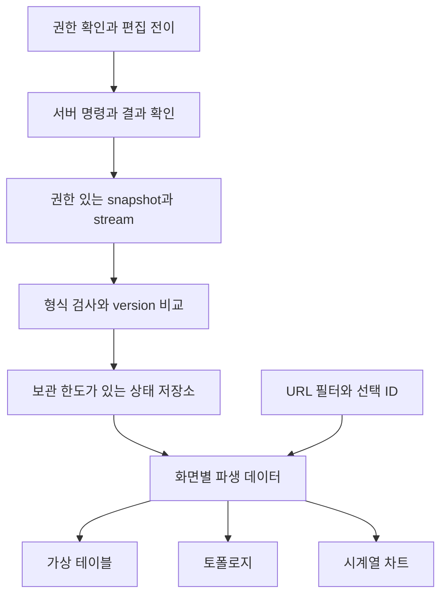

# Frontend · React

운영 대시보드를 사례로 실시간 데이터·대량 화면·권한과 복잡한 상호작용을 학습합니다. 장비 목록·CPU 추이·서비스 의존 관계·재시작 액션을 같은 설계 맥락에서 설명합니다. 아래 예제들은 주제별 독립 예제이며 하나의 완성된 제품으로 연결된 앱은 아닙니다. 화면 구현을 익힌 뒤 Micro Frontend의 팀·배포 경계와 실제 사례, 두 React 앱의 독립 빌드 실습으로 이어집니다.

## 선수 지식과 실행 환경

JavaScript 배열·객체·Promise, TypeScript type/union, React 컴포넌트·props·useState·useEffect, HTTP 요청·응답을 안다고 가정합니다. React 입문 문법 전체를 가르치는 강좌는 아닙니다. 낯설다면 [React 학습](https://react.dev/learn)에서 컴포넌트와 state를 먼저 익힙니다.

기존 React + TypeScript 브라우저 프로젝트에서 앞의 8개 주제의 TSX 예제를 하나씩 `src/App.tsx`에 넣습니다. React 18 이상에 존재하는 Hook을 사용합니다. CSS reset이나 앱의 전역 스타일이 예제 행 높이에 영향을 줄 수 있습니다. SSR 프레임워크는 브라우저 컴포넌트 경계를 설정하고 별도 SSR 조건을 확인합니다. 설치 명령은 이 문서 저장소가 아닌 별도 연습 프로젝트에서 실행합니다.

| 주제 | 추가 패키지 | 실행 조건 |
| --- | --- | --- |
| 상태·실시간·검색·차트·권한 | 없음, React/React DOM/TypeScript 환경 | 로컬 fixture 또는 mock |
| 가상 테이블 | `npm install @tanstack/react-virtual@3` | 고정 높이 가정 확인 |
| 토폴로지 | `npm install @xyflow/react@12` | 라이브러리 CSS와 부모 높이 |
| WebSocket/SSE | 없음 | 문서의 프레임·seq 계약을 따르는 서버 필요 |

Micro Frontend 실습은 여러 파일과 두 서버를 사용하는 별도 프로젝트입니다. 해당 문서의 파일 구조·버전·실행 명령을 따릅니다.

## 학습 순서

1. [복잡한 상태 모델: 소유권과 전이](complex-state-models.md)
2. [실시간 상태 업데이트: 수신과 화면 반영 분리](realtime-state-updates.md)
3. [WebSocket과 SSE: 연결·재접속·복구 계약](websocket-sse.md)
4. [대량 데이터 렌더링: 전송·계산·DOM 병목 분리](large-data-rendering.md)
5. [Virtualized table: 행 수와 DOM 수 분리](virtualized-table.md)
6. [Topology visualization: 관계와 배치 분리](topology-visualization.md)
7. [Time-series chart: 시간·결측·집계의 의미](time-series-chart.md)
8. [Permission-based UI: 권한 확인과 작업 상태](permission-based-ui.md)

9. [Micro Frontend: 독립 배포의 경계와 실제 활용](micro-frontends.md)
10. [React Micro Frontend 실습: 별도 빌드와 실패 경계](micro-frontends-react.md)

## 하나의 화면으로 통합할 때

UI에서 선택은 ID로 공유하고 차트 시간 범위·필터는 URL에 두어 직접 접근과 공유를 지원합니다. 서버 데이터 저장소를 화면마다 복제하지 않고 표·그래프가 같은 version을 읽게 합니다. tenant 전환은 권한 캐시·데이터·연결을 함께 바꾸는 경계입니다. 연결됨과 데이터 최신임을 구분하여 마지막 수신 시각과 재동기화 상태를 표시합니다.

## 통합 검증 시나리오

| 상황 | 기대 동작과 확인 근거 |
| --- | --- |
| 같은 이벤트 재수신·역순 응답 | 현재 version 유지, 중복 작업 없음 |
| 연결 중단·cursor 만료 | stale 표시, 재접속, 필요 시 snapshot 재동기화 |
| 사용자·tenant 전환 | 이전 연결과 캐시 정리, 다른 데이터 혼입 없음 |
| 검색 중 스크롤·행 정렬 | 입력 지연 측정, 선택 ID 유지, 화면 위치 정책 준수 |
| 편집 중 실시간 갱신·저장 timeout | 초안 보존, 충돌 또는 작업 상태 조회 |
| 결측·역순·중복 차트 샘플 | 시간순, 결측은 단절, 중복 정책 일관 |
| 권한 철회 직후 작업 | 서버 거부, capability 갱신, 민감 데이터 경계 확인 |
| 키보드·확대·모바일 | 접근 가능한 표 대안, 포커스·스크롤·pan 확인 |

## 예제 검증 범위

아래 기록은 앞의 8개 화면 예제에 대한 검증입니다. Micro Frontend의 두 산출물 빌드와 브라우저 검증 결과는 [해당 실습](micro-frontends-react.md)에 별도로 기록합니다.

2026-09-14에 문서의 TSX 코드 8개를 별도 임시 프로젝트로 추출하여 TypeScript 5.9.3 strict 검사를 통과했습니다. 환경은 React/React DOM 19.2.4, @types/react 19.2.14, @types/react-dom 19.2.3, TanStack React Virtual 3.14.12, React Flow 12.11.6입니다. 저장 응답 순서·실패 후 초안·잘못된 전이·갱신 병합과 정리·메시지 형식·차트 정규화와 결측 선 분리·권한별 서버 렌더링을 확인한 임시 Bun 테스트 8개(31개 assertion)가 통과했습니다. 이 테스트는 문서 코드를 대상으로 하며 저장소 사이트 앱의 기능 테스트는 아닙니다.

API 근거와 한·영 의미를 검토했습니다. 설계 fixture의 행 수·갱신 주기는 성능 보장이 아닙니다. 실제 네트워크 서버·재접속·재전송·운영 부하·브라우저 상호작용·보조 기술 호환성은 실행 검증하지 않았습니다. React 18에서의 실행도 별도로 확인해야 합니다.

[Frontend 용어](../../../glossary/ko/index.md) · [전체 분야](../index.md) · [English](../../en/frontend/index.md)
