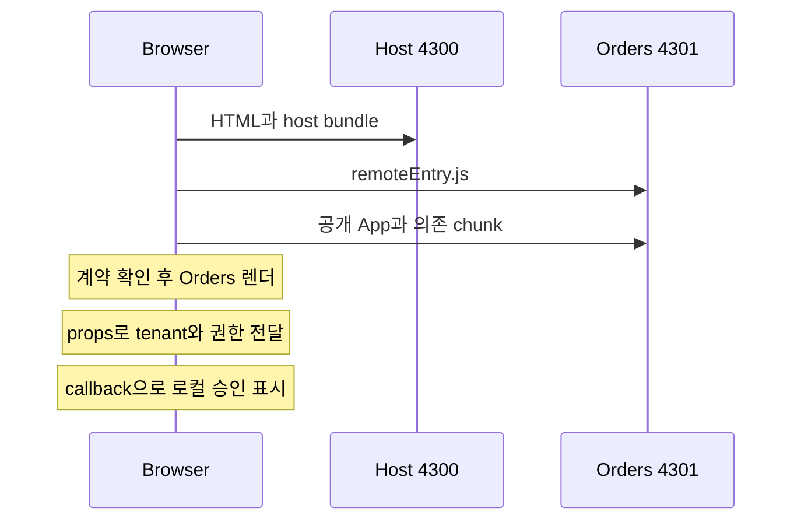

# React Micro Frontend 실습: 별도 빌드와 실패 경계

## 상황·학습 목표와 선수 지식

운영 콘솔을 담당하는 팀과 주문 기능 팀이 서로 다른 산출물을 만들되, 사용자는 같은 화면에서 주문을 승인한다고 가정합니다. 이 실습의 목표는 두 React 앱을 별도로 빌드하고 Module Federation으로 연결해, host 재빌드 없이 remote의 변경을 관찰하는 것입니다. 로딩 실패·렌더 실패·권한 표시·tenant 전환의 경계도 확인합니다.

[Micro Frontend 개념·사례](micro-frontends.md), React의 props·state·Suspense, TypeScript, npm과 터미널 사용을 선수 지식으로 둡니다. [복잡한 상태 모델](complex-state-models.md)과 [권한 UI](permission-based-ui.md)도 연결해서 읽습니다. 실제 주문 서버나 인증 서버 없이 동작하는 학습용 mock이며 화면의 승인은 실제 업무 승인이 아닙니다.

## 101 · 어떤 방식으로 연결합니까?

이 예제는 **webpack 5 내장 ModuleFederationPlugin**을 사용합니다. Remote의 `exposes`는 공개 모듈을 선언합니다. Host는 렌더링을 시작한 뒤 container API로 remote entry와 필요한 chunk를 로딩합니다. 가져온 컴포넌트는 같은 React tree에 합성됩니다.[^webpack][^plugin]



코드를 두 폴더로 나누는 것만 확인하지 않습니다. `dist/host`와 `dist/orders`라는 독립 산출물이 있고, 주문만 다시 빌드한 뒤 같은 host 파일이 새 주문 UI를 로딩하는지 확인합니다. 하나의 연습용 package.json·설정·타입 파일을 공유하는 것은 편의를 위한 선택입니다. 운영에서 각 팀의 파이프라인과 계약 버전 정책은 별도로 필요합니다.

React 자체가 remote 전달 프로토콜을 제공하는 것은 아닙니다. `lazy`는 Promise가 돌려주는 모듈의 default 컴포넌트를 렌더링하는 연결점이고, 로딩 중에는 Suspense, 거부 또는 하위 렌더 오류에는 Error Boundary를 사용합니다.[^lazy][^boundary]

## 201 · 파일을 만들고 실행합니다

### 1. 별도 연습 폴더와 버전

문서 저장소의 package.json을 바꾸지 말고 새 `react-mfe-lab` 폴더를 만듭니다. 아래 파일을 같은 구조로 복사합니다. 환경 기준은 Node 24.15.0, Python 3.10 이상이며 npm과 두 개의 터미널이 필요합니다. 실제 확인한 패키지 버전은 package.json에 고정했습니다. 향후 업데이트는 lockfile과 함께 검증합니다.

```text
react-mfe-lab/
  package.json
  tsconfig.json
  webpack.config.cjs
  contracts.ts
  host/
    index.ts
    bootstrap.tsx
    federation.d.ts
    loadOrders.ts
    App.tsx
  orders/
    index.ts
    bootstrap.tsx
    App.tsx
```

**package.json**

```json
{
  "name": "react-mfe-lab",
  "private": true,
  "scripts": {
    "build:host": "webpack --config webpack.config.cjs --env app=host",
    "build:orders": "webpack --config webpack.config.cjs --env app=orders",
    "typecheck": "tsc --noEmit"
  },
  "dependencies": {
    "react": "19.2.4",
    "react-dom": "19.2.4"
  },
  "devDependencies": {
    "webpack": "5.110.3",
    "webpack-cli": "7.2.3",
    "html-webpack-plugin": "5.6.8",
    "typescript": "5.9.3",
    "ts-loader": "9.6.2",
    "@types/react": "19.2.14",
    "@types/react-dom": "19.2.3"
  }
}
```

**tsconfig.json**

```json
{
  "compilerOptions": {
    "target": "ES2022",
    "module": "ESNext",
    "moduleResolution": "Bundler",
    "jsx": "react-jsx",
    "strict": true,
    "esModuleInterop": true,
    "skipLibCheck": true,
    "lib": [
      "ES2022",
      "DOM"
    ],
    "outDir": "./.types"
  },
  "include": [
    "host",
    "orders",
    "contracts.ts"
  ]
}
```

`npm install`로 생성한 package-lock.json을 실제 연습 프로젝트에 보관하면 이후에는 `npm ci`로 같은 의존성 집합을 설치할 수 있습니다. 직접 의존성 버전 고정만으로 전이 의존성까지 영구 고정되는 것은 아닙니다.

### 2. 두 개의 독립 빌드 설정

**webpack.config.cjs**

```js
const path = require("node:path");
const HtmlWebpackPlugin = require("html-webpack-plugin");
const { ModuleFederationPlugin } = require("webpack").container;
module.exports = (env) => {
  const app = env.app;
  if (!["host", "orders"].includes(app)) throw new Error("Use --env app=host or orders");
  const shared = Object.fromEntries(
    ["react", "react-dom", "react/jsx-runtime", "react-dom/client"].map(name => [name, {
      singleton: true, strictVersion: true, requiredVersion: "19.2.4",
    }]),
  );
  return {
    mode: "production", devtool: false,
    entry: path.resolve(__dirname, app, "index.ts"),
    output: { path: path.resolve(__dirname, "dist", app), clean: true,
      filename: "[name].[contenthash].js", chunkFilename: "[name].[contenthash].js",
      publicPath: "auto", uniqueName: `lab_${app}` },
    resolve: { extensions: [".tsx", ".ts", ".js"] },
    module: { rules: [{ test: /\.tsx?$/, exclude: /node_modules/,
      use: { loader: "ts-loader", options: { onlyCompileBundledFiles: true } } }] },
    plugins: [
      new ModuleFederationPlugin({
        name: app, shared,
        ...(app === "orders"
          ? { filename: "remoteEntry.js", exposes: { "./App": "./orders/App.tsx" } }
          : {}),
      }),
      new HtmlWebpackPlugin({ title: `${app} microfrontend lab`,
        templateContent: '<!doctype html><html lang="en"><head><meta charset="utf-8"><meta name="viewport" content="width=device-width,initial-scale=1"></head><body><div id="root"></div></body></html>' }),
    ],
  };
};
```

`--env app=host`와 `--env app=orders`는 각각 다른 entry·출력 디렉터리와 연합 설정을 선택합니다. `publicPath: "auto"`는 remote chunk를 remote 자산 위치에서 로딩하게 하고 `uniqueName`은 webpack runtime 이름 충돌을 피합니다. async bootstrap은 공유 모듈을 초기화할 로딩 경계를 마련합니다.[^webpack]

이 실습은 같은 React tree에서 컴포넌트를 합성하므로 React 관련 모듈을 singleton으로 공유하고 요구 버전을 정확히 지정합니다. `strictVersion`은 요구 버전을 만족하지 않으면 실패시키는 설정이지, 호환되지 않는 버전을 호환되게 만들어 주는 설정이 아닙니다.[^plugin] 패키지 버전을 바꾸면 이 설정도 계약에 맞게 검토합니다.

### 3. 공개 계약과 TypeScript 선언

**contracts.ts**

```ts
export type Approved = { schemaVersion: 1; tenantId: string; orderId: string };
export type OrdersProps = {
  tenantId: string;
  canApprove: boolean;
  onApproved: (event: Approved) => void;
  simulateCrash?: boolean;
};
```

**host/federation.d.ts**

```ts
declare function __webpack_init_sharing__(scope: string): Promise<void>;
declare const __webpack_share_scopes__: { default: object };
```

계약은 tenant, 권한 표시용 capability, 작은 승인 알림을 전달합니다. 다른 앱이 소유한 Redux store나 QueryClient 전체를 받지 않습니다. 여기서 contractVersion은 로딩 계약, schemaVersion은 승인 알림 계약을 구분하기 위한 예제 필드입니다.

federation.d.ts는 webpack이 제공하는 공유 scope API의 타입 선언입니다. 계약 타입과 선언 파일은 네트워크에서 받은 JavaScript의 실제 모양을 증명하지 않습니다. 아래 로더는 container와 공개 모듈의 버전·export를 검사합니다. 임의의 신뢰할 수 없는 remote를 안전하게 실행해 주는 검사는 아닙니다.

### 4. 주문 팀이 제공하는 컴포넌트

**orders/App.tsx**

```tsx
import { useState } from "react";
import type { OrdersProps } from "../contracts";
export const contractVersion = 1;
export default function OrdersApp({ tenantId, canApprove, onApproved, simulateCrash }: OrdersProps) {
  const [approved, setApproved] = useState(false);
  if (simulateCrash) throw new Error("Demo render failure");
  return <section aria-label="Orders" style={{ border: "1px solid #64748b", padding: 16 }}>
    <h2>Orders release v1</h2>
    <p>Tenant: {tenantId}; order: order-42</p>
    <button disabled={!canApprove || approved} onClick={() => {
      if (!canApprove || approved) return;
      // Local mock: real approval requires an authorized, idempotent API request.
      setApproved(true);
      onApproved({ schemaVersion: 1, tenantId, orderId: "order-42" });
    }}>Approve order</button>
    <p role="status">{approved ? "Approved locally" : canApprove ? "Awaiting approval" : "No approval permission"}</p>
  </section>;
}
```

Orders가 자체 승인 표시를 소유하고 host에는 작은 사실만 알립니다. canApprove는 UI 표시용 mock입니다. 실제 승인은 서버에서 현재 사용자·tenant·주문 권한을 확인하고, 성공 응답을 받은 뒤 표시해야 합니다. timeout·중복 클릭·재시도에는 별도의 idempotency key와 작업 상태 조회가 필요합니다.[^auth]

### 5. host의 로딩과 오류 경계

**host/loadOrders.ts**

```ts
import type { ComponentType } from "react";
import type { OrdersProps } from "../contracts";
type Container = {
  init: (scope: object) => void | Promise<void>;
  get: (name: string) => Promise<() => unknown>;
};
type OrdersModule = { default: ComponentType<OrdersProps>; contractVersion: 1 };

export function loadOrders(): Promise<OrdersModule> {
  return new Promise((resolve, reject) => {
    const script = document.createElement("script");
    // Fixed, trusted local demo endpoint; never accept a URL from user input.
    script.src = "http://localhost:4301/remoteEntry.js";
    script.async = true;
    const finish = () => {
      clearTimeout(timer); script.onload = null; script.onerror = null; script.remove();
    };
    const timer = setTimeout(() => {
      finish(); reject(new Error("Orders load timeout"));
    }, 5000);
    script.onerror = () => { finish(); reject(new Error("Orders entry failed")); };
    script.onload = async () => {
      try {
        await __webpack_init_sharing__("default");
        const remote = (window as Window & { orders?: Container }).orders;
        if (!remote || typeof remote.init !== "function" || typeof remote.get !== "function") {
          throw new Error("Invalid orders container");
        }
        await remote.init(__webpack_share_scopes__.default);
        const factory = await remote.get("./App");
        const module = factory() as Partial<OrdersModule> | null;
        if (!module || module.contractVersion !== 1 || typeof module.default !== "function") {
          throw new Error("Unsupported orders contract");
        }
        resolve(module as OrdersModule);
      } catch (error) { reject(error); }
      finally { finish(); }
    };
    document.head.appendChild(script);
  });
}
```

정적인 remotes 선언으로 간단히 import하는 방식도 가능하지만, 공유 모듈 초기화가 remote entry를 기다리면서 shell의 초기 렌더가 지연될 수 있습니다. 이 예제는 host 설정에 정적 remote를 등록하지 않습니다. Shell 렌더 이후 lazy 로더가 script를 가져오고, host의 share scope를 container에 전달한 뒤 `get("./App")`으로 공개 모듈 factory를 받습니다. 이 순서와 container API는 webpack의 동적 remote 설명을 따릅니다.[^webpack]

수동 로더는 단일 remote·단일 페이지 수명을 가정합니다. 여러 remote나 자동 재시도에서는 container 중복 초기화·동시 로딩·manifest 처리를 검증된 런타임으로 관리하는 대안을 비교합니다. `script.remove()`도 이미 진행 중인 평가를 취소한다는 보장은 없습니다.

**host/App.tsx**

```tsx
import { Component, Suspense, lazy, useState, type ReactNode } from "react";
import type { Approved } from "../contracts";

import { loadOrders } from "./loadOrders";

const Orders = lazy(loadOrders);

class RemoteBoundary extends Component<{ children: ReactNode }, { failed: boolean }> {
  state = { failed: false };
  static getDerivedStateFromError() { return { failed: true }; }
  render() {
    if (this.state.failed) return <section role="alert">
      <h2>Orders is unavailable</h2>
      <p>The rest of this console remains available.</p>
      <button onClick={() => window.location.reload()}>Reload page</button>{" "}
      <a href="http://localhost:4301/">Open standalone orders</a>
    </section>;
    return this.props.children;
  }
}
export default function App() {
  const [tenantId, setTenantId] = useState("tenant-a");
  const [canApprove, setCanApprove] = useState(false);
  const [message, setMessage] = useState("No local approvals");
  const simulateCrash = new URLSearchParams(location.search).get("demo") === "crash";
  function onApproved(event: Approved) {
    if (event.schemaVersion !== 1 || event.tenantId !== tenantId) return;
    setMessage(`Local approval: ${event.orderId} in ${event.tenantId}`);
  }
  return <main>
    <h1>Operations console</h1>
    <label>Tenant <select value={tenantId} onChange={event => {
      setTenantId(event.target.value); setCanApprove(false); setMessage("No local approvals");
    }}><option value="tenant-a">Tenant A</option><option value="tenant-b">Tenant B</option></select></label>
    <label><input type="checkbox" checked={canApprove}
      onChange={event => setCanApprove(event.target.checked)} />Mock approval permission</label>
    <p role="status">{message}</p>
    <RemoteBoundary key={tenantId}>
      <Suspense fallback={<p role="status">Loading orders…</p>}>
        <Orders key={tenantId} tenantId={tenantId} canApprove={canApprove}
          onApproved={onApproved} simulateCrash={simulateCrash} />
      </Suspense>
    </RemoteBoundary>
  </main>;
}
```

사용자는 orders 로딩 중에도 shell의 제목과 tenant 선택을 볼 수 있습니다. 5초는 이 실습의 데모 한도이며 서비스 SLO가 아닙니다. Promise timeout은 늦게 도착한 코드의 다운로드나 실행을 취소하지 않습니다. 네트워크가 끊기거나 contractVersion이 맞지 않으면 주문 영역만 fallback을 표시합니다.

lazy는 로더와 결과를 캐시합니다. 오류 뒤 boundary key만 바꿔도 같은 실패 Promise가 재사용될 수 있으므로 예제는 명시적인 전체 페이지 새로고침을 제공합니다.[^lazy] 실제 제품에서는 manifest 갱신·재시도 예산·이전 버전 fallback과 작성 중 데이터 보존까지 설계합니다. 새로고침은 이 실습의 로컬 상태를 잃게 합니다.

tenant가 바뀌면 권한 mock과 shell 메시지를 초기화하고 Orders를 새로 마운트합니다. 실제 API나 스트림이 있다면 effect cleanup으로 이전 요청·구독을 정리해야 합니다. 아직 서버에서 실행 중인 작업은 컴포넌트를 제거했다고 취소되지 않습니다. callback은 같은 신뢰 범위의 데모이며 보안 검증용 메시지 버스가 아닙니다.

### 6. 각 앱의 시작점

**host/index.ts**

```ts
import("./bootstrap");
export {};
```

**host/bootstrap.tsx**

```tsx
import { StrictMode } from "react";
import { createRoot } from "react-dom/client";
import App from "./App";
createRoot(document.getElementById("root")!).render(<StrictMode><App /></StrictMode>);
```

**orders/index.ts**

```ts
import("./bootstrap");
export {};
```

**orders/bootstrap.tsx**

```tsx
import { createRoot } from "react-dom/client";
import OrdersApp from "./App";
createRoot(document.getElementById("root")!).render(
  <OrdersApp tenantId="standalone-demo" canApprove={false} onApproved={() => {}} />,
);
```

host는 StrictMode로 로컬 개발 시 수명주기 문제를 드러낼 수 있게 작성했습니다. 다만 아래 빌드는 production mode이므로 개발 모드의 추가 effect 검사를 수행했다는 의미는 아닙니다. standalone orders는 단독 화면 확인용이며 승인 권한은 기본적으로 없습니다.

### 7. 빌드와 두 서버 실행

연습 폴더에서 의존성을 설치하고 두 산출물을 만듭니다.

```sh
npm install
npm run typecheck
npm run build:orders
npm run build:host
```

첫 터미널에서는 host를 실행합니다.

```sh
python3 -m http.server 4300 --bind 127.0.0.1 --directory dist/host
```

두 번째 터미널에서는 orders를 실행합니다.

```sh
python3 -m http.server 4301 --bind 127.0.0.1 --directory dist/orders
```

브라우저에서 `http://localhost:4300`을 열면 Operations console과 Orders release v1이 함께 나타납니다. `http://localhost:4301`은 standalone orders입니다. 예제 URL의 localhost·포트는 host 로더의 고정 주소와 일치시킵니다. 서버 파일은 로컬에만 제공하며 이 명령은 운영 배포 서버가 아닙니다.

| 동작 | 기대 결과와 해석 |
| --- | --- |
| 처음 접속 | Orders release v1, 승인 버튼 비활성화 |
| Mock approval permission 선택 후 승인 | remote 내부와 shell에 로컬 승인 표시 |
| Tenant B로 변경 | 주문 표시·권한·shell 알림 초기화 |
| orders 서버 중단 후 새 탭 또는 캐시 없는 새로고침 | 주문 영역 fallback, shell 유지 |
| orders 응답을 5초 이상 지연 | 로딩 안내 후 fallback; 다운로드 취소 보장은 없음 |
| `http://localhost:4300/?demo=crash` 접근 | 렌더 오류 fallback; 복구 시 query를 제거 |
| remote의 contractVersion을 2로 바꾸고 주문만 재빌드 | host가 지원하지 않는 계약을 거부 |

### 8. host를 재빌드하지 않고 주문만 바꿉니다

orders/App.tsx의 `Orders release v1`을 `Orders release v2`로 고치고 다음 명령만 실행합니다.

```sh
npm run build:orders
```

host 서버를 유지한 채 브라우저 캐시를 비활성화하고 host를 새로고침하면 v2를 봅니다. 이미 로딩한 탭이 즉시 바뀌는 hot replacement 실습은 아닙니다. 확인 전후 `dist/host` 파일의 SHA-256이 같으면 host 산출물을 바꾸지 않았다는 증거가 됩니다. 기본 실습을 마친 뒤 v1과 contractVersion 1로 되돌립니다.

## 301 · 운영으로 옮기기 전에 판단합니다

### 런타임 경계와 React 경계

이 코드는 CSR 예제이며 Next.js App Router·RSC·SSR 합성 예제가 아닙니다. SSR은 서버와 브라우저가 같은 release 조합과 렌더 결과를 쓰는지, 원격 코드 실행·streaming·hydration 실패를 어떻게 처리하는지 별도로 확인해야 합니다. 현재 프레임워크의 공식 지원 범위를 확인하지 않고 webpack 설정만 옮기지 않습니다.

같은 React tree를 공유하면 props·context 통합은 쉽지만 React와 디자인 시스템 버전의 조율 비용이 생깁니다. context가 다른 빌드의 다른 인스턴스라면 같은 이름이어도 같은 context가 아닙니다. 서로 다른 React major가 필수인 이전 작업은 route·독립 root·bridge·iframe 경계를 비교합니다. 각 방식을 적용했다고 메인 스레드 비용이나 DOM 접근이 모두 격리되는 것은 아닙니다.

### 배포·캐시·롤백

로컬 예제의 고정 remoteEntry URL과 `clean: true`는 간단한 확인용입니다. 운영에서 같은 경로를 덮어쓰고 이전 chunk를 삭제하면 오래 열린 탭이 깨질 수 있습니다. `orders/releases/<release-id>/`에 immutable 파일을 먼저 배포하고 호환성 검사 후 manifest나 라우팅 포인터를 변경합니다. short-lived manifest·long-lived hashed asset처럼 캐시 수명을 구분하되 실제 CDN 동작을 확인합니다.

현재 예제는 remote URL을 host 로더에 고정합니다. 운영 manifest를 런타임에 조회하는 기능은 구현하지 않았습니다. manifest 기반으로 확장할 때는 승인된 origin과 release만 허용하고 이전 artifact 보관 기간·preview 조합·롤백 절차를 정합니다. 포인터 롤백은 이미 실행된 JavaScript나 서버 승인을 되돌리지 않습니다.

### 오류·보안·상태

| 문제 | 예제의 범위 | 운영에서 추가할 것 |
| --- | --- | --- |
| entry·chunk 로딩 실패 | timeout과 boundary fallback | 제한된 재시도·대체 릴리스·remote별 관측 |
| 렌더 예외 | 주문 영역 fallback | release·사용자 흐름별 오류 수집, 개인정보 최소화 |
| 이벤트 핸들러·비동기 API 오류 | 실제 API 없음 | 해당 작업의 try/catch·오류 상태·재시도 정책 |
| CPU 무한 루프·악성 remote | 격리하지 않음 | 신뢰 경계 재설계·sandbox 또는 다른 합성 방식 |
| tenant 변경 | 로컬 컴포넌트와 권한 mock 초기화 | 요청 취소·epoch 비교·캐시·SSE/WS cleanup |
| 전역 CSS 충돌 | 예제는 영역 내부 inline style만 사용 | CSS Modules·토큰 계약·전역 reset 제한 |
| 새 remote와 오래된 host | contractVersion 1 검사 | 실제 지원 버전 조합·자동 계약 검증 |

React Error Boundary는 이벤트 핸들러와 일반 비동기 callback의 모든 예외를 대신 처리하지 않습니다.[^boundary] Remote가 서버 API를 호출하면 [권한 UI](permission-based-ui.md)의 원칙대로 서버 인가를 적용합니다. 다른 origin에서 내려온 script도 host 페이지의 JavaScript로 실행되는 합성 방식이므로 CORS 허용을 보안 sandbox로 해석하지 않습니다.

## 이해 확인

- **v2를 보려면 host도 다시 빌드해야 합니까?** 공개 계약·주소가 유지되면 주문만 빌드하고 새 페이지 로딩으로 확인합니다. 실제로 host 파일 hash가 같은지 비교합니다.
- **권한 checkbox를 조작하면 실제 주문을 승인할 수 있습니까?** 이 예제에는 주문 서버가 없습니다. 운영에서 클라이언트 값은 서버 인가를 대체하지 못합니다.
- **5초 timeout 뒤 코드가 실행될 수도 있습니까?** 그렇습니다. Promise 거부는 script fetch나 이미 시작된 모듈 평가를 취소하는 기능이 아닙니다.
- **Error Boundary가 보안과 성능 격리까지 보장합니까?** 아닙니다. 일부 렌더 오류에 대한 UI 복구와 다른 격리 요구를 구분합니다.
- **타입 검사가 통과했으면 CDN 배포 계약도 맞습니까?** 아닙니다. 잘못된 remote 버전·누락된 파일·실제 props 변경은 통합 검증으로 확인합니다.

## 실행 검증과 한계

2026-09-14에 위 파일을 별도 로컬 프로젝트에서 TypeScript 5.9.3 strict 검사와 webpack 5.110.3 production 빌드로 확인했습니다. React·React DOM 19.2.4, Node 24.15.0, Chromium(Playwright 1.58.2)을 사용했습니다. 브라우저에서 8개 시나리오를 확인했습니다: remote 합성·기본 거부·callback, tenant 초기화, standalone, entry 실패, 5초 timeout, 렌더 실패, remote 단독 재빌드, 계약 버전 불일치입니다. Remote를 v2로 빌드해 새 페이지에 표시하면서 host 산출물 전체의 SHA-256이 그대로임을 비교했습니다. 정상 경로에는 처리되지 않은 pageerror가 없었으며, 의도적인 실패는 fallback 결과로 확인했습니다.

문서의 코드를 별도 프로젝트에서 실행한 결과이며 기업의 실제 시스템을 재현한 것이 아닙니다. 영속 주문·로그인·실제 인가·CDN·SSR·보조 기술·운영 부하 검증은 포함하지 않습니다. 문서 사이트 배포와 실습 앱의 운영 배포는 별개입니다.

[개념과 실제 사례](micro-frontends.md) · [Frontend 학습 경로](index.md) · [English](../../en/frontend/micro-frontends-react.md)

## 출처

[^webpack]: [webpack Module Federation and dynamic containers](https://webpack.js.org/concepts/module-federation/)
[^plugin]: [webpack ModuleFederationPlugin](https://webpack.js.org/plugins/module-federation-plugin/)
[^lazy]: [React lazy](https://react.dev/reference/react/lazy)
[^boundary]: [React Error Boundaries](https://react.dev/reference/react/Component#catching-rendering-errors-with-an-error-boundary)
[^auth]: [OWASP Authorization Cheat Sheet](https://cheatsheetseries.owasp.org/cheatsheets/Authorization_Cheat_Sheet.html)
