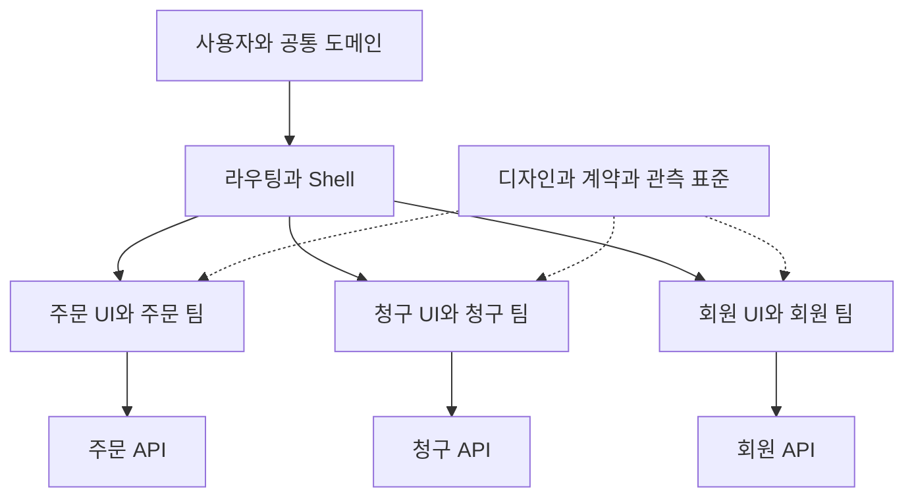

# Micro Frontend: 독립 배포의 경계와 실제 활용

## 상황·학습 목표

주문 화면의 문구 하나를 고치려는데 결제·회원 팀의 배포 일정까지 기다리는 상황을 생각해 봅니다. 코드가 크다는 사실보다, 서로 다른 업무를 맡은 팀이 하나의 프런트엔드 배포 단위에 묶여 있다는 점이 문제일 수 있습니다. Micro Frontend는 이런 조직과 배포의 결합을 다루는 아키텍처입니다.

이 문서에서는 정의와 모듈화의 차이, 현재 사용되는 합성 방식, 공개된 실제 사례, 도입·운영·철회 판단을 학습합니다. 읽은 뒤에는 “앱을 몇 개로 쪼갤까?”보다 “어느 팀이 무엇을 독립적으로 변경하고 책임질까?”에 답할 수 있어야 합니다. React 기반으로 두 산출물을 직접 실행하는 코드는 [React Module Federation 실습](micro-frontends-react.md)에 있습니다.

## 선수 지식

React 컴포넌트·props·effect, HTTP·URL·브라우저 JavaScript와 빌드·배포를 안다고 가정합니다. [복잡한 상태 모델](complex-state-models.md)에서 상태 소유권을, [권한 UI](permission-based-ui.md)에서 화면 표시와 서버 인가의 차이를 먼저 읽습니다. [Micro Frontend 용어](../../../glossary/ko/micro-frontend.md)는 짧은 정의를 제공합니다.

## 101 · 무엇을 분리하는 아키텍처입니까?

### 정의와 핵심 조건

Micro Frontend, microfrontend, 마이크로 프런트엔드는 하나의 사용자 경험을 업무 영역별 프런트엔드로 나누고, 각 영역을 팀이 개발·검증·배포할 수 있게 구성하는 방식입니다. 독립 배포 가능한 단위를 사용자가 하나의 서비스처럼 이용하게 한다는 점이 핵심입니다.[^vercel-docs][^single-spa]

“micro”는 버튼 하나 크기나 특정 파일 수를 뜻하지 않습니다. 주문 조회·승인, 결제, 회원 관리처럼 업무와 변경 이유가 응집된 영역을 먼저 찾습니다. 한 영역을 바꿀 때마다 다른 모든 앱도 다시 배포해야 한다면 파일을 나눴더라도 독립 배포의 이점은 약합니다. 반대로 하나의 monorepo 안에서도 영역별 산출물·파이프라인·릴리스가 분리될 수 있습니다.

이 문서의 설계 권고는 다음 네 가지 질문으로 독립성을 확인합니다.

1. 영역의 사용자 기능, API와 데이터 책임을 맡는 팀이 명확합니까?
2. 해당 팀이 다른 영역의 재빌드 없이 호환되는 변경을 배포할 수 있습니까?
3. 실패를 감지하고 이전 릴리스로 되돌릴 권한과 절차가 있습니까?
4. 다른 영역과 연결되는 URL·props·이벤트·디자인 계약이 명시되어 있습니까?

### 비슷해 보이는 개념과의 차이

| 개념 | 나누는 대상 | Micro Frontend와의 관계 |
| --- | --- | --- |
| React 컴포넌트 분리 | 코드·렌더 책임 | 같은 앱 빌드에 포함될 수 있어 독립 배포를 뜻하지 않습니다. |
| 코드 분할·lazy loading | 내려받는 시점과 chunk | 하나의 릴리스 안에서도 가능합니다. |
| 모듈형 모놀리스 | 내부 업무 모듈 | 한 번에 배포해도 경계가 잘 설계될 수 있으며 중요한 대안입니다. |
| monorepo / polyrepo | 소스 저장 위치 | 저장소 수와 배포 단위 수는 별개입니다. |
| 디자인 시스템 패키지 | 공통 토큰·컴포넌트 | 공통 UI를 재사용하는 수단이며 소비 앱의 재빌드가 보통 필요합니다. |
| Module Federation | 별도 빌드 사이 모듈 로딩·공유 | 합성 기술이지 팀 경계나 권한을 결정하는 아키텍처 전체가 아닙니다.[^webpack] |
| 백엔드 microservice | 서버 책임·배포 | 여러 API를 호출하는 SPA 하나는 여전히 단일 프런트엔드일 수 있습니다. |

### Shell과 업무 영역

Shell 또는 host는 탐색·로그인 진입·전체 레이아웃과 업무 영역을 연결하는 앱입니다. Remote는 별도 산출물로 제공되는 업무 UI나 모듈입니다. 경로 기반 합성에서는 브라우저 shell 대신 proxy가 앱 선택을 맡을 수도 있습니다.

이 그림은 책임 배치 예시이며 서버 개수나 네트워크 격리를 보장하지 않습니다. Shell에 모든 업무 데이터·전역 store·검증 로직을 다시 모으면 각 영역이 shell 릴리스에 종속됩니다. 공통 플랫폼과 업무 로직의 경계를 함께 관리해야 합니다.

## 201 · 현재 어떤 방식으로 사용합니까?

### 합성 방식 선택

다음은 2026-09-14에 확인한 공식 문서와 그에 기반한 설계 비교입니다. 채택률 순위나 “모든 기업이 이렇게 한다”는 조사 결과는 아닙니다.

| 방식 | 합성 위치와 동작 | 맞는 상황 | 직접 감당할 비용 |
| --- | --- | --- | --- |
| 경로·페이지 분리 | proxy가 `/orders/*`, `/billing/*`를 다른 앱으로 전달 | 업무 영역 간 이동이 적고 페이지 책임이 뚜렷함 | 경로·정적 자산 충돌, 앱 간 이동, 로그인·추적의 연속성 |
| 같은 화면의 런타임 합성 | host가 remote 모듈을 로딩해 화면에 렌더링 | 한 페이지에서 독립 팀의 기능을 함께 사용 | 런타임 호환성, 의존성·CSS 충돌, 부분 실패 |
| 서버·edge의 fragment 합성 | 서버가 여러 HTML fragment를 합침 | 초기 HTML과 SEO가 중요하고 서버 합성 계층을 운영 가능 | fragment timeout, 캐시 키, hydration·스트리밍 일치 |
| iframe | 별도 browsing context에 앱을 표시 | 격리 요구가 크거나 외부·레거시 앱을 포함 | 크기·포커스·키보드·접근성·메시지·인증 연동 |
| 빌드 시 패키지 결합 | 버전 있는 UI 패키지를 소비 앱에 포함 | 재사용이 주목적이고 릴리스 조율이 가능함 | 변경 전파에 소비 앱 재빌드 필요; 독립 런타임 배포와 구분 |

Web Components는 custom element라는 접점과 Shadow DOM 등을 제공하는 합성 선택지입니다.[^web-components] 그 자체로 배포 파이프라인·인증·라우팅·보안 sandbox를 만들어 주지는 않습니다. iframe 역시 origin과 sandbox 설정에 따라 격리 수준이 달라집니다. 외부 앱 메시지는 `targetOrigin`, 수신 `origin`·`source`, payload 형식을 검사해야 합니다.[^iframe][^postmessage]

### 현재 도구를 읽는 방법

Next.js Multi-Zones 문서는 같은 도메인 아래 독립 앱을 경로로 나누는 방식을 설명합니다. 같은 zone 안에서는 soft navigation, 다른 zone으로는 hard navigation이 발생하며 assetPrefix와 proxy 설정도 필요합니다. 자주 오가는 페이지를 같은 zone에 두라는 조건을 함께 읽어야 합니다.[^zones]

Vercel의 현재 Microfrontends 문서는 앱 그룹·경로 라우팅·독립 배포와 로컬 개발 proxy를 제공합니다. 소스 저장소를 여러 개로 만드는 것만으로 설정이 끝나지 않으며, JS·CSS·이미지 경로까지 해당 앱으로 전달해야 합니다. 특정 호스팅 플랫폼 사용은 Micro Frontend의 필수 조건이 아닙니다.[^vercel-docs][^vercel-quickstart]

같은 화면 합성에서는 webpack 5의 Module Federation과 별도의 Module Federation 생태계 도구가 선택지입니다. webpack 내장 플러그인과 enhanced runtime·각 bundler 플러그인은 같은 패키지가 아닙니다. 공식 integration 목록에는 webpack·Rspack·Rsbuild·Vite 등의 구성이 구분되어 있습니다. 도구 이름만 보고 설정·지원 범위를 섞지 않습니다.[^webpack][^mf] single-spa는 앱 등록과 활성화 조건, bootstrap·mount·unmount 생명주기를 조율합니다. 모듈 전달 방식, 팀의 릴리스 정책, 서버 인가는 별도로 정합니다.[^single-spa-config]

### 운영 대시보드에 적용하는 설계 연습

가정: 주문·청구·회원 영역을 서로 다른 세 팀이 담당하며 주문 화면의 변경 빈도가 높습니다. 이 숫자는 가상 시나리오이며 조직 규모에 대한 권장 임계값이 아닙니다.

첫 단계로 `/orders/*`를 주문 팀의 앱으로 분리하고, 기존 앱이 나머지를 처리하게 할 수 있습니다. 주문의 표·필터·승인 폼·상태 모델은 같은 영역에 둡니다. 표·차트·버튼처럼 시각적 형태만을 기준으로 각기 다른 remote로 나누면 하나의 업무 변경이 여러 팀 배포를 요구할 수 있습니다.

동시에 표시해야 하는 주문 요약 패널만 별도 배포할 이유가 확인되면 런타임 합성을 검토합니다. [React 실습](micro-frontends-react.md)은 바로 이 두 번째 경우를 작게 구현합니다. 사용 중인 테이블이나 차트 라이브러리를 MFE로 바꾸는 작업과는 구분합니다.

| 계약 | 이 사례의 책임 | 확인 기준 |
| --- | --- | --- |
| URL | shell은 영역 선택, 주문 앱은 하위 경로 | 직접 접근·새로고침·뒤로 가기·404 일치 |
| 인증·tenant | 플랫폼이 세션과 현재 tenant 전달, 서버가 각 요청 인가 | tenant 변경 때 이전 요청·캐시·구독 제거 |
| 데이터 | 주문 팀이 주문 API와 캐시 의미 소유 | 다른 앱이 주문 store 내부를 수정하지 않음 |
| 이벤트 | `orders.approved.v1` 같은 작은 사실 전달 | schema·tenant·order ID 확인; 이벤트를 서버 승인 증거로 신뢰하지 않음 |
| 디자인 | 토큰·접근성 기준은 공통, 적용은 각 팀 | 같은 필드의 라벨·오류·키보드 동작 일관 |
| 배포 | 주문 팀이 immutable 릴리스 생성, 플랫폼이 노출 규칙 관리 | 이전 shell과 호환·독립 롤백·릴리스 식별 가능 |

## 실제 공개 사례와 현재성

### Vercel: 경로 경계와 monorepo를 함께 사용한 사례

Vercel은 2024-10-22 글에서 웹사이트와 로그인 대시보드를 포함하던 큰 Next.js 앱을 논리적 경로 영역으로 나눴다고 설명합니다. monorepo는 유지했고, preview build와 로컬 compilation에서 40% 넘는 개선을 보고했습니다. 영역 사이 hard navigation과 preview·로컬 통합도 다뤘습니다.[^vercel-case]

읽을 점은 “MFE이면 40% 빨라진다”가 아니라 원래의 빌드·의존성 비용과 실제로 나눌 수 있는 경계입니다. 수치는 해당 팀의 자체 보고이며 우리 프로젝트의 성능 보장이 아닙니다. 2026년에 확인한 제품 문서는 현재 제공되는 방식을 보여 주지만 2024년 내부 구조가 오늘도 완전히 같음을 증명하지 않습니다.

### Vercel Community: Discourse와 Next.js의 점진적 공존

2026-03-10 공개 글은 기존 Discourse를 프록시하면서 `/live/:path*` 등의 경로를 Next.js로 제공하는 Vercel Community 구성을 설명합니다. 두 앱을 같은 도메인에 연결하고 Sign in with Vercel로 인증 연속성을 유지하며, 새 페이지가 준비되면 경로를 추가합니다.[^vercel-community]

이는 기존 플랫폼을 유지하면서 기능별로 현대화하는 실제 사례입니다. 경로 분리와 세션 연속성도 설계해야 한다는 점을 배웁니다. 설명 범위는 해당 발표 시점의 구성입니다.

### American Express One App: React 모듈 플랫폼과 유지보수 경계

공개 One App 자료는 Node.js 서버, React, Holocron을 사용해 모듈을 별도로 개발·검증·배포하는 구조를 설명합니다. 저장소에는 “One App is now InnerSource”라는 안내와 2024-05-03 archive 상태가 표시되어 있습니다.[^amex][^amex-overview]

이는 React 기반 독립 모듈을 플랫폼으로 운영한 실사례입니다. 공개 저장소가 보관 상태라는 사실로 사내 사용 종료까지 추론해서는 안 됩니다. 동시에 신규 서비스에 현재 유지보수되는 OSS처럼 추천해서도 안 됩니다. 런타임 공유 방식뿐 아니라 도구·보안 패치·소유권의 수명을 검토하는 사례로 읽습니다.

### Zalando Tailor: 서버에서 HTML을 합성한 역사적 사례

Tailor는 Zalando의 Project Mosaic에 속한 streaming layout service로, fragment 서비스가 제공한 HTML을 서버에서 합성하도록 설계되었습니다. 공개 저장소는 2022-12-05에 archive되었습니다.[^tailor]

이 자료는 MFE가 브라우저 remote import만을 의미하지 않는다는 근거입니다. 초기 HTML과 부분 실패를 합성 계층에서 다루는 방식의 참고 사례이며, Zalando의 2026년 실제 운영 스택을 이 저장소 하나로 확정하지 않습니다.

### Spotify Web Player: 분리를 줄이는 판단도 필요합니다

Spotify의 2019-03-25 회고는 이전 web player가 iframe으로 뷰를 격리해 팀별 릴리스를 지원했지만, 반복적인 JS·CSS 다운로드와 서로 다른 오래된 스택, 뷰를 가로지르는 변경 비용을 겪었다고 설명합니다. 이후 더 작은 전담 팀이 React·Redux 기반 새 player를 만들었습니다.[^spotify]

이는 모든 MFE가 실패한다는 증거도, Spotify의 현재 제품 전체가 단일 앱이라는 증거도 아닙니다. 조직·제품 조건이 달라지면 과거에 유리했던 분리 구조를 다시 평가해야 한다는 역사적 사례입니다. 도입 사례 목록에 회사 이름만 넣으면 이 방향 전환을 놓치게 됩니다.

## 301 · 도입·운영·철회 판단

### 도입 전에 대안을 비교합니다

다음은 본 문서의 조건부 설계 권고입니다. 먼저 모듈형 단일 앱에서 업무 경계, 빌드 캐시, 영향받은 영역만 검증하기, feature flag, 공통 패키지 관리로 해결할 수 있는지 살핍니다. MFE는 네트워크 로딩·계약·배포 조합이라는 새로운 비용을 더합니다.

| 관찰한 문제 | 먼저 비교할 대안 | MFE 검토 신호 |
| --- | --- | --- |
| 빌드가 느림 | 번들 분석·캐시·증분 빌드 | 불필요한 영역 전체 빌드가 남고 실제 릴리스 경계가 다름 |
| 코드 탐색이 어려움 | 모듈 경계·공개 API·소유자 지정 | 여러 팀이 독립 수명주기를 가진 업무를 소유함 |
| 레거시 교체가 어려움 | 페이지 단위 점진 이전 | 구·신 앱을 URL 경계로 공존시킬 수 있음 |
| 디자인 변경이 느림 | 버전 있는 디자인 시스템 | 공통 변경이 매번 전체 remote 동시 배포를 요구하면 경계 재검토 |
| 팀 간 승인 대기가 김 | 권한·프로세스 개선 | 기술 배포 단위가 실제로 독립 릴리스를 막고 있음 |

### 독립 배포에는 호환성 관리가 필요합니다

Shell v3와 Orders v7이 함께 실행될 수 있다면 양쪽의 최신 버전만 테스트해서는 부족합니다. 최소 지원 shell, 새 remote, 이전 remote와 rollback 조합을 정합니다. props나 이벤트는 추가 필드를 먼저 허용하고, 소비자가 전환된 뒤 구 필드를 제거합니다. TypeScript 선언은 개발 시 계약이며 실제로 CDN에서 받은 JavaScript를 검증하는 장치는 아닙니다.

릴리스 디렉터리의 chunk는 immutable하게 보관합니다. 새 chunk를 먼저 올리고 검증한 뒤 manifest 또는 라우팅 포인터를 바꿉니다. 오래 열린 탭이 이전 chunk를 요청할 수 있으므로 이전 파일을 즉시 삭제하지 않습니다. 포인터를 되돌려도 이미 실행 중인 탭의 코드는 자동으로 교체되지 않습니다. 새로고침·재마운트 정책, service worker와 CDN 캐시 동작까지 정합니다.

### 실패·보안·UX의 경계

같은 JavaScript 실행 환경의 remote는 host의 DOM·메모리·권한에 영향을 줄 수 있습니다. 다른 CDN에서 받은 코드라도 iframe sandbox처럼 격리되지 않습니다. 승인된 artifact origin·배포 권한·의존성 검토·CSP와 공급망 관리가 필요합니다. 로그인 확인이나 버튼 숨김을 각 앱의 보안 경계로 착각하지 않습니다. 서버는 모든 요청에 인가를 적용합니다.[^auth]

React Error Boundary는 일부 렌더링 오류를 fallback으로 바꾸지만 무한 루프, 모든 비동기 오류, 인증 침해를 격리하는 방화벽은 아닙니다.[^boundary] CSS 충돌·focus 이동·중복 heading·서로 다른 loading UI도 제품 전체 품질에 영향을 줍니다. 페이지 전체의 키보드 이동과 오류 복구를 누가 책임지는지 명확히 합니다.

### 관측과 배포 확인표

| 관측 대상 | 남길 정보 또는 검사 | 필요한 이유 |
| --- | --- | --- |
| 릴리스 조합 | shell·remote 버전, manifest revision | 어떤 조합에서 실패했는지 재현 |
| 로딩 | remoteEntry·chunk·API 시간과 실패율 | 전달·렌더·데이터 실패 구분 |
| 사용자 경험 | 실제 사용자 LCP·INP·CLS, 핵심 업무 성공률 | 빌드 개선이 사용자 성능 개선과 같은지 확인 |
| 통합 | 직접 URL·언어·tenant·뒤로 가기·로그아웃 | 앱 사이 상태와 경로 연속성 |
| 변경 안전성 | 계약 테스트·preview 조합·작은 노출·독립 rollback | 팀 독립성과 전체 회귀 방지 병행 |
| 운영 책임 | 소유 팀·연락 경로·부분 장애 안내·복구 목표 | shell 팀이 모든 remote 장애를 떠안지 않도록 함 |

사용자 식별 정보나 토큰을 무분별하게 관측 태그로 기록하지 않습니다. 보안·접근성·개인정보 기준은 각 팀이 자유롭게 달리 선택할 항목이 아닙니다.

### 점진 도입과 중단 기준

1. 현재 배포 대기 시간·빌드 시간·실패율을 같은 정의로 기록합니다.
2. 자주 함께 바뀌는 코드와 사용자 이동을 분석해 후보 영역 하나를 고릅니다.
3. URL·데이터·이벤트·디자인 계약과 rollback 책임을 문서화합니다.
4. 제한된 사용자에게 먼저 노출하고 업무 성공률·지연·오류를 비교합니다.
5. 개선이 확인되면 확대하고, 전역 store 의존·동시 배포·사용자 지연이 늘면 경계를 합치거나 단일 앱으로 되돌립니다.

단일 팀의 작은 CRUD 앱, 하나의 편집 트랜잭션을 여러 화면이 강하게 공유하는 제품, 독립 배포 수요가 없는 경우에는 모듈형 단일 앱을 우선 검토합니다. “언젠가 커질 것”만으로 지금 분산 배포 비용을 지불하지 않습니다.

## 이해 확인

- **저장소를 네 개로 나누면 MFE입니까?** 네 개 모두 같은 날 묶어서 배포해야 한다면 저장소만 분리했을 수 있습니다. 업무 소유권과 독립 릴리스 가능성을 확인합니다.
- **공통 버튼을 remote로 배포해야 합니까?** 보통은 디자인 패키지가 더 단순합니다. 소비 앱의 재배포 없이 즉시 바꿔야 하는 요구와 그에 따른 호환성·장애 비용을 설명할 수 있을 때 런타임 합성을 검토합니다.
- **React 버전이 다르면 바로 합성할 수 있습니까?** 동일 React tree에서 컴포넌트를 합성하는 방식은 호환성 계약이 필요합니다. 다른 버전이 필수이면 독립 root·bridge·iframe·경로 분리 등 다른 경계를 검토하되 격리 수준과 비용을 다시 평가합니다.
- **Vercel의 개선 수치를 우리 예상치로 써도 됩니까?** 자체 측정값과 분리해서 인용해야 합니다. 원래 병목·사용자 이동·팀 구조가 다른 프로젝트로 그대로 일반화하지 않습니다.
- **archive된 One App은 사용 종료입니까?** 공개 저장소는 읽기 전용이고 InnerSource 안내가 있다는 사실까지만 확인했습니다. 사내 사용 현황은 이 증거만으로 판단할 수 없습니다.

## 근거와 한계

공식 API 문서·운영 주체의 공개 글·소유자 저장소를 2026-09-14에 확인했습니다. 현재 제품 기능, 과거 사례의 주장, 본 문서의 설계 권고를 구분했습니다. 기업의 내부 최신 운영 현황·채택률·성과 재현은 검증하지 않았습니다. 코드 실행 범위는 [React 실습](micro-frontends-react.md)에 별도로 기록합니다. 이 Fieldbook 사이트 자체를 MFE로 전환하는 변경은 아닙니다.

[Frontend 학습 경로](index.md) · [React 실습](micro-frontends-react.md) · [English](../../en/frontend/micro-frontends.md)

## 출처

[^vercel-docs]: [Vercel Microfrontends](https://vercel.com/docs/microfrontends)
[^single-spa]: [single-spa Microfrontends overview](https://single-spa.js.org/docs/microfrontends-concept/)
[^webpack]: [webpack Module Federation and dynamic containers](https://webpack.js.org/concepts/module-federation/)
[^web-components]: [MDN Web Components](https://developer.mozilla.org/en-US/docs/Web/API/Web_components)
[^iframe]: [MDN iframe](https://developer.mozilla.org/en-US/docs/Web/HTML/Reference/Elements/iframe)
[^postmessage]: [MDN postMessage](https://developer.mozilla.org/en-US/docs/Web/API/Window/postMessage)
[^zones]: [Next.js Multi-Zones](https://nextjs.org/docs/app/guides/multi-zones)
[^vercel-quickstart]: [Vercel Microfrontends quickstart](https://vercel.com/docs/microfrontends/quickstart)
[^mf]: [Module Federation integrations](https://module-federation.io/integrations/index.html)
[^single-spa-config]: [single-spa configuration and lifecycles](https://single-spa.js.org/docs/configuration/)
[^vercel-case]: [How Vercel adopted microfrontends — 2024-10-22](https://vercel.com/blog/how-vercel-adopted-microfrontends)
[^amex]: [American Express One App — archived 2024-05-03](https://github.com/americanexpress/one-app)
[^amex-overview]: [One App overview](https://github.com/americanexpress/one-app/blob/main/docs/overview/README.md)
[^tailor]: [Zalando Tailor — archived 2022-12-05](https://github.com/zalando/tailor)
[^spotify]: [Building Spotify’s New Web Player — 2019-03-25](https://engineering.atspotify.com/2019/3/building-spotifys-new-web-player)
[^auth]: [OWASP Authorization Cheat Sheet](https://cheatsheetseries.owasp.org/cheatsheets/Authorization_Cheat_Sheet.html)
[^boundary]: [React Error Boundaries](https://react.dev/reference/react/Component#catching-rendering-errors-with-an-error-boundary)

[^vercel-community]: [How we run Vercel’s CDN in front of Discourse — 2026-03-10](https://vercel.com/blog/how-we-run-vercels-cdn-in-front-of-discourse)
